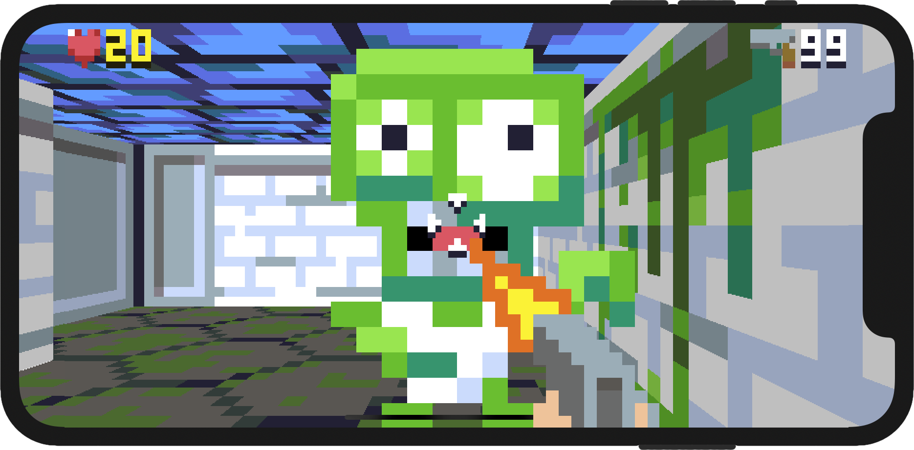

## Retro Rampage

### New!

The first chapters of Retro Rampage are now available as a [video tutorial series](https://talk.objc.io/collections/retro-rampage), produced by the great folks at [objc.io](https://objc.io) (with Yours Truly as guest presenter).

### About

Retro Rampage is a tutorial series in which you will learn how to build a Wolfenstein-like game from scratch, in Swift. Initially the game will be targeting iPhone and iPad, but the engine should work on any platform that can run Swift code.

Modern shooters have moved on a bit from Wolfenstein's grid-based 2.5D world, but we're going to stick with that template for a few reasons:

* It's feasible to build Wolfenstein's 3D engine from scratch, without a lot of complicated math and without needing to know anything about GPUs or shaders.

* It's simple to create and visualize maps that are constructed on a 2D grid, avoiding the complexities of 3D modeling and animation tools.

* Tile grids are an excellent way to prototype techniques such as procedural map generation, pathfinding and line-of-sight calculations, which can then be applied to more complex worlds.

### Background

Ever since I first played Wolfenstein 3D on a friend's battered old 386 back in 1993, I was hooked on the *First-Person Shooter*.

As an aspiring programmer, I wanted to recreate what I had seen. But armed only with 7th grade math and a rudimentary knowledge of BASIC, recreating the state-of-the-art in modern PC 3D graphics was hopelessly beyond my reach.

More than two decades later, a few things have changed:

We have the iPhone - a mobile computer many hundreds of times more powerful than a DOS-era desktop PC; We have Swift - a simple, powerful programming language with which to write apps and games; Finally - and most importantly - we have the Wolfenstein source code, and the wizardry behind it has been thoroughly demystified.

I guess now is as good a time as any to scratch that quarter-century itch and build an FPS!

### Tutorials

The tutorials below are designed to be completed in order, and each step builds on the code from the previous one. If you decide to skip ahead, project snapshots for each step are available [here](https://github.com/nicklockwood/RetroRampage/releases).

The tutorials are written with the assumption that you are already familiar with Xcode and are comfortable setting up an iOS project and adding new files to it. No knowledge of advanced Swift features is required, so it's fine if you've only used Objective-C or other C-like languages.

[Part 1 - Separation of Concerns](Tutorial/Part1.md)

Unlike most apps, games are typically designed to be independent of any given device or OS. Swift has already been ported to many platforms outside of the Apple ecosystem, including Android, Ubuntu, Windows and even Raspberry Pi. In this first part, we'll set up our project to minimize dependencies with iOS and provide a solid foundation for writing a fully portable game engine.

[Part 2 - Mazes and Motion](Tutorial/Part2.md)

Wolfenstein 3D is really a 2D game projected into the third dimension. The game mechanics work exactly the same as for a top-down 2D shooter, and to prove that we'll begin by building the game from a top-down 2D perspective before we make the shift to first-person 3D.

[Part 3 - Ray Casting](Tutorial/Part3.md)

Long before hardware accelerated 3D graphics, some of the greatest game programmers of our generation were creating incredible 3D worlds armed only with a 16-bit processor. We'll follow in their footsteps and bring our game into the third dimension with an old-school graphics hack called *ray casting*.

[Part 4 - Texture Mapping](Tutorial/Part4.md)

In this chapter we'll spruce up the bare walls and floor with *texture mapping*. Texture mapping is the process of painting or *wall-papering* a 3D object with a 2D image, helping to provide the appearance of intricate detail in an otherwise featureless surface.

[Part 5 - Sprites](Tutorial/Part5.md)

It's time to introduce some monsters to keep our player company. We'll display these using *sprites* - a popular technique used to add engaging content to 3D games in the days before it was possible to render textured polygonal models in real-time with sufficient detail.

[Part 6 - Enemy Action](Tutorial/Part6.md)

Right now the monsters in the maze are little more than gruesome scenery. We'll bring those passive monsters to life with collision detection, animations, and artificial intelligence so they can hunt and attack the player.

[Part 7 - Death and Pixels](Tutorial/Part7.md)

In this part we'll implement player damage, giving the monsters the ability to hurt and eventually kill the game's protagonist. We'll explore a variety of damage effects and techniques, including a cool Wolfenstein transition called *fizzlefade*.

[Part 8 - Target Practice](Tutorial/Part8.md)

We'll now give the player a weapon so they can fight back against the ravenous monsters. This chapter will demonstrate how to extend our drawing logic to handle screen-space sprites, add a bunch of new animations, and figure out how to implement reliable collision detection for fast-moving projectiles.

[Part 9 - Performance Tuning](Tutorial/Part9.md)

The new effects we've added are starting to take a toll on the game's frame rate, especially on older devices. Let's take a break from adding new features and spend some time on improving the rendering speed. In this chapter we'll find out how to diagnose and fix performance bottlenecks, while avoiding the kind of micro-optimizations that will make it harder to add new features later on.

[Part 10 - Sliding Doors](Tutorial/Part10.md)

In this chapter we add another iconic feature from Wolfenstein - the sliding metal doors between rooms. These add some interesting challenges as the first non-static, non-grid-aligned scenery in the game.

[Part 11 - Secrets](Tutorial/Part11.md)

Time to add bit of intrigue with the introduction of a secret passage, hidden behind a sliding push-wall that doubles as a zombie-squishing booby trap. Moving walls pose some interesting problems, both for the rendering engine and collision detection - we get to find out what a wall looks like from the inside *and* what the world looks like from the outside!

[Part 12 - Another Level](Tutorial/Part12.md)

In this chapter we add a second level and an end-of-level elevator that the player can use to reach it. We'll demonstrate a number of new techniques including animated wall decorations, and how the command pattern can be a handy substitute for delegation when using structs.

[Part 13 - Sound Effects](Tutorial/Part13.md)

It's time to end the silence! In this chapter we'll add sound effects to the game, demonstrating how to stream MP3 files on iOS with minimal latency, as well as techniques such as 3D positional audio.

[Part 14 - Power-ups and Inventory](Tutorial/Part14.md)

Long before games made the leap into 3D, power-ups were a staple feature of action-oriented games. In this chapter we'll add a medkit and a new weapon for the player to collect on their travels around the maze.

[Part 15 - Pathfinding](Tutorial/Part15.md)

Right now the game's zombie inhabitants only follow the player if they have line-of-sight. In this chapter we'll enhance the monster intelligence by adding *pathfinding* using the A* algorithm, so they can chase you through doors and around corners.

[Part 16 - Heads-Up Display](Tutorial/Part16.md)

In Part 16 we'll add a heads-up display showing the player important information such as how many bullets they've got left, and whether they're about to die. This tutorial covers a bunch of new techniques such as text rendering, sprite sheets, dynamic image tinting, and more!

### Reader Exercises

Each tutorial includes a "Reader Exercises" section at the end. These exercises are intended as an optional challenge for readers to check that they've followed and understood the material so far - completing the exercises is not a prerequisite for starting the next tutorial.

The questions are arranged in ascending order of difficulty:

* The first is usually a trivial modification to the existing code.
* The second requires a bit more thought.
* The third may require significant changes and enhancements to the game engine.

Some of the more advanced questions will eventually be answered, either in a later tutorial or in an Experiments PR (see below). If you are stuck on one of the exercises (or if you've completed an exercise and want to show off your solution) feel free to open a PR or Github issue.

### Bugs

I've occasionally made retrospective fixes after a tutorial chapter was published. This will be called out in a later tutorial if it directly impacts any new code, but it's a good idea to periodically check the [CHANGELOG](CHANGELOG.md) for fixes.

### Experiments

If you're up-to-date with the tutorials, and can't wait for the next chapter, you might like to check out some of the [Experiments PRs](https://github.com/nicklockwood/RetroRampage/pulls) on Github.

These experiments demonstrate advanced features that we aren't quite ready to explore in the tutorials yet.

### Further Reading

If you've exhausted the tutorials and experiments and are still eager to learn more, here are some resources you might find useful:

* [Swift Talks](https://talk.objc.io/collections/retro-rampage) - The first few chapters of Retro Rampage are available in video form, hosted by the great folks at [objc.io](https://objc.io) (with Yours Truly as guest presenter).
* [Lode's Raycasting Tutorial](https://lodev.org/cgtutor/raycasting.html#Introduction) - A great tutorial on ray casting, implemented in C++.
* [Game Engine Black Book: Wolfenstein 3D](https://www.amazon.co.uk/gp/product/1727646703/ref=as_li_tl?ie=UTF8&camp=1634&creative=6738&creativeASIN=1727646703&linkCode=as2&tag=charcoaldesig-21&linkId=aab5d43499c96f7417b7aa0a7b3e587d) - Fabien Sanglard's excellent book about the Wolfenstein 3D game engine.
* [Swiftenstein](https://github.com/nicklockwood/Swiftenstein) - A more complete but less polished implementation of the ideas covered in this tutorial.
* [Handmade Hero](https://handmadehero.org) - A video series in which games industry veteran [Casey Muratori](https://github.com/cmuratori) builds a game from scratch in C.

### Acknowledgments

I'd like to thank [Nat Brown](https://github.com/natbro) and [PJ Cook](https://github.com/pjcook) for their invaluable feedback on the first drafts of these tutorials.

Thanks also to [Lode Vandevenne](https://github.com/lvandeve) and [Fabien Sanglard](https://github.com/fabiensanglard/), whom I've never actually spoken to, but whose brilliant explanations of ray casting and the Wolfenstein engine formed both the basis and inspiration for this tutorial series.

All sound effects used in the project were obtained from [zapsplat.com](https://www.zapsplat.com). These may be used for free with attribution. See https://www.zapsplat.com/license-type/standard-license/ for details.

All graphics were drawn (badly) by me, in [Aseprite](https://www.aseprite.org).

### Tip Jar

I started this tutorial series thinking it would take just a few days. Many months later, with no end in sight, I realize I may have been a bit naive. If you've found it interesting, please consider donating to my caffeine fund.

