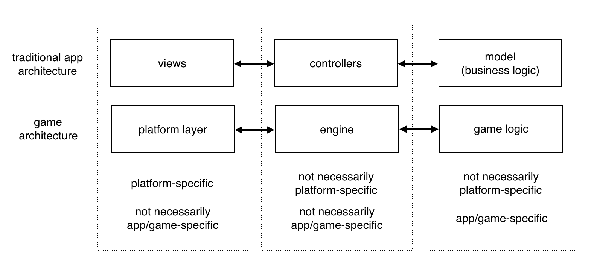
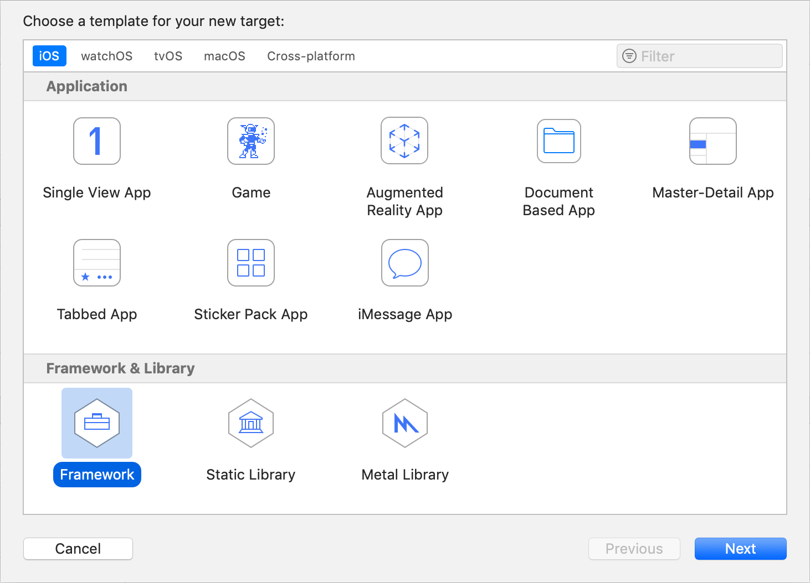
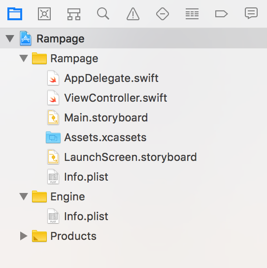
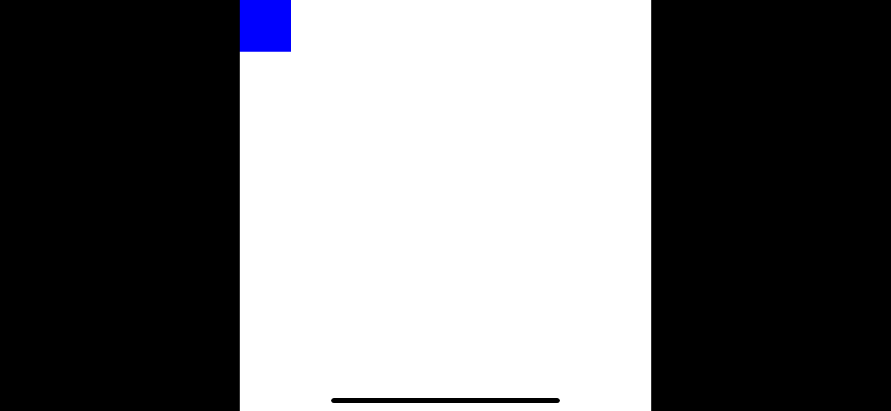

## Part 1: Separation of Concerns

In a traditional app, it is common practice to split the logic into three layers - the Model, View and Controller<sup><a id="reference1"></a>[[1]](#footnote1)</sup>. Games can also be divided into three similar layers:

* Platform Layer - Platform-specific code to integrate with the host operating system.
* Engine - Platform-independent game functions like asset loaders, rendering, physics, pathfinding AI, etc.
* Game Logic - Gameplay and graphics specific to this game. Tightly coupled to a particular engine.



Apple would ideally like you to build your game or engine using frameworks like GameKit, SpriteKit and SceneKit. These are powerful and easy-to-use, but doing so shackles your game completely to Apple's platforms.

In practice, few game developers do this because Apple alone doesn't represent a large enough share of the games market. A popular alternative is to use a 3rd party framework like Unity or Unreal that provide a cross-platform engine, and have platform layers for many different systems. This frees you from Apple exclusivity, but ties you into a 3rd party ecosystem instead.

In this tutorial we are choosing a third path: We'll create a very minimal platform layer for iOS using UIKit, then build both the game and engine from scratch using pure Swift, with no external dependencies.

### Project Setup

Modern games require a fairly complex interface with their host operating system in order to implement hardware accelerated graphics, sound and user input. But fortunately, *we aren't building a modern game*.

In the era of Wolfenstein 3D, computers were mainly intended as business machines, and did almost nothing for you as a game developer. We're going to build this game using a similar approach to what they used in the MSDOS days (while taking advantage of modern advancements such as fast floating-point math and 32-bit color).

Start by creating a new *Single View iOS App* project in Xcode. To keep ourselves honest, we're going to put the engine code in a separate module, creating an "air gap" between the game code and the code that interacts with iOS.

To create the Engine module, go to the Targets tab and add a new target of type *Framework* called "Engine". Xcode will automatically link this in to your main app. It will also create a C header file in the Engine folder called `Engine.h` which imports UIKit. We aren't going to be using UIKit in the engine, so you can go ahead and delete `Engine.h`.



If you aren't confident creating a project with a nested framework (or if you just don't feel like setting up a project from scratch) you can download the base project from [here](https://github.com/nicklockwood/RetroRampage/archive/Start.zip).

Here is how the project structure should look:



### View Setup 

Open `ViewController.swift` and replace its contents with the following:

```swift
import UIKit

class ViewController: UIViewController {
    private let imageView = UIImageView()

    override func viewDidLoad() {
        super.viewDidLoad()
        setUpImageView()
    }
    
    func setUpImageView() {
        view.addSubview(imageView)
        imageView.translatesAutoresizingMaskIntoConstraints = false
        imageView.topAnchor.constraint(equalTo: view.topAnchor).isActive = true
        imageView.leadingAnchor.constraint(equalTo: view.leadingAnchor).isActive = true
        imageView.widthAnchor.constraint(equalTo: view.widthAnchor).isActive = true
        imageView.heightAnchor.constraint(equalTo: view.heightAnchor).isActive = true
        imageView.contentMode = .scaleAspectFit
        imageView.backgroundColor = .black
    }
}
```

Now run the app. If all has gone well you should see the black background of the `UIImageView` filling the whole screen.

### Pixel Pushing

Apps display views. Games typically deal with sprites or polygons. We are going to be working directly with *pixels*. Everything you see on screen is made up of pixels, and on a modern system, pixels are usually stored as 4 bytes<sup><a id="reference2"></a>[[2]](#footnote2)</sup> - one byte for each of the red, green, blue and alpha channels.

UIKit provides the `UIColor` class, which treats those channels as floating-point values in the range 0.0 to 1.0. This is a convenient abstraction, but it's an expensive way to store colors and it couples us to UIKit, so we'll create our own `Color` type instead. Create a new file called `Color.swift` in the Engine module with the following contents<sup><a id="reference3"></a>[[3]](#footnote3)</sup>:

```swift
public struct Color {
    public var r, g, b, a: UInt8
    
    public init(r: UInt8, g: UInt8, b: UInt8, a: UInt8 = 255) {
        self.r = r
        self.g = g
        self.b = b
        self.a = a
    }
}
```

Since we're mostly going to be dealing with opaque colors, we've defaulted the alpha value to 255 (no transparency) in the initializer. In the same file, add some common color constants, which will be useful later<sup><a id="reference4"></a>[[4]](#footnote4)</sup>:

```swift
public extension Color {
    static let clear = Color(r: 0, g: 0, b: 0, a: 0)
    static let black = Color(r: 0, g: 0, b: 0)
    static let white = Color(r: 255, g: 255, b: 255)
    static let gray = Color(r: 192, g: 192, b: 192)
    static let red = Color(r: 255, g: 0, b: 0)
    static let green = Color(r: 0, g: 255, b: 0)
    static let blue = Color(r: 0, g: 0, b: 255)
}
```

Now that the engine has a way to represent a pixel color, we need a type to represent an entire image. We'll call this `Bitmap` to avoid confusion with `UIImage`. Create a new file called `Bitmap.swift` in the Engine module with the following contents:

```swift
public struct Bitmap {
    public private(set) var pixels: [Color]
    public let width: Int
    
    public init(width: Int, pixels: [Color]) {
        self.width = width
        self.pixels = pixels
    }
}
```

You'll notice that `Bitmap` stores its pixels in a flat array instead of a 2D matrix as you might expect. This is mainly for efficiency - allocating a flat array like this means that the pixels will be stored contiguously in a single block of memory instead of each row or column being allocated separately on the heap.

In performance-critical code, consideration of memory layout is important to avoid cache-misses, which occur when the program is forced to page in new data from main memory instead of the much-faster [processor cache](https://en.wikipedia.org/wiki/CPU_cache).

Accessing a 2D image using a one-dimensional index (and having to compute the row offsets each time) isn't very ergonomic though, so lets add a 2D subscript. While we're at it, let's also add a computed property for the image height, and a convenience initializer for creating an empty image:

```swift
public extension Bitmap {
    var height: Int {
        return pixels.count / width
    }
    
    subscript(x: Int, y: Int) -> Color {
        get { return pixels[y * width + x] }
        set { pixels[y * width + x] = newValue }
    }

    init(width: Int, height: Int, color: Color) {
        self.pixels = Array(repeating: color, count: width * height)
        self.width = width
    }
}
```

The subscript takes an X and Y coordinate within the image and does some math to compute the offset into the flat `pixels` array. The code assumes that the pixels are stored in row order rather than column order (which is the convention on most platforms, including iOS), but this assumption is not exposed in the public interface, so we can change it later if necessary.

Add a new file to the main app target called `UIImage+Bitmap.swift` with the following contents:

```swift
import UIKit
import Engine

extension UIImage {
    convenience init?(bitmap: Bitmap) {
        let alphaInfo = CGImageAlphaInfo.premultipliedLast
        let bytesPerPixel = MemoryLayout<Color>.size
        let bytesPerRow = bitmap.width * bytesPerPixel

        guard let providerRef = CGDataProvider(data: Data(
            bytes: bitmap.pixels, count: bitmap.height * bytesPerRow
        ) as CFData) else {
            return nil
        }

        guard let cgImage = CGImage(
            width: bitmap.width,
            height: bitmap.height,
            bitsPerComponent: 8,
            bitsPerPixel: bytesPerPixel * 8,
            bytesPerRow: bytesPerRow,
            space: CGColorSpaceCreateDeviceRGB(),
            bitmapInfo: CGBitmapInfo(rawValue: alphaInfo.rawValue),
            provider: providerRef,
            decode: nil,
            shouldInterpolate: true,
            intent: .defaultIntent
        ) else {
            return nil
        }

        self.init(cgImage: cgImage)
    }
}
```

Notice that the file imports both UIKit and the Engine module - that's a good clue as to its purpose, which is to act as a bridge between UIKit and the game engine. Specifically, it provides a way to take a `Bitmap` and turn it into a `UIImage` for display on screen.

We want this conversion process to be as cheap as possible since we're repeating it every frame. The `pixels` array already has the correct memory layout to be consumed directly by `CGImage`, so it's a simple copy without any need for per-pixel manipulation.

Pay particular attention to this line:

```swift
let alphaInfo = CGImageAlphaInfo.premultipliedLast
```

Usually in Swift, the order in which properties are declared in a struct doesn't matter very much. In this case though, we are relying on the order and alignment of the `r`, `g`, `b` and `a` properties of `Color` to match the format we specified for `alphaInfo`.

The constant `premultipliedLast` specifies that the alpha value is stored *after* the RGB channels. It is common practice on iOS to use `premultipliedFirst` instead, and if we used that we would have to change the property order in our `Color` struct to `a, r, g, b` or our colors would be messed up.

Now we have all the pieces we need to display a `Bitmap` on the screen. Add the following code to `viewDidLoad()` in `ViewController.swift` (note that you need to add `import Engine` at the top of the file as well since the `Bitmap` type is defined in the Engine module):

```swift
import Engine

...

override func viewDidLoad() {
    super.viewDidLoad()
    setUpImageView()
    
    var bitmap = Bitmap(width: 8, height: 8, color: .white)
    bitmap[0, 0] = .blue
    
    imageView.image = UIImage(bitmap: bitmap)
}
```

This code creates a new 8x8 `Bitmap` filled with white, and then sets the pixel at 0,0 (the top-left corner) to blue. The result looks like this:


Now I know what you're thinking: *Why is it all blurry?*

What you are seeing here is the modern miracle of [bilinear filtering](https://en.wikipedia.org/wiki/Bilinear_filtering). In the good old days, when computers were slow, when we expanded images on the screen we saw big square pixels<sup><a id="reference5"></a>[[5]](#footnote5)</sup> *and we liked it*. But in the mid-to-late '90s, as 3D graphics cards became popular and math became cheaper, bilinear filtering replaced the so-called [nearest-neighbor](https://en.wikipedia.org/wiki/Nearest-neighbor_interpolation) algorithm used previously.

Bilinear filtering combines nearby pixel values, creating results that are interpolated rather than just sampled directly from the original image. When downscaling images this produces dramatically better results, because instead of pixels just disappearing as the output shrinks, their color still contributes to the final image. Unfortunately, when *upscaling* images - especially chunky pixel-art - the results tend to look like blurry garbage.

To solve this, add the following line to the end of `ViewController.setUpImageView()`:

```swift
imageView.layer.magnificationFilter = .nearest
```

That tells the `UIImageView` to use the nearest-neighbor algorithm when magnifying an image instead of bilinear filtering (which is the default for both upscaling and downscaling). Run the app again and the blurriness should be gone.



### Inversion of Control

Right now our drawing logic lives in the platform layer, which is kind of backwards. The game engine should be responsible for the drawing, not the platform. Create a new file called `Renderer.swift` in the Engine module with the following contents:

```swift
public struct Renderer {
    public private(set) var bitmap: Bitmap

    public init(width: Int, height: Int) {
        self.bitmap = Bitmap(width: width, height: height, color: .white)
    }
}

public extension Renderer {
    mutating func draw() {
        bitmap[0, 0] = .blue
    }
}

```

Then in `ViewController.viewDidLoad()` replace the lines:

```swift
var bitmap = Bitmap(width: 8, height: 8, color: .white)
bitmap[0, 0] = .blue

imageView.image = UIImage(bitmap: bitmap)
```

with:

```swift
var renderer = Renderer(width: 8, height: 8)
renderer.draw()

imageView.image = UIImage(bitmap: renderer.bitmap)
```

Run it again, and the result should look the same as before.

### Loop-the-Loop

That's all very well, but one static pixel is hardly a game. In a game, things change over time, even when the player isn't doing anything. This is different from a typical GUI application where the app spends most of its time sitting idle, waiting for user input.

Right now we just draw one screen and then stop. In a real game, everything happens in a loop called the *game loop*. Game loops are usually driven in sync with the display's [refresh rate](https://en.wikipedia.org/wiki/Refresh_rate).

In the early days of home computing, computer monitors used a scanning electron beam to stimulate phosphorescent paint on the inside of the glass screen. The rate at which that beam could scan across the entire screen was called the *refresh rate* - typically 50 Hz (PAL) or 60 Hz (NTSC).

Early graphics cards did little more than expose a pixel buffer into which apps and games could draw their interface. If you timed your drawing at the wrong point in the beam cycle, the image would flicker, which is why it was important for game loops to be synchronized to the refresh rate.

Modern LCD or OLED screens no longer have a scanning beam, but they still have a finite rate at which data can be streamed into and out of video memory. Thanks to [double buffering](https://en.wikipedia.org/wiki/Multiple_buffering#Double_buffering_in_computer_graphics) we no longer have to worry about flickering and tearing, but we still need to synchronize our drawing to the refresh rate in order to achieve smooth animations.

If we redraw the interface too frequently then we'll waste cycles on drawing that will never be seen. If we redraw too slowly then the screen will appear frozen. If we redraw slightly out of step with the refresh, objects will appear to stutter as they move across the screen. Most iOS developers have experienced the *jerky scrolling* that arises when a `UITableView` takes too long to redraw its cells.

In single-threaded, single-process operating systems like DOS, the game loop was an actual `while` loop, repeatedly scanning for user input, running the game logic, then redrawing the screen. Modern operating systems like iOS have a lot of things going on in parallel, and blocking the main thread is a big no-no. So instead of a loop, we use a *timer*, which calls our update logic at a specified frequency, handing back control to the OS while it's waiting.

In iOS, the recommended way to synchronize code execution to the screen refresh is to use `CADisplayLink`. `CADisplayLink` is a special type of timer whose period is always an exact multiple of the refresh rate (typically 60 Hz, although some modern iOS devices can manage 120 Hz).

Unlike `Timer`, `CADisplayLink` doesn't have a Swift-friendly, closure-based API, so we need to use the target/selector pattern. Add the following method to `ViewController` (Note the `@objc` annotation, which is needed for the selector binding to work):

```swift
@objc func update(_ displayLink: CADisplayLink) {
    var renderer = Renderer(width: 8, height: 8)
    renderer.draw()
    
    imageView.image = UIImage(bitmap: renderer.bitmap)
}
```

Then in `viewDidLoad()`, replace the lines: 

```swift
var renderer = Renderer(width: 8, height: 8)
renderer.draw()

imageView.image = UIImage(bitmap: renderer.bitmap)
```

with:

```swift
let displayLink = CADisplayLink(target: self, selector: #selector(update))
displayLink.add(to: .main, forMode: .common)
```

This code creates a `CADisplayLink` with the default frequency (60 Hz) and adds it to the main `RunLoop`. A `RunLoop` is essentially the same concept as a game loop - it's a loop that runs continuously on a given thread, monitoring for user-triggered events like touches or key presses, and firing scheduled events like timers. By adding our display link to the `RunLoop` we are telling the system to keep track of it and call our `update()` method as needed until further notice.

Note the `forMode:` argument. The `Runloop.Mode` is a sort of priority system that iOS uses to determine which events need to be updated under which circumstances. The documentation for `CADisplayLink` suggests using `default` for the mode, but events bound to the `default` mode won't fire during *tracking* (e.g. when the user is scrolling, or manipulating a UI control). By using the `common` mode we ensure that our `CADisplayLink` will be given top priority. 

A word of caution: `CADisplayLink` is retained by the `RunLoop`, and also retains a strong reference to its `target` (the view controller in this case) while running. We are not keeping a reference to the display link anywhere, so we have no means to stop it, which means it will run forever until the app terminates, and will never release the `ViewController`, even if it moves off-screen.

In this case that doesn't matter because `ViewController` is the root view controller and will never be dismissed, but if you were to build a game that used multiple view controllers for different screens it would be something to watch out for. A simple solution would be to store a reference to the `CADisplayLink` and call its `invalidate()` method when the view controller is dismissed.

### Setting Things in Motion

If everything worked correctly, we should now be redrawing our screen at 60 FPS (Frames Per Second). We're still always drawing the same thing though, so lets add some animation.

Motion is a change of position over time. Position in a 2D world is typically defined as a vector with X (for horizontal position) and Y (for vertical position). We already touched on the idea of X and Y coordinates in the context of accessing pixels in a `Bitmap`, and world coordinates are similar. But unlike pixels, entities in the world won't necessarily be aligned exactly on a grid, so we need to represent them using floating point values.

Let's create a new type to represent a position in the world. Add a new file to the Engine module called `Vector.swift` with the following contents:

```swift
public struct Vector {
    public var x, y: Double
    
    public init(x: Double, y: Double) {
        self.x = x
        self.y = y
    }
}
```

Vectors are a very flexible type - they can represent position, velocity, distance, direction and more. We will be making a lot of use of this type throughout the game engine. Our vector type could easily be extended into the 3rd dimension by adding a Z component, but because our game mechanics are primarily 2D, we'll stick with just X and Y as it makes the math much simpler.

While we're here, let's add a few operator overloads<sup><a id="reference6"></a>[[6]](#footnote6)</sup> to make `Vector` easier to work with:

```swift
public extension Vector {
    static func + (lhs: Vector, rhs: Vector) -> Vector {
        return Vector(x: lhs.x + rhs.x, y: lhs.y + rhs.y)
    }

    static func - (lhs: Vector, rhs: Vector) -> Vector {
        return Vector(x: lhs.x - rhs.x, y: lhs.y - rhs.y)
    }
    
    static func * (lhs: Vector, rhs: Double) -> Vector {
        return Vector(x: lhs.x * rhs, y: lhs.y * rhs)
    }
    
    static func / (lhs: Vector, rhs: Double) -> Vector {
        return Vector(x: lhs.x / rhs, y: lhs.y / rhs)
    }

    static func * (lhs: Double, rhs: Vector) -> Vector {
        return Vector(x: lhs * rhs.x, y: lhs * rhs.y)
    }

    static func / (lhs: Double, rhs: Vector) -> Vector {
        return Vector(x: lhs / rhs.x, y: lhs / rhs.y)
    }
    
    static func += (lhs: inout Vector, rhs: Vector) {
        lhs.x += rhs.x
        lhs.y += rhs.y
    }

    static func -= (lhs: inout Vector, rhs: Vector) {
        lhs.x -= rhs.x
        lhs.y -= rhs.y
    }
    
    static func *= (lhs: inout Vector, rhs: Double) {
        lhs.x *= rhs
        lhs.y *= rhs
    }

    static func /= (lhs: inout Vector, rhs: Double) {
        lhs.x /= rhs
        lhs.y /= rhs
    }
    
    static prefix func - (rhs: Vector) -> Vector {
        return Vector(x: -rhs.x, y: -rhs.y)
    }
}
```

### Ready Player One

We'll need a *player* object to act as our avatar in the game. Create a new file called `Player.swift` in the Engine module, with the following contents:

```swift
public struct Player {
    public var position: Vector

    public init(position: Vector) {
        self.position = position
    }
}
```

The player's position should persist between frames, so it can't be a local variable. Add a `player` property to the `ViewController` class:

```swift
class ViewController: UIViewController {
    private let imageView = UIImageView()
    private var player = Player(position: Vector(x: 4, y: 4))
    
    ...
}
```

The player is positioned at 4,4 by default which would be the center of a world that had a size of 8x8 units square. We haven't really thought about what those units are or what any of that means yet, but for now let's assume that the world's dimensions match the bitmap that we've been drawing into - i.e. that the units are in pixels.

Now we have a player instance, the renderer will need access to it in order to draw it. In `Renderer.swift` change the `draw()` method to:

```swift
mutating func draw(_ player: Player) {
    bitmap[Int(player.position.x), Int(player.position.y)] = .blue
}
```

Then in `ViewController.swift` update the line:

```swift
renderer.draw()
```

to:

```swift
renderer.draw(player)
```

Run the app and and you'll see that we now draw a pixel at the player's position - the middle of the bitmap - instead of the top corner. Next, we'll make that position change over time.

### Need for Speed

A change of position over time is called [velocity](https://en.wikipedia.org/wiki/Velocity). Velocity is a vector that combines both the [speed](https://en.wikipedia.org/wiki/Speed) at which an object is moving, and the direction of movement. Let's add a velocity property to `Player`:

```swift
public struct Player {
    public var position: Vector
    public var velocity: Vector
    
    public init(position: Vector) {
        self.position = position
        self.velocity = Vector(x: 1, y: 1)
    }
}
```

Now that the player has a velocity, we can implement movement by adding the player `velocity` to the player `position` every frame. We don't really want to add movement logic inside the `draw()` method because that violates the [separation of concerns](https://en.wikipedia.org/wiki/Separation_of_concerns) principle, so let's add a new method to `Player` called `update()`:

```swift
public extension Player {
    mutating func update() {
        position += velocity
    }
}
```

In `ViewController`'s `update()` method, call `player.update()` before drawing:

```swift
@objc func update(_ displayLink: CADisplayLink) {
    player.update()
    
    var renderer = Renderer(width: 8, height: 8)
    ...
}
```

If we run the app now it crashes almost instantly. The problem is that the player quickly moves outside of visible area, and when we try to draw outside the bitmap we get an out-of-bounds error for the `pixels` array.

This is likely to be a common problem. Rather than having to add tedious bounds checking to every drawing function we write, let's just add a guard inside the subscript to prevent us from accidentally drawing outside the array. In `Bitmap.swift`, replace the line:

```swift
set { pixels[y * width + x] = newValue }
```

with:

```swift
set {
    guard x >= 0, y >= 0, x < width, y < height else { return }
    pixels[y * width + x] = newValue
}
```

With that protection in place the app won't crash anymore, but the player avatar still vanishes from view almost immediately. To solve that, we can wrap the player position within the bitmap, using the `formTruncatingRemainder()` function from the Swift standard library:

```swift
mutating func update() {
    position += velocity
    position.x.formTruncatingRemainder(dividingBy: 8)
    position.y.formTruncatingRemainder(dividingBy: 8)
}
```

Run the app now and you should see the blue player pixel streaking diagonally across the screen, wrapping back around to the top-left corner whenever it moves off the screen. It seems to be moving much too fast - but how fast is it exactly?

For the player velocity we used `Vector(x: 1, y: 1)`, which means that the player will move one pixel to the right and down every frame. Since our frame rate is 60 FPS, that means it's moving 60 pixels per second, and since the world is only 8 pixels wide that means it flashes across the entire screen 7.5 times per second!

If we want it to move at one unit per *second* instead of one unit per frame, we need to divide the velocity by the frame-rate:

```swift
func update() {
    position += velocity / 60
    ...
}
```

That magic number 60 is pretty nasty though because it ties us to 60 FPS, when we might decide that we actually want to run at 30 FPS on older devices (or 120 FPS on newer ones) without it affecting the speed at which objects move.

Instead of hard-coding the time factor as 1/60, let's pass it as a parameter to the update function:

```swift
mutating func update(timeStep: Double) {
    position += velocity * timeStep
    ...
}
```
The value for `timeStep` will need to be provided by the platform layer. Although `CADisplayLink` has a number of time-related properties, it doesn't have exactly the value we need, so we'll need to compute it. To do that we'll add a `lastFrameTime` property to `ViewController`:

```swift
class ViewController: UIViewController {
    private let imageView = UIImageView()
    private var player = Player(position: Vector(x: 4, y: 4))
    private var lastFrameTime = CACurrentMediaTime()
    
    ...
}
```

Then, in the `update()` method, replace the line:

```swift
player.update()
```

with:

```swift
let timeStep = displayLink.timestamp - lastFrameTime
player.update(timeStep: timeStep)
lastFrameTime = displayLink.timestamp
```

Run the game again and you'll see that the player avatar now moves much more slowly. The frame rate appears much lower too, but that's an illusion - the player avatar *really is* being moved and redrawn ~60 times per second, but its position is rounded down to the nearest whole pixel in the bitmap (which only has 8x8 resolution), and the rounded value only changes once per second.

We can make the movement smoother by increasing the resolution of the bitmap from 8x8 to something much higher, but that will also make the player rectangle smaller and slower because both its size and speed are proportional to the bitmap resolution. Besides, we've hard-coded those 8x8 pixel dimensions in a couple of places already and all these magic numbers are starting to get a bit unwieldy. It's time for a refactor.

### Brave New World

We don't want the dimensions of the world to be coupled to the dimensions of the bitmap that we are drawing into, so let's make a new type to represent the world itself. Create a new file in the Engine module called `World.swift` with the following contents:

```swift
public struct World {
    public let size: Vector
    public var player: Player

    public init() {
        self.size = Vector(x: 8, y: 8)
        self.player = Player(position: Vector(x: 4, y: 4))
    }
}

public extension World {
    mutating func update(timeStep: Double) {
        player.position += player.velocity * timeStep
        player.position.x.formTruncatingRemainder(dividingBy: size.x)
        player.position.y.formTruncatingRemainder(dividingBy: size.y)
    }   
}
```

And delete the `update()` method from `Player.swift`, as we won't be needing it anymore.

In `ViewController.swift` replace the line:

```swift
private var player = Player(position: Vector(x: 4, y: 4))
```

with:

```swift
private var world = World()
```

Then in `ViewController.update()` replace:

```swift
player.update(timeStep: timeStep)
```

with:

```swift
world.update(timeStep: timeStep)
```

And replace:

```swift
renderer.draw(player)
```

with:

```swift
renderer.draw(world.player)
```

Currently, the world is still the same size as the bitmap (8x8 units), but because the world now has its own coordinate system independent of the bitmap, we are free to make the bitmap resolution higher without affecting the player speed.

If we want to be able to draw the player avatar at different scales, we can no longer just represent it as a single pixel. Let's introduce a rectangle type to represent the player's size on screen. Create a new file in the Engine module called `Rect.swift` with the following contents:

```swift
public struct Rect {
    var min, max: Vector

    public init(min: Vector, max: Vector) {
        self.min = min
        self.max = max
    }
}
```

We'll also add a convenience method to `Bitmap` to draw a `Rect`:

```swift
public extension Bitmap {
    ...
    
    mutating func fill(rect: Rect, color: Color) {
        for y in Int(rect.min.y) ..< Int(rect.max.y) {
            for x in Int(rect.min.x) ..< Int(rect.max.x) {
                self[x, y] = color
            }
        }
    }
}
```

Now that the player avatar is a rectangle rather than a single pixel, we should make the size configurable. Add a `radius` property to `Player`:

```swift
public struct Player {
    public let radius: Double = 0.5
    ...
}
```

Radius might seem an odd way to specify the size of a square, and you may be wondering why we don't use a width and height, but a radius value will be easier to work with (as we'll see in just a second). Add a computed property to `Player` to get the bounding `Rect` (in world units):

```swift
public extension Player {
    var rect: Rect {
        let halfSize = Vector(x: radius, y: radius)
        return Rect(min: position - halfSize, max: position + halfSize)
    }
}
```

Here is why the radius is useful. We want the player rectangle to be *centered* on their position, which means that it needs to extend by half their width/height in every direction. We can use the `radius` value for this directly instead of dividing by two every time.

Finally, we can update `Renderer.draw()` to display the player as a filled rectangle instead of just a single pixel. Since the method now needs to know the world size in order to compute the scale at which to draw, we'll update the method signature to accept the whole world rather than just the player:

```swift
mutating func draw(_ world: World) {
    let scale = Double(bitmap.height) / world.size.y
    
    // Draw player
    var rect = world.player.rect
    rect.min *= scale
    rect.max *= scale
    bitmap.fill(rect: rect, color: .blue)
}
```

Then, in `ViewController`, update the line:

```swift
renderer.draw(world.player)
```

to just:

```swift
renderer.draw(world)
```

By dividing the bitmap height by the world height<sup><a id="reference7"></a>[[7]](#footnote7)</sup> we get the relative scale between world units and pixels. That value is then used to scale the player rectangle so that its size on screen is independent of the pixel resolution of the bitmap.

The bitmap size is set inside the platform layer, in `ViewController`. This makes sense because the resolution at which we draw the output should be chosen to suit the device we are displaying it on. But instead of matching the world size, let's derive it from the screen size. In `ViewController.swift` replace the line:

```swift
var renderer = Renderer(width: 8, height: 8)
```

with:

```swift
let size = Int(min(imageView.bounds.width, imageView.bounds.height))
var renderer = Renderer(width: size, height: size)
```

Note that the view size is in *points*, which on a Retina display is only a half or a third of the actual pixel resolution. This isn't a mistake - drawing a full-screen image with the CPU is expensive, and I don't recommend trying to do it at full pixel resolution. Besides, chunky pixels are good for the authentic retro look!

Run the app again and you should now at last see the blue player rectangle moving smoothly across the screen (don't worry if it's a bit jerky on the simulator - it will run silky smooth in release mode on a real device).

And that's a wrap for Part 1. To recap, in this part we...

* Created a platform-independent software renderer
* Created a simple game engine with a moving player avatar
* Created an iOS platform layer to display the output of the engine

In [Part 2](Part2.md) we'll make the world a bit more interesting, and implement user input so the player can travel in any direction, not just diagonally.

### Reader Exercises

1. We've set the bitmap size to match the screen points (rather than physical pixels) to keep the total size down. But if we opened the game on an iPad it would potentially still be a lot of pixels. Can you modify the logic to cap the bitmap size at a maximum of 512x512?

2. If we set the player velocity to -1, -1 (up and left instead of down and right) then the wrapping doesn't work. Can you fix it?

3. We'll tackle this in the next chapter, but try moving the player by touch instead of a hard-coded velocity. How would you pass touch gestures from the platform layer to the engine?

<hr>

<a id="footnote1"></a>[[1]](#reference1) MVC is not the only architecture used for apps, but patterns such as MVP, MVVM, Clean, VIPER, etc. still share the same basic concepts of *view*, *model* and *everything else*, even if they give them different names or divide their responsibilities across additional layers.

<a id="footnote2"></a>[[2]](#reference2) On older systems, when RAM was at much more of a premium and memory bandwidth was lower, it was common practice to use an [indexed color palette](https://en.wikipedia.org/wiki/Indexed_color). Since the number of colors in the palette was smaller than the total number of possible colors, the space required to store a bitmap made up of color indexes was much smaller than the 3 or 4 bytes needed to store each color directly.

<a id="footnote3"></a>[[3]](#reference3) Note that there is no `import Foundation`. Nothing in the Engine module relies on any code outside the Swift standard library, even Foundation.

<a id="footnote4"></a>[[4]](#reference4) Note that the constants are added via a public extension rather than directly in the `Color` struct. Members added this way will be `public` by default instead of `internal`, which saves some typing.

<a id="footnote5"></a>[[5]](#reference5) Or possibly *rectangles*, because in the popular [Mode 13h](https://en.wikipedia.org/wiki/Mode_13h) VGA display resolution used by games like Wolfenstein and Doom, the pixels weren't actually square.

<a id="footnote6"></a>[[6]](#reference6) I'm not a big fan of operator overloading as a rule, but extending regular math operators to support vector operands like this can make code a lot more concise and easier to follow.

<a id="footnote7"></a>[[7]](#reference7) We could compute X scale and Y scale separately, but since both our world and bitmap are square we know they'll be the same. Later that will change, but we'll be replacing this code before that happens anyway.
