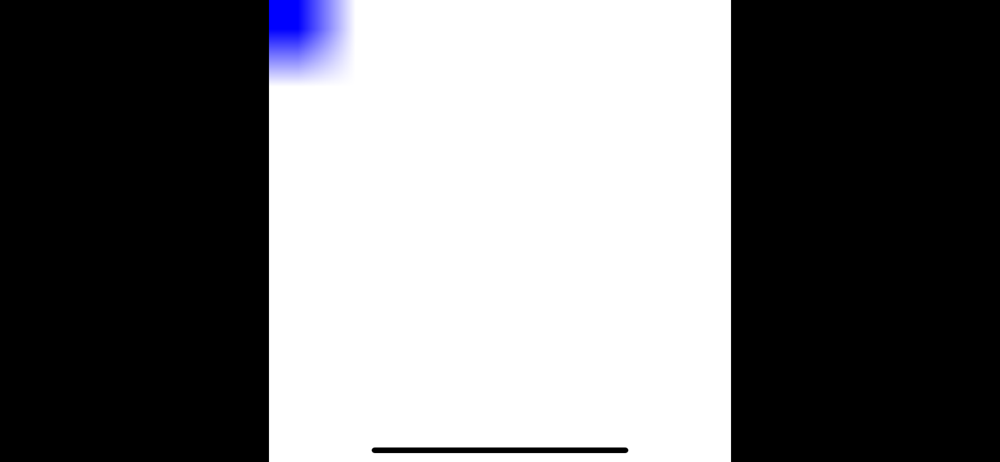

## Part 1: 关注点分离

传统的应用中， 把逻辑分离到不同的层次中是很普遍的做法——模型层（Model）,视图层（View）和控制层(Controller)<sup><a id="reference1"></a>[[1]](#footnote1)</sup>。游戏的逻辑也可以被分离到三个类似的层中：

* 平台层 - 与主机操作系统平台相关的代码
* 引擎层 - 与平台无关的游戏相关功能：资源加载、图形渲染、物理、寻路AI等。
* 游戏层 - 和当前游戏有关的玩法、图片。松耦合于特定的引擎。


Apple非常希望你使用GameKit，SpriteKit和SceneKit等框架构建游戏或引擎。它们强大且易用，然而这样做将会把你的游戏完全限定在Apple的平台内。

在实践中，也很少有开发者会这样做，因为仅苹果一家厂商并不能代表市场中足够大的份额。一种流行的替代方案是使用第三方的框架，像是Unity和Unreal这样的跨平台引擎，为很多不同的操作系统提供了很多的平台层。这个方案可以使你摆脱Apple的垄断，让你和第三方生态系统联系起来。

在这篇教程中，我们选择第三条路：使用UIKit为iOS开发一个最小化的平台层，接着从头开始，用纯Swift构建游戏层和引擎层，不引入额外的依赖。

### 项目配置

通常来说，现代的游戏需要一个相当复杂的主机操作系统接口层，用于实现硬件图形加速、声音和用户输入。幸运的是，*我们并没有在构建一个现代游戏*。

在《德军总部3D》的年代，计算机主要作为商用机器，并没有为游戏开发者提供什么助力。我们将使用MS-DOS时期类似的方式来构建这个游戏（同时会利用到一些现代技术，像是快速浮点数运算和32位色）。

首先，在Xcode中创建一个新的 *Single View iOS App* 项目。为了践行分层思想，我们将会把引擎的代码放入一个单独的模块中，在形式上，将游戏层和平台层的代码分开。

要创建引擎模块，进入Targets选项卡并添加一个新目标，类型为 *Cocoa Touch Framework*，命名为“Engine”。Xcode将会自动的将这个模块链接到你的主应用中，同时也会在Engine文件夹创建一个名为`Engine.h`的C语言头文件，这个文件引入了UIKit。我们不会在引擎中使用UIKit，所以你可以将这个文件删掉。

如果你觉得从头创建一个嵌套框架的项目有些许困难（或者不想从头开始创建一个项目），你可以从[这里](https://github.com/nicklockwood/RetroRampage/archive/Start.zip)下载起步项目。

下图展示了整个项目的结构：


### 显示设置 

打开 `ViewController.swift` 并将内容替换为以下代码：

```swift
import UIKit

class ViewController: UIViewController {
    private let imageView = UIImageView()

    override func viewDidLoad() {
        super.viewDidLoad()
        setUpImageView()
    }
    
    func setUpImageView() {
        view.addSubview(imageView)
        imageView.translatesAutoresizingMaskIntoConstraints = false
        imageView.topAnchor.constraint(equalTo: view.topAnchor).isActive = true
        imageView.leadingAnchor.constraint(equalTo: view.leadingAnchor).isActive = true
        imageView.widthAnchor.constraint(equalTo: view.widthAnchor).isActive = true
        imageView.heightAnchor.constraint(equalTo: view.heightAnchor).isActive = true
        imageView.contentMode = .scaleAspectFit
        imageView.backgroundColor = .black
    }
}
```

现在运行应用。如果一切正常，你现在应该看到了`UIImageView`的黑色背景填满了整个屏幕。

### 进入像素的世界

应用都会展示视图。游戏通常会处理精灵或多边形。我们将会直接和*像素*沟通。你在屏幕上看到的任何东西都是由像素构成的，并且，在现代操作系统中，像素通常用4个字节<sup><a id="reference2"></a>[[2]](#footnote2)</sup>存放——4个字节分别对应4个通道：红、绿，蓝和透明度(alpha)。

UIKit提供了`UIColor`类，这个类用浮点数0.0到1.0表示这4个通道。这是一种方便的抽象，但是却是一种成本高昂的颜色储存方式，同时会让我们和UIKit耦合起来，所以我们将会创建自己的`Color`类型。在Engine模块中创建一个名为`Color.swift`的新文件，内容如下<sup><a id="reference3"></a>[[3]](#footnote3)</sup>：

```swift
public struct Color {
    public var r, g, b, a: UInt8
    
    public init(r: UInt8, g: UInt8, b: UInt8, a: UInt8 = 255) {
        self.r = r
        self.g = g
        self.b = b
        self.a = a
    }
}
```

由于我们主要处理不透明的颜色，因此我们在将alpha值默认初始化为255（无透明度）。在同一个文件中，添加一些常见的颜色常量，稍后会有用<sup><a id="reference4"></a>[[4]](#footnote4)</sup>：

```swift
public extension Color {
    static let clear = Color(r: 0, g: 0, b: 0, a: 0)
    static let black = Color(r: 0, g: 0, b: 0)
    static let white = Color(r: 255, g: 255, b: 255)
    static let gray = Color(r: 192, g: 192, b: 192)
    static let red = Color(r: 255, g: 0, b: 0)
    static let green = Color(r: 0, g: 255, b: 0)
    static let blue = Color(r: 0, g: 0, b: 255)
}
```

现在引擎有可以表示像素颜色的方法了，我们还需要一种类型来表示整个图像。我们将它称为`Bitmap`避免与`UIImage`混淆。在Engine模块中创建一个名为Bitmap.swift的新文件，其中包含以下内容：

```swift
public struct Bitmap {
    public private(set) var pixels: [Color]
    public let width: Int
    
    public init(width: Int, pixels: [Color]) {
        self.width = width
        self.pixels = pixels
    }
}
```

您会注意到`Bitmap`将其像素存储在一个一纬数组中，而不是像你可能期望的那样将其存储在二维矩阵中。这样做的主要原因是为了提高效率——像这样的一维数组的内存分配方式，意味着像素将连续存储在单个内存块中，而不是在堆上单独为每个行或列分配内存。

在性能很关键的代码中，考虑内存布局，对于避免缓存未命中至关重要。当程序被强制从主内存，而不是更快的[处理器缓存](https://en.wikipedia.org/wiki/CPU_cache)中获取新数据时就发生了缓存未命中。

使用一维索引访问2D图像（每次必须计算行偏移）不是很符合一般的思维逻辑，所以我们为该类将添加一个2D下标脚本（subscript）。顺道，我们为图像的高度添加一个计算属性，并添加一个便利的initializer，用于创建一张空白的图像：

```swift
public extension Bitmap {
    var height: Int {
        return pixels.count / width
    }
    
    subscript(x: Int, y: Int) -> Color {
        get { return pixels[y * width + x] }
        set { pixels[y * width + x] = newValue }
    }

    init(width: Int, height: Int, color: Color) {
        self.pixels = Array(repeating: color, count: width * height)
        self.width = width
    }
}
```

下标脚本方法接收图像中的X和Y坐标，并进行一些数学运算来计算一维`像素`数组的偏移量。这段代码假设像素是按行顺序而不是列顺序存储的（这是大多数平台上的约定，包括iOS），但这种假定没有在公共接口中暴露出来，因此我们可以在以后必要时进行更改。

添加一个新文件`UIImage+Bitmap.swift`到主应用中，内容如下：

```swift
import UIKit
import Engine

extension UIImage {
    convenience init?(bitmap: Bitmap) {
        let alphaInfo = CGImageAlphaInfo.premultipliedLast
        let bytesPerPixel = MemoryLayout<Color>.size
        let bytesPerRow = bitmap.width * bytesPerPixel

        guard let providerRef = CGDataProvider(data: Data(
            bytes: bitmap.pixels, count: bitmap.height * bytesPerRow
        ) as CFData) else {
            return nil
        }

        guard let cgImage = CGImage(
            width: bitmap.width,
            height: bitmap.height,
            bitsPerComponent: 8,
            bitsPerPixel: bytesPerPixel * 8,
            bytesPerRow: bytesPerRow,
            space: CGColorSpaceCreateDeviceRGB(),
            bitmapInfo: CGBitmapInfo(rawValue: alphaInfo.rawValue),
            provider: providerRef,
            decode: nil,
            shouldInterpolate: true,
            intent: .defaultIntent
        ) else {
            return nil
        }

        self.init(cgImage: cgImage)
    }
}
```

你可能会注意到这个文件同时引入了UIKit和Engine模块——这很好的表明了该文件的意图，它充当了UIKit和游戏引擎之间的桥梁。具体一点，它可以接受`Bitmap`并将之转化为一个`UIImage`从而在屏幕上显示出来。

我们希望这种转换过程尽可能的高效，原因是每一帧我们都会重复这个过程。`pixels`数组已经具备了可以被`CGImage`类直接消费的正确内存布局，所以只需要简单拷贝，而不需要任何针对单个像素的操作。

请格外注意这一行：

```swift
let alphaInfo = CGImageAlphaInfo.premultipliedLast
```

通常在Swift中，结构体中声明的属性顺序并不重要。但是在当前情况下，我们依赖于`Color`的`r`，`g`，`b`和`a`属性的顺序和对齐，以匹配我们为`alphaInfo`指定的格式。

常量`premultipliedLast`指定了透明度通道位于RGB通道*之后*。 在iOS上更常见的做法是使用`premultipliedFirst`，但是如果我们使用它，我们就必须将`Color`结构体中的属性顺序更改为`a，r，g，b`，否则我们的颜色会乱套。

现在我们有了在屏幕上显示`Bitmap`所需的所有代码。将以下代码添加到`ViewController.swift`中的`viewDidLoad()`中（请注意，你需要在文件顶部添加`import Engine`，因为在`Bitmap`类型定义在Engine模块中）：

```swift
import Engine

...

override func viewDidLoad() {
    super.viewDidLoad()
    setUpImageView()
    
    var bitmap = Bitmap(width: 8, height: 8, color: .white)
    bitmap[0, 0] = .blue
    
    imageView.image = UIImage(bitmap: bitmap)
}
```

以上的代码创建了一个新的8x8尺寸的`Bitmap`，填充为白色，接着将0,0(左上角)位置的像素设置为蓝色。结果看起来将像这样：



现在你一定在想：*为何如此模糊？*

你看到的结果是现代技术[双线性过滤](https://en.wikipedia.org/wiki/Bilinear_filtering)的杰作。在美好的往昔，那时的计算机很慢，屏幕上展开的图像都成了一个个大大的方块像素<sup><a id="reference5"></a>[[5]](#footnote5)</sup>*我们挺满意*。但当时间来到90年代晚期，随着3D图形卡的普及、计算变得廉价，双线性过滤取代了之前使用的[最近邻算法](https://en.wikipedia.org/wiki/Nearest-neighbor_interpolation)。

双线性过滤算法将相邻的像素值组合产生插值结果，而不直接从原始图像中采样。对图像进行缩放时，算法的效果很好，因为像素并没有随着输出的收缩而消失，最终的图像仍可受益于这些像素的颜色特征。不幸的是，当*放大*图像时 - 特别是粗糙的像素艺术 - 最终结果往往看起来像是一团浆糊。

为了解决这个问题，请将下面这行代码添加到`ViewController.setUpImageView()`的末尾：

```swift
imageView.layer.magnificationFilter = .nearest
```

上面的代码指示`UIImageView`使用最近邻算法而不是双线性过滤来放大图像（这个将作用于放大和缩小）。再次运行程序，模糊应该已经消失了。


### 控制反转

直到现在，我们的绘图逻辑依然放在平台层中，这是一个弊端。游戏引擎应该负责绘图，而不是平台。在Engine模块中创建一个名为`Renderer.swift`的新文件，其中包含以下内容：

```swift
public struct Renderer {
    public private(set) var bitmap: Bitmap

    public init(width: Int, height: Int) {
        self.bitmap = Bitmap(width: width, height: height, color: .white)
    }
}

public extension Renderer {
    mutating func draw() {
        bitmap[0, 0] = .blue
    }
}

```

然后将`ViewController.viewDidLoad()`中的以下内容：

```swift
var bitmap = Bitmap(width: 8, height: 8, color: .white)
bitmap[0, 0] = .blue

imageView.image = UIImage(bitmap: bitmap)
```

替换为:

```swift
var renderer = Renderer(width: 8, height: 8)
renderer.draw()

imageView.image = UIImage(bitmap: renderer.bitmap)
```

再次运行，结果应该和之前一样。

### 进入循环

目前为止一切都挺好,但是一个静态像素很难称之为一个游戏。游戏中，就算玩家没有做任何事，事物也会随着时间的推移而发生变化。这是游戏和传统的GUI应用很不一样的一点——GUI应用在大部分时间都处于空闲状态，等待着用户输入。

现在我们只绘制了一次屏幕然后就停了。在真实的游戏中，一切都发生在称为*游戏循环*的循环中。游戏循环通常与显示器的[刷新率]（https://en.wikipedia.org/wiki/Refresh_rate）同步。

早期的家用计算机显示器使用扫描电子束来刺激玻璃屏幕内部的磷光涂料，该光束扫过整个屏幕的速率称为*刷新率* ——通常为50 Hz（PAL）或60 Hz（NTSC）。

早期的图形卡会暴露一个像素缓冲区，让应用程序和游戏可以在其中绘制界面，除此之外，并没有做太多的事。如果你在光束周期中错误的时间点进行图像绘制，图像会闪烁，这是为何同步游戏循环和刷新率很重要的一个原因。

现代的LCD或OLED屏幕已不再具有扫描光束，但他们的刷新率仍是有限的，在该速率下数据可以流入和流出显存。 感谢[双缓冲]（https://en.wikipedia.org/wiki/Multiple_buffering#Double_buffering_in_computer_graphics），我们不再需要担心闪烁和撕裂，但我们仍需要将绘图频率与刷新率同步才能实现顺畅的动画。

如果我们过于频繁地重绘界面，那么我们将会绘制一些我们永远看不到的帧。如果我们重绘的太慢，画面会看起来好像卡顿了。如果重绘的速度稍微慢于屏幕刷新率，则对象在屏幕上移动时会出现断断续续的情况。大多数iOS开发人员都经历过`UITableView`重绘单元格太慢时发生的* 滚动卡顿*现象。

在类似DOS这样的单线程，单进程操作系统中，游戏循环实际上就是一个`while`循环，反复扫描用户输入，运行游戏逻辑，接着重新绘制屏幕。像iOS这样的现代操作系统会并发做很多事情，阻塞主线程是一个很大的禁忌。因此，我们使用*timer*来代替循环，它会以指定的频率调用我们的更新逻辑，在等待时将控制权交还给操作系统。

在iOS中，将代码执行与屏幕刷新同步的推荐是使用`CADisplayLink`。 `CADisplayLink`是一种特殊类型的计时器，其周期始终是刷新率的精确倍数（通常为60 Hz，尽管一些现代iOS设备可以跑到120 Hz）。

Unlike `Timer`, `CADisplayLink` doesn't have a Swift-friendly, closure-based API, so we need to use the target/selector pattern. Add the following method to `ViewController` (Note the `@objc` annotation, which is needed for the selector binding to work):

```swift
@objc func update(_ displayLink: CADisplayLink) {
    var renderer = Renderer(width: 8, height: 8)
    renderer.draw()
    
    imageView.image = UIImage(bitmap: renderer.bitmap)
}
```

Then in `viewDidLoad()`, replace the lines: 

```swift
var renderer = Renderer(width: 8, height: 8)
renderer.draw()

imageView.image = UIImage(bitmap: renderer.bitmap)
```

with:

```swift
let displayLink = CADisplayLink(target: self, selector: #selector(update))
displayLink.add(to: .main, forMode: .common)
```

This code creates a `CADisplayLink` with the default frequency (60 Hz) and adds it to the main `RunLoop`. A `RunLoop` is essentially the same concept as a game loop - it's a loop that runs continuously on a given thread, monitoring for user-triggered events like touches or key presses, and firing scheduled events like timers. By adding our display link to the `RunLoop` we are telling the system to keep track of it and call our `update()` method as needed until further notice.

Note the `forMode:` argument. The `Runloop.Mode` is a sort of priority system that iOS uses to determine which events need to be updated under which circumstances. The documentation for `CADisplayLink` suggests using `default` for the mode, but events bound to the `default` mode won't fire during *tracking* (e.g. when the user is scrolling, or manipulating a UI control). By using the `common` mode we ensure that our `CADisplayLink` will be given top priority. 

A word of caution: `CADisplayLink` is retained by the `RunLoop`, and also retains a strong reference to its `target` (the view controller in this case) while running. We are not keeping a reference to the display link anywhere, so we have no means to stop it, which means it will run forever until the app terminates, and will never release the `ViewController`, even if it moves off-screen.

In this case that doesn't matter because `ViewController` is the root view controller and will never be dismissed, but if you were to build a game that used multiple view controllers for different screens it would be something to watch out for. A simple solution would be to store a reference to the `CADisplayLink` and call its `invalidate()` method when the view controller is dismissed.

### Setting Things in Motion

If everything worked correctly, we should now be redrawing our screen at 60 FPS (Frames Per Second). We're still always drawing the same thing though, so lets add some animation.

Motion is a change of position over time. Position in a 2D world is typically defined as a vector with X (for horizontal position) and Y (for vertical position). We already touched on the idea of X and Y coordinates in the context of accessing pixels in a `Bitmap`, and world coordinates are similar. But unlike pixels, entities in the world won't necessarily be aligned exactly on a grid, so we need to represent them using floating point values.

Let's create a new type to represent a position in the world. Add a new file to the Engine module called `Vector.swift` with the following contents:

```swift
public struct Vector {
    public var x, y: Double
    
    public init(x: Double, y: Double) {
        self.x = x
        self.y = y
    }
}
```

Vectors are a very flexible type - they can represent position, velocity, distance, direction and more. We will be making a lot of use of this type throughout the game engine. Our vector type could easily be extended into the 3rd dimension by adding a Z component, but because our game mechanics are primarily 2D, we'll stick with just X and Y as it makes the math much simpler.

While we're here, let's add a few operator overloads<sup><a id="reference6"></a>[[6]](#footnote6)</sup> to make `Vector` easier to work with:

```swift
public extension Vector {
    static func + (lhs: Vector, rhs: Vector) -> Vector {
        return Vector(x: lhs.x + rhs.x, y: lhs.y + rhs.y)
    }

    static func - (lhs: Vector, rhs: Vector) -> Vector {
        return Vector(x: lhs.x - rhs.x, y: lhs.y - rhs.y)
    }
    
    static func * (lhs: Vector, rhs: Double) -> Vector {
        return Vector(x: lhs.x * rhs, y: lhs.y * rhs)
    }
    
    static func / (lhs: Vector, rhs: Double) -> Vector {
        return Vector(x: lhs.x / rhs, y: lhs.y / rhs)
    }

    static func * (lhs: Double, rhs: Vector) -> Vector {
        return Vector(x: lhs * rhs.x, y: lhs * rhs.y)
    }

    static func / (lhs: Double, rhs: Vector) -> Vector {
        return Vector(x: lhs / rhs.x, y: lhs / rhs.y)
    }
    
    static func += (lhs: inout Vector, rhs: Vector) {
        lhs.x += rhs.x
        lhs.y += rhs.y
    }

    static func -= (lhs: inout Vector, rhs: Vector) {
        lhs.x -= rhs.x
        lhs.y -= rhs.y
    }
    
    static func *= (lhs: inout Vector, rhs: Double) {
        lhs.x *= rhs
        lhs.y *= rhs
    }

    static func /= (lhs: inout Vector, rhs: Double) {
        lhs.x /= rhs
        lhs.y /= rhs
    }
    
    static prefix func - (rhs: Vector) -> Vector {
        return Vector(x: -rhs.x, y: -rhs.y)
    }
}
```

### Ready Player One

We'll need a *player* object to act as our avatar in the game. Create a new file called `Player.swift` in the Engine module, with the following contents:

```swift
public struct Player {
    public var position: Vector

    public init(position: Vector) {
        self.position = position
    }
}
```

The player's position should persist between frames, so it can't be a local variable. Add a `player` property to the `ViewController` class:

```swift
class ViewController: UIViewController {
    private let imageView = UIImageView()
    private var player = Player(position: Vector(x: 4, y: 4))
    
    ...
}
```

The player is positioned at 4,4 by default which would be the center of a world that had a size of 8x8 units square. We haven't really thought about what those units are or what any of that means yet, but for now let's assume that the world's dimensions match the bitmap that we've been drawing into - i.e. that the units are in pixels.

Now we have a player instance, the renderer will need access to it in order to draw it. In `Renderer.swift` change the `draw()` method to:

```swift
mutating func draw(_ player: Player) {
    bitmap[Int(player.position.x), Int(player.position.y)] = .blue
}
```

Then in `ViewController.swift` update the line:

```swift
renderer.draw()
```

to:

```swift
renderer.draw(player)
```

Run the app and and you'll see that we now draw a pixel at the player's position - the middle of the bitmap - instead of the top corner. Next, we'll make that position change over time.

### Need for Speed

A change of position over time is called [velocity](https://en.wikipedia.org/wiki/Velocity). Velocity is a vector that combines both the [speed](https://en.wikipedia.org/wiki/Speed) at which an object is moving, and the direction of movement. Let's add a velocity property to `Player`:

```swift
public struct Player {
    public var position: Vector
    public var velocity: Vector
    
    public init(position: Vector) {
        self.position = position
        self.velocity = Vector(x: 1, y: 1)
    }
}
```

Now that the player has a velocity, we can implement movement by adding the player `velocity` to the player `position` every frame. We don't really want to add movement logic inside the `draw()` method because that violates the [separation of concerns](https://en.wikipedia.org/wiki/Separation_of_concerns) principle, so let's add a new method to `Player` called `update()`:

```swift
public extension Player {
    mutating func update() {
        position += velocity
    }
}
```

In `ViewController`'s `update()` method, call `player.update()` before drawing:

```swift
@objc func update(_ displayLink: CADisplayLink) {
    player.update()
    
    var renderer = Renderer(width: 8, height: 8)
    ...
}
```

If we run the app now it crashes almost instantly. The problem is that the player quickly moves outside of visible area, and when we try to draw outside the bitmap we get an out-of-bounds error for the `pixels` array.

This is likely to be a common problem. Rather than having to add tedious bounds checking to every drawing function we write, let's just add a guard inside the subscript to prevent us from accidentally drawing outside the array. In `Bitmap.swift`, replace the line:

```swift
set { pixels[y * width + x] = newValue }
```

with:

```swift
set {
    guard x >= 0, y >= 0, x < width, y < height else { return }
    pixels[y * width + x] = newValue
}
```

With that protection in place the app won't crash anymore, but the player avatar still vanishes from view almost immediately. To solve that, we can wrap the player position within the bitmap, using the `formTruncatingRemainder()` function from the Swift standard library:

```swift
mutating func update() {
    position += velocity
    position.x.formTruncatingRemainder(dividingBy: 8)
    position.y.formTruncatingRemainder(dividingBy: 8)
}
```

Run the app now and you should see the blue player pixel streaking diagonally across the screen, wrapping back around to the top-left corner whenever it moves off the screen. It seems to be moving much too fast - but how fast is it exactly?

For the player velocity we used `Vector(x: 1, y: 1)`, which means that the player will move one pixel to the right and down every frame. Since our frame rate is 60 FPS, that means it's moving 60 pixels per second, and since the world is only 8 pixels wide that means it flashes across the entire screen 7.5 times per second!

If we want it to move at one unit per *second* instead of one unit per frame, we need to divide the velocity by the frame-rate:

```swift
func update() {
    position += velocity / 60
    ...
}
```

That magic number 60 is pretty nasty though because it ties us to 60 FPS, when we might decide that we actually want to run at 30 FPS on older devices (or 120 FPS on newer ones) without it affecting the speed at which objects move.

Instead of hard-coding the time factor as 1/60, let's pass it as a parameter to the update function:

```swift
mutating func update(timeStep: Double) {
    position += velocity * timeStep
    ...
}
```
The value for `timeStep` will need to be provided by the platform layer. Although `CADisplayLink` has a number of time-related properties, it doesn't have exactly the value we need, so we'll need to compute it. To do that we'll add a `lastFrameTime` property to `ViewController`:

```swift
class ViewController: UIViewController {
    private let imageView = UIImageView()
    private var player = Player(position: Vector(x: 4, y: 4))
    private var lastFrameTime = CACurrentMediaTime()
    
    ...
}
```

Then, in the `update()` method, replace the line:

```swift
player.update()
```

with:

```swift
let timeStep = displayLink.timestamp - lastFrameTime
player.update(timeStep: timeStep)
lastFrameTime = displayLink.timestamp
```

Run the game again and you'll see that the player avatar now moves much more slowly. The frame rate appears much lower too, but that's an illusion - the player avatar *really is* being moved and redrawn ~60 times per second, but its position is rounded down to the nearest whole pixel in the bitmap (which only has 8x8 resolution), and the rounded value only changes once per second.

We can make the movement smoother by increasing the resolution of the bitmap from 8x8 to something much higher, but that will also make the player rectangle smaller and slower because both its size and speed are proportional to the bitmap resolution. Besides, we've hard-coded those 8x8 pixel dimensions in a couple of places already and all these magic numbers are starting to get a bit unwieldy. It's time for a refactor.

### Brave New World

We don't want the dimensions of the world to be coupled to the dimensions of the bitmap that we are drawing into, so let's make a new type to represent the world itself. Create a new file in the Engine module called `World.swift` with the following contents:

```swift
public struct World {
    public let size: Vector
    public var player: Player

    public init() {
        self.size = Vector(x: 8, y: 8)
        self.player = Player(position: Vector(x: 4, y: 4))
    }
}

public extension World {
    mutating func update(timeStep: Double) {
        player.position += player.velocity * timeStep
        player.position.x.formTruncatingRemainder(dividingBy: size.x)
        player.position.y.formTruncatingRemainder(dividingBy: size.y)
    }   
}
```

And delete the `update()` method from `Player.swift`, as we won't be needing it anymore.

In `ViewController.swift` replace the line:

```swift
private var player = Player(position: Vector(x: 4, y: 4))
```

with:

```swift
private var world = World()
```

Then in `ViewController.update()` replace:

```swift
player.update(timeStep: timeStep)
```

with:

```swift
world.update(timeStep: timeStep)
```

And replace:

```swift
renderer.draw(player)
```

with:

```swift
renderer.draw(world.player)
```

Currently, the world is still the same size as the bitmap (8x8 units), but because the world now has its own coordinate system independent of the bitmap, we are free to make the bitmap resolution higher without affecting the player speed.

If we want to be able to draw the player avatar at different scales, we can no longer just represent it as a single pixel. Let's introduce a rectangle type to represent the player's size on screen. Create a new file in the Engine module called `Rect.swift` with the following contents:

```swift
public struct Rect {
    var min, max: Vector

    public init(min: Vector, max: Vector) {
        self.min = min
        self.max = max
    }
}
```

We'll also add a convenience method to `Bitmap` to draw a `Rect`:

```swift
public extension Bitmap {
    ...
    
    mutating func fill(rect: Rect, color: Color) {
        for y in Int(rect.min.y) ..< Int(rect.max.y) {
            for x in Int(rect.min.x) ..< Int(rect.max.x) {
                self[x, y] = color
            }
        }
    }
}
```

Now that the player avatar is a rectangle rather than a single pixel, we should make the size configurable. Add a `radius` property to `Player`:

```swift
public struct Player {
    public let radius: Double = 0.5
    ...
}
```

Radius might seem an odd way to specify the size of a square, and you may be wondering why we don't use a width and height, but a radius value will be easier to work with (as we'll see in just a second). Add a computed property to `Player` to get the bounding `Rect` (in world units):

```swift
public extension Player {
    var rect: Rect {
        let halfSize = Vector(x: radius, y: radius)
        return Rect(min: position - halfSize, max: position + halfSize)
    }
}
```

Here is why the radius is useful. We want the player rectangle to be *centered* on their position, which means that it needs to extend by half their width/height in every direction. We can use the `radius` value for this directly instead of dividing by two every time.

Finally, we can update `Renderer.draw()` to display the player as a filled rectangle instead of just a single pixel. Since the method now needs to know the world size in order to compute the scale at which to draw, we'll update the method signature to accept the whole world rather than just the player:

```swift
mutating func draw(_ world: World) {
    let scale = Double(bitmap.height) / world.size.y
    
    // Draw player
    var rect = world.player.rect
    rect.min *= scale
    rect.max *= scale
    bitmap.fill(rect: rect, color: .blue)
}
```

Then, in `ViewController`, update the line:

```swift
renderer.draw(world.player)
```

to just:

```swift
renderer.draw(world)
```

By dividing the bitmap height by the world height<sup><a id="reference7"></a>[[7]](#footnote7)</sup> we get the relative scale between world units and pixels. That value is then used to scale the player rectangle so that its size on screen is independent of the pixel resolution of the bitmap.

The bitmap size is set inside the platform layer, in `ViewController`. This makes sense because the resolution at which we draw the output should be chosen to suit the device we are displaying it on. But instead of matching the world size, let's derive it from the screen size. In `ViewController.swift` replace the line:

```swift
var renderer = Renderer(width: 8, height: 8)
```

with:

```swift
let size = Int(min(imageView.bounds.width, imageView.bounds.height))
var renderer = Renderer(width: size, height: size)
```

Note that the view size is in *points*, which on a Retina display is only a half or a third of the actual pixel resolution. This isn't a mistake - drawing a full-screen image with the CPU is expensive, and I don't recommend trying to do it at full pixel resolution. Besides, chunky pixels are good for the authentic retro look!

Run the app again and you should now at last see the blue player rectangle moving smoothly across the screen (don't worry if it's a bit jerky on the simulator - it will run silky smooth in release mode on a real device).

And that's a wrap for Part 1. To recap, in this part we...

* Created a platform-independent software renderer
* Created a simple game engine with a moving player avatar
* Created an iOS platform layer to display the output of the engine

In [Part 2](Part2.md) we'll make the world a bit more interesting, and implement user input so the player can travel in any direction, not just diagonally.

<hr>

<a id="footnote1"></a>[[1]](#reference1) MVC is not the only architecture used for apps, but patterns such as MVP, MVVM, Clean, VIPER, etc. still share the same basic concepts of *view*, *model* and *everything else*, even if they give them different names or divide their responsibilities across additional layers.

<a id="footnote2"></a>[[2]](#reference2) On older systems, when RAM was at much more of a premium and memory bandwidth was lower, it was common practice to use an [indexed color palette](https://en.wikipedia.org/wiki/Indexed_color). Since the number of colors in the palette was smaller than the total number of possible colors, the space required to store a bitmap made up of color indexes was much smaller than the 3 or 4 bytes needed to store each color directly.

<a id="footnote3"></a>[[3]](#reference3) Note that there is no `import Foundation`. Nothing in the Engine module relies on any code outside the Swift standard library, even Foundation.

<a id="footnote4"></a>[[4]](#reference4) Note that the constants are added via a public extension rather than directly in the `Color` struct. Members added this way will be `public` by default instead of `internal`, which saves some typing.

<a id="footnote5"></a>[[5]](#reference5) Or possibly *rectangles*, because in the popular [Mode 13h](https://en.wikipedia.org/wiki/Mode_13h) VGA display resolution used by games like Wolfenstein and Doom, the pixels weren't actually square.

<a id="footnote6"></a>[[6]](#reference6) I'm not a big fan of operator overloading as a rule, but extending regular math operators to support vector operands like this can make code a lot more concise and easier to follow.

<a id="footnote7"></a>[[7]](#reference7) We could compute X scale and Y scale separately, but since both our world and bitmap are square we know they'll be the same. Later that will change, but we'll be replacing this code before that happens anyway.