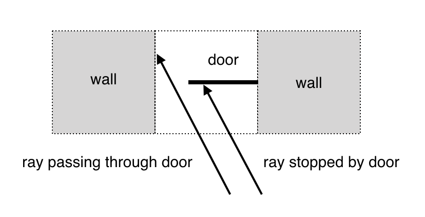
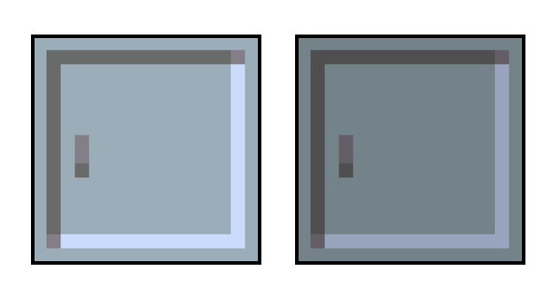
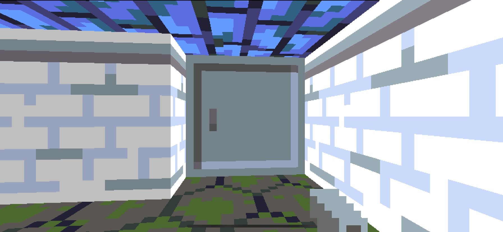
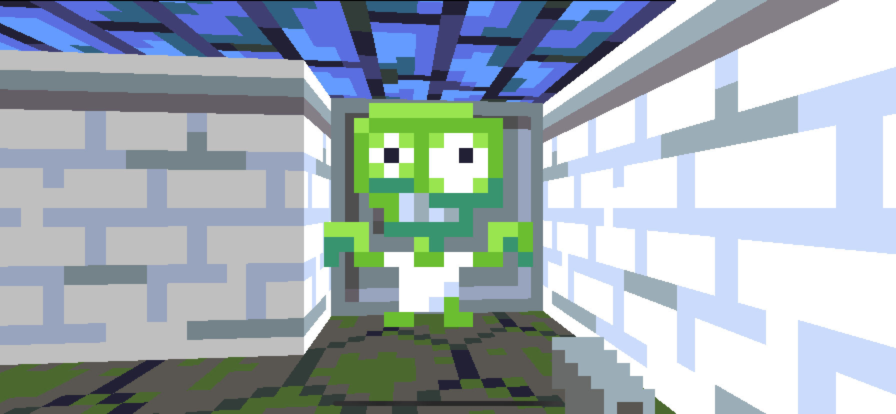
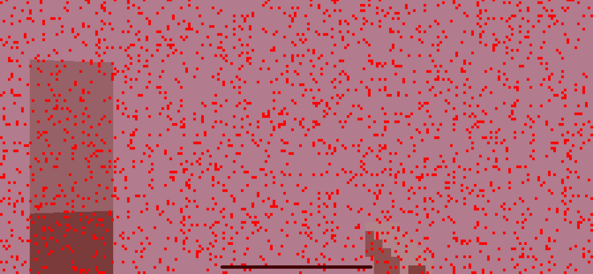
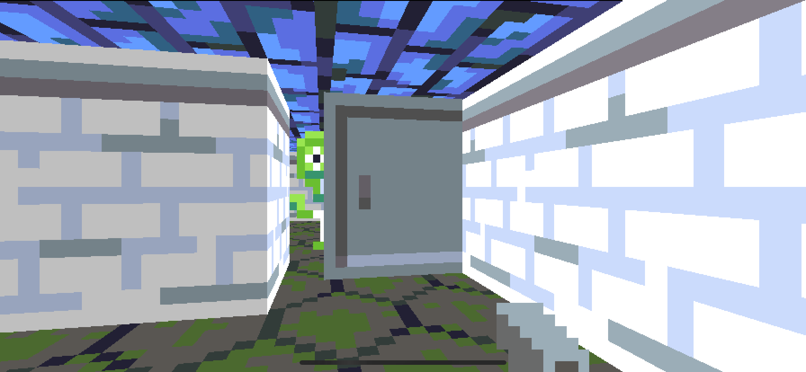
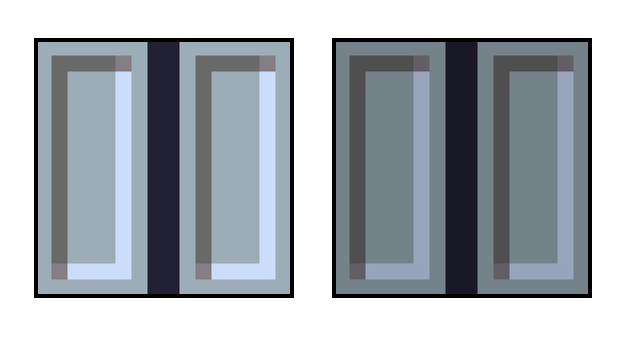
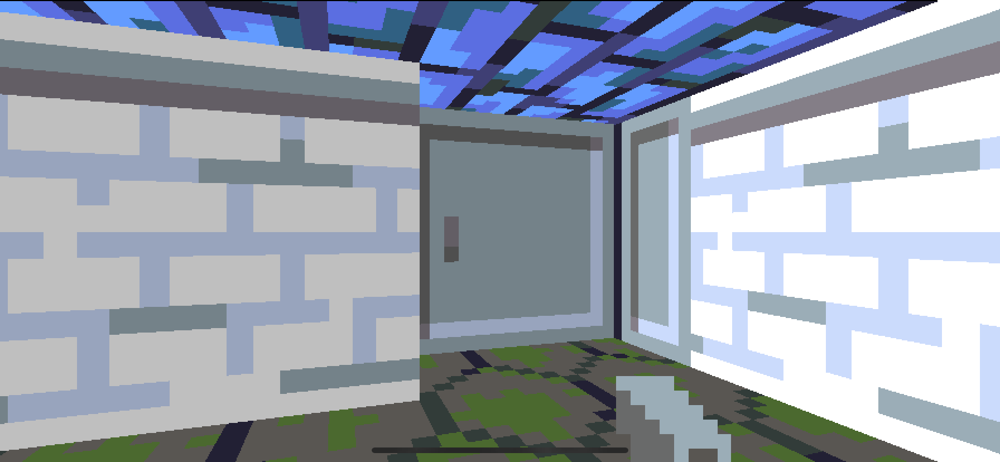

## Part 10: Sliding Doors

In [Part 9](Part9.md) we optimized the drawing logic to improve frame rate on older devices and provide some headroom for adding new features. The code for Part 9 can be found [here](https://github.com/nicklockwood/RetroRampage/archive/Part9.zip).

The game world so far consists of a simple maze containing monsters. It's time to expand that environment a bit with some interactive elements.

### Room Service

Wolfenstein 3D breaks up its endless corridors by splitting areas into separate rooms, separated by doors. These aren't just a graphical flourish, they also affect gameplay - rooms can be set up with surprise ambushes that only trigger when the player opens the door, and doors can also be locked with a key that must be located before the door will open.

But how exactly *did* Wolfenstein's doors work? After all, the ray casting system is specifically designed to work with a grid, and the doors don't actually conform to this grid. Like all other level geometry in Wolfenstein, doors are grid-aligned, but they have zero thickness and don't line up with the other wall surfaces.

Viewed from above, doors are a line segment bridging the gap between two wall sections. The Wolfenstein engine handled these as a special case in the ray caster<sup><a id="reference1"></a>[[1]](#footnote1)</sup>. If the ray encountered a door tile it would know that it needed to make a half-step to reach the door, and then, depending on how open the door was, it would either stop at the door or continue through the gap.



It wouldn't be too hard to extend the ray caster to handle doors in this way, but we aren't going to do that, because we already have another mechanism we can use that is more flexible.

### Write Once, Use Twice

I have a confession to make, dear reader. In [Part 4](Part4.md), when we added the logic for drawing sprites, I made you work a bit harder than you really needed to. 

If you just want to draw scalable sprites that always face the screen, there's really no need to compute the intersection point between arbitrary lines. The `Billboard` type we added is significantly over-specced for its ostensible purpose of drawing sprites.

And that's because it has *another purpose*. We can create a door by placing a `Billboard` in the gap between two walls. But unlike sprites, this billboard will be aligned with the map grid rather than with the view plane.

We'll need a texture for the door. Doors have two sides, but we'll just let the reverse side be a mirror of the front (this falls naturally out of the way billboard texturing works, so we don't need to do anything extra). We'll want the lighting of the doors to match the environment though, so we'll actually add *two* textures - a light and dark variant - for the vertical and horizontal door orientations.

Here are the textures I've used. You will find them in the [project assets folder](https://github.com/nicklockwood/RetroRampage/tree/Part10/Source/Rampage/Assets.xcassets/), but feel free to make your own. The door graphic can be anything you like - it can even include transparency.



Add the door textures to XCAssets, then add the new cases to `Textures.swift`:

```swift
public enum Texture: String, CaseIterable {
    ...
    case door, door2
    ...
}
```

Next up, we need to add a type to represent the door. Create a new file called `Door.swift` in the Engine module, with the following contents:

```swift
public struct Door {
    public let position: Vector
    public let direction: Vector
    public let texture: Texture

    public init(position: Vector, direction: Vector, texture: Texture) {
        self.position = position
        self.direction = direction
        self.texture = texture
    }
}
```

The structure of the door is pretty similar to `Billboard` - not a coincidence since that's how we intend to present the door to the renderer. Let's go ahead and add a computed property for the door's billboard representation. Add the following code to the bottom of the file:

```swift
public extension Door {
    var billboard: Billboard {
        return Billboard(
            start: position - direction * 0.5,
            direction: direction,
            length: 1,
            texture: texture
        )
    }
}
```

We'll need to place the doors in the map. The `Tilemap` has two categories of data in it, *tiles* and *things*, and it's not immediately obvious which of these a door would fall under.

On the one hand, a door is part of the level geometry. It's not sentient, it can't move freely around the level, it can't occupy the same space as a wall. So it makes sense for it to be a type of tile, right?

But on the other hand, doors are not static. At any given time a door can be open or closed (or somewhere in between), so it requires runtime state. It's animated, it can interact with the player, it can't occupy the same starting tile as a monster or other *thing*.

I don't think there's an obvious right answer here, but in the end I opted to make doors a *thing*, for the following reasons:

* It means we can specify the floor/ceiling tile for the doorway independently of the door itself.
* It requires fewer code changes to the `Renderer` and `World` initialization code.

In `Thing.swift`, go ahead and add a `door` case to the enum:

```swift
public enum Thing: Int, Decodable {
    case nothing
    case player
    case monster
    case door
}
```

Then in `Map.json`, in the main project, add two doors to the `things` array (doors are represented by a `3`, matching their index in the `Thing` enum):

```swift
{
    "width": 8,
    "tiles": [
        ...
    ],
    "things": [
        0, 0, 0, 0, 0, 0, 0, 0,
        0, 2, 0, 0, 0, 0, 0, 0,
        0, 0, 0, 0, 0, 0, 2, 0,
        0, 0, 0, 3, 0, 0, 0, 0,
        0, 0, 0, 0, 0, 0, 3, 0,
        0, 0, 2, 0, 0, 0, 0, 0,
        0, 0, 0, 0, 1, 0, 2, 0,
        0, 0, 0, 0, 0, 0, 0, 0
    ]
}
```

Back in Engine, in `World.swift` update the `World` struct to include a new `doors` property as follows:

```swift
public struct World {
    public let map: Tilemap
    public private(set) var doors: [Door]
    public private(set) var monsters: [Monster]
    public private(set) var player: Player!
    public private(set) var effects: [Effect]

    public init(map: Tilemap) {
        self.map = map
        self.doors = []
        self.monsters = []
        self.effects = []
        reset()
    }
}
```

Still in `World.swift`, add the following to the top of the `reset()` method, just below the `self.monsters = []` line:

```swift
self.doors = []
```

We'll also need to add a case to the switch statement to handle the new `door` type:

```swift
case .door:
    doors.append(Door(
        position: position,
        direction: Vector(x: 0, y: 1),
        texture: .door
    ))
```

This adds a vertical door, but what do we do about horizontal doors? We could add a second door type to `Thing` but that seems rather inelegant. It's also not great that `World` needs to know quite so much about the door internals here.

In `Door.swift`, replace the `init` method with the following:

```swift
public init(position: Vector, isVertical: Bool) {
    self.position = position
    if isVertical {
        self.direction = Vector(x: 0, y: 1)
        self.texture = .door
    } else {
        self.direction = Vector(x: 1, y: 0)
        self.texture = .door2
    }
}
```

That's better - the `Door` initializer now only allows valid door configurations, and the caller can easily specify if a vertical or horizontal door is needed. So how do we work out which type we need?

The design of the doors means that they have to be straddled on either side by two wall tiles. They can't have a wall segment in front and behind them, otherwise it wouldn't be possible to walk through.

On that basis, we can infer that if there is a wall tile above and below a door then it must be vertical, and if there isn't, it must be horizontal. Back in `World.reset()`, replace the `case .door:` block with:

```swift
case .door:
    let isVertical = map[x, y - 1].isWall && map[x, y + 1].isWall
    doors.append(Door(position: position, isVertical: isVertical))
```

You may have noticed that this code will crash if the door is placed on a border tile - we could add bounds checks, but the renderer will freeze up anyway if the border of the map isn't a wall, so we can consider this a programmer error.

But since we disabled safety checks in [Part 9](Part9.md), it's possible an out-of-bounds error *won't* actually crash here but will return a garbage value and probably crash at some later point. It would be good code hygiene to add a `precondition()` call to ensure we crash early with a meaningful error.

Add the following line just before the `let isVertical ...`:

```swift
precondition(y > 0 && y < map.height, "Door cannot be placed on map edge")
```

### Drawing Room

That's all the code we need in order to place the doors in the world. Now we just need to actually draw them, and turn our corridors into rooms.

This part is actually fairly trivial, since we already did all the setup work. In the `World.sprites` computed property, replace the line:

```swift
return monsters.map { $0.billboard(for: ray) }
```

with:

```swift
return monsters.map { $0.billboard(for: ray) } + doors.map { $0.billboard }
```

And that's it! Run the game and there's the door in the corner<sup><a id="reference2"></a>[[2]](#footnote2)</sup>.



If you walk over to admire the door up close, you might be surprised by this fellow making a sudden appearance!



The problem is, although we've placed the door in the level and drawn it, it has no physical presence. None of the collision detection mechanisms are aware of it, so monsters can walk right through it - as can the player.

### You Shall Not Pass

To prevent the monster and player from passing through the door, we need to extend the collision logic. All of our collisions so far are based on rectangle intersections, and fortunately that will work for doors as well. In `Door.swift`, add a computed `rect` property, as follows:

```swift
public extension Door {
    var rect: Rect {
        let position = self.position - direction * 0.5
        return Rect(min: position, max: position + direction)
    }
    
    ...
}
```

This `Rect` actually has zero area - it's really just a line - but it will work perfectly well for collision calculations. The original Wolfenstein 3D actually modeled the collision area for doors as a full tile-sized square, so you couldn't step into the alcove in front of them, but on a mobile device that makes it tricky to line yourself up with the door, as John Carmack described in a [blog post about the original Wolfenstein 3D iPhone port](https://www.eurogamer.net/articles/id-releases-open-source-wolf-3d-iphone):

> In watching the early testers, the biggest issue I saw was people sliding off doors before they opened, and having to maneuver back around to go through. In Wolf, as far as collision detection was concerned, everything was just a 64x64 tile map that was either solid or passable.

> It turned out to be pretty easy to make the door tiles only have a solid central core against the player, so players would slide into the "notch" with the door until it opened. This made a huge improvement in playability.

Collisions between a monster or player and the walls are handled by the `Actor` protocol. In `Actor.swift`, we already have an `intersection(with map:)` method, but we can't simply extend that to handle doors as well because the `Tilemap` only contains the initial state of the doors, and we'll need to vary the collision behavior when the doors are opened or closed.

Instead, add two new methods just below `intersection(with map:)`:

```swift
func intersection(with door: Door) -> Vector? {
    return rect.intersection(with: door.rect)
}

func intersection(with world: World) -> Vector? {
    if let intersection = intersection(with: world.map) {
        return intersection
    }
    for door in world.doors {
        if let intersection = intersection(with: door) {
            return intersection
        }
    }
    return nil
}
```

The `intersection(with door:)` method detects the intersection with a single door, and the `intersection(with world:)` checks for intersections with any wall or door in the world.

In `World.update`, in the `// Handle collisions` section, replace the line:

```
while let intersection = monster.intersection(with: map) {
```

with:

```
while let intersection = monster.intersection(with: self) {
```

Then replace:

```
while let intersection = player.intersection(with: map) {
```

with:

```
while let intersection = player.intersection(with: self) {
```

Try running the game again and you should find that the monster can no longer walk through the door to get you. If you walk right up to the door though, you'll find that the screen starts flashing red, and you eventually die. What's up with that?



### X-Ray Vision

Even though the door is closed, the monster behind it can still see you because we didn't update their AI to take doors into account. As soon as you walk in front of the door they'll walk towards you. They can't walk through the door, but since the door has zero thickness, if you stand right up against it then you're inside their attack radius and they can hurt you.

Your pistol also "sees" the monster using a ray cast, so right now there's nothing to stop you shooting them through the door. Both of these bugs have the same root cause:

The monster detects the player via the `Monster.canSeePlayer()` method, which projects a ray towards the player and checks if it hits a wall before it reaches them. To detect wall collisions, it uses the `Tilemap.hitTest()` method internally, which isn't aware of doors (hence the "ability" to see through them).

The player's pistol finds its target by calling the `World.hitTest()` method, which projects a ray and returns the index of the first monster it hits. This method also calls `Tilemap.hitTest()`, and so also ignores doors.

In retrospect, `World.hitTest()` was poorly named - partly because it deviates from the pattern of other `hitTest()` methods (which return a coordinate rather than an object index), and partly because it implies generality, whereas actually this method is specifically checking for *monster* hits - we can't use it to detect if the ray hits a wall, or a door, or the player.

In `World.swift`, rename the `hitTest()` method to `pickMonster()`, as follows:

```swift
func pickMonster(_ ray: Ray) -> Int? {
```

Then, in `Player.update()`, change the line:

```swift
if let index = world.hitTest(ray) {
```

to:

```swift
if let index = world.pickMonster(ray) {
```

That frees up the name `World.hitTest()` to use for its more natural purpose. Back in `World.swift`, add a new `hitTest()` method above the renamed `pickMonster()`:

```swift
func hitTest(_ ray: Ray) -> Vector {
    var wallHit = map.hitTest(ray)
    
    return wallHit
}
```

Currently, this just wraps the `Tilemap.hitTest()` method, and will only detect wall hits, but let's expand it to handle doors as well. In `Door.swift` add the following method:

```swift
func hitTest(_ ray: Ray) -> Vector? {
    return billboard.hitTest(ray)
}
```

This may seem a little redundant, since the `Door.billboard` property is public and we could `hitTest()` it directly, but it gives us the flexibility to change the behavior. For example, we might later want doors with holes that can be seen and fired through, or we could add the ability to destroy doors, etc.

Back in `World.hitTest()`, add the following lines before the return statement:

```swift
var distance = (wallHit - ray.origin).length
for door in doors {
    guard let hit = door.hitTest(ray) else {
        continue
    }
    let hitDistance = (hit - ray.origin).length
    guard hitDistance < distance else {
        continue
    }
    wallHit = hit
    distance = hitDistance
}
```

Here we loop through the doors in the level and check if the ray hits them. If so, the distance of the hit is compared to the original wall hit distance, and the shortest distance is taken as the new threshold.

Now we have a method to detect ray collisions with both doors and walls, we can refactor the methods that use `Tilemap.hitTest()` to use `World.hitTest()` instead. In `World.pickMonster()`, replace the line:

```swift
let wallHit = map.hitTest(ray)
```

with just:

```swift
let wallHit = hitTest(ray)
```

Then, in `Monster.canSeePlayer()`, replace:

```swift
let wallHit = world.map.hitTest(ray)
```

with just:

```swift
let wallHit = world.hitTest(ray)
```

With that done, we finally have a door that is impervious both to movement and vision. We have created *a wall*. Um... I guess we should probably work out how to make a door that actually opens?

### Open Sesame

To allow doors to be opened and closed, we will need to give them some internal state. By now you should be familiar with the concept of creating a state machine by switching over an enum - we'll use the same technique again here.

In `Door.swift`, add the following enum to the top of the file:

```swift
public enum DoorState {
    case closed
    case opening
    case open
    case closing
}
```

The door will start out in the closed state, and like all animated objects in the game it will need to keep track of time, so go ahead and add the following properties to the `Door` struct:

```swift
public var state: DoorState = .closed
public var time: Double = 0
```

Since doors are interactive, they will need their own `update()` method. Add the following method to the extension block:

```swift
mutating func update(in world: inout World) {
    switch state {
    case .closed:
        
    case .opening:
        
    case .open:
        
    case .closing:
        
    }
}
```

This is just a shell for now - we'll work out the implementation in a second. But first, go to `World.update` and add this block of code after the `// Update monsters` section:

```swift
// Update doors
for i in 0 ..< doors.count {
    var door = doors[i]
    door.time += timeStep
    door.update(in: &self)
    doors[i] = door
}
```

This should be a fairly familiar pattern - for each door we make a copy, increment the time, and then call `update()`, before replacing the original door instance in the array with the modified one.

Door opening will be triggered by the player, but having an explicit "open door" button isn't great UX for a mobile game - as Carmack explains in the [aforementioned blog post](https://www.eurogamer.net/articles/id-releases-open-source-wolf-3d-iphone):

> I started out with an explicit "open door" button like the original game, but I quickly decided to just make that automatic. Wolf and Doom had explicit "use" buttons, but we did away with them on Quake with contact or proximity activation on everything. Modern games have generally brought explicit activation back by situationally overriding attack, but hunting for push walls in Wolf by shooting every tile wouldn't work out. There were some combat tactics involving explicitly shutting doors that are gone with automatic-use, and some secret push walls are trivially found when you pick up an item in front of them now, but this was definitely the right decision.

If and when we port the game to other platforms, we might want to consider adding an explicit door control, but for now we'll make it automatic. That means we don't need to extend the `Input` or `Player` types at all - we can implement the door opening logic entirely within `Door.update()`. Replace the empty `case .closed:` with the following:

```swift
case .closed:
    if world.player.intersection(with: self) != nil {
        state = .opening
        time = 0
    }
```

So now if the player is touching the door when it's in the `closed` state, it will transition to the `opening` state automatically. What's next?

The transition from `opening` to `open` is time-based. We'll need to add a `duration` constant to control how long that process should take, so go ahead and add the following property at the top of the `Door` struct:

```swift
public let duration: Double = 0.5
```

Then in `update()`, replace the empty `case .opening:` with:

```swift
case .opening:
    if time >= duration {
        state = .open
        time = 0
    }
```

We'll use the same duration for the closing animation too, so replace `case .closing:` with:

```swift
case .closing:
    if time >= duration {
        state = .closed
        time = 0
    }
```

That just leaves the `open` case. We need some logic to transition from the open state to the closing sequence. The opening sequence is triggered when the player touches the door, but there's no equivalent action for closing the door again - so how should this work?

We could do something based on distance - if the player moves outside a certain radius then the door closes automatically - but a simpler option is to have the door close after a fixed delay. Add a second constant called `closeDelay` to `Door`, just below the `duration` property we added earlier:

```swift
public let closeDelay: Double = 3
```

Then in `update()`, replace `case .open:` with:

```swift
case .open:
    if time >= closeDelay {
        state = .closing
        time = 0
    }
```

That takes care of the door's state machine - now we just need to implement the animation.

In keeping with the original Wolfenstein 3D, our doors will slide open sideways<sup><a id="reference3"></a>[[3]](#footnote3)</sup>. In earlier chapters we implemented animations based on image sequences and opacity - this time we are going to animate a position, but really the principle is the same.

The door already has a `position` property. We could manipulate this directly, but that would make it difficult to track where we are at in the animation, and could also lead to a gradual buildup of floating point rounding errors over time. Instead, we'll add a separate `offset` property which we can combine with the `position` to get the current door placement. 

Add the following computed property to the extension block in `Door.swift`, just above the `billboard` property:

```swift
var offset: Double {
    let t = min(1, time / duration)
    switch state {
    case .closed:
        return 0
    case .opening:
        return Easing.easeInEaseOut(t)
    case .open:
        return 1
    case .closing:
        return 1 - Easing.easeInEaseOut(t)
    }
}
```

This `offset` property works in a very similar way to the `progress` property we added to the `Effect` type in [Part 7](Part7.md). Like the `fizzleOut` effect, we've used the `easeInEaseOut()` easing function so that the door will gently accelerate and decelerate as it opens and closes.

In the `billboard` property code, replace the line:

```swift
start: position - direction * 0.5,
```

with:

```swift
start: position + direction * (offset - 0.5),
```

So now the `Billboard` for the door will slide along its axis in proportion to the current offset. That will take care of rendering, but we also need to handle player and monster collisions, which are based on the door's `rect` property.

There are a couple of ways we could handle this - for example, we could update `Player.intersection(with door:)` to return nil if the door is in the `open` or `opening state`. That's actually how the original Wolfenstein engine worked. 

But the way we have constructed the door means it's really not much trouble to implement collisions properly. In the computed `Door.rect` property, replace the following line:

```swift
let position = self.position - direction * 0.5
```

with:

```swift
let position = self.position + direction * (offset - 0.5)
```

With this in place, the position of the collision rect for the door will match up exactly with the billboard position, allowing the player to pass through the gap when the door is open. Try running the game now and you should find that the door is fully functional.



### Door Jam

The decision to implement the door collisions faithfully does introduce a slight complication. After opening the door (and dispatching any prowling monsters), try standing in the doorway and waiting for it to close on you.

Assuming you've lined yourself up correctly, you'll find that the game freezes when the door hits you. Not good!

If you recall, in `World.update()` we wrote some collision logic for the player that looked like this:

```swift
while let intersection = player.intersection(with: map) {
    player.position -= intersection
}
```

This well-intentioned loop was supposed to ensure that the player never got stuck inside walls, but we failed to account for the scenario of a wall (or in this case, a door) getting stuck *inside the player*. As the door closes on the player, the collision handling tries to move the player out of the way, but there is nowhere to move to, as the gap between the door and wall is now too narrow for the player to fit.

The solution is to make the collision handling a bit more tolerant. But since this code is duplicated between the player and monsters, we'll also take this opportunity to extract it. In `Actor.swift`, add the following method to the extension block:

```swift
mutating func avoidWalls(in world: World) {
    var attempts = 10
    while attempts > 0, let intersection = intersection(with: world) {
        position -= intersection
        attempts -= 1
    }
}
```

Like the existing collision loops, this repeatedly tries to move the actor away from any scenery they are intersecting. Unlike those loops, however, it attempts this only 10 times before giving up, on the basis that it's better to allow some object interpenetration than to freeze the game.

Back in `World.update()`, in the `// Handle collisions` block, replace the lines:

```swift
while let intersection = player.intersection(with: map) {
    player.position -= intersection
}
```

with:

```swift
player.avoidWalls(in: self)
```

Then also replace:

```swift
while let intersection = monster.intersection(with: map) {
    monster.position -= intersection
}
```

with:

```swift
monster.avoidWalls(in: self)
```

Try running the game again and you should find that it's no longer possible to get stuck in the door. If you position yourself so it closes on you, you just end up getting nudged out again as the `avoidWalls()` method gives up and the door keeps moving.

### Doorjamb

It looks a little odd having the doors slide out of a featureless wall. Wolfenstein had special [doorjamb](https://en.wikipedia.org/wiki/Jamb) textures that were applied to the neighboring wall tiles.

Go ahead and add a pair of doorjamb textures to XCAssets.



Then add the new cases to `Textures.swift`:

```swift
public enum Texture: String, CaseIterable {
    ...
    case doorjamb, doorjamb2
    ...
}
```

We could implement the doorjamb as a special kind of wall tile, but our texturing scheme currently only allows us to vary the texture for vertical or horizontal walls, which would lead to an awkward limitation on how doors can be placed to avoid the jamb texture appearing on walls we didn't intend it to.

Instead of trying to force this into our existing wall model, let's extend the renderer to support doorjambs as a special case. Whenever a wall is adjacent to a door, we'll use the jamb texture instead of whatever texture is specified by the tile.

To check if a given tile contains a door, we could either use the `things` array in the `Tilemap` or the `doors` array in `World`. The `things` array is already ordered for lookup by tile coordinate, whereas `doors` would require a linear search to find the element with the matching position, so `things` seems like the better choice.

In `World.swift`, add the following method:

```swift
func isDoor(at x: Int, _ y: Int) -> Bool {
    return map.things[y * map.width + x] == .door
}
```

Now let's take a look at the wall-rendering code. In `Renderer.draw()`, in the `// Draw wall` section, we look up the current tile using:

```swift
let tile = world.map.tile(at: end, from: ray.direction)
```

The `TileMap.tile(at:from:)` method uses the ray intersection point and direction to compute the tile that's been hit. This method returns the `Tile` directly, but in order to determine if the neighboring tile contains a door, it would be more helpful if we had the tile *coordinates* instead.

In `Tilemap.swift`, find the following method:

```swift
func tile(at position: Vector, from direction: Vector) -> Tile {
```

and change its signature to:

```swift
func tileCoords(at position: Vector, from direction: Vector) -> (x: Int, y: Int) {
```

Then, in the same method, replace the last line:

```swift
return self[Int(position.x) + offsetX, Int(position.y) + offsetY]
```

with:

```swift
return (x: Int(position.x) + offsetX, y: Int(position.y) + offsetY)
```

Next, to avoid breaking all the call sites that were using `tile(at:from:)`, add a new method with the same signature just below the `tileCoords()` method:

```swift
func tile(at position: Vector, from direction: Vector) -> Tile {
    let (x, y) = tileCoords(at: position, from: direction)
    return self[x, y]
}
```

Back in the `// Draw wall` section of `Renderer.draw()`, replace the line:

```swift
let tile = world.map.tile(at: end, from: ray.direction)
```

with:

```swift
let (tileX, tileY) = world.map.tileCoords(at: end, from: ray.direction)
let tile = world.map[tileX, tileY]
```

The new code is functionally equivalent, but now that we have the actual tile coordinates available, we can derive the neighboring tile and determine if it contains a door.

The code immediately after those lines looks like this:

```swift
if end.x.rounded(.down) == end.x {
    wallTexture = textures[tile.textures[0]]
    wallX = end.y - end.y.rounded(.down)
} else {
    wallTexture = textures[tile.textures[1]]
    wallX = end.x - end.x.rounded(.down)
}
```

This code checks if the wall is horizontal or vertical, then applies the appropriate wall texture. It is here that we need to add the check for a neighboring door and (if applicable) override the texture.

For a vertical wall, the tile we need to check will be either to the left or right of `tileX`, depending on the direction of the ray. Replace the line:

```swift
wallTexture = textures[tile.textures[0]]
```

with:

```swift
let neighborX = tileX + (ray.direction.x > 0 ? -1 : 1)
let isDoor = world.isDoor(at: neighborX, tileY)
wallTexture = textures[isDoor ? .doorjamb : tile.textures[0]]
```

That code uses the ray direction to determine which neighbor to check, then if the neighbor contains a door, swaps the wall texture for the doorjamb. Now we'll do the same for the `else` (horizontal) branch. Replace:

```swift
wallTexture = textures[tile.textures[1]]
```

with:

```swift
let neighborY = tileY + (ray.direction.y > 0 ? -1 : 1)
let isDoor = world.isDoor(at: tileX, neighborY)
wallTexture = textures[isDoor ? .doorjamb2 : tile.textures[1]]
```

Run the game again and you should see the doorjamb in position by the door.



And that's it for Part 10! In this part we:

* Added sliding doors by repurposing the billboard renderer we used for sprites
* Implemented doorjamb textures without awkward map layout restrictions

In [Part 11](Part11.md) we'll add another iconic gameplay feature from Wolfenstein 3D.

### Reader Exercises

1. Try increasing the thickness of the door collision rect so that you don't have to actually touch it to open it.

2. The door closing automatically when you are trying to walk through can be a nuisance. Could you modify the door logic so that it will only close if the doorway tile is unoccupied?

3. Create a new type of door that swings open from one corner instead of sliding (you can cheat and include Foundation if you need the trigonometry functions, but there's bonus points if you can figure out how to do it without those).

<hr>

<a id="footnote1"></a>[[1]](#reference1) Sliding doors are a rare example of something the primitive Wolfenstein engine could do that later, more sophisticated engines like Doom could not replicate. In Doom's sector-based world, sectors can only move up and down, not sideways. Doors in Doom were effectively mini elevators - with a small section of floor moving up to meet the ceiling, or vice-versa.

<a id="footnote2"></a>[[2]](#reference2) Before examining the door, you might want to kill the zombie first so you can appreciate it properly without being mauled.

<a id="footnote3"></a>[[3]](#reference3) Note that we don't *have* to implement them this way. Although vertical offsets aren't current supported for billboards, we could create a door opening animation using a sequence of image frames and then animate it using the same technique we use for sprites.
