## Part 11: Secrets

In [Part 10](Part10.md) we added sliding doors. The code for Part 10 can be found [here](https://github.com/nicklockwood/RetroRampage/archive/Part10.zip).

**Note:** There was a bug introduced in [Part 9](Part9.md) that caused the floor and ceiling to be swapped. While it doesn't directly affect any of the code in this chapter, if you have been coding along with the tutorials as they were released then you might want to fix it in your own project before proceeding. For details, refer to the [CHANGELOG](../CHANGELOG.md).

### Pushing the Boundaries

Beyond the innovative<sup><a id="reference1"></a>[[1]](#footnote1)</sup> run-and-gun gameplay, one of the most iconic features of the original Wolfenstein 3D were the secret rooms, filled with treasure and power-ups, hidden behind sliding push-walls<sup><a id="reference2"></a>[[2]](#footnote2)</sup>.

The mechanism for push-walls is similar to the sliding doors. Although they *look* like ordinary walls, push-walls aren't aligned to the map grid, and can't be drawn using the normal tile-based wall-renderer. Instead, we'll construct the push wall using four individual billboards, arranged in a square.

Add a new file called `Pushwall.swift` to the Engine module, with the following contents:

```swift
public struct Pushwall {
    public var position: Vector
    public let tile: Tile
    
    public init(position: Vector, tile: Tile) {
        self.position = position
        self.tile = tile
    }
}

public extension Pushwall {
    var rect: Rect {
        return Rect(
            min: position - Vector(x: 0.5, y: 0.5),
            max: position + Vector(x: 0.5, y: 0.5)
        )
    }
    
    var billboards: [Billboard] {
        let topLeft = rect.min, bottomRight = rect.max
        let topRight = Vector(x: bottomRight.x, y: topLeft.y)
        let bottomLeft = Vector(x: topLeft.x, y: bottomRight.y)
        let textures = tile.textures
        return [
            Billboard(start: topLeft, direction: Vector(x: 0, y: 1), length: 1, texture: textures[0]),
            Billboard(start: topRight, direction: Vector(x: -1, y: 0), length: 1, texture: textures[1]),
            Billboard(start: bottomRight, direction: Vector(x: 0, y: -1), length: 1, texture: textures[0]),
            Billboard(start: bottomLeft, direction: Vector(x: 1, y: 0), length: 1, texture: textures[1])
        ]
    }
}
```

This is a basic model for the push-wall that has a `position`, `tile` type, `rect` (for collisions) and a `billboards` property for the faces of the wall.

Like doors, push-walls will be `Thing`s, allowing them to move around within the map without needing to alter the static `tiles` layout at runtime. Open `Thing.swift` and add a `pushwall` case to the end of the enum:

```swift
public enum Thing: Int, Decodable {
    ...
    case pushwall
}
```

In `World.swift`, add a `pushwalls` property to the `World` struct:

```swift
public struct World {
    public let map: Tilemap
    public private(set) var doors: [Door]
    public private(set) var pushwalls: [Pushwall]
    ...
}
```

Then update `World.init()` to set `pushwalls` to an empty array:

```swift
public init(map: Tilemap) {
    self.map = map
    self.doors = []
    self.pushwalls = []
    ...
}
```

Update `World.reset()` to reset the `pushwalls` array:

```swift
mutating func reset() {
    self.monsters = []
    self.doors = []
    self.pushwalls = []
    ...
}
```

And, still in the `reset()` method, add a case to the switch statement:

```swift
case .pushwall:
    precondition(!map[x, y].isWall, "Pushwall must be placed on a floor tile")
    pushwalls.append(Pushwall(position: position, tile: .wall))
```

Note the precondition - because `Pushwall` acts like a wall, it can't actually occupy the same space as a wall tile in the map. In `Map.json` go ahead and remove an inner wall from the `tiles` array and replace it with a push-wall (index `4`) in the `things` array:

```swift
"tiles": [
    1, 3, 1, 1, 3, 1, 1, 1,
    1, 0, 0, 2, 0, 0, 0, 1,
    1, 4, 0, 3, 4, 0, 0, 3,
    2, 0, 0, 0, 0, 0, 4, 3,
    1, 4, 0, 1, 0, 1, 0, 1,
    1, 0, 4, 2, 0, 0, 0, 1,
    1, 0, 0, 1, 0, 4, 4, 1,
    1, 3, 3, 1, 1, 3, 1, 1
],
"things": [
    0, 0, 0, 0, 0, 0, 0, 0,
    0, 2, 0, 0, 0, 0, 0, 0,
    0, 0, 0, 0, 0, 0, 2, 0,
    0, 0, 0, 3, 0, 0, 0, 0,
    0, 0, 0, 0, 4, 0, 3, 0,
    0, 0, 2, 0, 0, 0, 0, 0,
    0, 0, 0, 0, 1, 0, 2, 0,
    0, 0, 0, 0, 0, 0, 0, 0
]
```

This creates a secret passage immediately to the left of the player, which we can use to surprise the monster in the second room. Try running the game and looking to your left (you might want to dispatch the monster in front of you first).

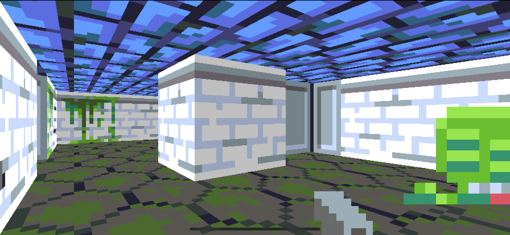

Hmm. The secret passage isn't all that secret really - I guess we forgot to actually draw the push-wall!

Still in `World.swift` find the `sprites` computed property and update it to include the push-wall billboards:

```swift
var sprites: [Billboard] {
    let ray = Ray(origin: player.position, direction: player.direction)
    return monsters.map { $0.billboard(for: ray) } + doors.map { $0.billboard }
        + pushwalls.flatMap { $0.billboards }
}
```

That takes care of the wall drawing, but the monster on the other side of the passage can potentially still see us.

The monster's vision isn't based on the same rendering logic used for the game view - it "sees" by casting a single ray towards the player and checking if it finds anything solid in the way. To ensure that rays cast by the monster will be stopped by push-walls as well as doors, find the following lines in `World.hitTest()`:

```swift
for door in doors {
    guard let hit = door.billboard.hitTest(ray) else {
```

And replace them with:

```swift
let billboards = doors.map { $0.billboard } + pushwalls.flatMap { $0.billboards }
for billboard in billboards {
    guard let hit = billboard.hitTest(ray) else {
```

Okay, so now let's try running the game again.

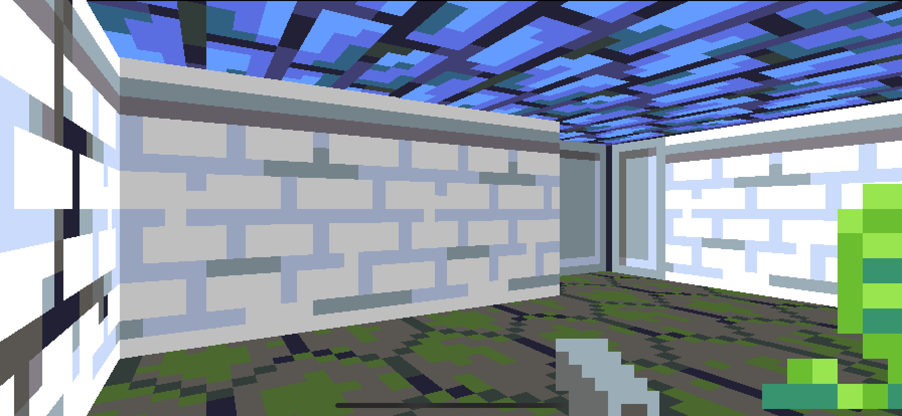

Not much to look at - it's just an ordinary wall. But if you walk forward you'll find you can pass right through it. It's a secret passage alright, but not quite what we intended. Although it now *looks* like a wall, the push-wall has no physical presence.

We want the player (and monsters too), to bounce off the push-wall just as they would any other wall. Collisions between player and scenery are handled by the `Actor.avoidWalls()` method, which in turn calls `Actor.intersection(with world:)`. That method currently checks for collisions with walls and doors, so we'll extend it to detect push-walls as well.

In `Actor.swift`, add the following method, just after `intersection(with door:)`:

```swift
func intersection(with pushwall: Pushwall) -> Vector? {
    return rect.intersection(with: pushwall.rect)
}
```

Then add the following code to the `intersection(with world:)` method, just before the `return nil` line:

```swift
for pushwall in world.pushwalls {
    if let intersection = intersection(with: pushwall) {
        return intersection
    }
}
```

If you run the game again you should find you can no longer walk through the wall. We have successfully invented a new (and considerably less efficient) way to draw walls. Good job everyone!

### Right of Passage

To convert our stationary wall back into a passageway, we need to give it some interactivity. You should be pretty familiar with this process by now - Things that move need a `velocity`; Things that interact need an `update()` method.

In `Pushwall.swift`, add a `speed` constant and `velocity` property:

```swift
public struct Pushwall {
    public let speed: Double = 0.25
    public var position: Vector
    public var velocity: Vector
    public let tile: Tile

    public init(position: Vector, tile: Tile) {
        self.position = position
        self.velocity = Vector(x: 0, y: 0)
        self.tile = tile
    }
}
```

Then, in the extension block, add the following code:

```swift
public extension Pushwall {
    ...
    
    var isMoving: Bool {
        return velocity.x != 0 || velocity.y != 0
    }
    
    mutating func update(in world: inout World) {
        if isMoving == false, let intersection = world.player.intersection(with: self) {
            let direction: Vector
            if abs(intersection.x) > abs(intersection.y) {
                direction = Vector(x: intersection.x > 0 ? 1 : -1, y: 0)
            } else {
                direction = Vector(x: 0, y: intersection.y > 0 ? 1 : -1)
            }
            if !world.map.tile(at: position + direction, from: position).isWall {
                velocity += direction * speed
            }
        }
    }
}
```

This logic detects when the player touches the push-wall, and will start it moving at `speed` in whatever direction it was pushed. Before setting the push-wall velocity, we check that the next tile in that direction is not a wall (in which case the wall can't actually be pushed).

The reason for the `isMoving` check is that we don't really want the player to be able to interfere with the push-wall once it's in motion. Since we only check if the push-wall is moving, and not if it has *ever* moved, the player could theoretically push it again once it's come to a halt, but the current map layout prevents that.

Next, go to `World.update()` and add the following code just after the `// Update doors` section:

```swift
// Update pushwalls
for i in 0 ..< pushwalls.count {
    var pushwall = pushwalls[i]
    pushwall.update(in: &self)
    pushwall.position += pushwall.velocity * timeStep
    pushwalls[i] = pushwall
}
```

Run the game again and bump up against the wall. You should see it start to slide slowly away.

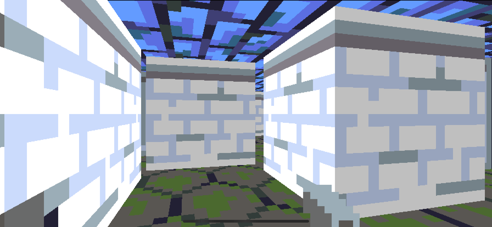

The problem now is that it never actually stops sliding - it just keeps going until it passes through the far wall and vanishes. We handled collisions between player and push-wall, but forgot about collisions between the push-wall and the rest of the map.

Currently, the logic for detecting collisions with the map is tied to the `Actor` protocol, but `Pushwall` isn't an `Actor`. Could it be, though? It has a `position` and a `rect` and it moves around and bumps into things like other actors. Let's try it!

In `Pushwall.swift`, conform `Pushwall` to the `Actor` protocol, and add a `radius` property:

```swift
public struct Pushwall: Actor {
    public let radius: Double = 0.5
    ...
}
```

In the extension below, delete the computed `rect` property (this is provided by `Actor` already) and replace it with the following:

```swift
var isDead: Bool { return false }
```

The `Actor` protocol requires an `isDead` property, but walls can't be killed<sup><a id="reference3"></a>[[3]](#footnote3)</sup>, so rather than storing a redundant property, we use a computed property that always returns `false`.

Now that `Pushwall` is an `Actor` we can use the existing intersection methods defined on the `Actor` protocol extension to detect collisions. Add the following code to the end of the `Pushwall.update()` method:

```swift
if let intersection = self.intersection(with: world.map),
    abs(intersection.x) > 0.001 || abs(intersection.y) > 0.001 {
    velocity = Vector(x: 0, y: 0)
    position.x = position.x.rounded(.down) + 0.5
    position.y = position.y.rounded(.down) + 0.5
}
```

This code will stop the push-wall when it hits another wall in the map. The `abs(intersection.x) > 0.001` adds a *fudge factor* to prevent the wall getting stuck when brushing past other walls.

After zeroing the velocity, we also update the position to ensure the push-wall is exactly centered in the tile where it came to rest. That prevents bugs like this, where the player bumps the push-wall at an angle, causing it to get stuck in a neighboring tile (note the single-pixel vertical strip where the push-wall has become misaligned from the tile grid):

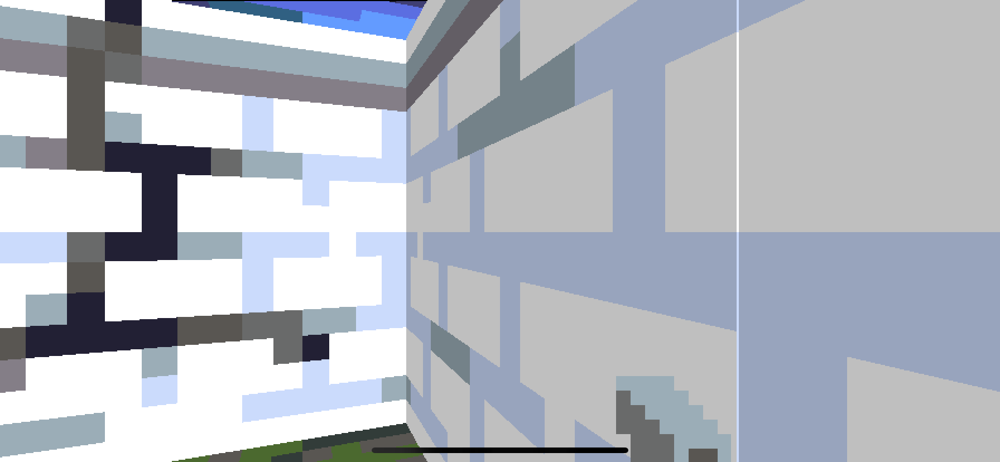

There's another potential bug here though - `self.intersection(with: world.map)` only checks for collisions with the wall tiles in the map itself, not with doors or other push-walls.

What happens if we replace `self.intersection(with: world.map)` with `self.intersection(with: world)`? Try it, then run the game again.

If you push the wall now, it doesn't move - so what's the problem?

Well, `Actor.intersection(with world:)` checks for intersections between the current actor's `Rect` and all other scenery including all push-walls. Since in this case the actor *is* a push-wall, it's detecting a collision with itself.

To fix that, first open `Vector.swift` and add `Equatable` conformance to the `Vector` type, as follows:

```swift
public struct Vector: Equatable {
```

Then open `Actor.swift` and replace the following line in the `intersection(with world:)` method:

```swift
for pushwall in world.pushwalls {
```

with:

```swift
for pushwall in world.pushwalls where pushwall.position != position {
```

With that change, the push-wall will no longer detect collisions with itself, and can once again be set in motion.

### Out of Sorts

You may have noticed that at certain angles, we can see a glitch in the rendering of the push-wall where the billboards are displayed in the wrong order, with farther wall faces appearing in front of nearer ones.

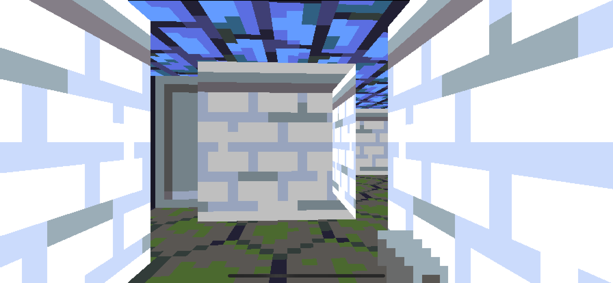

This bug is caused by an optimization we made in `Renderer.draw()` back in [Part 5](Part5.md) when we first added the sprite rendering logic - specifically these lines:

```swift
// Sort sprites by distance
var spritesByDistance: [(distance: Double, sprite: Billboard)] = []
for sprite in world.sprites {
    let spriteDistance = (sprite.start - world.player.position).length
    spritesByDistance.append(
        (distance: spriteDistance, sprite: sprite)
    )
}
spritesByDistance.sort(by: { $0.distance > $1.distance })
```

This code gets the list of sprite billboards and sorts them according to the distance from one end of the billboard to the player's position.

This isn't quite the same thing as the distance from the camera plane (which would be the *perpendicular* distance), but it's a good-enough approximation as long as the billboards are all facing the camera - which they were when we wrote this code.

But the billboards we added for the doors and push-walls are aligned relative to the *map*, not the view plane, which means that the distance from the camera varies along the length of billboard, and sorting by the distance to one end of each billboard will not always produce the correct rendering order at every point on the screen.

The push-wall is a cube constructed from four square billboards<sup><a id="reference4"></a>[[4]](#footnote4)</sup>. Due to the problem with rendering order, at certain angles the distance from the player to the end of a rearward-facing billboard may be less than the distance to the end of one that's in front of it, resulting in the rear billboard being drawn on top.

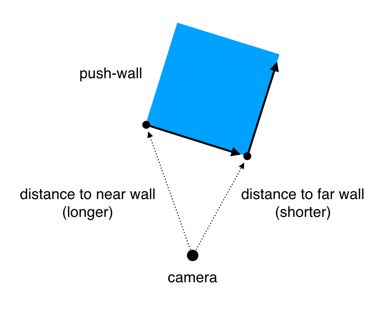

To fix this properly, we should modify the renderer to sort the billboards by the intersection distance for each ray. But that's a complex change, with potential performance drawbacks. There's a simpler solution we can apply to solve the immediate problem *and* improve performance as a bonus, namely [back-face culling](https://en.wikipedia.org/wiki/Back-face_culling).

When you construct a 3D shape from polygons (such as triangles or quads), each polygon on the surface of the object has a face that points outwards from the shape, and a face that points inwards. Assuming the shape is solid and has no holes, the inward-pointing face can never be seen, since it will always be obscured by an outward-pointing face. These inward-pointing faces are known as *back-faces*.

The principle of back-face culling is that since we can't see those faces, we don't need to draw them. Any polygon with it's back-face towards the camera can be discarded. This is primarily a performance optimization, but it also helps to reduce drawing-order glitches in engines like ours that lack a [Z-buffer](https://en.wikipedia.org/wiki/Z-buffering) and rely on the [Painter's Algorithm](https://en.wikipedia.org/wiki/Painter%27s_algorithm).

So how do we work out which are the backward-facing billboards? We can do this by casting a ray from the player to each billboard (as we do already to measure the distance), and comparing it with the [face normal](https://en.wikipedia.org/wiki/Normal_(geometry)) using the [vector dot product](https://en.wikipedia.org/wiki/Dot_product#Geometric_definition).

The dot product of two vectors is proportional to the cosine of the angle between them. If the angle is concave (less than 90 degrees) the cosine will be positive, if the angle is convex (greater than 90 degrees) it will be negative. Using the dot product, we can determine if a given side of the push-wall is facing towards or away from the player's viewpoint.

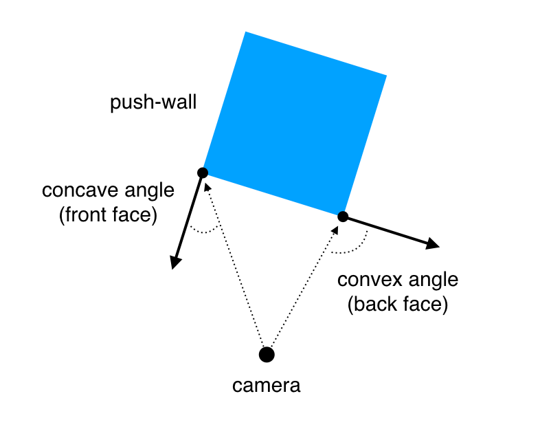

In `Vector.swift`, add the following method to the extension block, just below the computed `length` property<sup><a id="reference5"></a>[[5]](#footnote5)</sup>:

```swift
func dot(_ rhs: Vector) -> Double {
    return x * rhs.x + y * rhs.y
}
```

In `Pushwall.swift` replace the line:

```swift
var billboards: [Billboard] {
```

with:

```swift
func billboards(facing viewpoint: Vector) -> [Billboard] {
```

Then update the return statement of the function as follows:

```swift
return [
    Billboard(start: topLeft, direction: Vector(x: 0, y: 1), length: 1, texture: textures[0]),
    Billboard(start: topRight, direction: Vector(x: -1, y: 0), length: 1, texture: textures[1]),
    Billboard(start: bottomRight, direction: Vector(x: 0, y: -1), length: 1, texture: textures[0]),
    Billboard(start: bottomLeft, direction: Vector(x: 1, y: 0), length: 1, texture: textures[1])
].filter { billboard in
    let ray = billboard.start - viewpoint
    let faceNormal = billboard.direction.orthogonal
    return ray.dot(faceNormal) < 0
}
```

This computes the dot product between the face normal of each billboard and a ray from the viewpoint, then filters out the back-facing billboards. All that's left is to pass in the player's position as the viewpoint.

In `World.swift`, in the computed `sprites` property, replace the line:

```swift
+ pushwalls.flatMap { $0.billboards }
```

with:

```swift
+ pushwalls.flatMap { $0.billboards(facing: player.position) }
```

Then in `hitTest()`, replace:

```swift
let billboards = doors.map { $0.billboard } + pushwalls.flatMap { $0.billboards }
```

with:

```swift
let billboards = doors.map { $0.billboard } +
    pushwalls.flatMap { $0.billboards(facing: ray.origin) }
```

Run the game again and you should see that the rendering glitches on the push-wall have disappeared. There's just one slightly entertaining bug left to resolve.

### Your First Crush

If you push the wall and then very quickly run through the door you can get ahead of the sliding wall and put yourself in a position where it will crush you against the outer wall.

The fact that you can do this isn't in itself a bug - the problem is that there isn't actually a crushing mechanic in the game. The player can't be compressed, and the sliding wall isn't affected by collisions with the player when it's already moving, so it will simply go on pushing the player until something breaks.

What breaks first depends on your precise positioning - you may end up inside the push-wall, or the push-wall may bounce off you and head in another direction, etc. But if you try to walk towards the outer wall while being crushed, things can get a bit... trippy<sup><a id="reference6"></a>[[6]](#footnote6)</sup>.

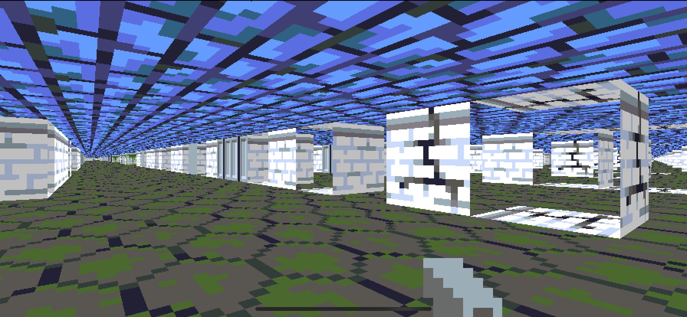

This is what the world looks like from outside the wall. An infinite plane of inside-out geometry I like to call *[The Upside Down](https://strangerthings.fandom.com/wiki/The_Upside_Down)*.

This bug is almost too fun to fix, but fix it we must.

The solution is pretty simple. If the player somehow manages to get outside the map, *we'll kill them*. Monsters can also get trapped behind a push-wall and end up outside the map, so let's solve this for any `Actor`, not just the player.

In `Actor.swift` add the following method to the extension block:

```swift
func isStuck(in world: World) -> Bool {
   
}
```

There are various ways in which an actor can potentially get stuck. The one that we've just encountered is when they end up outside the map, so let's tackle that first. Add the following code to the `isStuck()` method:

```swift
// If outside map
if position.x < 1 || position.x > world.map.size.x - 1 ||
    position.y < 1 || position.y > world.map.size.y - 1 {
    return true
}
```

Although we haven't seen it happen yet, another possible scenario is that an actor ends up inside a wall tile. While we're here, let's handle that as well. Add the following code to the method:

```swift
// If stuck in a wall
if world.map[Int(position.x), Int(position.y)].isWall {
    return true
}
```

Finally, an actor could end up inside a push-wall. We'd better check for that too. Add the following code to complete the method:

```swift
// If stuck in a pushwall
return world.pushwalls.contains(where: {
    abs(position.x - $0.position.x) < 0.6 && abs(position.y - $0.position.y) < 0.6
})
```

Now we have the means to *detect* a stuck actor, we need to respond to it. In `World.swift`, add the following code at the end of the `update()` method, just after the `// Handle collisions` section:

```swift
// Check for stuck actors
if player.isStuck(in: self) {
    hurtPlayer(1)
}
for i in 0 ..< monsters.count where monsters[i].isStuck(in: self) {
    hurtMonster(at: i, damage: 1)
}
```

This logic detects if a player or monster is stuck and quickly kills them.

You might wonder why we only do one unit of damage instead of 100 or 1000? This just adds a bit of fault tolerance. If the player is stuck for just one frame due to a transient glitch then this probably won't be fatal, but if they are trapped permanently then their health will drain to zero within seconds.

We added this death-trap feature to fix a bug, but now that we have it, we might as well have some fun with it. Open `Map.json` and edit the `things` array to move the monster in the second room directly behind the push-wall:

```swift
"things": [
    0, 0, 0, 0, 0, 0, 0, 0,
    0, 2, 0, 0, 0, 0, 0, 0,
    0, 0, 0, 0, 2, 0, 0, 0,
    0, 0, 0, 3, 0, 0, 0, 0,
    0, 0, 0, 0, 4, 0, 3, 0,
    0, 0, 2, 0, 0, 0, 0, 0,
    0, 0, 0, 0, 1, 0, 2, 0,
    0, 0, 0, 0, 0, 0, 0, 0
]
```

Now, when you push the wall, it will crush the monster!

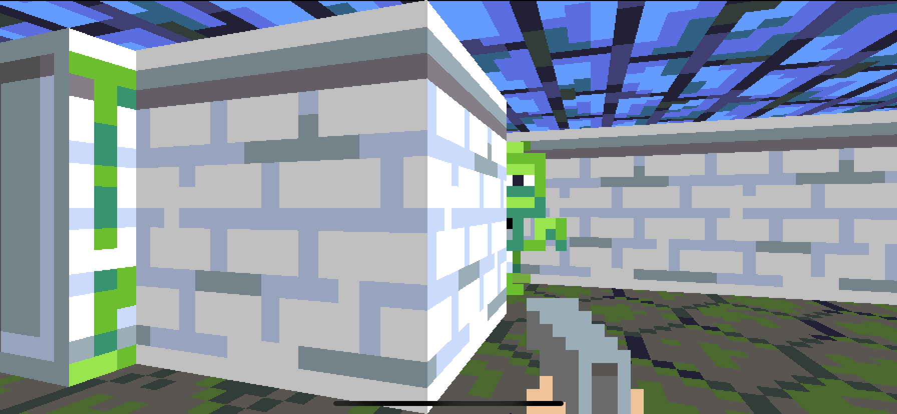

Unfortunately, this reveals another glitch. Once dead, the monster's corpse pops out from behind the push-wall due to the `avoidWalls()` logic. That's a bit weird, but I think we can live with it. The bigger problem is this:

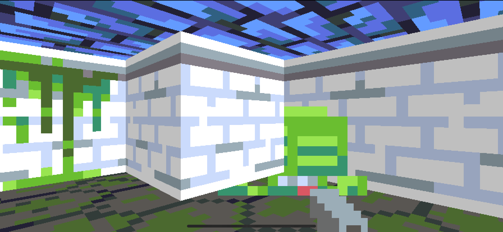

This is the drawing order glitch raising its ugly head again. The push-wall billboard is being drawn in front of the monster sprite. Unfortunately this time our back-face culling trick doesn't help because both the wall and sprite are facing forwards - it's just that the relative angle between them breaks the sorting logic.

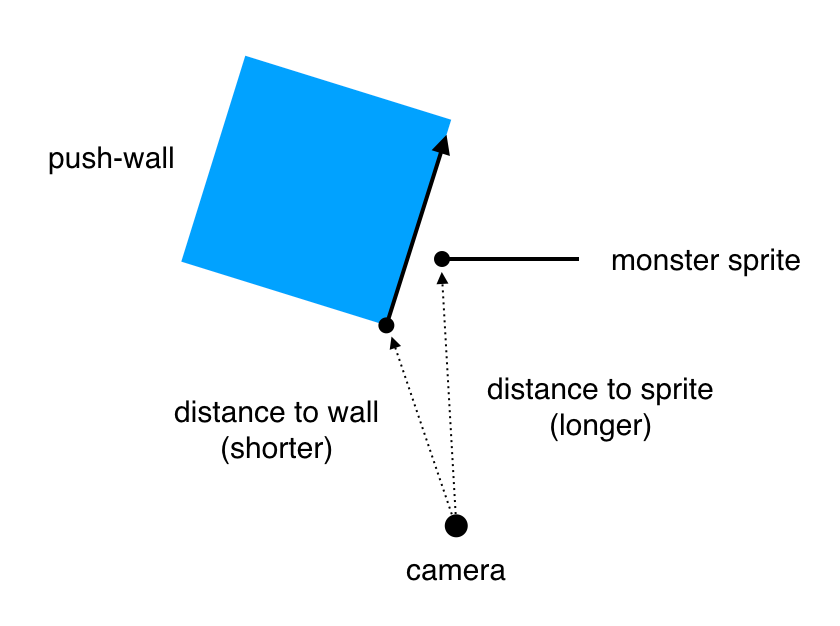

It looks like we're going to have to fix this properly after all.

### Disorderly Conduct

As a reminder, the bug occurs because we are sorting all the billboards up-front according to their distance from the player, when really we should be sorting each vertical slice according to its perpendicular distance from the view plane. 

In `Renderer.swift`, cut this block of code:

```swift
// Sort sprites by distance
var spritesByDistance: [(distance: Double, sprite: Billboard)] = []
for sprite in world.sprites {
    let spriteDistance = (sprite.start - world.player.position).length
    spritesByDistance.append(
        (distance: spriteDistance, sprite: sprite)
    )
}
spritesByDistance.sort(by: { $0.distance > $1.distance })
```

Then paste it again *inside* the for loop, just before the `// Draw sprites` section. Now that it's inside the loop, the sorting logic can use the exact perpendicular distance for that column of pixels, instead of an approximation. Replace the line:

```swift
let spriteDistance = (sprite.start - world.player.position).length
```

with:

```swift
guard let hit = sprite.hitTest(ray) else {
    continue
}
let spriteDistance = (hit - ray.origin).length
if spriteDistance > wallDistance {
    continue
}
```

Run the game again and you should find that the problem is fixed.

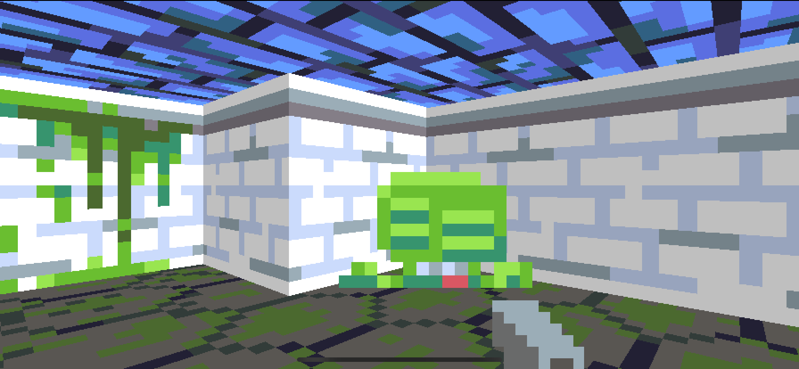

That wasn't so complicated after all. But we're now repeating the ray intersection calculation twice for each visible sprite, so let's clean that up.

Delete the following lines from the `// Draw sprites` loop, since we're already computing this information in the `// Sort sprites by distance` loop anyway:

```swift
guard let hit = sprite.hitTest(ray) else {
    continue
}
let spriteDistance = (hit - ray.origin).length
if spriteDistance > wallDistance {
    continue
}
```

Then replace the line:

```swift
for (_, sprite) in spritesByDistance {
```

with:

```swift
for (hit, spriteDistance, sprite) in spritesByDistance {
```

The drawing loop requires the hit position as well as the distance, but we aren't currently including that in the `spritesByDistance` tuples, so in the `// Sort sprites by distance` section, change the line:

```swift
var spritesByDistance: [(distance: Double, sprite: Billboard)] = []
```

to:

```swift
var spritesByDistance: [(hit: Vector, distance: Double, sprite: Billboard)] = []
```

And then, inside the loop, replace:

```swift
spritesByDistance.append(
    (distance: spriteDistance, sprite: sprite)
)
```

with:

```swift
spritesByDistance.append(
    (hit: hit, distance: spriteDistance, sprite: sprite)
)
```

### Variety Show

In Wolfenstein 3D, the push-walls were typically disguised as lavish paintings, making them more discoverable than just a blank wall.

When we added the logic in `World.reset()` to insert a push-wall into the map, we hard-coded the push-wall's tile-type. This isn't very satisfactory because it means push-walls will all have the same appearance. Ideally, we'd like to be able to use *any* wall texture for our push-wall.

`Thing`s are represented by a single integer index value in the `Map.json` file, so there isn't really an obvious way to attach additional metadata such as the tile texture. One solution would be to create a distinct `Thing` type for every push-wall texture, but that's pretty inelegant, and would result in a lot of duplication in various switch statements.

It would be neat if we could combine the wall-type information from the `tiles` array with the `Thing` type. But if we allow a push-wall to occupy the same tile as a wall, what happens to the wall tile when the push-wall starts moving? We'd need to add some way to modify the tiles so we could remove the original wall and replace it with a push-wall.

So let's do that, I guess?

Currently we access the tile information via a read-only subscript method on `Tilemap`. In order to modify the tiles, we'll need to make that read-write instead. Open `Tilemap.swift` and in the extension block replace the following code:

```swift
subscript(x: Int, y: Int) -> Tile {
    return tiles[y * width + x]
}
```

with:

```swift
subscript(x: Int, y: Int) -> Tile {
    get { return tiles[y * width + x] }
    set { tiles[y * width + x] = newValue }
}
```

This will produce an error because the underlying `tiles` property is immutable, so in the `Tilemap` struct declaration, change the line:

```swift
let tiles: [Tile]
```

to:

```swift
private(set) var tiles: [Tile]
```

The `Tilemap` is now editable in principle, but the `map` property in `World` is still immutable. So next, in `World.swift`, change the line:

```swift
public let map: Tilemap
```

to:

```swift
public private(set) var map: Tilemap
```

We can now modify the map at runtime. In `World.reset()`, update the `pushwall` case as follows:

```swift
case .pushwall:
    var tile = map[x, y]
    if tile.isWall {
        map[x, y] = .floor
    } else {
        tile = .wall
    }
    pushwalls.append(Pushwall(position: position, tile: tile))
```

Previously we had to place a push-wall on top of an existing floor tile. With the new logic, if the push-wall is placed on an existing wall tile it will use that wall texture for the push-wall, and replace the wall itself with a floor tile.

Let's try it out. In `Map.json` replace the floor tile under the `push-wall` with a slime wall (tile index `3`):

```swift
"tiles": [
    1, 3, 1, 1, 3, 1, 1, 1,
    1, 0, 0, 2, 0, 0, 0, 1,
    1, 4, 0, 3, 4, 0, 0, 3,
    2, 0, 0, 0, 0, 0, 4, 3,
    1, 4, 0, 1, 3, 1, 0, 1,
    1, 0, 4, 2, 0, 0, 0, 1,
    1, 0, 0, 1, 0, 4, 4, 1,
    1, 3, 3, 1, 1, 3, 1, 1
],
```

Run the game again and... it works!

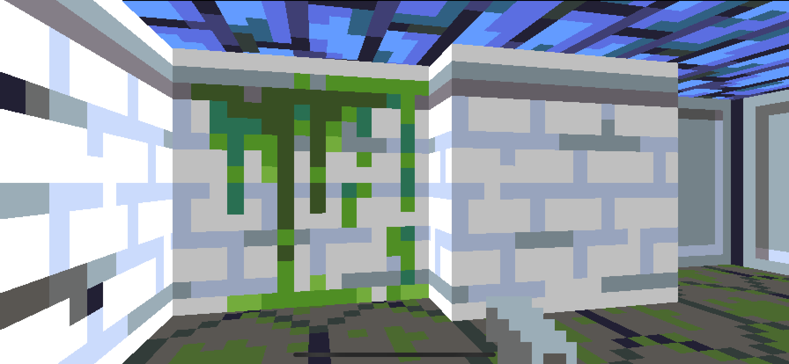

### Hard Reset

If the player dies, everything in the world is reset to the initial state defined in the `Tilemap`. The problem is that we've now overwritten some of that state by changing the push-wall tiles to floor tiles.

If we reset the game now, all the push-walls will be converted into regular wall tiles. We need to somehow preserve the original tile textures. We could make a second copy of the tiles that we *don't* modify, but I have a sneakier solution:

We still have the original wall texture information stored in the push-walls, so instead of resetting the `pushwalls` array, what if we keep it? In `World.reset()`, replace the line:

```swift
self.pushwalls = []
```

with:

```swift
var pushwallCount = 0
```

Then add the following code to the top of `case .pushwall:`:

```swift
pushwallCount += 1
if pushwalls.count >= pushwallCount {
    let tile = pushwalls[pushwallCount - 1].tile
    pushwalls[pushwallCount - 1] = Pushwall(position: position, tile: tile)
    break
}
```

### Floor Plan

There's just one last little niggle with the way we specify push-walls. Now that we are using the `tiles` array to define the push-wall texture, we've lost the ability to define the floor underneath it. Not a huge problem, but still unsatisfactory.

We can improve on the current solution of hard-coding the floor tile by finding the nearest floor tile and using that instead. It's not a perfect solution, but at least it means the floor beneath the push-wall should be consistent with the area around it.

For a push-wall to be able to move, at least two of the four adjacent tiles must be floor tiles, so we won't have to search very far. Open `Tilemap.swift` and add the following method just before `hitTest()`:

```swift
func closestFloorTile(to x: Int, _ y: Int) -> Tile? {
    for y in max(0, y - 1) ... min(height - 1, y + 1) {
        for x in max(0, x - 1) ... min(width - 1, x + 1) {
            let tile = self[x, y]
            if tile.isWall == false {
                return tile
            }
        }
    }
    return nil
}
```

Then, back in `World.reset()`, in `case .pushwall:`, replace the line:

```swift
map[x, y] = .floor
```

with:

```swift
map[x, y] = map.closestFloorTile(to: x, y) ?? .floor
``` 

And that's it for Part 11! In this part we:

* Created a secret passageway between rooms
* Learned about back-face culling
* Pushed a wall into a zombie
* Found a way to combine `Tile` and `Thing` data

In [Part 12](Part12.md) we'll add an actual goal for the player (besides *kill or be killed*), in the form of an end-of-level elevator.

### Reader Exercises

1. Currently, if you walk around the push-wall you can push it from the other side. Can you restrict it to move in only one direction? How would that be specified in the map JSON?

2. Can you implement another way to activate the push-wall besides pushing it? What about a floor panel that opens a secret wall when you step on it?

3. We've established that the `Billboard` type can basically just be used as a wall that isn't bound to the tile grid. Could you use this to create a *diagonal* wall? And how would you add support for diagonal wall tiles in the JSON? Would there be performance implications to using a lot of these?

<hr>

<a id="footnote1"></a>[[1]](#reference1) Back in 1992.

<a id="footnote2"></a>[[2]](#reference2) Apparently John Carmack was originally reluctant to implement this feature as he felt it would spoil the elegance of his 3D engine implementation. Luckily, he eventually relented.

<a id="footnote3"></a>[[3]](#reference3) What Is Dead May Never Die.

<a id="footnote4"></a>[[4]](#reference4) Yes, I know a cube has six sides. Don't be pedantic.

<a id="footnote5"></a>[[5]](#reference5) We've used a method rather than the `*` operator because the dot product is only one of several types of vector multiplication. We could use a custom operator such as `•` instead, but I prefer the clarity of an ordinary method name.

<a id="footnote6"></a>[[6]](#reference6) That's assuming you disabled safety checks, as suggested in [Part 9](Part9.md#safeties-off). If you didn't, you'll find things get a bit *crashy* instead.
