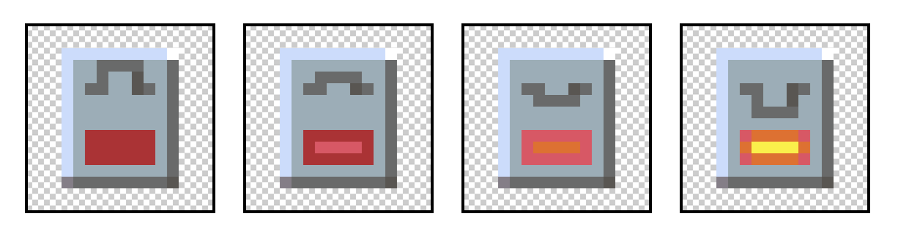
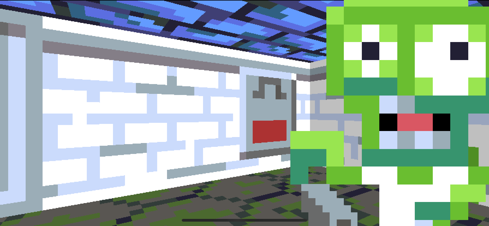
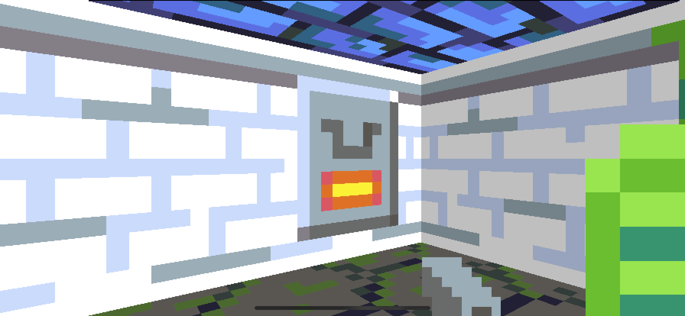
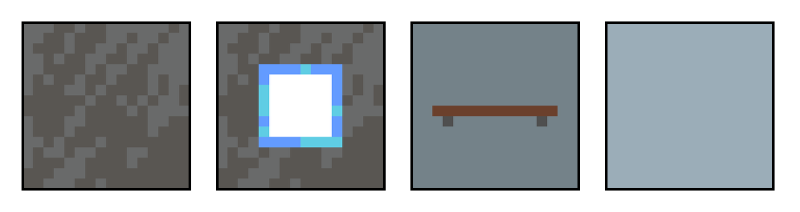
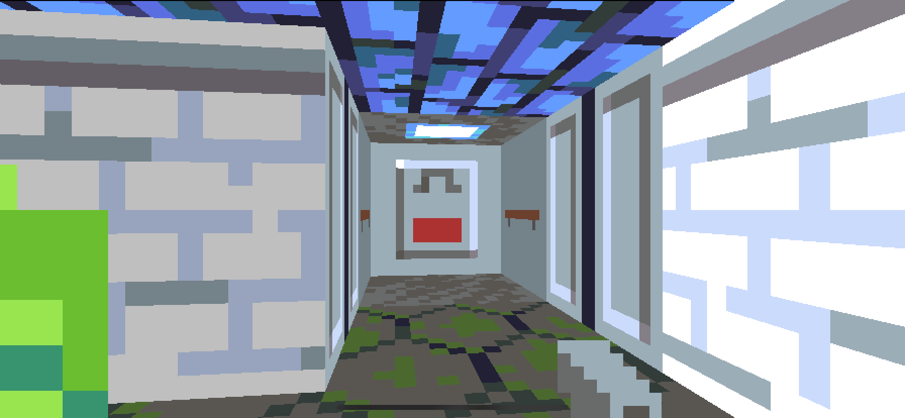

## Part 12: Another Level

In [Part 11](Part11.md) we added a secret passage, hidden behind a zombie-squishing push-wall. The code for Part 11 can be found [here](https://github.com/nicklockwood/RetroRampage/archive/Part11.zip).

The player has a few things to do now, but there's still no actual *goal*. If you die then the level restarts, but if you manage to slay all the monsters then you are left alone with nothing to do except force-quit the app.

### Elevated Status

In Wolfenstein 3D, though the levels are flat, we imagine ourselves inside a towering castle. We begin in the dungeon, and work our way up by finding the elevator on each floor to move up to the next level.

This is a fairly elegant solution to the design problem of creating a multi-story building in an engine that supports neither stairs nor overlapping floors<sup><a id="reference1"></a>[[1]](#footnote1)</sup>. So how do we make an elevator?

Well, the Wolfenstein engine doesn't really support elevators either - at least not in the sense that later games like Doom did. The "elevator" is simply a room with metallic walls and a switch. When you throw the switch, the player is teleported instantly to the next level.

So the real question is not *how do we make an elevator*, but *how do we make a switch*?

### Bait and Switch

We'll start by adding some texture images for the switch itself. Wolfenstein only had on and off frames for the switch, but the infrastructure we already built for animations in Rampage means it's no trouble to add several frames for a smooth transition.



If you wish to flex your creative muscles and draw your own switch textures, by all means do so, but you can find the ones from the tutorial [here](https://github.com/nicklockwood/RetroRampage/tree/Part12/Source/Rampage/Assets.xcassets/).

You may have noticed that these textures have a transparent background. This is a departure from Wolfenstein 3D, which combined the switch with the elevator wall behind it.

Add the switch textures to XCAssets, then update the `Texture` enum in `Textures.swift` with the new cases:

```swift
case switch1, switch2, switch3, switch4
```

As with the doors in [Part 10](Part10.md), it may not be immediately obvious whether the switch should be a *tile* or a *thing*. Switches are bound to a particular wall, and don't move around, but they are animated and have state information.

In [Part 11](Part11.md) we added the capability of mutating the map at runtime, which was used to replace pushable wall tiles with empty floor tiles. In principle we could do something similar with switches - perhaps using two different tiles for the on and off states. But for a four-frame animation we'd need four different tiles, plus we'd have to create new infrastructure for animations rather than re-using what we've already built. Using a `Thing` for the switch will be much more straightforward.

In `Thing.swift`, add the following case to the end of the `Thing` enum:

```swift
case `switch`
```

Note the back-ticks around "switch". Because `switch` is actually a keyword in Swift, these are needed to escape the case name. This is a bit ugly, but other than at the point of declaration they mostly aren't needed.  

We'll eventually want to place the switch in an "elevator" room, but for now we'll just stick it on an arbitrary wall. The switch has an index of `5` in the `Thing` enum, so add a number `5` to the bottom-right outer edge of the `things` in `Map.json`, just behind the first monster's position:

```swift
"things": [
    0, 0, 0, 0, 0, 0, 0, 0,
    0, 2, 0, 0, 0, 0, 0, 0,
    0, 0, 0, 0, 2, 0, 0, 0,
    0, 0, 0, 3, 0, 0, 0, 0,
    0, 0, 0, 0, 4, 0, 3, 0,
    0, 0, 2, 0, 0, 0, 0, 0,
    0, 0, 0, 0, 1, 0, 2, 5,
    0, 0, 0, 0, 0, 0, 0, 0
]
```

Now that we have placed a switch in the map, we'll need to actually provide the implementation. Create a new file in the Engine module called `Switch.swift` with the following contents:

```swift
public enum SwitchState {
    case off
    case on
}

public struct Switch {
    public let position: Vector
    public var state: SwitchState = .off
    public var animation: Animation = .switchOff

    public init(position: Vector) {
        self.position = position
    }
}

public extension Animation {
    static let switchOff = Animation(frames: [
        .switch1
    ], duration: 0)
    static let switchFlip = Animation(frames: [
        .switch1,
        .switch2,
        .switch3,
        .switch4
    ], duration: 0.4)
    static let switchOn = Animation(frames: [
        .switch4
    ], duration: 0)
}
```

There's a lot going on here, but hopefully it should all be quite familiar by now - The `Switch` has a `position`, a `state` and an `animation` property. Although there are only two states, three animation phases are needed, because we need separate single-frame on and off animations to play when the switch has finished its transition.

### Turned On

We've defined the states - now to write the logic for transitioning between them. Add the following block of code between the `Switch` struct declaration and the `Animation` extension:

```swift
public extension Switch {
    var rect: Rect {
        return Rect(
            min: position - Vector(x: 0.5, y: 0.5),
            max: position + Vector(x: 0.5, y: 0.5)
        )
    }

    mutating func update(in world: inout World) {
        switch state {
        case .off:
            if world.player.rect.intersection(with: self.rect) != nil {
                state = .on
                animation = .switchFlip
            }
        case .on:
            if animation.isCompleted {
                animation = .switchOn
            }
        }
    }
}
```

This code defines a collision `Rect` for the switch (equivalent to the tile it sits on), and an `update()` method with a simple state machine similar to the ones we've used previously.

In the `off` state the switch waits for the player to come along and bump into it, at which point it transitions to the `on` state and starts the `switchFlip` animation. In the `on` state, it waits for the animation to complete and then transitions to the single-frame `switchOn` animation so the switch doesn't keep cycling from off to on repeatedly.

In `World.swift`, add a `switches` property to the `World` struct, just below `pushwalls`:

```swift
public struct World {
    public let map: Tilemap
    public private(set) var doors: [Door]
    public private(set) var pushwalls: [Pushwall]
    public private(set) var switches: [Switch]
    ...
}
```

Then in `World.init()` initialize the property:

```swift
public init(map: Tilemap) {
    self.map = map
    self.doors = []
    self.pushwalls = []
    self.switches = []
    ...
}
```

A bit further down, in `World.update()`, just below the `// Update pushwalls` section, add the following:

```swift
// Update switches
for i in 0 ..< switches.count {
    var s = switches[i]
    s.animation.time += timeStep
    s.update(in: &self)
    switches[i] = s
}
```

Further down still, in `World.reset()`, add a line to reset the switches when the level reloads:

```swift
mutating func reset() {
    self.monsters = []
    self.doors = []
    self.switches = []
    ...
}
```

And below that, in the same function, add a case to the switch statement to handle the, uh, switch:

```swift
case .switch:
    precondition(map[x, y].isWall, "Switch must be placed on a wall tile")
    switches.append(Switch(position: position))
```

Since it only makes sense to place switches on wall tiles, we've added a `precondition` to ensure the switch is placed on an existing wall tile.

### Writing on the Wall

Switches in Wolfenstein behave a lot like ordinary wall textures (except that they're interactive). But because in our game we've implemented the switch as a *thing* rather than a tile, the switch doesn't exactly replace a wall tile - there's still an ordinary tile occupying the same space.

There is already a precedent in the game for `Thing`s overriding the textures of nearby tiles - in [Part 10](Part10.md) when we added the doorjamb feature, it worked by replacing the walls next to each door with a different texture. The code for doing that looks like this:

```swift
let isDoor = world.isDoor(at: neighborX, tileY)
wallTexture = textures[isDoor ? .doorjamb : tile.textures[0]]
```

If we had opted to make our switch texture opaque, and included the elevator wall texture in the same frame, we would probably use that exact same technique again. But instead we made it partially transparent, giving us the flexibility to place a switch on any wall.

Technically we don't *need* this functionality right now, as we will only be using the switch for elevators, but it's very little extra work to support this, and it means we can potentially use switches for other gameplay features later.

Combining the wall and switch requires a slightly different approach. Instead of replacing the wall texture with the switch texture, we need to draw the switch on top of the wall in a second pass.

For drawing the doors, we created an `World.isDoor()` function to determine if a given tile contained a door. We'll need something similar for drawing switches. Still in `World.swift`, find the `isDoor()` function, and just below it add the following:

```swift
func `switch`(at x: Int, _ y: Int) -> Switch? {
    guard map.things[y * map.width + x] == .switch else {
        return nil
    }
    return switches.first(where: {
        Int($0.position.x) == x && Int($0.position.y) == y
    })
}
```

Like `isDoor(at:)`, the `switch(at:)` method first checks the `map.things` array to see if the specified tile contains a switch. This lookup can be done in constant time, so for the majority of tiles which don't contain a switch, it's inexpensive.

But because the switch texture changes over time, it's not enough to know *if* a tile contains a switch - we need to actually access the switch object. For that, we perform a linear search of the switches array to find the one with matching coordinates.

In `Renderer.swift`, insert the following code just before the `// Draw floor and ceiling` section:

```swift
// Draw switch
if let s = world.switch(at: tileX, tileY) {
    let switchTexture = textures[s.animation.texture]
    bitmap.drawColumn(textureX, of: switchTexture, at: wallStart, height: height)
}
```

This code looks for a switch at the current tile coordinate, and if found, draws a vertical strip of the current switch animation frame over the top of the wall texture.

Run the app now and you should see the switch on the wall behind the first monster.



### Flip the Switch

Dispatch the monster before it kills you, then walk over and flip the switch. It should smoothly animate from off to on.



That's all well and good, but nothing actually happens when the switch is flipped. What we *want* to happen is for the level to end.

Since we don't yet have multiple levels, for now we'll just reset the current level to the beginning. In [Part 7](Part7.md) we implemented the logic to reset the level when the player is killed. The process for ending the level will be similar.

In `World.swift`, add the following property to the `World` struct:

```swift
public private(set) var isLevelEnded: Bool
```

Then in `World.init()`, set it to `false` by default:

```swift
public init(map: Tilemap) {
    self.map = map
    self.doors = []
    self.switches = []
    self.monsters = []
    self.effects = []
    self.isLevelEnded = false
    reset()
}
```

Further down, in `World.reset()`, set `isLevelEnded` to `false` again to avoid a reset loop:

```swift
 mutating func reset() {
    self.monsters = []
    self.doors = []
    self.switches = []
    self.isLevelEnded = false
    ...
}
```

We've made the `isLevelEnded` setter private because rather than having the switch just set the property directly, we want to have some control over the level-end sequence. Still in `World.swift`, just above the `reset()` method, add the following:

```swift
mutating func endLevel() {
    isLevelEnded = true
    effects.append(Effect(type: .fadeOut, color: .black, duration: 2))
}
```

This method sets `isLevelEnded` to `true` and also triggers a slow fade to black that will nicely cover the transition<sup><a id="reference2"></a>[[2]](#footnote2)</sup>. Next, in `World.update()`, just below the `// Update effects` section, add the following:

```swift
// Check for level end
if isLevelEnded {
    if effects.isEmpty {
        reset()
        effects.append(Effect(type: .fadeIn, color: .black, duration: 0.5))
    }
    return
}
```

This is pretty similar to the logic we used for the player death scenario. If the level has ended, we exit early from the update method and wait for the fade effect to finish before resetting the level and fading back in.

The early exit ensures that the player can't be killed between flipping the switch and the level ending, which would lead to an awkward race condition, and a potentially frustrating gameplay experience.

Finally, in `Switch.update()`, update the `on` case as follows:

```swift
case .on:
    if animation.time >= animation.duration {
        animation = .switchOn
        world.endLevel()
    }
```

You might wonder why we're calling `endLevel()` here when the animation completes instead of in the `off` case when the transition to `on` happens? The reason is that triggering the level-end pauses all animation updates (apart from `Effect`s), so if we did it earlier we would never actually see the switch animation.

Run the game again and go press the switch. You should see the level fade to black and reset back to the beginning.

### Make Room

It was handy for testing purposes to place the switch at the start of the level, but it doesn't make much sense from a gameplay perspective. It's time to construct a proper elevator room.

Elevators aren't generally made out of stone. The elevator will need new metallic textures for the walls, floor and ceiling. When we factor in the two copies of each texture needed for lighting angles, this adds up to quite a lot of images for something that only appears once in each map.

Wolfenstein cheated here by only drawing the elevator and switch textures in one shade - the elevator textures are always arranged in the same way, so as long as they are shaded correctly relative to each other, there's nothing to break the lighting illusion.

We'll take a similar approach. Here is the full set of textures for the elevator.



As before, add the textures to XCAssets, then update the `Texture` enum in `Textures.swift` with the new cases:

```swift
case elevatorFloor, elevatorCeiling, elevatorSideWall, elevatorBackWall
```

In `Tile.swift`, add new cases for the elevator tiles:

```swift
public enum Tile: Int, Decodable {
    ...
    case elevatorFloor
    case elevatorSideWall
    case elevatorBackWall
}
```

Update the `Tile.isWall` computed property as follows:

```swift
var isWall: Bool {
    switch self {
    case .wall, .crackWall, .slimeWall, .elevatorSideWall, .elevatorBackWall:
        return true
    case .floor, .crackFloor, .elevatorFloor:
        return false
    }
}
```

Then extend the `Tile.textures` property logic to handle the new cases:

```swift
var textures: [Texture] {
    switch self {
    ...
    case .elevatorSideWall:
        return [.elevatorSideWall, .elevatorSideWall]
    case .elevatorBackWall:
        return [.elevatorBackWall, .elevatorBackWall]
    case .elevatorFloor:
        return [.elevatorFloor, .elevatorCeiling]
    }
}
```

That should be all the changes needed to support the elevator textures. Finally, we just need to craft the elevator itself in the `Map.json` file. Update the JSON as follows:

```swift
"tiles": [
    1, 3, 1, 1, 3, 1, 1, 1,
    1, 0, 0, 2, 0, 0, 0, 1,
    1, 4, 0, 3, 4, 0, 0, 3,
    2, 0, 0, 0, 0, 0, 4, 3,
    1, 4, 0, 1, 3, 1, 0, 1,
    1, 0, 1, 2, 0, 0, 0, 1,
    6, 5, 6, 1, 0, 4, 4, 1,
    1, 7, 3, 1, 1, 3, 1, 1
],
"things": [
    0, 0, 0, 0, 0, 0, 0, 0,
    0, 2, 0, 0, 0, 0, 0, 0,
    0, 0, 0, 0, 2, 0, 0, 0,
    0, 0, 0, 3, 0, 0, 0, 0,
    0, 0, 2, 0, 4, 0, 3, 0,
    0, 3, 0, 0, 0, 0, 0, 0,
    0, 0, 0, 0, 1, 0, 2, 0,
    0, 5, 0, 0, 0, 0, 0, 0
]
```

Run the game and fight your way through the zombies. At the end you'll be rewarded with the exit elevator.



### Level Up

It's nice that we can now actually complete the level, but a single level won't keep the player entertained for long. It's time to add a second map.

The first level map is currently defined inside `Map.json`. We could add a second `Map2.json` file, but using separate files for each map would introduce a problem with ordering. We'd then need to add an additional manifest file for the game to know the total number of levels, which level to start with, and which to load next.

Since our map data is relatively tiny, for now we'll sidestep this complexity by just putting all of the level maps in a single file. Rename `Map.json` to `Levels.json`, and replace its contents with the following:

```swift
[
    {
        "width": 8,
        "tiles": [
            1, 3, 1, 1, 3, 1, 1, 1,
            1, 0, 0, 2, 0, 0, 0, 1,
            1, 4, 0, 3, 4, 0, 0, 3,
            2, 0, 0, 0, 0, 0, 4, 3,
            1, 4, 0, 1, 3, 1, 0, 1,
            1, 0, 1, 2, 0, 0, 0, 1,
            6, 5, 6, 1, 0, 4, 4, 1,
            1, 7, 3, 1, 1, 3, 1, 1
        ],
        "things": [
            0, 0, 0, 0, 0, 0, 0, 0,
            0, 2, 0, 0, 0, 0, 0, 0,
            0, 0, 0, 0, 2, 0, 0, 0,
            0, 0, 0, 3, 0, 0, 0, 0,
            0, 0, 2, 0, 4, 0, 3, 0,
            0, 3, 0, 0, 0, 0, 0, 0,
            0, 0, 0, 0, 1, 0, 2, 0,
            0, 5, 0, 0, 0, 0, 0, 0
        ]
    },
    {
        "width": 5,
        "tiles": [
            2, 1, 1, 6, 1,
            1, 0, 4, 5, 7,
            1, 1, 1, 6, 1,
            2, 0, 0, 1, 3,
            1, 0, 3, 1, 3,
            1, 1, 1, 1, 1
        ],
        "things": [
            0, 0, 0, 0, 0,
            0, 1, 3, 0, 5,
            0, 4, 0, 0, 0,
            0, 0, 2, 0, 0,
            0, 0, 0, 0, 0,
            0, 0, 0, 0, 0
        ]
    }
]
```

The top-level container of the JSON is now an array. The first element is the original map, and we've added a second map element for the second level.

You may have noticed that the new map is smaller, and rectangular rather than square. Since each map specifies its own width, there's no requirement for the levels to all be the same size<sup><a id="reference3"></a>[[3]](#footnote3)</sup>.

In `ViewController.swift` (in the main app project, not the Engine module), find the `loadMap()` method and replace it with the following:

```swift
public func loadLevels() -> [Tilemap] {
    let jsonURL = Bundle.main.url(forResource: "Levels", withExtension: "json")!
    let jsonData = try! Data(contentsOf: jsonURL)
    return try! JSONDecoder().decode([Tilemap].self, from: jsonData)
}
```

The loading logic is similar to what we had before, but it now returns an array of `Tilemap`s instead of a single map. The initializer for `World` only takes a single map, so further down in the same file replace the line:

```swift
private var world = World(map: loadMap())
```

with:

```swift
private let levels =  loadLevels()
private lazy var world = World(map: levels[0])
```

The `World` instance is now initialized with the first map in the `levels` array, but to move between levels we're going to need a way for the world to keep track of which level we are currently on.

### By the Numbers

Since the levels have an inherent order (defined by their position in the levels array), it would make sense to refer to them by index. We could add a property to the `World` or `ViewController` to track the current level index, but in general it's better to keep related data together.

Open `Tilemap.swift` and add a `index` property:

```swift
public struct Tilemap: Decodable {
    ...
    public let index: Int
}
```

Now how do we set this property? Maps are currently created by deserializing them from JSON. We could just add an `index` property to the JSON, but it's rather inelegant to specify the index twice (implicitly, with the order of the level in the `levels` array, and then again explicitly in each level).

This may seem like a pedantic thing to worry about, but these kinds of data duplication can lead to real bugs - what would happen for example if we rearranged the levels but forgot to update their index values, so that the level order and level indexes no longer matched up?

Ideally, we'd like to set the index programmatically after we've loaded the levels JSON, but Swift's strictness can make deferred initialization difficult. We could make the `index` property optional by using `?` or `!` but then we'd have to deal with partially initialized objects, and either write code to handle maps with a `nil` index in places where that should never actually happen, or risk a runtime crash by force-unwrapping.

If we take a step back, it's clear that what we are really talking about here are two distinct types: Maps that have an index, and maps that don't. The elegant solution is therefore to fork the `Tilemap` type. 

In `Tilemap.swift`, add the following code just above the `Tilemap` struct definition:

```swift
public struct MapData: Decodable {
    fileprivate let tiles: [Tile]
    fileprivate let things: [Thing]
    fileprivate let width: Int
}
```

This `MapData` struct is a new, opaque type that represents the map data as it appears in the JSON file (without an index). `Tilemap` itself will no longer be directly decoded from the JSON, so we can remove the `Decodable` conformance. Replace the line:

```swift
public struct Tilemap: Decodable {
```

with:

```swift
public struct Tilemap {
```

Next, add a public initializer to `Tilemap` so that we can construct it from a deserialized `MapData` object:

```swift
public init(_ map: MapData, index: Int) {
    self.tiles = map.tiles
    self.things = map.things
    self.width = map.width
    self.index = index
}
```

Finally, back in `ViewController.swift`, replace the following line in `loadLevels()`:

```swift
return try! JSONDecoder().decode([Tilemap].self, from: jsonData)
```

with:

```swift
let levels = try! JSONDecoder().decode([MapData].self, from: jsonData)
return levels.enumerated().map { Tilemap($0.element, index: $0.offset) }
```

### At Your Command

The `World` now has a way to track which level it is running, but it still lacks a way to load the next level.

This brings us to an interesting design problem. The `ViewController` owns the world and the levels, but the `World` decides when the level has ended. Communication between `ViewController` and the `World` is currently one-way, so how can the world tell the platform that it needs to load the next level?

If you're familiar with Cocoa design patterns, you'll have seen this situation before. The relationship between our view controller and the game world is similar to the relationship between an ordinary `UIViewController` and its view, and you might be thinking right now that the [Delegation Pattern](https://en.wikipedia.org/wiki/Delegation_pattern) might be a good solution.

Delegation works really well in UIKit, where everything is class-based, but it won't work well here due to the *overlapping access* issue we encountered back in [Part 8](Part8.md#health-hazard)<sup><a id="reference4"></a>[[4]](#footnote4)</sup>.

Because the `World` is a struct (a [value type](https://en.wikipedia.org/wiki/Value_type_and_reference_type)), we are effectively replacing it every time we modify any of its properties. If the world calls the `ViewController` from inside the mutating `update()` method in order to load a new map, and the `ViewController` then synchronously modifies its own copy of the world, there will be two different copies of the world being modified at once, and one set of changes will be lost. If we try to solve that by passing the current world instance via `inout` to the delegate, we'll trigger the overlapping access error.

This problem is a little hard to demonstrate without writing a lot of code that we'll ultimately throw away, so let's just skip to the better solution, which is to use the [Command Pattern](https://en.wikipedia.org/wiki/Command_pattern).

In the command pattern, a *command* (also known as an *action*) is an object that encapsulates a function call. With delegation, messages must be sent synchronously, but with the command pattern, a message can be stored, passed around between functions, and evaluated at your convenience.

Everything that takes place in the game happens inside the `World.update()` method. Right now, when the level ends we call the `World.reset()` method and then return early from the function. Since `World.update()` is called from `ViewController.update()`, this is the perfect setup for two-way communication. The `ViewController` communicates with `World` via arguments to the `World.update()` function, and if `World` needs to send a command back to the `ViewController`, it can just return it from that function.

At the top of `World.swift` add the following:

```swift
public enum WorldAction {
    case loadLevel(Int)
}
```

The `WorldAction` enum represents the commands that the `World` can send to `ViewController`. For now there is only one type of action that `World` needs to send - an instruction to load a new level - but there will undoubtedly be other such messages as the logic evolves.

Now go ahead and change the method signature for `World.update()` from:

```swift
mutating func update(timeStep: Double, input: Input) {
```

to:

```swift
mutating func update(timeStep: Double, input: Input) -> WorldAction? {
```

There are a couple of places in `update()` where the method returns early. The first is in the `// Check for level end` section:

```swift
 // Check for level end
if isLevelEnded {
    if effects.isEmpty {
        reset()
        effects.append(Effect(type: .fadeIn, color: .black, duration: 0.5))
    }
    return
}
```

Replace that code block with the following:

```swift
// Check for level end
if isLevelEnded {
    if effects.isEmpty {
        effects.append(Effect(type: .fadeIn, color: .black, duration: 0.5))
        return .loadLevel(map.index + 1)
    }
    return nil
}
```

Next, in the `// Update player` section, replace the `return` in the `else` block with:

```swift
return nil
```

Then add another `return nil` to the very end of the `World.update()` method, just after the `// Check for stuck actors` block:

```swift
mutating func update(timeStep: Double, input: Input) -> WorldEvent? {
    ...
    
    // Check for stuck actors
    if player.isStuck(in: self) {
        hurtPlayer(1)
    }
    for i in 0 ..< monsters.count where monsters[i].isStuck(in: self) {
        hurtMonster(at: i, damage: 1)
    }

    return nil
}
```

Back in `ViewController.update()`, replace the line:

```swift
world.update(timeStep: timeStep / worldSteps, input: input)
```

with:

```swift
if let action = world.update(timeStep: timeStep / worldSteps, input: input) {
    switch action {
    case .loadLevel(let index):
        let index = index % levels.count
        world = World(map: levels[index])
    }
}
```

### Jump Start

Run the game again, fight your way to the exit elevator<sup><a id="reference5"></a>[[5]](#footnote5)</sup>, and you should find that flipping the switch loads the next level.

The only slight problem is that we've lost the nice fade-in when the level starts. Because we're just replacing the whole world, in the `loadLevel` action, the in-flight fade `Effect` is not being preserved, and so the next level starts with a jump.

We can't (and shouldn't) manipulate `World.effects` from inside `ViewController`, but we can solve this with a dedicated setter method. In `World.swift`, add the following method just after `endLevel`:

```swift
mutating func setLevel(_ map: Tilemap) {
    let effects = self.effects
    self = World(map: map)
    self.effects = effects
}
```

Then in `ViewController.update()`, replace the line:

```swift
world = World(map: levels[index])
```

with:

```swift
world.setLevel(levels[index])
```

That's it for Part 12! In this part we:

* Added a wall switch to end the level
* Fashioned an elevator room to house the switch
* Added a second level and the means to load it

In [Part 13](Part13.md) we'll bring the world to life with sound effects.

### Reader Exercises

1. Try adding a third level.

2. Right now the levels must be played through in order, but do they have to be? Could you add a second switch (perhaps hidden behind a push-wall door) that takes you to a secret level?

3. What if a wall switch could do something other than end the level? What about adding a switch that opens a locked door, or activates a push-wall automatically? For a real challenge, how about a switch that turns the lights on and off in the level (this will be easier if you completed the dynamic lighting exercise in [Part 4](Part4.md#reader-exercises)).

<hr>

<a id="footnote1"></a>[[1]](#reference1) Setting aside the rather implausible architecture of a building where each pair of floors is joined by a separate elevator shaft in a different place on the floor plan.

<a id="footnote2"></a>[[2]](#reference2) You might wonder why we don't just use the `didSet` handler on the `isLevelEnded` property rather than adding a separate method? In general it's risky to use `didSet` to trigger side-effects. There are other places in the code where we set the `isLevelEnded` property without wanting to trigger the side-effect (e.g. inside `reset()`), so doing it within the setter may lead to unexpected behavior.

<a id="footnote3"></a>[[3]](#reference3) In Wolfenstein 3D the level-size was hard-coded to 64x64 tiles - it wasn't possible to make a level larger than that, but it was possible to make *smaller* levels by simply not using all the space.

<a id="footnote4"></a>[[4]](#reference4) There's actually a second reason not to use delegation, which is that it will make it harder in the future to implement a save game system, because adding a delegate property to `World` will interfere with automatic Codable synthesis. 

<a id="footnote5"></a>[[5]](#reference5) If you find this too challenging - especially when trying to play with a mouse on the simulator - try swapping the first and second levels in `Levels.json`. The second level is considerably easier!
