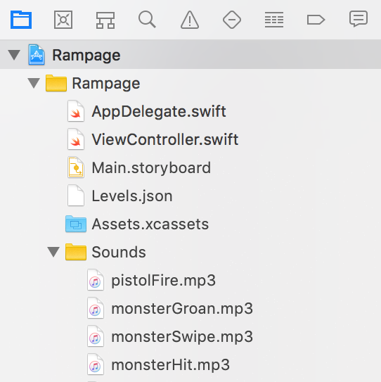
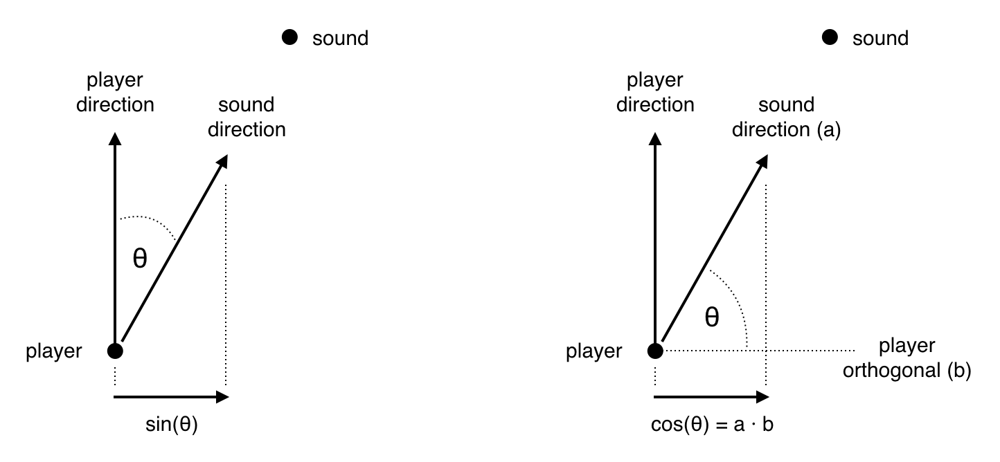

## Part 13: Sound Effects

In [Part 12](Part12.md) we added multiple levels, and the means to move between them. You can find the complete source code for Part 12 [here](https://github.com/nicklockwood/RetroRampage/archive/Part12.zip).

We've covered several different aspects of graphics and gameplay so far, but in this chapter we're going to explore an area that we've so-far neglected - sound.

### The Sound of Silence

We have an almost fully-playable game, but it's a bit... *quiet*. Many gamers, especially on mobile devices tend to play with the sound turned off, but even so it's expected that a game should provide sound and/or music for those that want it, and audio design often plays a key role in building the atmosphere in a game.

The digitized voices of the prison guards<sup><a id="reference1"></a>[[1]](#footnote1)</sup> shouting "Halten sie!" or "Mein lieben!" were an iconic feature of Wolfenstein 3D, but in the early DOS era, playing sound was a significant challenge.

### Beep Boop

DOS PCs did not come with the means to play complex digital audio as standard. If you were lucky, you had a [Sound Blaster](https://en.wikipedia.org/wiki/Sound_Blaster) or [Gravis Utrasound](https://en.wikipedia.org/wiki/Gravis_Ultrasound) card, but in many cases the only sound output was the built-in [PC speaker](https://en.wikipedia.org/wiki/PC_speaker), a coin-sized device that could beep in various tones to tell you that the computer was (or wasn't) working.

Fortunately, polyphonic stereo sound is now standard on pretty much any device we might want to support. Well, *sort of* standard. While the platforms that Swift targets have similar audio capabilities, Swift's standard library has no built-in support for sound, and for that reason we will have to implement the actual audio output in the platform layer rather than the cross-platform part of the engine.

A key theme of this tutorial series has been to demonstrate the low-level graphics programming techniques used in retro games, before the advent of modern high-level frameworks and drivers. It's tempting to try to take the same approach with sound, and implement playback by directly managing a buffer of quantized [PCM](https://en.wikipedia.org/wiki/Pulse-code_modulation) sound samples inside the engine (the audio equivalent of the pixel array we use to represent bitmaps). But while that would allow for complex audio manipulation, it's  overkill for what we need in the game, which is really just to play back prerecorded sound effects.

Since the engine itself won't need to play or manipulate audio, there's no need for it to handle raw data. But it will need some way to refer to specific sounds.

In the Engine module, add a new file called `Sounds.swift`, with the following contents:

```swift
public enum SoundName: String, CaseIterable {
    case pistolFire
    case ricochet
    case monsterHit
    case monsterGroan
    case monsterDeath
    case monsterSwipe
    case doorSlide
    case wallSlide
    case wallThud
    case switchFlip
    case playerDeath
    case playerWalk
    case squelch
}

public struct Sound {
    public let name: SoundName
}
```

`SoundName` is a enum of identifiers that we can use to refer to sound resources within the engine. Like the `Texture` enum, the `SoundName` cases will map to actual files in the platform layer, but the engine doesn't need to know the details of that mapping.

### Bang Bang

We'll start with the pistol sound. Firing is handled by the `Player` object, but the player doesn't have a direct channel of communication with the platform layer - all of its interactions are mediated via the `World` object. For that reason, let's add a `playSound()` method to `World` that can be called by its inhabitants.

In `World.swift`, add the following method just before the `endLevel()` function declaration:

```swift
func playSound(_ name: SoundName) {

}
```

Next, in `Player.update()`, add the following line just after `animation = .pistolFire`:

```
world.playSound(.pistolFire)
```

Now how will the world actually play the sound? Most communication between the platform and the world has been one-way so far, but in [Part 12](Part12.md) we introduced the `WorldAction` enum, allowing the world to send commands back to the platform layer at the end of every frame update. Go ahead now and extend `WorldAction` (in `World.swift`) with a `playSounds()` case:

```switch
public enum WorldAction {
    case loadLevel(Int)
    case playSounds([Sound])
}
```

Actions are returned from the `World.update()` method, but the `World.playSound()` method doesn't have access to the local scope of `update()`, so we'll need to add a variable to the `World` struct that can be used to store sounds temporarily until the frame is complete.

For now the only sound source is the pistol firing, but later it's possible that more that one sound may be triggered within a single frame, so we'll use an array to store them. Add the following property to `World`, just below the `effects` property:

```swift
private var sounds: [Sound] = []
```

Next, update the `playSound()` method as follows:

```swift
mutating func playSound(_ name: SoundName) {
    sounds.append(Sound(name: name))
}
```

The `update()` method returns an optional `WorldAction`. Most of the time it returns `nil`, unless a new level needs to be loaded. At the end of the method, replace the line `return nil` with the following:

```swift
// Play sounds
defer { sounds.removeAll() }
return .playSounds(sounds)
```

This means that any sounds initiated during the frame will be returned to the caller in a `playSounds()` action. The `defer { ... }` statement ensures that the sounds are removed from the array after returning them, so they won't be played again on the next frame.

That takes care of the model side. Now we need to update the platform layer.

### Playtime

The first step is to choose an API for sound playback. On iOS we're [spoilt for choice](https://www.objc.io/issues/24-audio/audio-api-overview/) when it comes to audio APIs. For the purposes of this tutorial we're going to use `AVAudioPlayer`, a high-level framework that abstracts over the finer details of working with audio hardware and sound data.

The `AVAudioPlayer` class supports a variety of sound file formats. Before we implement the player itself we'll need some files to play, so let's go ahead and add those now - one file for each case in the `SoundNames` enum. The sound files used in the tutorial can be found [here](https://github.com/nicklockwood/RetroRampage/tree/Part13/Source/Rampage/Sounds).

The sounds are in [MP3](https://en.wikipedia.org/wiki/MP3) format, and were obtained from https://www.zapsplat.com. Download the files and import the entire `Sounds` directory into the main project (see the screenshot below).

**Note:** If you wish to redistribute these files you must abide by the terms of the [Zapsplat license](https://www.zapsplat.com/license-type/standard-license/].



Each `AVAudioPlayer` instance is responsible for a single sound. To manage multiple sounds we'll need to build some infrastructure around it. Add a new file to the main app target called `SoundManager.swift` with the following contents:

```swift
import AVFoundation

public class SoundManager {
    private var playing = Set<AVAudioPlayer>()

    public static let shared = SoundManager()

    private init() {}
}

public extension SoundManager {
    func activate() throws {
        try AVAudioSession.sharedInstance().setActive(true)
    }
    
    func play(_ url: URL) throws {
        let player = try AVAudioPlayer(contentsOf: url)
        playing.insert(player)
        player.play() 
    }
}
```

The `SoundManager` class is a [singleton](https://en.wikipedia.org/wiki/Singleton_pattern). The `activate()` method sets up the audio session, which notifies iOS that the app will be using sound. The `play()` method is somewhat self-explanatory - it accepts a URL pointing to an audio file, creates an `AVAudioPlayer` instance from it, and then plays it.

You might be wondering about the `playing.insert(sound)` line. The `AVAudioPlayer` does not retain itself while playing, so if we simply returned without storing the player anywhere then it would immediately be released, and sound playback would stop. For that reason we add it to an internal `Set` so that it can live long enough for playback to complete.

This does leave us with the problem of how to clean up completed sounds. One option would be to scan the `playing` Set for finished sounds every time we call `play()`, but there's a better solution, which is to use the `AVAudioPlayerDelegate`.

Change the class declaration for `SoundManager` as follows:

```swift
public class SoundManager: NSObject, AVAudioPlayerDelegate {
```

Then replace the line:

```swift
private init() {}
```

with:

```swift
private override init() {}

public func audioPlayerDidFinishPlaying(_ player: AVAudioPlayer, successfully flag: Bool) {
    playing.remove(player)
}
```

Next, in the `SoundManager.play()` method, add the following line between `playing.insert(player)` and `player.play()`:

```swift
player.delegate = self
```

Now, when a player has finished playing the `audioPlayerDidFinishPlaying()` method will be called and we'll remove it from the set so the object can be released. 

In `ViewController.swift`, at the top of the file, just below the `loadTextures()` method, add the following code:

```swift
public extension SoundName {
    var url: URL? {
        return Bundle.main.url(forResource: rawValue, withExtension: "mp3")
    }
}

func setUpAudio() {
    try? SoundManager.shared.activate()
}
```

This convenience extension on `SoundName` makes it easy for us to map the case used by the game engine to the equivalent MP3 file in the app bundle. Further down, in `viewDidLoad(), add a call to `setUpAudio()` just before `setUpImageView()`:

```swift
override func viewDidLoad() {
    ...
    
    setUpAudio()
    setUpImageView()
    
    ...
}
```

Still in `ViewController.swift`, find the `update()` function and add a new case to the switch statement, below `case .loadLevel`:

```swift
case .playSounds(let sounds):
    for sound in sounds {
        guard let url = sound.name.url else {
            continue
        }
        try? SoundManager.shared.play(url)
    }
```

### Sound Check

We used a guard here to prevent a crash if the URL is nil, but this can really only happen due to a programming error (e.g. if the file is misnamed or missing from the bundle), so don't really want to fail silently. Force-unwrapping here also wouldn't be ideal because if we did mess up then we'd prefer to find out immediately, rather than at some later point in the game when a given sound is played for the first time.

A good solution for this would be to run through all the `SoundName` cases when the app first launches and assert that the equivalent file exists. Since `SoundName` already conforms to the `CaseIterable` protocol, that's quite straightforward. Insert the following code at the start of the `setUpAudio()` method we added earlier:

```swift
for name in SoundName.allCases {
    precondition(name.url != nil, "Missing mp3 file for \(name.rawValue)")
}
```

With this assertion in place, the game will crash immediately on launch if any sound file is missing from the app bundle<sup><a id="reference2"></a>[[2]](#footnote2)</sup>.

Run the game and you should find that the pistol now fires with a satisfying "BANG!" (or whatever sound you decided to use for it). But on some devices (and it's especially noticeable in the iOS Simulator) you may see the game freeze momentarily when you first try to fire.

While I've not been able to find any official Apple documentation for this, it seems that the first time an `AVAudioPlayer` instance is created, the thread is blocked briefly as it brings the audio system online. A simple fix for this is to *preload* a sound file when the app first launches, thereby priming `AVAudioPlayer` to play future sounds without a delay.

To facilitate that, in `SoundManager.swift` add the following new method just below the `activate()` declaration:

```swift
func preload(_ url: URL) throws -> AVAudioPlayer {
    return try AVAudioPlayer(contentsOf: url)
}
```

Then in `ViewController.swift`, add the this line to the bottom of the `setUpAudio()` method:

```swift
_ = try? SoundManager.shared.preload(SoundName.allCases[0].url!)
```

This will load the first sound in the `SoundName` enum when the app first starts up (without actually playing it). This happens to be the pistol sound that we are currently using, but it is not necessary to preload the specific sound that you wish to play - loading *any* sound is sufficient to warm up the system so that all subsequent sounds will load and play without latency.

Now that we have one sound effect working, it's time to add some more. When the pistol is fired, it will either hit a monster, or miss and hit the wall behind. We have two sound effects for these scenarios, `monsterHit` and `ricochet`.

In `Player.update()`, replace the following block of code:

```swift
if let index = world.pickMonster(ray) {
    world.hurtMonster(at: index, damage: 10)
}
```

with:

```swift
if let index = world.pickMonster(ray) {
    world.hurtMonster(at: index, damage: 10)
    world.playSound(.monsterHit)
} else {
    world.playSound(.ricochet)
}
```

If you run the game again you should now find that bullets hit the monster with a satisfying "SPLAT!", and misses have a "ZING!" as they bounce around the room.

### Going the Distance

The bullet collision system is based on a ray-test rather than a moving projectile, so the collision effectively happens instantly the moment the weapon is fired. Visually this is not a problem, as the level is quite small and bullets travel at supersonic speeds. But from an audio perspective we'd expect a delay between the sound of the gunshot and the sound of the bullet ricocheting off a distant wall due to the finite speed of sound.

Another (related) issue is that the *loudness* does not diminish with distance, so a ricochet sounds the same if it hits a wall on the far side of the room or right in front of your face.

Fixing these limitations will go a long way towards making the game's audio more immersive. To do that we'll need to adjust the sound volume and starting delay based on the distance of the sound source from the player.

In `Sounds.swift`, add `volume` and `delay` properties to the `Sound` struct:

```swift
public struct Sound {
    public let name: SoundName
    public let volume: Double
    public let delay: Double
}
```

Rather than computing these values at the call site, we'll pass the sound's source location to `World.playSound()` and let it figure out the rest. In `Player.update()`, replace the line:

```swift
world.playSound(.pistolFire)
```

with:

```swift
world.playSound(.pistolFire, at: position)
```

The `position` value we are using in this case is just the player's position, since the pistol is in the player's hand. Next, replace the following code:

```swift
if let index = world.pickMonster(ray) {
    world.hurtMonster(at: index, damage: 10)
    world.playSound(.monsterHit)
} else {
    world.playSound(.ricochet)
}
```

with:

```swift
if let index = world.pickMonster(ray) {
    world.hurtMonster(at: index, damage: 10)
    world.playSound(.monsterHit, at: world.monsters[index].position)
} else {
    let hitPosition = world.hitTest(ray)
    world.playSound(.ricochet, at: hitPosition)
}
```

Even though they are triggered by the same event, the positions for the hit and ricochet sounds are different from the gunshot. For a hit we use the monster's position, and for a miss we use `hitTest()` to determine where the bullet intersects the wall.

In `World.swift`, update the signature of the `playSound()` method as follows:

```swift
mutating func playSound(_ name: SoundName, at position: Vector) {
```

To compute the sound distance, we need to subtract the player's position from the sound's position and get the length of the resultant vector. Add the following code to the start of the `playSound()` method:

```swift
let delta = position - player.position
let distance = delta.length
```

Sound propagation follows the [inverse square law](https://en.wikipedia.org/wiki/Inverse-square_law), meaning that the apparent sound volume is proportional to one divided by the square of the distance of the listener from the source. Add the following line to `playSound()`:

```swift
let volume = 1 / (distance * distance + 1)
```

Note the `+ 1` in the equation. This ensures that at zero distance from the player, the volume will be 1.0 and not infinity.

What about the time delay? Well, the speed of sound in air is [around 343 meters per second](https://en.wikipedia.org/wiki/Speed_of_sound). If we assume that the map tiles are about two meters square, that means the delay will be 2 / 343 which amounts to 0.0058 seconds per world unit of distance.

It may seem like such a trivial delay won't be noticeable, but at 60fps a single frame has a duration of only 0.0167 seconds, so a sound will be delayed by about one frame for every three world units' distance from the player. Still in `playSound()`, replace the line:

```swift
sounds.append(Sound(name: name))
```

with:

```swift
let delay = distance * 2 / 343
sounds.append(Sound(name: name, volume: volume, delay: delay))
```

That's it for the engine updates, but we still need to handle these new sound parameters in the platform layer. In `SoundManager.swift`, change the signature of the `play()` method to:

```swift
func play(_ url: URL, volume: Double) throws {
```

Then add the following line just before `player.play()`:

```swift
player.volume = Float(volume)
```

Next, in `ViewController.update()` replace the lines:

```swift
guard let url = sound.name.url else {
    continue
}
try? SoundManager.shared.play(url)
```

with:

```swift
DispatchQueue.main.asyncAfter(deadline: .now() + sound.delay) {
    guard let url = sound.name.url else {
        return
    }
    try? SoundManager.shared.play(url, volume: sound.volume)
}
```

Try running the game again and you should be able to hear the difference, with distant ricochets sounding both quieter and more delayed. It's possible the sound volume now drops a little *too* quickly. We can fix that by adding a multiplier to the volume equation.

In `World.playSound()`, replace the line:

```swift
let volume = 1 / (distance * distance + 1)
```

with:

```swift
let dropOff = 0.5
let volume = 1 / (distance * distance * dropOff + 1)
```

The `dropOff` constant controls the rate at which the sound volume drops with distance. A value of 0.5 means the volume will drop at half the rate it did before.

### Pump Up the Stereo

In the same way that different perspectives from our two eyes grant us stereo vision, the separate inputs from our two ears give us stereo *hearing*, allowing us to work out the approximate direction of a sound source.

The sound system in the game is now taking the sound's distance into account, but not its *direction*. `AVAudioPlayer` has a `pan` property for controlling the balance of sound between the left and right speakers. Go ahead and add `pan` to the `Sound` type in the Engine module:

```swift
public struct Sound {
    public let name: SoundName
    public let volume: Double
    public let pan: Double
    public let delay: Double
}
```

To calculate the pan value, we need to compute the angle between the player's direction and the sound source, then convert that to a value in the range -1 to 1.

Taking the sine of the angle would give us the result we want, but we don't readily have the means to compute that in the Engine module, as Swift's standard library doesn't include trigonometric functions (we don't have a way to compute the angle either, for that matter).

Fortunately there's a simpler way. The sine of an angle is equivalent to the cosine of the orthogonal angle (see diagram).



How does that help us? Well, the cosine of the angle between two normalized vectors is equal to the dot product<sup><a id="reference3"></a>[[3]](#footnote3)</sup> of those vectors. So if we take the dot product of the direction of the sound and the orthogonal of the player direction, that should be exactly what we need for the pan value.

In `World.playSound()`, replace the line:

```swift
sounds.append(Sound(name: name, volume: volume, delay: delay))
```

with:

```swift
let direction = distance > 0 ? delta / distance : player.direction
let pan = player.direction.orthogonal.dot(direction)
sounds.append(Sound(name: name, volume: volume, pan: pan, delay: delay))
```

Note the `distance > 0` check - this is needed to prevent a divide-by-zero when the sound source is directly on top of the player.

The final step is to add support for `pan` in the platform layer. In `SoundManager.swift`, update the `play()` method as follows:

```swift
func play(_ url: URL, volume: Double, pan: Double) throws {
    let player = try AVAudioPlayer(contentsOf: url)
    playing.insert(player)
    player.delegate = self
    player.volume = Float(volume)
    player.pan = Float(pan)
    player.play()
}
```

Then, in `ViewController.update()`, replace the line:

```swift
try? SoundManager.shared.play(url, volume: sound.volume)
```

with:

```swift
try? SoundManager.shared.play(
    url,
    volume: sound.volume,
    pan: sound.pan
)
```

Run the game again and see if you can hear the difference. If you are having trouble detecting it, try bumping up against a door from the side-on, then turn around to face the other way before it closes. The effect is especially pronounced when wearing headphones.

### Quiet Room

It's time to bring some sound to the environment itself, starting with the sliding doors. If you haven't already done so, add all the remaining sound files now. Then, in `Door.swift` add the following code to the `update()` method, just below the `state = .opening` line:

```swift
world.playSound(.doorSlide, at: position)
```

Then add the same line again below `state = .closing`.

Next, in `Switch.swift`, in the `update()` method, insert the following code just below the line `animation = .switchFlip`:

```swift
world.playSound(.switchFlip, at: position)
```

In `Pushwall.swift`, add this line at the top of the `update()` method:

```swift
let wasMoving = isMoving
```

Then, at the end of the method add the following code:

```swift
if isMoving, !wasMoving {
    world.playSound(.wallSlide, at: position)
} else if !isMoving, wasMoving {
    world.playSound(.wallThud, at: position)
}
```

Run the game again. The doors should now open and close with a swiping sound, the end-of-level switch will click, and the push-wall will start moving with a scraping of stone on stone before finally coming to a halt with a satisfying thud.

The scraping sound when the push-wall first starts moving sounds pretty good, but it doesn't persist for the whole time that the wall is moving, making the last leg of its journey seem oddly silent. We'll come back to this problem later, but there's actually a much bigger issue to solve first.

### Unsound Engineering

Try walking up to the push-wall and bumping into it again after it has stopped moving. You may be surprised to hear a sudden chorus of grinding noises start emanating from the block as soon as you touch it. What's causing that?

The way that the push-wall handles collisions means that even if it is wedged against another wall, touching it sets it in motion for a single frame before it comes to rest again. This brief movement is undetectable to the eye, but it's enough to trigger the scraping sound effect, which then plays in its entirety even though the motion has ended.

To fix this we need to alter the movement logic. In `Pushwall.update()`, replace the following code:

```swift
if isMoving == false, let intersection = world.player.intersection(with: self) {
    if abs(intersection.x) > abs(intersection.y) {
        velocity = Vector(x: intersection.x > 0 ? speed : -speed, y: 0)
    } else {
        velocity = Vector(x: 0, y: intersection.y > 0 ? speed : -speed)
    }
}
```

with:

```swift
if isMoving == false, let intersection = world.player.intersection(with: self) {
    let direction: Vector
    if abs(intersection.x) > abs(intersection.y) {
        direction = Vector(x: intersection.x > 0 ? 1 : -1, y: 0)
    } else {
        direction = Vector(x: 0, y: intersection.y > 0 ? 1 : -1)
    }
    let x = Int(position.x + direction.x), y = Int(position.y + direction.y)
    if world.map[x, y].isWall == false {
        velocity = direction * speed
    }
}
```

The new code checks if the push-wall is up against another wall *before* setting it in motion, so the sliding sound is never triggered.

### Silent Protagonist

If you let a zombie get too close it will make short work of you with its claws, but your player avatar dies in silence. The zombie too is oddly stoical, either killing or being killed without a peep. Maybe it's time to add some character sounds?

We'll start with the zombie's death grunt. In `World.swift`, add the following line to the `hurtMonster()` method, just inside the `if monster.isDead {` block:
    
```swift
playSound(.monsterDeath, at: monster.position)
```

In addition to death by gunfire, the monster can also be crushed by the push-wall. We'll add a comedic "SPLAT!" effect for that scenario. Insert the following code below the line you just added:

```swift
if monster.isStuck(in: self) {
    playSound(.squelch, at: monster.position)
}
```

Now we'll do the same for the player. In `hurtPlayer()`, add the following inside the `if player.isDead {` clause:

```swift
playSound(.playerDeath, at: player.position)
if player.isStuck(in: self) {
    playSound(.squelch, at: player.position)
}
```

We have a sound for the player's weapon firing, but not for the monster's attack. In `Monster.swift`, find the `update()` method and add the following code just below the line `world.hurtPlayer(10)`:

```swift
world.playSound(.monsterSwipe, at: position)
```

Finally, let's add a growl of surprise when the monster first sets eyes on the player. Still in `Monster.update()`, add the following line inside the `if canSeePlayer(in: world) {` clause in `case .idle:`:

```swift
world.playSound(.monsterGroan, at: position)
```

If you run the game now, you will find that the monster growls every time you shoot it. This wasn't intentional - the problem is that whenever the monster is hurt, it resets to the `idle` state and then immediately "sees" the player again.

We can solve this by modifying the monster's state machine slightly so that it remains in `chasing` mode after being shot, and only returns to `idle` when it loses sight of the player. In `case .hurt:` replace the following two lines:

```swift
state = .idle
animation = .monsterIdle
```

with:

```swift
state = .chasing
animation = .monsterWalk
```

If you try the game again you should now find that the zombie only growls once when it first sees you.

**Note:** if the monster's growl has a strange echo, it is probably due to a bug in the original code for [Part 11](Part11.md) that allowed the monster in the neighboring room to see you through the secret push-wall. For details of how to fix this, refer to the [CHANGELOG](../CHANGELOG.md).

### Walk the Walk

We have one last sound effect to add - The player's footsteps.

The footsteps sound we are using is several seconds long. If we play that sound every time the player position is updated (120 times per second) it will sound less like footsteps and more like a hammer drill!

A potential solution would be to take the sound duration into account, and not attempt to play it again until the first playback has completed. To do that then we'd need to store the sound duration on the engine side, which means reading in that information up-front in the platform layer and then passing it to the engine (or just hard-coding it, which is really ugly).

Another option would be for the platform to inform the engine when a given sound has finished playing. That's a bit more elegant, since we already track that event inside the `SoundManager` but there's a third, simpler option:

Instead of thinking of the footsteps as a one-shot effect like the rest of the sounds we've added so far, we can treat them as a continuous, looping audio track that plays from when we start moving until we stop.

With that approach, we just need to make `AVAudioPlayer` play the sound in a loop until we tell it to finish. That's much easier to coordinate than a series of individual play instructions that must be sent with precise timing. It also means we can interrupt the sound part-way through, so it pauses instantly when the player does, instead of playing to completion.

We'll need a way to refer back to an already-playing sound in order to pause it. Because `Sound` is a struct rather than a class, it has no inherent identity, so we can't track a particular sound instance between frames. Even if we were to use a class instead, the player would need to store a reference to the playing `Sound` object indefinitely, which would cause problems later when it comes to serializing the model<sup><a id="reference4"></a>[[4]](#footnote4)</sup>.

We could add some kind of unique identifier to each `Sound`, but that is also rather complicated. We don't have any equivalent of Foundation's [NSUUID](https://developer.apple.com/documentation/foundation/nsuuid) in the Swift stdlib, so we'd need an alternative way to allocate unique IDs on-the-fly.

### Change the Channel

In the '90s, sound cards typically had a very limited number of sound [channels](https://en.wikipedia.org/wiki/Sound_card#Sound_channels_and_polyphony), and games would have to carefully juggle effects between the available channels. Modern sound APIs like AVFoundation abstract away the hardware and can play an effectively unlimited number of sounds concurrently, but the concept of channels could still be useful to us.

Instead of trying to keep track of which sound is playing, we can specify that all sounds of a given type should be played in a specific "channel", and when we're done we just clear that channel. These would be *virtual* channels, with no relationship to the underlying hardware - they're just a convenient way to refer a particular sound source without needing to create and track IDs for each sound instance.

In `Sounds.swift`, update the `Sound` struct as follows:

```swift
public struct Sound {
    public let name: SoundName?
    public let channel: Int?
    public let volume: Double
    public let pan: Double
    public let delay: Double
}
```

We don't need *every* sound to play in a channel - only looping sounds like the footsteps - so we've made the `channel` property optional. Note that we've made the `name` property optional too, so we can pass `nil` to clear the channel.

In `World.swift`, change the signature of the `playSound()` method as follows:

```swift
mutating func playSound(_ name: SoundName?, at position: Vector, in channel: Int? = nil) {
```

Then replace the line:

```swift
sounds.append(Sound(name: name, volume: volume, pan: pan, delay: delay))
```

with:

```swift
sounds.append(Sound(
    name: name,
    channel: channel,
    volume: volume,
    pan: pan,
    delay: delay
))
```

In `Player.swift`, add the following constant to the `Player` struct:

```swift
public let soundChannel: Int = 0
```

We need to be able to track when the player starts and stops moving. The push-wall has an `isMoving` property that would be helpful here. Copy the following code from `Pushwall.swift`:

```swift
var isMoving: Bool {
    return velocity.x != 0 || velocity.y != 0
}
```

And paste it inside the `Player` extension block, just below the `isDead` property. Next, add the following line at the start of the `Player.update()` method:

```swift
let wasMoving = isMoving
```

Then add the following code to the bottom of the method:

```swift
if isMoving, !wasMoving {
    world.playSound(.playerWalk, at: position, in: soundChannel)
} else if !isMoving {
    world.playSound(nil, at: position, in: soundChannel)
}
```

That should be it for the model changes. Now, in the main app target, add this property to the top of the `SoundManager` class:

```swift
private var channels = [Int: (url: URL, player: AVAudioPlayer)]()
```

Next, update the signature of the `play()` method as follows:

```swift
func play(_ url: URL, channel: Int?, volume: Double, pan: Double) throws {
```

Then add the following block of code to the `play()` method, just below the `let player = try AVAudioPlayer(contentsOf: url)` line:

```swift
if let channel = channel {
    channels[channel] = (url, player)
    player.numberOfLoops = -1
}
```

This means that when called with a non-nil channel, the sound will be added to the `channels` dictionary. Since channels will only be used for looping sounds, we also set the `numberOfLoops` to -1, which tells `AVAudioPlayer` to keep playing the sound indefinitely.

Below the `play()` method declaration, add the following two new methods:

```swift
func clearChannel(_ channel: Int) {
    channels[channel]?.player.stop()
    channels[channel] = nil
}

func clearAll() {
    channels.keys.forEach(clearChannel)
}
```

Finally, in `ViewController.update()`, insert the following line inside `case .loadLevel(let index):`:

```swift
SoundManager.shared.clearAll()
```

Then replace the lines:

```swift
guard let url = sound.name.url else {
    return
}
try? SoundManager.shared.play(
    url,
    volume: sound.volume,
    pan: sound.pan
)
```

with:

```swift
guard let url = sound.name?.url else {
    if let channel = sound.channel {
        SoundManager.shared.clearChannel(channel)
    }
    return
}
try? SoundManager.shared.play(
    url,
    channel: sound.channel,
    volume: sound.volume,
    pan: sound.pan
)
```

Run the game again and you should now hear the player's footsteps as you walk around. Having implemented the channels system, we can now solve another little problem we saw earlier...

### Scraping the Bottom

If you recall, we mentioned that the scraping sound played by the push-wall as it drags along the ground doesn't last for the whole time that it's moving. We now have the means to solve that.

We hard-coded a value for the `soundChannel` in `Player.swift`. We could hard code a different value for `PushWall`, but in principle a level could have more than one push-wall in motion at once, in which case they would need to use different channels.

Instead, we'll make the `World` responsible for allocating the channels at setup time. In `Player.swift` replace the line:

```swift
public let soundChannel: Int = 0
```

with:

```swift
public let soundChannel: Int
```

Then update `Player.init` to accept the `soundChannel` as a parameter:

```swift
public init(position: Vector, soundChannel: Int) {
    ...
    self.health = 100
    self.soundChannel = soundChannel
}
```

Make the equivalent changes in `Pushwall.swift`:

```swift
public struct Pushwall: Actor {
    ...
    public let tile: Tile
    public let soundChannel: Int

    public init(position: Vector, tile: Tile, soundChannel: Int) {
        ...
        self.tile = tile
        self.soundChannel = soundChannel
    }
}
```

Then in `Pushwall.update()` replace the lines:

```swift
if isMoving, !wasMoving {
    world.playSound(.wallSlide, at: position)
} else if !isMoving, wasMoving {
    world.playSound(.wallThud, at: position)
}
```

with:

```swift
if isMoving, !wasMoving {
    world.playSound(.wallSlide, at: position, in: soundChannel)
} else if !isMoving {
    world.playSound(nil, at: position, in: soundChannel)
    if wasMoving {
        world.playSound(.wallThud, at: position)
    }
}
```

In `World.swift`, in the `reset()` method, add the following line just below `pushwallCount = 0`:

```swift
var soundChannel = 0
```

Replace the line:

```swift
self.player = Player(position: position)
```

with:

```swift
self.player = Player(position: position, soundChannel: soundChannel)
soundChannel += 1
```

Then replace:

```swift
pushwalls[pushwallCount - 1] = Pushwall(position: position, tile: tile)
```

with:

```swift
pushwalls[pushwallCount - 1] = Pushwall(
    position: position,
    tile: tile,
    soundChannel: soundChannel
)
soundChannel += 1
```

And finally, replace:

```swift
pushwalls.append(Pushwall(position: position, tile: tile))
```

with:

```swift
pushwalls.append(Pushwall(
    position: position,
    tile: tile,
    soundChannel: soundChannel
))
soundChannel += 1
```

If you try running the game again now and giving the push-wall a shove, you should hopefully hear the scraping noise continue right up until it hits the far wall. You may notice a couple of bugs though, one rather subtle and one not-so subtle.

The subtle bug is that the volume of the wall scraping sound doesn't decrease as the wall gets further away. That's because we only call `playSound()` once with its initial starting position, so the volume is never updated.

The less-subtle bug (which will be apparent if you play the game for a while) is that the footsteps and push-wall sounds sometimes fail to start or stop correctly. It turns out that trying to detect the starting and stopping of motion in the `update()` methods is a bit fragile because object velocities can be modified in multiple places in the code due to collisions, etc.

We can solve both of these bugs in the same way. In `Pushwall.update()`, replace this line:

```swift
if isMoving, !wasMoving {
```

with just:

```swift
if isMoving {
```

That means that instead of just sending a single play and stop action, the push-wall will send play actions continuously to update volume and pan as it moves.

With the current `SoundManager` implementation that will cause hundreds of copies of the sound to play at once, so we'll need to make some changes to the implementation. In `SoundManager.swift`, update the `preload()` method as follows:

```swift
func preload(_ url: URL, channel: Int? = nil) throws -> AVAudioPlayer {
    if let channel = channel, let (oldURL, oldSound) = channels[channel] {
        if oldURL == url {
            return oldSound
        }
        oldSound.stop()
    }
    return try AVAudioPlayer(contentsOf: url)
}
```

Then in `SoundManager.play()` replace the line:

```swift
let player = try AVAudioPlayer(contentsOf: url)
```

with:

```swift
let player = try preload(url, channel: channel)
```

These changes means that the `play()` method will now reuse the existing `AVAudioPlayer` instance for a given channel if the requested sound is already playing, instead of starting a new instance of the same sound.

That should do it. Run the game again and you'll find that the push-wall sound fades as expected, and the glitches are gone.

And that's a wrap for Part 13! In this part we:

* Added sound effects to the game
* Introduced sound channels to manage long-running sounds
* Implemented 3D positional audio

In [Part 14](Part14.md) we'll add support for power-ups and multiple weapons.

### Reader Exercises

1. Add another sound effect yourself. What about a "bump" noise when the player runs into a wall?

2. What about background music? Should music be a channel, or a one-shot sound effect? Where is a logical place in the code to play the music?

3. Currently the sound volume is affected only by distance, not obstacles. How would you implement a system where sound emanating from behind a door or wall would sound quieter?

<hr>

<a id="footnote1"></a>[[1]](#reference1) The voices were actually members of the Id Software team faking German accents (badly).

<a id="footnote2"></a>[[2]](#reference2) If you are sourcing your own sound effects instead of using the ones from the tutorial, you might wish to comment out all but the first three `SoundName` enum cases for now so you can get on with the tutorial without having to provide every single sound effect up-front.

<a id="footnote3"></a>[[3]](#reference3) If you recall, the vector dot product is a useful method that we added in [Part 11](Part11.md) to help us detect back-facing billboards.

<a id="footnote4"></a>[[4]](#reference4) Suppose we were to pause the game while a sound was playing, then serialize the game state to disk and quit. When we deserialized the state again later, deserialized instances of the same object wouldn't share the same pointer anymore. For this reason it's generally best to avoid relying on pointer-based identity in your data model.