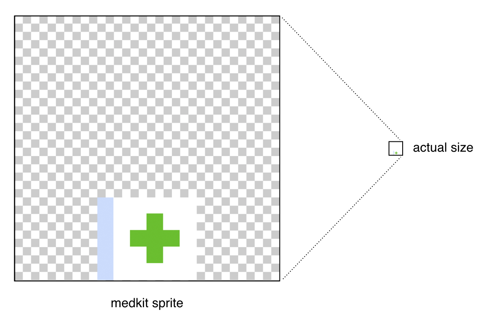
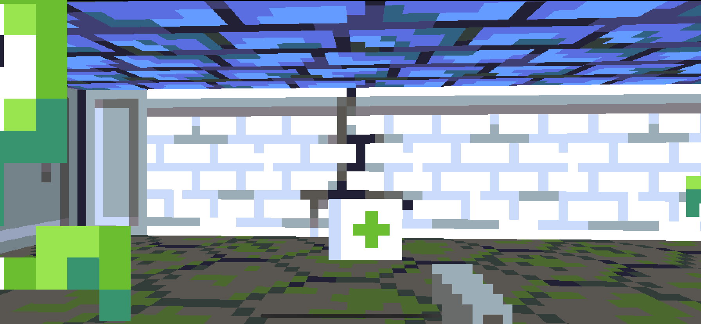
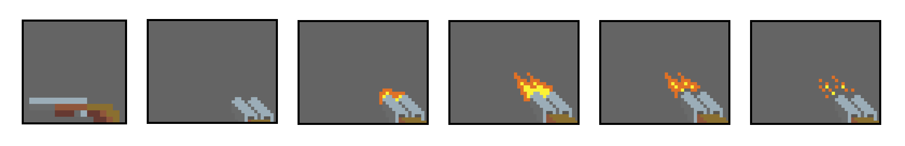
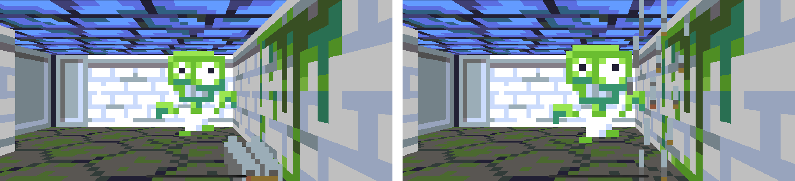
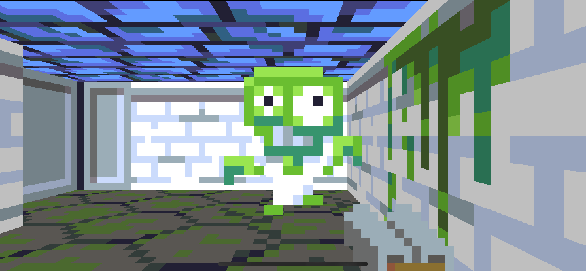
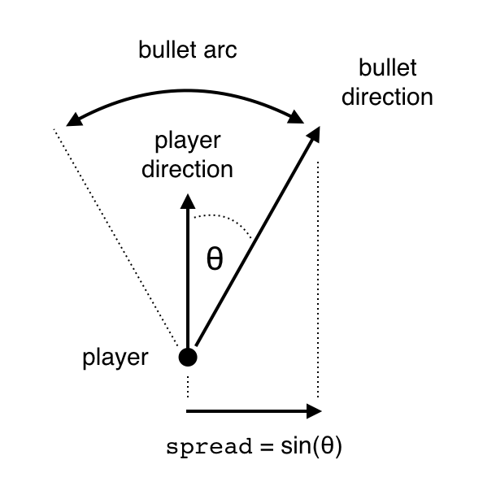

## Part 14: Power-ups and Inventory

In [Part 13](Part13.md) we added sound effects. You can find the complete source code for Part 13 [here](https://github.com/nicklockwood/RetroRampage/archive/Part13.zip).

We'll now return to working on the actual game mechanics, and implement another important gameplay feature...

### Power to The People

As a lone soldier battling a horde of the undead, the odds are against you. You might have the upper hand at first, but eventually the monsters will wear you down until your health runs out, and you finally fall.

But it doesn't have to be this way. What if you could recover your health? Or maybe even become *more* powerful? All of this is possible with pickups or - as they are sometimes known - *power*-ups.

We're going to add a new kind of `Thing` to the level, and this time it is neither an enemy nor an obstacle, but an *ally*. In `Thing.swift` add the following new case to the enum:

```swift
public enum Thing: Int, Decodable {
    ...
    case medkit
}
```

Yes, the first type of pickup we'll add is a *medkit*. This will bump the player's health by a few points so they can keep on fighting.

The medkit should have an index of `6` in the `Thing` enum. Open `Levels.json` and add a `6` to the `things` array for the first level:

```swift
"things": [
    0, 0, 0, 0, 0, 0, 0, 0,
    0, 2, 0, 0, 0, 0, 0, 0,
    0, 0, 0, 0, 2, 0, 0, 0,
    0, 6, 0, 3, 0, 0, 0, 0,
    0, 0, 2, 0, 4, 0, 3, 0,
    0, 3, 0, 0, 0, 0, 0, 0,
    0, 0, 0, 0, 1, 0, 2, 0,
    0, 5, 0, 0, 0, 0, 0, 0
]
```

Like most entities in the level, pickups will be a type of `Actor`. Create a new file in the Engine module called `Pickup.swift` with the following contents:

```swift
public enum PickupType {
    case medkit
}

public struct Pickup: Actor {
    public let type: PickupType
    public let radius: Double = 0.4
    public let position: Vector

    public init(type: PickupType, position: Vector) {
        self.type = type
        self.position = position
    }
}

public extension Pickup {
    var isDead: Bool { return false }
}
```

We'll assume that pickups cannot move or change size, so their position and radius are constant. It's also reasonable to assume all pickups will have similar properties and behavior, so we've added a `type` field so that we can re-use the `Pickup` struct for multiple pickup types.

With the `Monster` type it was important that the radius was small enough to accurately reflect collisions, but large enough that the sprite wouldn't clip into the walls. In this case the pickup will always be centered in its tile, so clipping is not much of a concern. We've chosen a large-ish radius mainly because it will make it easier for the player to, well... *pick it up*.

The medkit pickup looks like this<sup><a id="reference1"></a>[[1]](#footnote1)</sup>:



As always you can draw your own art assets, but if you want to use the one from the tutorial you will find it [here](https://github.com/nicklockwood/RetroRampage/tree/Part14/Source/Rampage/Assets.xcassets/medkit.imageset).

Add the medkit image to XCAssets, then in `Textures.swift` add a new entry to the `Texture` enum:

```swift
public enum Texture: String, CaseIterable {
    ...
    case medkit
}
```

Pickups will be represented as sprites, which means that they will be rendered using a `Billboard` that always faces the player. We already worked out this logic for the `Monster` sprite in [Part 5](Part5.md) so we'll re-use the same implementation.

Add the following code to the `Pickup` extension:

```swift
public extension Pickup {
    ...
    
    var texture: Texture {
        switch type {
        case .medkit:
            return .medkit
        }
    }

    func billboard(for ray: Ray) -> Billboard {
        let plane = ray.direction.orthogonal
        return Billboard(
            start: position - plane / 2,
            direction: plane,
            length: 1,
            texture: texture
        )
    }
}
```

Next, we need to update `World.swift`. Start by adding a `pickups` array to the `World` struct, along with the initialization code:

```swift
public struct World {
    public private(set) var map: Tilemap
    public private(set) var doors: [Door]
    public private(set) var pushwalls: [Pushwall]
    public private(set) var switches: [Switch]
    public private(set) var pickups: [Pickup]
    public private(set) var monsters: [Monster]
    public private(set) var player: Player!
    public private(set) var effects: [Effect]
    public private(set) var isLevelEnded: Bool
    private var sounds: [Sound] = []

    public init(map: Tilemap) {
        self.map = map
        self.doors = []
        self.pushwalls = []
        self.switches = []
        self.pickups = []
        self.monsters = []
        self.effects = []
        self.isLevelEnded = false
        reset()
    }
}
```

In order to draw the medkit, we'll need to add pickups to the `sprites` array:

```swift
var sprites: [Billboard] {
    let ray = Ray(origin: player.position, direction: player.direction)
    return monsters.map { $0.billboard(for: ray) } + doors.map { $0.billboard }
        + pushwalls.flatMap { $0.billboards(facing: player.position) }
        + pickups.map { $0.billboard(for: ray) }
}
```

We'll also need to clear the `pickups` array inside the `reset()` method:

```swift
mutating func reset() {
    self.monsters = []
    self.doors = []
    self.switches = []
    self.pickups = []
    ...
}
```

Then, still in `reset()`, add the following case to the switch statement:

```swift
case .medkit:
    pickups.append(Pickup(type: .medkit, position: position))
```

That should be everything needed to display the medkit. Run the game and battle your way through the zombie hoards to the final door. Ah, sweet relief...



Of course, the medkit doesn't actually *do* anything. It doesn't even get in our way, as the collision detection system ignores it. It's nothing more than a ghostly apparition, sitting intangibly on the floor, taunting us with the promise of health restored.

To fix that, we'll need to add some logic to `World.update()`. But what should that logic *do*?

Add the following loop just below the `// Handle collisions` block:

```swift
// Handle pickups
for i in (0 ..< pickups.count).reversed() {
    let pickup = pickups[i]
    if player.intersection(with: pickup) != nil {
        pickups.remove(at: i)
    }
}
```

This code will loop through every pickup, and if any of them are intersecting the player then they'll be removed.

The logic is pretty similar to the other update loops, but for one detail: Notice the `.reversed()` in the first line. We're looping through the pickups *backwards*. Can you tell why?

Up until now, all objects in the map have have been permanent. Monsters can die, but they aren't removed when that happens - they just change state. In this case we are *actually removing* the `Pickup` actor from the world when it has been collected.

Mutating an array while you're iterating through it can be dangerous. Once an element has been removed, the subsequent indices no longer match-up with their original elements, and the last index will point past the end of the array.

The simple trick of iterating backwards ensures that the indices affected will always be the ones we have *already visited*, so we avoid a crash.

Merely removing the pickup from the world is not enough - we need the pickup to actually alter the state of the player. Add the following code inside the if statement in the `// Handle pickups` section, just after `pickups.remove(at: i)`:

```swift
switch pickup.type {
case .medkit:
    player.health += 25
    effects.append(Effect(type: .fadeIn, color: .green, duration: 0.5))
}
```

This code will bump the player's health by 25 points. Since we don't currently have a health meter on screen (and it's difficult from a first-person perspective to see what's going on at your feet) we also trigger a fullscreen green flash effect to indicate that the medkit was collected.

Now that the game has audio, we should really add a sound effect for the medkit pickup too. Add the following new case to the `SoundName` enum in `Sounds.swift`, and add the accompanying MP3 file to (which you can find [here](https://github.com/nicklockwood/RetroRampage/tree/Part14/Source/Rampage/Sounds/medkit.mp3)) to the `Sounds` directory in the main project:

```swift
public enum SoundName: String, CaseIterable {
    ...
    case medkit
}
```

Back in `World.update()`, in the `// Handle pickups` section, add the following line just below `player.health += 25`:

```swift
playSound(.medkit, at: pickup.position)
```

### Arms Race

It's time to add a new weapon to our arsenal. In Wolfenstein 3D the next weapon upgrade from the pistol was an SMG, but in this case we're going to take our inspiration from Doom and add a shotgun.

Besides the pickup sprite, we'll also need new graphics for the weapon in-hand:



Like the pistol, the shotgun has one idle frame and four firing frames. You can find all the new graphics [here](https://github.com/nicklockwood/RetroRampage/tree/Part14/Source/Rampage/Assets.xcassets/) (or feel free to create your own).

Add the images for the shotgun pickup and firing animation to XCAssets, then in `Textures.swift` extend the `Texture` enum with the additional cases, matching the names of the image assets:

```swift
public enum Texture: String, CaseIterable {
    ...
    case shotgun
    case shotgunFire1, shotgunFire2, shotgunFire3, shotgunFire4
    case shotgunPickup
}
```

We'll also need new sound effects. The shotgun has a louder gunshot than the pistol, and we'll need a sound for when we collect the shotgun pickup too. Add these new cases to the `SoundName` enum in `Sounds.swift`. You'll find the MP3 files for the new sounds [here](https://github.com/nicklockwood/RetroRampage/tree/Part14/Source/Rampage/Sounds).

```swift
public enum SoundName: String, CaseIterable {
    ...
    case shotgunFire
    case shotgunPickup
}
```

Currently the pistol behavior is hard-coded in the `Player` type. To add a new weapon we'll need to extract some of that logic. Create a new file in the Engine module called `Weapon.swift` with the following contents:

```swift
public enum Weapon {
    case pistol
    case shotgun
}
```

At the bottom of `Player.swift` is an extension on `Animation` that adds constants for the pistol animation sequences:

```swift
public extension Animation {
    static let pistolIdle = Animation(frames: [
        .pistol
    ], duration: 0)
    ...
}
```

Delete this extension from `Player.swift` and then add a new one at the bottom of `Weapon.swift`:

```swift
public extension Animation {
    static let pistolIdle = Animation(frames: [
        .pistol
    ], duration: 0)
    static let pistolFire = Animation(frames: [
        .pistolFire1,
        .pistolFire2,
        .pistolFire3,
        .pistolFire4,
        .pistol
    ], duration: 0.5)
    static let shotgunIdle = Animation(frames: [
        .shotgun
    ], duration: 0)
    static let shotgunFire = Animation(frames: [
        .shotgunFire1,
        .shotgunFire2,
        .shotgunFire3,
        .shotgunFire4,
        .shotgun
    ], duration: 0.5)
}
```

We've now got separate animations and sound effects for both the pistol and shotgun, but how do we associate these with their respective weapons?

Since `Weapon` is an enum, it's awkward to add properties to it directly. We could add computed properties, but multiple computed properties are also a bit of a headache to deal with, as we'd need a switch statement inside each property.

Instead, we'll create a new type to contain the attributes (animations, sounds and other properties) for each weapon type. Add the following extension to `Weapon.swift`, just below the `Weapon` enum definition:

```swift
public extension Weapon {
    struct Attributes {
        let idleAnimation: Animation
        let fireAnimation: Animation
        let fireSound: SoundName
    }

    var attributes: Attributes {
        switch self {
        case .pistol:
            return Attributes(
                idleAnimation: .pistolIdle,
                fireAnimation: .pistolFire,
                fireSound: .pistolFire
            )
        case .shotgun:
            return Attributes(
                idleAnimation: .shotgunIdle,
                fireAnimation: .shotgunFire,
                fireSound: .shotgunFire
            )
        }
    }
}
```

Back in `Player.swift`, replace the line:

```swift
public var animation: Animation = .pistolIdle
```

with:

```swift
public private(set) var weapon: Weapon = .shotgun
public var animation: Animation
```

Then add the following code to the bottom of `Player.init()`:

```swift
self.animation = weapon.attributes.idleAnimation
```

We've made the `weapon` setter private because changing the player's weapon will have other side-effects, such as changing the current animation. We could use a `didSet` handler, but (as mentioned in [Part 12](Part12.md#reference2)) this can lead to hard-to-diagnose bugs when seemingly trivial code has unexpected side-effects.

Instead, we'll use an explicit setter method. Add the following code just below the `canFire` computed var:

```swift
mutating func setWeapon(_ weapon: Weapon) {
    self.weapon = weapon
    self.animation = weapon.attributes.idleAnimation
}
```

We'll need to make some changes in the `Player.update()` method too. Replace the lines:

```swift
animation = .pistolFire
world.playSound(.pistolFire, at: position)
```

with:

```swift
animation = weapon.attributes.fireAnimation
world.playSound(weapon.attributes.fireSound, at: position)
```

Then, further down, replace:

```swift
animation = .pistolIdle
```

with:

```swift
animation = weapon.attributes.idleAnimation
```

Run the game now and you should see something like the screenshot on the left below.



If you see the screen on the *right* instead, it's due to a bug that was introduced in the original draft of [Part 9](Tutorial/Part9.md) which caused the width and height of bitmaps to be inverted. To fix it, you need to replace the following line in `UIImage+Bitmap.swift`:

```swift
self.init(height: cgImage.width, pixels: pixels)
```

with:

```swift
self.init(height: cgImage.height, pixels: pixels)
```

Assuming you aren't seeing the corrupted version, you may still be thinking that the shotgun looks a bit *squished* - and you'd be right. Unlike all the other textures we have used up until this point, the shotgun textures are rectangular rather than square.

The logic we originally added in the renderer assumes equal dimensions for the weapon image, hence the distortion. Let's fix that now. In `Renderer.swift`, replace the following lines:

```swift
// Player weapon
let screenHeight = Double(bitmap.height)
bitmap.drawImage(
    textures[world.player.animation.texture],
    at: Vector(x: Double(bitmap.width) / 2 - screenHeight / 2, y: 0),
    size: Vector(x: screenHeight, y: screenHeight)
)
```

with:

```swift
// Player weapon
let weaponTexture = textures[world.player.animation.texture]
let aspectRatio = Double(weaponTexture.width) / Double(weaponTexture.height)
let screenHeight = Double(bitmap.height)
let weaponWidth = screenHeight * aspectRatio
bitmap.drawImage(
    weaponTexture,
    at: Vector(x: Double(bitmap.width) / 2 - weaponWidth / 2, y: 0),
    size: Vector(x: weaponWidth, y: screenHeight)
)
```

This new code calculates the actual aspect ratio of the weapon graphic instead of assuming a square. The rest of the rendering logic is unchanged. Run the game again and you should see the un-squashed shotgun.



The shotgun looks and sounds suitably fearsome, but it doesn't really *feel* any more powerful than the pistol. And that's because it *isn't*. We've changed the appearance, but the behavior is exactly the same.

We need to extract some more of the weapon behavior from `Player`. In `Weapon.swift`, add `damage` and `cooldown` properties to the `Weapon.Attributes`:

```swift
public extension Weapon {
    struct Attributes {
        let idleAnimation: Animation
        let fireAnimation: Animation
        let fireSound: SoundName
        let damage: Double
        let cooldown: Double
    }
    
    var attributes: Attributes {
        switch self {
        case .pistol:
            return Attributes(
                ...
                fireSound: .pistolFire,
                damage: 10,
                cooldown: 0.25
            )
        case .shotgun:
            return Attributes(
                ...
                fireSound: .shotgunFire,
                damage: 50,
                cooldown: 0.5
            )
        }
    }
}
```

In `Player.swift` you can delete the `attackCooldown` property (since it's now defined in the weapon itself). Then in the `Player.canFire` computed var, replace the line:

```swift
return animation.time >= attackCooldown
```

with:

```swift
return animation.time >= weapon.attributes.cooldown
```

Next, in `Player.update()`, replace the line:

```swift
world.hurtMonster(at: index, damage: 10)
```

with:

```swift
world.hurtMonster(at: index, damage: weapon.attributes.damage)
```

That's more like it! The shotgun now does enough damage to kill a zombie with one shot. We've also increased the cooldown period to half a second, because you don't really expect a double-barrelled shotgun to have the same firing rate as a semi-automatic pistol.

### Spray and Pray

Although it's more powerful now, the shotgun still doesn't behave quite convincingly. A real shotgun typically<sup><a id="reference2"></a>[[2]](#footnote2)</sup> fires a spray of pellets with each shot, rather than a single bullet. These pellets spread out, doing more damage at closer range and potentially hitting multiple targets at a distance.

We can't really emulate this with a single ray - we need to cast a *spread*. Add two more parameters to `Weapon.Attributes`:

```swift
public extension Weapon {
    struct Attributes {
        ...
        let projectiles: Int
        let spread: Double
    }
    
    var attributes: Attributes {
        switch self {
        case .pistol:
            return Attributes(
                ...
                cooldown: 0.25,
                projectiles: 1,
                spread: 0
            )
        case .shotgun:
            return Attributes(
                ...
                cooldown: 0.5,
                projectiles: 5,
                spread: 0.4
            )
        }
    }
}
```

The `projectiles` parameter will be the number of individual bullets or pellets cast by the weapon each time it fires. The `spread` determines the arc across which the bullets will be dispersed.

In `Player.swift`, locate the following block of code in the `update()` method:

```swift
let ray = Ray(origin: position, direction: direction)
if let index = world.pickMonster(ray) {
    world.hurtMonster(at: index, damage: weapon.attributes.damage)
    world.playSound(.monsterHit, at: world.monsters[index].position)
} else {
    let position = world.hitTest(ray)
    world.playSound(.ricochet, at: position)
}
```

And wrap it in a loop, as follows:

```swift
let projectiles = weapon.attributes.projectiles
for _ in 0 ..< projectiles {
    let ray = Ray(origin: position, direction: direction)
    if let index = world.pickMonster(ray) {
        world.hurtMonster(at: index, damage: weapon.attributes.damage)
        world.playSound(.monsterHit, at: world.monsters[index].position)
    } else {
        let position = world.hitTest(ray)
        world.playSound(.ricochet, at: position)
    }
}
```

This isn't very useful by itself. The shotgun now fires five bullets instead of one, but they'll all be going in the same direction. To spread the bullets out we'll need to apply a random offset to each.

The way that we calculate the offset is similar to the calculation we used in [Part 13](Part13.md#pump-up-the-stereo) to determine the sound pan, but in reverse. Instead of taking a direction vector and converting it to a sine or cosine value, we're going to take the sine value and convert it to a direction vector. 



We can't use the dot product like we used to calculate the sound pan, because the dot product isn't a reversible operation. However we can use Pythagoras's Theorem<sup><a id="reference3"></a>[[3]](#footnote3)</sup> to get the cosine of the angle from the sine:

```swift
cosine = sqrt(1 - sine * sine)
```

And with the sine and cosine we can generate a rotation matrix to calculate the bullet direction. Insert the following code just inside the for loop:

```swift
let spread = weapon.attributes.spread
let sine = Double.random(in: -spread ... spread)
let cosine = (1 - sine * sine).squareRoot()
let rotation = Rotation(sine: sine, cosine: cosine)
let direction = self.direction.rotated(by: rotation)
```

We'll also need to divide the total damage by the number of projectiles, otherwise each of pellet of the shotgun will be delivering a fatal blow, making it excessively powerful. Replace the line:

```swift
world.hurtMonster(at: index, damage: weapon.attributes.damage)
```

with:

```swift
let damage = weapon.attributes.damage / Double(projectiles)
world.hurtMonster(at: index, damage: damage)
```

If you run the game now you should find that the shotgun works more like a shotgun. Close up, it will usually kill a zombie outright, but at a distance there is a good chance that some of the individual pellets will miss.

Something is wrong with the sound though. The ricochet is louder and more echoey than expected. The problem is that we are now playing the impact sound repeatedly for every projectile in the loop.

We can defer it until after the loop, but which sound do we play? It could be that some of the bullets hit and others miss, so what we really need to do is keep track of collisions inside the loop and then play one or both of the possible impact sounds afterwards.

Just before the for loop, add the following line:

```swift
var hitPosition, missPosition: Vector?
```

Now, inside the loop, replace the line:

```swift
world.playSound(.monsterHit, at: world.monsters[index].position)
```

with:

```swift
hitPosition = world.monsters[index].position
```

Then replace the lines:

```swift
let position = world.hitTest(ray)
world.playSound(.ricochet, at: position)
```

with:

```swift
missPosition = world.hitTest(ray)
```

Finally, add the following code after the for loop, but still inside the `if input.isFiring, canFire {` block:
    
```swift
if let hitPosition = hitPosition {
    world.playSound(.monsterHit, at: hitPosition)
}
if let missPosition = missPosition {
    world.playSound(.ricochet, at: missPosition)
}
```

Now the impact sounds will only play at most once each, regardless of the number of projectiles.

### Time to Say Goodbye

Now that we've perfected the shotgun, we have to take it away. The point of this exercise was to make the shotgun a *power-up* that the player has to find - it doesn't do much good to just give it to them from the outset.

In `Player.swift`, replace the line:

```swift
public private(set) var weapon: Weapon = .shotgun
```

with:

```swift
public private(set) var weapon: Weapon = .pistol
```

Now we'll put the shotgun back, but this time in `Pickup` form. We'll start by adding a `shotgun` case to the `Thing` enum in `Things.swift`:

```swift
public enum Thing: Int, Decodable {
    ...
    case shotgun
}
```

Then do the same for the `PickupType` enum in `Pickup.swift`:

```swift
public enum PickupType {
    case medkit
    case shotgun
}
```

And, further down in the same file, add an extra case to the `Pickup.texture` property:

```swift
var texture: Texture {
    switch type {
    case .medkit:
        return .medkit
    case .shotgun:
        return .shotgunPickup
    }
}
```

In `Levels.json` update the `things` array for the first level by adding a shotgun pickup in the top-right of the map, which corresponds to the second room (the shotgun `Thing` has an index of `7`):

```swift
"things": [
    0, 0, 0, 0, 0, 0, 0, 0,
    0, 2, 0, 0, 0, 0, 7, 0,
    0, 0, 0, 0, 2, 0, 0, 0,
    0, 6, 0, 3, 0, 0, 0, 0,
    0, 0, 2, 0, 4, 0, 3, 0,
    0, 3, 0, 0, 0, 0, 0, 0,
    0, 0, 0, 0, 1, 0, 2, 0,
    0, 5, 0, 0, 0, 0, 0, 0
]
```

We'll also need to update the world logic. In `World.update()`, in the `// Handle pickups` section, add the following case to the switch statement:

```swift
case .shotgun:
    player.setWeapon(.shotgun)
    playSound(.shotgunPickup, at: pickup.position)
    effects.append(Effect(type: .fadeIn, color: .white, duration: 0.5))
```

On collision between the player and the pickup, this logic will set the player's weapon to the shotgun, play the `shotgunPickup` sound effect and also flash the screen white (to distinguish from the green flash when picking up a medkit).

Finally, in `World.reset()`, add the following after `case medkit:`:

```swift
case .shotgun:
    pickups.append(Pickup(type: .shotgun, position: position))
```

### Easy Come, Easy Go

Battle through the level to the end and hit the elevator switch. You appear in a new level, but your shotgun doesn't.

The problem is that the player (and their inventory) does not actually persist between levels. When the level is loaded, everything (including the player object) is created afresh from the map JSON.

We don't actually want to preserve the player instance<sup><a id="reference4"></a>[[4]](#footnote4)</sup> between levels, because there are more properties that we need to reset than preserve (position, direction, velocity, sound channel, animation) but we do want the ability to carry over the player's health and inventory between levels.

In `Player.swift`, add the following method just after `setWeapon()`:

```swift
mutating func inherit(from player: Player) {
    health = player.health
    setWeapon(player.weapon)
}
```

Then in `World.swift`, update the `setLevel()` method as follows:

```swift
mutating func setLevel(_ map: Tilemap) {
    let effects = self.effects
    let player = self.player!
    self = World(map: map)
    self.effects = effects
    self.player.inherit(from: player)
}
```

This logic makes a copy of the current player prior to replacing the world contents, then calls `inherit()` to copy over their health and weapon properties to the new player.

### Artificial Scarcity

Carrying weapons and heath over to the next level seems fairer, but is also makes things a bit too easy. Once you've acquired the shotgun, you'll never lose it again, and you'd have no reason to drop back to the pistol (even if the game offered the option to do so).

In Wolfenstein 3D (as in the real world), weapons eventually run out of bullets. If the shotgun can run out of ammunition then it will restore some of the balance we've lost by keeping the weapon between levels.

In `Weapon.swift` add a new `defaultAmmo` property to `Weapon.Attributes`:

```swift
public extension Weapon {
    struct Attributes {
        ...
        let spread: Double
        let defaultAmmo: Double
    }

    var attributes: Attributes {
        switch self {
        case .pistol:
            return Attributes(
                ...
                spread: 0,
                defaultAmmo: .infinity
            )
        case .shotgun:
            return Attributes(
                ...
                spread: 0.4,
                defaultAmmo: 5
            )
        }
    }
}
```

We've given the pistol infinite ammo (since there's nothing to drop down to if it runs out), but the shotgun is now limited to five shots.

In `Player.swift`, just below the line:

```swift
public private(set) var weapon: Weapon = .pistol
```

Add:

```swift
public private(set) var ammo: Double
```

Then add the following line to the bottom of `Player.init()`:

```swift
self.ammo = weapon.attributes.defaultAmmo
```

We don't want the gun to fire if we've run out of ammo, so add a guard statement at the start of the `canFire` computed property:

```swift
var canFire: Bool {
    guard ammo > 0 else {
        return false
    }
    ...
}
```

Now add the following line to the end of the `Player.setWeapon()` method:

```swift
ammo = weapon.attributes.defaultAmmo
```

Changing weapons will now reset the ammo to the default for that weapon. Now add the following line to the end of `Player.inherit()`:

```swift
ammo = player.ammo
```

That means the player's ammo will be kept between levels. All that's left is to actually consume ammo when firing. In `Player.update()` just after the line `state = .firing`, add the following:

```swift
ammo -= 1
```

Then a few lines below that, inside the switch statement, replace the `break` in `case .idle:` with:
   
```swift
if ammo == 0 {
    setWeapon(.pistol)
}
```

Try playing the game now and you should find that after 5 shots, the shotgun is replaced by the pistol again.

And that brings us to the end of Part 14. In this part we:

* Added a medkit pickup to restore the player's health
* Implemented support for new weapon types, and added a collectable shotgun
* Added persistent player inventory that carries over between levels
* Implemented a simple ammunition mechanic, so weapons eventually run out of bullets

In [Part 15](Part15.md) we'll improve the monster IQ by adding *pathfinding*.

### Reader Exercises

1. Picking up a medkit when you're already on more than 75% health currently *overcharges* you to beyond 100%. Can you modify the logic so that your health is capped at 100%? For bonus points, make it so that if you're already at 100% the game won't let you pick up the medkit at all.

2. If you manage to preserve your ammo for long enough to pick up another shotgun, the current behavior is that the ammo is reset to the default for that weapon. Can you modify the logic so that whatever ammo you have left over is kept and added to the total?

3. Try adding a third weapon type to the game (a laser gun would be an easy choice, as it doesn't require any new mechanics). If you were you pick up the shotgun and then pick up the third weapon, it would replace the shotgun in your inventory. Can you modify the code to allow the player to carry multiple weapons at once, each with its own ammo type? Weapons should have an implicit hierarchy so that picking up a more powerful weapon switches to it automatically. When you run out of ammo, the next most powerful weapon in your arsenal should be selected (not necessarily the pistol).

<hr>

<a id="footnote1"></a>[[1]](#reference1) You may be wondering why the cross on the medkit is green instead of the more-traditional red? Surprisingly, the red cross on a white background is not a generic medical symbol, but the emblem of the International Committee of the Red Cross, whose lawyers have apparently made the case that its use in videogames [constitutes a violation of the Geneva Conventions](https://www.pcgamer.com/how-the-prison-architect-developers-broke-the-geneva-conventions/).

<a id="footnote2"></a>[[2]](#reference2) Shotguns can actually fire [a wide variety of shell types](https://en.wikipedia.org/wiki/Shotgun_shell) including solid slugs, non-lethal beanbag rounds and incendiary chemicals.

<a id="footnote3"></a>[[3]](#reference3) We've used this at least three times already - I'm not explaining it again!

<a id="footnote4"></a>[[4]](#reference4) This isn't exactly meaningful anyway given that `Player` is a [value type](https://en.wikipedia.org/wiki/Value_type_and_reference_type), but Swift's semantics do distinguish between copying a whole struct vs some of its properties.
