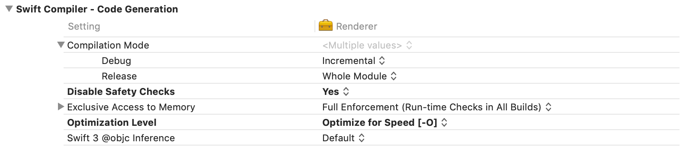
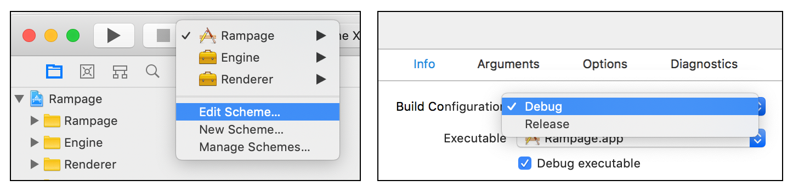
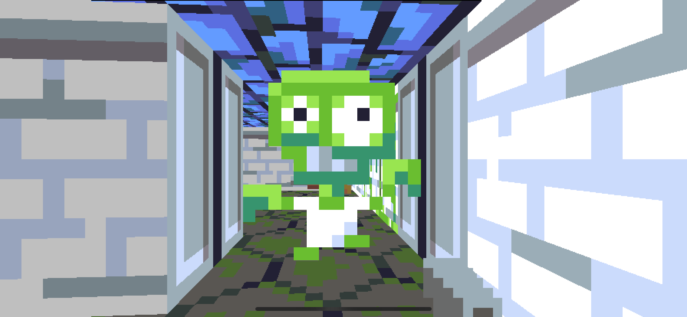
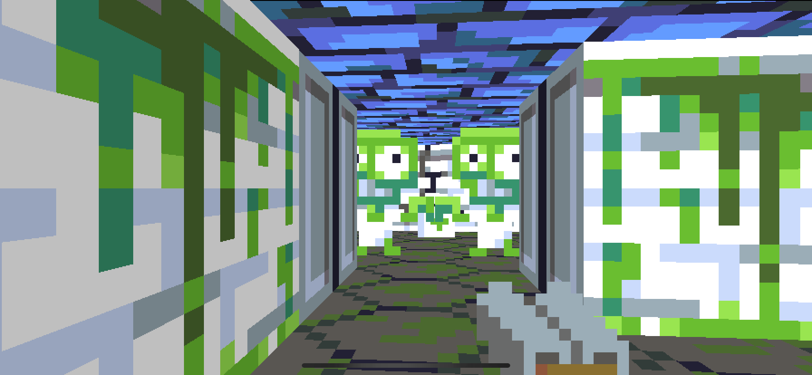
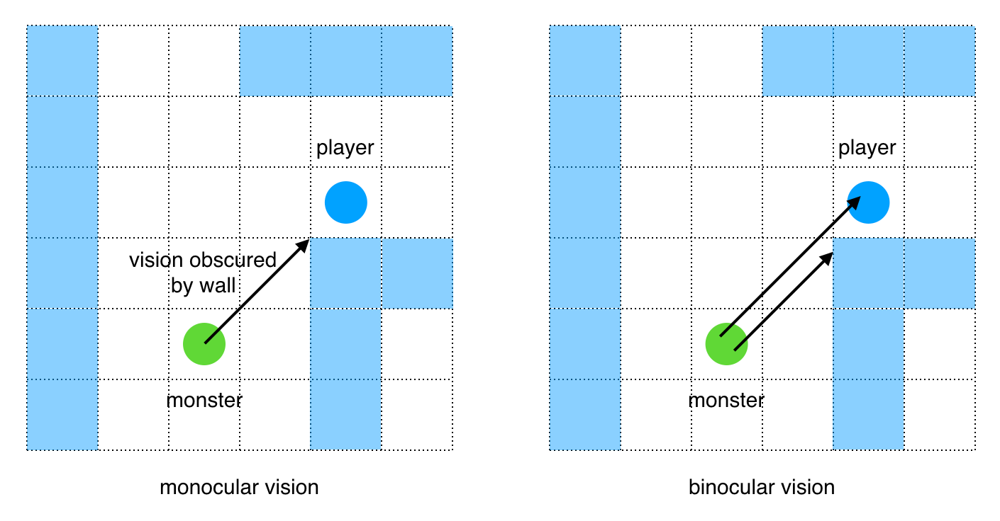
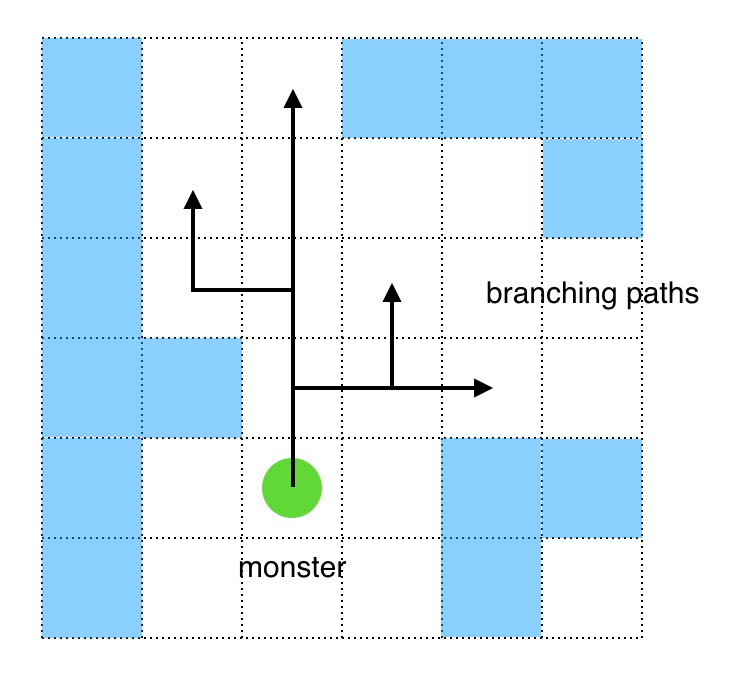
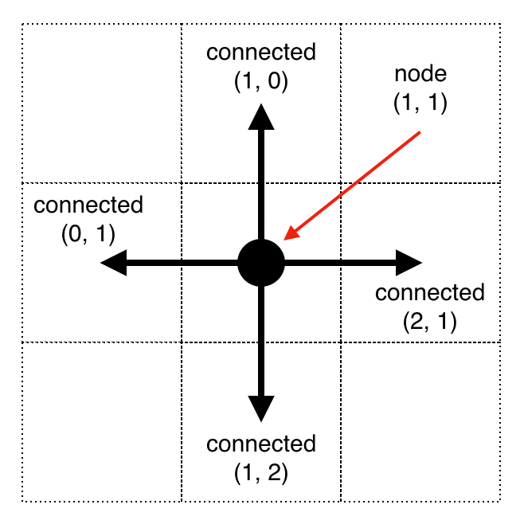
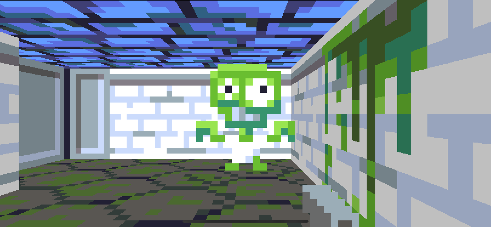

## Part 15: Pathfinding

In [Part 14](Part14.md) we added power-ups, including a medkit and a kickass shotgun! You can find the complete source code for Part 14 [here](https://github.com/nicklockwood/RetroRampage/archive/Part14.zip).

In this part we're going to revisit the rather primitive monster AI and see if we can't bump its IQ by a few points...

### A Blunt Instrument

At the start of [Part 4](Part4.md) we switched the project to run in Release mode so that it would actually be playable while testing. In Release mode, Xcode switches on a bunch of compiler optimizations that make the generated code a lot faster, but this comes at a cost of making it much harder to debug because the optimized code structure bears little resemblance to the original source. Variables and functions that you are trying to inspect may be inlined or optimized away completely.

Until now, the algorithms we've been writing have been relatively simple, and it has been possible to debug the app mostly by visually inspecting the game as it runs. But in this chapter we are going to need to implement some rather more complex logic, and doing that without the benefit of the debugger will be painful.

So what can we do? The game is completely unplayable in Debug mode, but is un-debuggable in Release mode. Well, it turns out that switching the *entire app* to Release mode is a rather blunt instrument, because it's mainly the *renderer* that is performance-critical.

Unfortunately, in order to apply optimizations only to the renderer, we will need to extract it into its own module. We already created a separate module for the game engine - now we'll need to do the same again for the rendering logic.

### Parting Ways

**Note:** Extracting a module is not terribly complicated, but it's error-prone and difficult to troubleshoot. If you get stuck, it's fine to skip this section as it's not critical to the features we'll be implementing right now. Just remember to grab the completed project from [here](https://github.com/nicklockwood/RetroRampage/archive/Part15.zip) when you're done.

We'll start by creating a new target. Go to the Targets tab in Xcode and add a new target of type *Framework* called "Renderer". Xcode will automatically link this in to your main app. It will also create a C header file in the Renderer folder called `Renderer.h` which imports Foundation. We aren't going to be using Foundation in the renderer, so you can go ahead and delete `Renderer.h`.


With the Renderer target selected, go to the Build Phases tab and add Engine as a dependency of the Renderer module. Next, in the Build Settings tab, in the `Swift Compiler - Code Generation` section set `Disable Safety Checks` to `Yes`, and set `Optimization Level` to `Optimize for Speed [-O]`.



These changes will ensure that any code in the Renderer module will be optimized even if the module is built in Debug mode. Next move the files `Bitmap.swift`, `Textures.swift` and `Renderer.swift` from the Engine module into the Renderer module. Make sure that Target Membership settings for these files (in the right-hand sidebar in Xcode) are all updated correctly.


Add the following line to the top of each of the files:

```swift
import Engine
```

Then, in the `Textures.swift` file, cut (i.e. copy and delete) the `Texture` enum definition:

```swift
public enum Texture: String, CaseIterable {
    case wall, wall2
    case crackWall, crackWall2
    case slimeWall, slimeWall2
    case door, door2
    case doorjamb, doorjamb2
    case floor
    case crackFloor
    case ceiling
    case monster
    case monsterWalk1, monsterWalk2
    case monsterScratch1, monsterScratch2, monsterScratch3, monsterScratch4
    case monsterScratch5, monsterScratch6, monsterScratch7, monsterScratch8
    case monsterHurt, monsterDeath1, monsterDeath2, monsterDead
    case pistol
    case pistolFire1, pistolFire2, pistolFire3, pistolFire4
    case shotgun
    case shotgunFire1, shotgunFire2, shotgunFire3, shotgunFire4
    case shotgunPickup
    case switch1, switch2, switch3, switch4
    case elevatorFloor, elevatorCeiling, elevatorSideWall, elevatorBackWall
    case medkit
}
```

Add a new file called `Texture.swift` to the Engine module, and paste the `Texture` enum into it. Still in the Engine module, in `Rect.swift` replace the following line:

```swift
var min, max: Vector
```

with:

```swift
public var min, max: Vector
```

Next, in the main game module add the following line to `ViewController.swift` and `UIImage+Bitmap.swift`:

```swift
import Renderer
```

Add the same import to `RampageTests.swift` in the RampageTests module.

Finally, go to Edit Scheme > Run > Build Configuration and revert the Run mode back to Debug.



And that *should* be everything. Try running the game again now and it should play as smoothly as before.

**Note:** If the app fails to compile, try a clean build. If it still fails, it's a good idea to try building each module separately in turn to narrow down the problem.

### Out of Sight, Out of Mind

Right now the monster's state is tied closely to whether they can see the player. When the monster sees the player they will start to chase them, then they'll stop again when they lose visual contact.

This isn't very realistic. If you're being chased by a monster and you go round a corner, you'd expect them to follow, not immediately forget that you exist. Let's change it so that once "activated", a monster will chase you wherever you go.

In `Monster.swift`, in the `update()` method, delete the following lines:

```swift
guard canSeePlayer(in: world) else {
    state = .idle
    animation = .monsterIdle
    velocity = Vector(x: 0, y: 0)
    break
}
```

Then try running the game again.

You may not immediately notice much difference in the monster behavior. The problem is that the ability of the monsters to follow you is significantly hampered by their inability to open doors.

Amusingly though, if you go and stand near the door (but not near enough to open it), the monster will swipe at you *through* the door. The monster's attack logic is purely range-based, and so at close proximity it can attack you even if it can't see you.

We'll fix that problem first. In `Monster.update()`, find the following code inside `case chasing:` :

```swift
if canReachPlayer(in: world) {
    state = .scratching
    animation = .monsterScratch
    lastAttackTime = -attackCooldown
    velocity = Vector(x: 0, y: 0)
    break
}
```

and wrap it in a `canSeePlayer()` check, as follows:

```swift
if canSeePlayer(in: world) {
    if canReachPlayer(in: world) {
        state = .scratching
        animation = .monsterScratch
        lastAttackTime = -attackCooldown
        velocity = Vector(x: 0, y: 0)
        break
    }
}
```

Next, in `Door.swift` find the following line:

```swift
if world.player.intersection(with: self) != nil {
```

and replace it with:

```swift
if world.player.intersection(with: self) != nil ||
    world.monsters.contains(where: { monster in
        monster.isDead == false &&
            monster.intersection(with: self) != nil
    }) {
```

The doors will now open if a (living) monster touches them. We'll also make it a little easier for our zombie friends by increasing the thickness of the door collision rectangle. In the computed `Rect.rect` property, replace the line:

```swift
return Rect(min: position, max: position + direction)
```

with:

```swift
let depth = direction.orthogonal * 0.1
return Rect(min: position + depth, max: position + direction - depth)
```

This doesn't affect the appearance of the door (which is still rendered as a paper-thin surface), but it increases the collision area by a distance of 0.1 world units in each direction (for a total of thickness 0.2 units).

### Heeeeere's Johnny!

Try running the game again and you should find that the monster follows you through the door.



This still isn't very satisfactory though - if you round a corner after passing through the door then the monster will not follow you through, but will instead try to take the shortest path towards you (through the wall) and get stuck.

The monster's supernatural awareness of the player location is actually a hinderance to its ability to chase you. The monster always tries to walk directly towards the player, wherever they are, even if the way is obstructed. 

A more realistic model would be for the monster to retain a memory of where it last saw you, and to head towards that. Because it will always be walking to somewhere that it has (or had) a clear line of sight to, it should ensure that the destination is reachable. Once it gets there, it can attempt to reacquire sight of you and resume the chase.

Add the following property to the `Monster` struct:

```swift
public private(set) var lastKnownPlayerPosition: Vector?
```

Then in `Monster.update()`, in `case .chasing:`, just inside `if canSeePlayer(in: world) {`, insert this line:
    
```swift
lastKnownPlayerPosition = world.player.position
```

This ensures the `lastKnownPlayerPosition` vector will always be updated when the monster has eyes on the player.

A few lines further down, replace the line:

```swift
let direction = world.player.position - position
```

with:

```swift
guard let destination = lastKnownPlayerPosition else {
    break
}
let direction = destination - position
```

The monster will now always walk towards the last place that it saw the player - which is not necessarily the player's current location. Here it will remain until it catches sight of the player once more.

### Crowd Control

Run the game again and you should find the zombies chase you rather more effectively. When you reach the last room, however the logic breaks down. If you pop your head into the room and then back out again, both monsters will start chasing you... and promptly collide inside the door, each blocking the other's path.



This kind of traffic jam is an inevitable consequence of the monsters all independently following the same chase routine. So how can we get them to cooperate?

In `Monster.swift`, add a new `blocked` state to the `MonsterState` enum:

```swift
public enum MonsterState {
    case idle
    case chasing
    case blocked
    ...
}
```

Then in the `Animation` extension in the same file, add a new case after `monsterIdle`:

```swift
public extension Animation {
    static let monsterIdle = Animation(frames: [
        .monster
    ], duration: 0)
    static let monsterBlocked = Animation(frames: [
        .monster
    ], duration: 1)
    ...
}
```

The blocked animation is basically the same as the idle animation, except for its duration. When it enters the `blocked` state we want the monster to wait for a period before resuming the chase. We don't currently have any way to set a standalone timer in the monster logic, so we'll use the animation's duration as a way to control how long the monster waits in the blocked state.

Add the following case to the switch statement inside `update()`, just after `case .chasing:`:

```swift
case .blocked:
    if animation.isCompleted {
        state = .chasing
        animation = .monsterWalk
    }
```

Then add the following new method just below the `update()` method:

```swift
func isBlocked(by other: Monster) -> Bool {

}
```

This will be used to detect if monsters are blocking each other. We'll start by discarding monsters that are dead or inactive, as the former won't get in the way, and the latter can be pushed out of the way if needed. Add the following code to the method body:

```swift
// Ignore dead or inactive monsters
if other.isDead || other.state != .chasing {
    return false
}
```

Next we'll check if the other monster is close enough to be a problem. We'll use the sum of the monster radii plus a reasonable buffer distance as the threshold. Add this code:

```swift
// Ignore if too far away
let direction = other.position - position
let distance = direction.length
if distance > radius + other.radius + 0.5 {
    return false
}
```

If two monsters are in close proximity, one needs to give way to the other. So how do we decide which gets priority?

We'll base it on the direction of movement. If the other monster lies in the same direction we are trying to move then it's blocking us. Add this final line to complete the method:

```swift
// Is standing in the direction we're moving
return (direction / distance).dot(velocity / velocity.length) > 0.5
```

We've used the dot product here to get the cosine of the angle between the normalized direction and velocity. The threshold of 0.5 equates to a 120 degree arc in front of the monster. If `other` is in that arc then we consider it to be blocking.

Now we just need to call this method for every monster in the level. If any monster is blocking us, we'll halt for one second and allow it to pass. In `Monster.update()` find the line:

```swift
velocity = direction * (speed / direction.length)
```

and add the following code just after it:

```swift
if world.monsters.contains(where: isBlocked(by:)) {
    state = .blocked
    animation = .monsterBlocked
    velocity = Vector(x: 0, y: 0)
}
```

Try running the game again. The monsters in the last room should no longer block each other.

### Seeing Double

It's quite noticeable (particularly when entering the last room) that the monsters aren't very good at spotting the player. Even when you can clearly see a monster's eye poking out from behind a wall, it doesn't always react to you.

The monsters "see" by projecting a single ray from their center towards the player. If it hits a wall or door before it reaches the player, they are considered to be obscured. This extreme *tunnel vision* means the monster can't see the player at all if the midpoint of either party is obscured.

This is a very low-fidelity view of the world compared to the player's own, where we cast hundreds of rays. It would be too expensive to do this for every monster, but we can compromise by using *two* rays to give the monster binocular vision<sup><a id="reference1"></a>[[1]](#footnote1)</sup>.



To implement this, open `Monster.swift` and update the `canSeePlayer()` method as follows:

```swift
func canSeePlayer(in world: World) -> Bool {
    var direction = world.player.position - position
    let playerDistance = direction.length
    direction /= playerDistance
    let orthogonal = direction.orthogonal
    for offset in [-0.2, 0.2] {
        let origin = position + orthogonal * offset
        let ray = Ray(origin: origin, direction: direction)
        let wallHit = world.hitTest(ray)
        let wallDistance = (wallHit - position).length
        if wallDistance > playerDistance {
            return true
        }
    }
    return false
}
```

The ray direction is the same as before, but we now create two rays, each offset by 0.2 world units from the monster's center. This coincides with the position of the eyes in the monster sprite, which means that if you can see either of the monster's eyes, it can probably see you.

### Chart a Course

We've significantly improved the monster's chasing logic, but they still tend to get stuck in door frames. The problem is that the monsters always want to walk to their destination in a straight line, without regard for obstructions.

So what if the monsters could chart the shortest route from their current location to their destination, following the layout of the map, avoiding walls, and approaching doorways head-on instead of at an arbitrary angle?

This process is called [Pathfinding](https://en.wikipedia.org/wiki/Pathfinding), and the best-known of the pathfinding algorithms is the [A* algorithm](https://en.wikipedia.org/wiki/A*_search_algorithm), which we will now implement<sup><a id="reference2"></a>[[2]](#footnote2)</sup>.

A* is designed to quickly find the shortest path between two nodes in a [graph](https://en.wikipedia.org/wiki/Graph_(abstract_data_type)). This is a relatively simple problem to solve with brute force (comparing all possible paths and taking the shortest), but solving it this way is incredibly slow, and the time increases exponentially with the number of nodes<sup><a id="reference3"></a>[[3]](#footnote3)</sup>. 

The algorithm hones in on the optimal solution by using a [best-first search](https://en.wikipedia.org/wiki/Best-first_search), discarding longer paths without having to fully trace them. It is able to do this by using a [heuristic](https://en.wikipedia.org/wiki/Heuristic_(computer_science)) to quickly estimate the approximate distance between nodes.

The exact nature of this heuristic depend on the type of graph being traversed. In our case, the graph is a rectangular grid of tiles, and so we will use the [Manhattan Distance](https://en.wiktionary.org/wiki/Manhattan_distance) for estimating distance. The Manhattan Distance (named in reference to the grid-like nature of New York's streets) is the distance required to travel between two nodes in a grid if you are only permitted to move horizontally or vertically, and assuming that there are no obstacles (of course in reality there *will* be obstacles - that's why it's only an estimate).

Since the pathfinder is a nontrivial<sup><a id="reference4"></a>[[4]](#footnote4)</sup> piece of code, we're going to try to write it in a generalized way so that we can re-use it for other purposes later. In particular, we don't want to make too many assumptions about the nature of the map itself. To that end, we'll use a protocol to decouple the pathfinding logic from the world.

Create a new file in the Engine module called `Pathfinder.swift`, with the following contents:

```swift
public protocol Graph {
    associatedtype Node: Hashable

    func nodesConnectedTo(_ node: Node) -> [Node]
    func estimatedDistance(from a: Node, to b: Node) -> Double
    func stepDistance(from a: Node, to b: Node) -> Double
}
```

This protocol defines the functions that a graph must implement for the pathfinding to work. The `nodesConnectedTo()` method tells the algorithm which nodes (or tiles, in our case) can be reached from a given position. The `estimatedDistance()` function is used to return the approximate distance between nodes. Finally, the `stepDistance()` will be used to return the exact distance<sup><a id="reference5"></a>[[5]](#footnote5)</sup> between two neighboring nodes.

Notice that the protocol has an associated type called `Node`. `Node` is an abstract representation of a point along the path. A nice quality of the A* algorithm is that it doesn't need to know anything much about these nodes at all - they could be a grid coordinate, a 3D vector, or even a postal address. The only requirement is that nodes must conform to the `Hashable` protocol, so they can be stored in a `Set`.

The A* algorithm works by maintaining a list of explored paths and comparing their lengths and the estimated distance remaining to decide which is the best candidate to reach the goal. The paths form an inverted tree structure, where the front (or *head*) of each path is a leaf in the tree, and its tail forms a branch all the way back to the root (the starting point).



Add the following class to `Pathfinding.swift`:

```swift
private class Path<Node> {
    let head: Node
    let tail: Path?
    let distanceTravelled: Double
    let totalDistance: Double

    init(head: Node, tail: Path?, stepDistance: Double, remaining: Double) {
        self.head = head
        self.tail = tail
        self.distanceTravelled = (tail?.distanceTravelled ?? 0) + stepDistance
        self.totalDistance = distanceTravelled + remaining
    }
}
```

The `Path` class represents a path. It has the same structure as a [linked list](https://en.wikipedia.org/wiki/Linked_list), with a head containing its value (a graph node) and an optional tail that's represented by another `Path`. Because `Path` is a class (a reference type), multiple paths can share the same tail instance, which is where the tree structure comes in.

In addition to the `Node`, paths also store `distanceTravelled`, which is the sum of all the steps taken to get from the start to the current head position, and `totalDistance`, which is the sum of the `distanceTravelled` plus the estimated distance remaining.

Add the following computed property to `Path`:

```swift
var nodes: [Node] {
    var nodes = [head]
    var tail = self.tail
    while let path = tail {
        nodes.insert(path.head, at: 0)
        tail = path.tail
    }
    return nodes
}
```

The `nodes` property iteratively<sup><a id="reference6"></a>[[6]](#footnote6)</sup> gathers the nodes making up the path into an array (for more convenient traversal later).

Next, we'll write the path-finding function itself. Add the following extension to `Pathfinder.swift`:

```swift
public extension Graph {
    func findPath(from start: Node, to end: Node) -> [Node] {
        var visited = Set([start])
        var paths = [Path(
            head: start,
            tail: nil,
            stepDistance: 0,
            remaining: estimatedDistance(from: start, to: end)
        )]
        
    }
}
```

We begin with a single node (the starting point), which we add to the `visited` set. From this node we also create our first `Path` object, which we store in the `paths` array.

Next, we'll set up the main search loop. Add the following code to the `findPath()` method:

```swift
while let path = paths.popLast() {
    
}

// Unreachable
return []
```

This loop removes the last path from the `paths` array. If the array is empty, it means that we've failed to find a path so we just return an empty array.

The first thing to do inside the loop is check if the goal (the `end` node) has been reached. If it has, we'll return the successful path. Add the following code inside the while loop:

```swift
// Finish if goal reached
if path.head == end {
    return path.nodes
}
```

Now for the meat of the algorithm. Add the following code just after the `// Finish if goal reached` block (still inside the while loop):

```swift
// Get connected nodes
for node in nodesConnectedTo(path.head) where !visited.contains(node) {

}
```

This for loop iterates through all nodes connected to the current path head, excluding ones that we've already visited. Add the following code to the loop:

```swift
visited.insert(node)
let next = Path(
    head: node,
    tail: path,
    stepDistance: stepDistance(from: path.head, to: node),
    remaining: estimatedDistance(from: node, to: end)
)
```

The first line adds the connected node to the `visited` set so we don't explore it again. We then create a new path called `next` with the current path as its tail. Now we just need to add the `next` path to the `paths` array.

Instead of just appending new paths to the array, we insert them in reverse order of the `totalDistance`, so that the last element is always the shortest candidate. Add the following code to the for loop:

```swift
// Insert shortest path last
if let index = paths.firstIndex(where: {
    $0.totalDistance <= next.totalDistance
}) {
    paths.insert(next, at: index)
} else {
    paths.append(next)
}
```

This is where the *best-first* part of the algorithm comes in. For each step of the while loop, we take the last path in the `paths` array, which is also the one we have estimated to be the shortest.

Now we just need to actually implement the `Graph` protocol. First we must decide on a type to use for `Graph.Node`. Since we are only dealing in grid-aligned positions, we could use the integer tile index, or perhaps create a new type with integer `x` and `y` properties representing the map coordinate, but since our player and monster positions are already specified as vectors it will save a lot of conversions if we use `Vector` for the path nodes too.

All we need to do to use `Vector` as a `Graph.Node` is add `Hashable` conformance. In `Vector.swift` replace the line:

```swift
public struct Vector: Equatable {
```

with:

```swift
public struct Vector: Hashable {
```

The `Hashable` protocol is a superset of `Equatable`, so there's no need to include both. Also, Swift is able to synthesize `Hashable` conformance automatically for structs whose properties all conform already, so we don't need to do anything else.

Next, open `World.swift` and add the following code to the bottom of the file:

```swift
extension World: Graph {
    public typealias Node = Vector

    public func nodesConnectedTo(_ node: Node) -> [Node] {
        
    }

    public func estimatedDistance(from a: Node, to b: Node) -> Double {
        
    }

    public func stepDistance(from a: Node, to b: Node) -> Double {
        
    }
}
```

We'll start with the `nodesConnectedTo()` method, which is actually the most complex to implement. If you recall, the purpose of this method is to tell the pathfinding algorithm which nodes are reachable from a given point.

Although monsters can move in any direction in the open, for the purposes of the algorithm we will limit their movement to the horizontal and vertical. Given this, a given node will have a maximum of four possible connections:



Add the following code to the `nodesConnectedTo()` method:

```swift
return [
    Node(x: node.x - 1, y: node.y),
    Node(x: node.x + 1, y: node.y),
    Node(x: node.x, y: node.y - 1),
    Node(x: node.x, y: node.y + 1),
]
```

In practice, these nodes may not all be reachable. If one of the neighbors of the tile represented by the current node is a wall, we can't walk to it. In the `nodesConnectedTo()` method, replace the closing `]` with:

```swift
].filter { node in
    let x = Int(node.x), y = Int(node.y)
    return map[x, y].isWall == false
}
```

This will filter out nodes that lie on a wall tile. Besides regular walls, monsters also can't walk through push-walls, so we better add a check for those too. Add the following code just below the `isDoor(at:)` method:

```swift
func pushwall(at x: Int, _ y: Int) -> Pushwall? {
    return pushwalls.first(where: {
        Int($0.position.x) == x && Int($0.position.y) == y
    })
}
```

Note that unlike the `isDoor(at:)` and `switch(at:)` implementations, we can't use the `map.things` array for a fast push-wall check because the wall can move from its original position, so we must resort to a linear search using `first(where:)`. It's unlikely that a typical level will contain a very large number of push-walls though, so this shouldn't be too expensive.

Back in the `nodesConnectedTo()` method, replace the line:

```swift
return map[x, y].isWall == false
```

with:

```swift
return map[x, y].isWall == false && pushwall(at: x, y) == nil
```

That's the connectivity sorted - now we need to implement the other two `Graph` methods.

When moving on a rectangular grid, the distance between any two points (assuming there are no obstacles) is the sum of the horizontal distance between the points plus the vertical distance (the *Manhattan Distance* we mentioned earlier). Add the following code to the `estimatedDistance()` method:

```swift
return abs(b.x - a.x) + abs(b.y - a.y)
```

Finally, the `stepDistance()` is the *actual* (not-estimated) distance between the neighboring nodes `a` and `b`. Since our map is a uniform grid of square tiles, the distance between any two points is just one world unit, so the implementation for the `stepDistance()` method is just:

```swift
return 1
```

With the pathfinding logic implemented, we need to modify the monster AI to actually use it.

In `Monster.swift`, replace the line:

```swift
public private(set) var lastKnownPlayerPosition: Vector?
```

with:

```swift
public private(set) var path: [Vector] = []
```

Then, in the `update()` method, replace:

```swift
lastKnownPlayerPosition = world.player.position
```

with:

```swift
path = world.findPath(from: position, to: world.player.position)
```

and replace:

```swift
guard let destination = lastKnownPlayerPosition else {
```

with:

```swift
guard let destination = path.first else {
```

The monster will now walk towards the first node in the path instead of directly towards the player's last known location. But what happens when they get there? We need to add some code to detect when the monster has completed the first step in the path, and move on to the next.

Replace the line:

```swift
velocity = direction * (speed / direction.length)
```

with:

```swift
let distance = direction.length
if distance < 0.1 {
    path.removeFirst()
    break
}
velocity = direction * (speed / distance)
```

So now, when the monster is close to the first node in the path, we'll remove that node and break so that on the next call to `update()` they will start to move towards the next node in the path instead.

That should be it. Try running the game and see what happens.



That's weird. The monster seems to be stuck in place, jogging on the spot instead of chasing us. What's going on?

If we add a breakpoint after the path is created and inspect the value, we see that the path has three nodes. The first is the monster's own position, the last is the player position. This is as expected, but there's a logical error in our code:

Since the first node matches the monster position, the `if distance < 0.1` test will pass every time. We remove the first node and then break, but the next time `update()` is called it will recreate the path from the same starting position, so no progress is ever made.

In `Pathfinder.swift`, in the `Path.nodes` computed property, add the following line just before `return nodes`:

```swift
nodes.removeFirst()
```

The path returned by `findPath()` will now no longer include the starting point.

Try running the game again and... oh. The monster's still stuck.

### Type Mismatch

The reason this time is a little more subtle - the monster now makes it past the `if distance < 0.1` check, but when the path is recomputed on the next iteration, it's empty.

It turns out we made a mistake by using `Vector` for the `Graph.Node` type. While it does meet the requirement that each node can be represented as a unique value, it's not strict enough because there are multiple distinct `Vector` values that map to a single node.

When the game starts, the player and monster are both centered in their respective tiles, so their positions align with the pathfinding nodes and we are able to plot a path between them. But as soon as the monster moves it is no longer exactly in the center of a tile, which means that its position coordinates are no longer an integer multiple of the player's coordinates, so the `if path.head == end` check in `findPath()` will never pass.

We could calculate tile-centered values for the start and end positions before calling `findPath()`, but that makes the API very fragile. Instead, let's create a dedicated type for use as the `Graph.Node`.

In `World.swift` replace the line:

```swift
public typealias Node = Vector
```

with:

```swift
public struct Node: Hashable {
    public let x, y: Double

    public init(x: Double, y: Double) {
        self.x = x.rounded(.down) + 0.5
        self.y = y.rounded(.down) + 0.5
    }
}
```

This new `Node` type is structurally identical to `Vector`, but its initializer enforces grid alignment, so it's impossible to have a situation when the `start` or `end` parameters are not valid node positions.

For convenience, we'll overload the `World.findPath()` method with a `Vector`-based version:

```swift
public func findPath(from start: Vector, to end: Vector) -> [Vector] {
    return findPath(
        from: Node(x: start.x, y: start.y),
        to: Node(x: end.x, y: end.y)
    ).map { node in
        Vector(x: node.x, y: node.y)
    }
}
```

That saves us having to update any of the code in `Monster.swift`.

Run the game again and you should find that the zombies chase you much more effectively.

### Hear No Evil

Because pathfinding is not limited to line-of-sight, it introduces some interesting new gameplay possibilities. Instead of just being able to see the player, what if monsters could *hear* the player too?

In [Part 13](Part13.md) we introduced a crude form of sound propagation, where volume drops with distance according to the inverse square law. This works well inside a room, but doesn't account for sounds being muffled by walls.

Add the following method to `Monster.swift`, just below the `canSeePlayer()` definition:

```swift
func canHearPlayer(in world: World) -> Bool {
    guard world.player.state == .firing else {
        return false
    }
    let path = world.findPath(from: position, to: world.player.position)
    return path.count < 8
}
```

Instead of using the straight-line distance as we did for the volume calculation, `canHearPlayer()` uses pathfinding to simulate sound propagation through the maze. This is still only a crude approximation<sup><a id="reference7"></a>[[7]](#footnote7)</sup>, but it allows for greater realism than a distance-based approach (where monsters would be able to hear you just as clearly through a solid wall as through thin air).

In `Monster.update()` replace *both* of the instances of:

```swift
if canSeePlayer(in: world) {
```

with:

```swift
if canSeePlayer(in: world) || canHearPlayer(in: world) {
```

Try playing the game and you should find that shooting the monster in the first room now attracts the monster in the second room. The problem is that it works a little *too* well, as the monsters in the third room soon follow. We'd expect that the closed door would also muffle the sound a bit, but currently it offers no more resistance to sound than any other tile.

In `World.swift` we currently return `1` as the distance between any pair of nodes. We should ideally return a greater step distance for a closed door than for an open floor tile to reflect the fact that it takes longer to traverse. There is already an `World.isDoor()` method, but this doesn't tell us whether the door in question is closed or not. Add the following new method just below `isDoor()`:

```swift
func door(at x: Int, _ y: Int) -> Door? {
    guard isDoor(at: x, y) else {
        return nil
    }
    return doors.first(where: {
        Int($0.position.x) == x && Int($0.position.y) == y
    })
}
```

Then, in the `stepDistance()` method, add the following code before the return statement:

```swift
let x = Int(b.x), y = Int(b.y)
if door(at: x, y)?.state == .closed {
    return 5
}
```

The pathfinding algorithm will now consider a closed door to be equivalent to five floor tiles in terms of the effort needed to cross it. The current implementation of `canHearPlayer()` doesn't take that into account yet though because it's only based on the path *count*.

Computing the total path length is possible, but expensive. The thing is, we already calculated the path length inside the `findPath()` method, but we don't expose it. Trying to make that value public might lead to a rather awkward API, but we don't actually need the value, we just need to know if it exceeds a given threshold.

Open `Pathfinder.swift` and replace the line:

```swift
func findPath(from start: Node, to end: Node) -> [Node] {
```

with:

```swift
func findPath(from start: Node, to end: Node, maxDistance: Double) -> [Node] {
```

Then insert the following code just before the `// Insert shortest path last` comment:

```swift
// Skip this node if max distance exceeded
if next.totalDistance > maxDistance {
    break
}
```

We also need to do the same for the overloaded `findPath()` method in `World.swift`. Replace:

```swift
public func findPath(from start: Vector, to end: Vector) -> [Vector] {
    return findPath(
        from: Node(x: start.x, y: start.y),
        to: Node(x: end.x, y: end.y)
    ).map { node in
        Vector(x: node.x, y: node.y)
    }
}
```

with:

```swift
public func findPath(
    from start: Vector,
    to end: Vector,
    maxDistance: Double = 50
) -> [Vector] {
    return findPath(
        from: Node(x: start.x, y: start.y),
        to: Node(x: end.x, y: end.y),
        maxDistance: maxDistance
    ).map { node in
        Vector(x: node.x, y: node.y)
    }
}
```

Notice the default value of 50. Since we've added the `maxDistance` parameter anyway, this seems like a good opportunity to ensure that the monsters don't spend an unbounded time on hunting the player.

Finally, in `Monster.swift`, replace the following lines in `canHearPlayer()`:

```swift
let path = world.findPath(from: position, to: world.player.position)
return path.count < 8
```

with:

```swift
return world.findPath(
    from: position,
    to: world.player.position,
    maxDistance: 12
).isEmpty == false
```

And that brings us to the end of Part 15. In this part we:

* Split the Renderer out into its own module to aid debugging
* Added monster memory, so it can continue to hunt for the player even after losing sight of them
* Allowed monsters to open doors, so they can chase you between rooms
* Added blockage resolution, so monsters don't get in each other's way
* Gave the monsters binocular vision, so they can peek at you around corners
* Implemented A* pathfinding, so that monsters don't get stuck against walls and in doorways
* Made the monsters able to hear and respond to gunfire in the next room

Stay tuned for more retro mayhem in Part 16 (TBD).

### Reader Exercises

Finished the tutorial and hungry for more? Here are some ideas you can try out for yourself:

1. The monster movement can look a bit weird up-close as they zig-zag towards the player along exact horizontal or vertical axes. Can you modify the chasing logic so that when the monsters get close enough they'll just head directly towards the player instead?

2. In Wolfenstein 3D, certain enemies were set to *ambush mode* where they wouldn't come running if they heard the player, but would instead stay in hiding until they made eye contact. These would typically be hidden in alcoves along a corridor, or behind pillars so they could jump out and surprise the player. Can you implement something similar in Retro Rampage?

3. Although the `maxDistance` parameter helps to cap the performance cost of pathfinding, in a worst-case scenario (a large, closed room with no access to the player) even with a maximum path distance of 50 tiles the algorithm could potentially be forced to run thousands of total iterations - and that's *per-monster*, *every frame*. Can you think of a way to modify the pathfinder to work incrementally, so it can be paused and resumed if a monster fails to find a complete path within a given time budget? For bonus points, can you share explored paths between monsters so they don't have to duplicate work?

<hr>

<a id="footnote1"></a>[[1]](#reference1) Note that this is "binocular vision" only in the literal sense that the monster has *two eyes*. It has nothing to do with depth perception.

<a id="footnote2"></a>[[2]](#reference2) FYI, Apple includes a nice pathfinding implementation in [GameplayKit](https://developer.apple.com/documentation/gameplaykit).

<a id="footnote3"></a>[[3]](#reference3) In the general case, this problem of finding the shortest path is known as the [Travelling Salesman Problem](https://en.wikipedia.org/wiki/Travelling_salesman_problem) and is a commonly-cited example of an [NP-hard](https://en.wikipedia.org/wiki/NP-hardness) problem, for which there is no fast solution.

<a id="footnote4"></a>[[4]](#reference4) FYI, "nontrivial" is programmer-speak for "makes my head hurt".

<a id="footnote5"></a>[[5]](#reference5) Some implementations use the term "cost" instead of "distance". That's because the *cost* of moving between nodes may depend on more than just their physical separation. For example, moving to a given node might require going uphill, or wading through mud, and so the cost encapsulates qualities that might make a path more *costly* even if it's technically shorter.

<a id="footnote6"></a>[[6]](#reference6) You may be thinking that there is a more elegant way to write this using recursion - and you'd be right - but a simple recursive solution is actually a lot more expensive due to the additional array allocations needed.

<a id="footnote7"></a>[[7]](#reference7) Wolfenstein used an even cruder (if ingenious) system for sound propagation. Each distinct room in a level was assigned a number, and the tiles in that room were tagged with that number in the map data. The connectivity (via doorways) between the numbered rooms was then pre-calculated and stored in a lookup table. The sound of player gunfire could then be propagated very quickly between rooms with open doors.
