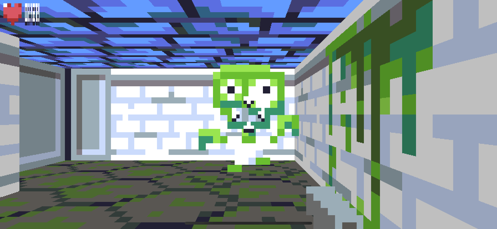
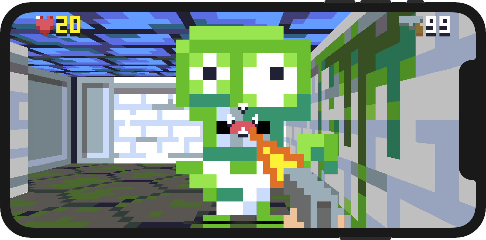

## Part 16: Heads-Up Display

In [Part 15](Part15.md) we improved the AI of our monsters, adding pathfinding logic so that they can follow the player around corners and avoid getting stuck in doorways. You can find the complete source code for Part 15 [here](https://github.com/nicklockwood/RetroRampage/archive/Part15.zip).

Now that we have the basic gameplay up and running, it's time to add some in-game UI.

### Heads Up

Most first-person games feature some kind of [heads-up display](https://en.wikipedia.org/wiki/Head-up_display) (HUD) to assist the player. 

Although we're building a retro game, we don't want to ignore *all* the innovations of modern shooters. One of the common visual affordances introduced since the days of Wolfenstein 3D is the [targeting reticle](https://en.wikipedia.org/wiki/Reticle), or *crosshair*, which makes it easier for players to aim.

Go ahead and add a crosshair image to XCAssets. [Here's](https://github.com/nicklockwood/RetroRampage/tree/Part16/Source/Rampage/Assets.xcassets/crosshair.imageset) one I prepared earlier.

Add a new case for the crosshair texture to the `Texture` enum in `Texture.swift` in the Engine module:

```swift
public enum Texture: String, CaseIterable {
    ...
    case crosshair
}
```

Unlike most images in the game, the crosshair will not be textured onto a 3D surface, but actually just drawn flat in the center of the screen on top of everything else. We do have a precedent for this in the code - the player weapon is drawn in a similar way.

Open up `Renderer.swift` and take a look at the `// Player weapon` block near the bottom of the `draw()` method:

```swift
// Player weapon
let weaponTexture = textures[world.player.animation.texture]
let aspectRatio = Double(weaponTexture.width) / Double(weaponTexture.height)
let screenHeight = Double(bitmap.height)
let weaponWidth = screenHeight * aspectRatio
bitmap.drawImage(
    weaponTexture,
    at: Vector(x: Double(bitmap.width) / 2 - weaponWidth / 2, y: 0),
    size: Vector(x: weaponWidth, y: screenHeight)
)
```

This logic computes the size and position at which to draw the player weapon so that it fills the center of the display. The code is kind of gross though. Let's add a small affordance to `Bitmap` so we can simplify this down to something we might want to reuse.

In `Bitmap.swift`, add the following computed property at the top of the extension block:

```swift
public extension {
    var size: Vector {
        return Vector(x: Double(width), y: Double(height))
    }
    
    ...
}
```

Thanks to the operators we already created for doing `Vector` math, exposing `Bitmap` size as a vector means we can simplify the weapon drawing code down to this:

```swift
// Player weapon
let weaponTexture = textures[world.player.animation.texture]
let weaponScale = bitmap.size.y / weaponTexture.size.y
let weaponSize = weaponTexture.size * weaponScale
bitmap.drawImage(weaponTexture, at: (bitmap.size - weaponSize) / 2, size: weaponSize)
```

This is pretty close to what we want for drawing the crosshair, so let's add the code for that now, just below the `// Player weapon` block:

```swift
// Crosshair
let crosshair = textures[.crosshair]
let crosshairScale = bitmap.size.y / crosshair.size.y
let crosshairSize = crosshair.size * crosshairScale
bitmap.drawImage(crosshair, at: (bitmap.size - crosshairSize) / 2, size: crosshairSize)
```

Try running the game and... whoa!


OK, so maybe we don't want the *exact* same logic as for the player weapon. The weapon sits at the bottom of a 32x32 image that is scaled to fit the height of the screen. But for the crosshair image we cropped the contents exactly, so stretching it to fill the screen makes it *huge*.

We could just go back and draw the crosshair in the middle of a larger image, but that would be an awful waste of pixels. Instead let's figure out a more appropriate scale at which to draw it.

Game HUDs are typically drawn at 1:1 screen resolution<sup><a id="reference1"></a>[[1]](#footnote1)</sup>, but the crosshair is only 10 pixels high - if we draw it at 1:1 size it will be tiny. Since we're going for a low-res pixel-art aesthetic in this game, we'll need to up-scale the HUD graphics a bit.

With pixel art, it's important to have some consistency with the resolution. Although the pixel sizes chosen are often arbitrary (not dictated by the hardware, as they once were), it looks best if things at the same conceptual distance from the player are displayed with the same pixel density.

For the wall graphics and sprites we used a vertical resolution of 16 pixels. For the player weapon we increased this to 32 because (as explained in [Part 8](Part8.md#pistols-at-dawn), even though the weapon is nearer to player than other objects in the world, it better matches up with the *perceived* resolution of the more distant textures.

The HUD is not supposed to represent a physical entity in the world at all, so we can justify a resolution switch so long as the different elements of the HUD are consistent with each other. 32 vertical pixels is rather limiting, as the HUD graphics will need to either be so low-res that they are hard to identify, or so large that they obscure most of the screen.

Instead we'll adopt a virtual resolution of 64 vertical pixels for all HUD graphics. Replace the lines:

```swift
let crosshairScale = bitmap.size.y / crosshair.size.y
let crosshairSize = crosshair.size * crosshairScale
```

with:

```swift
let hudScale = bitmap.size.y / 64
let crosshairSize = crosshair.size * hudScale
```

Now try running the game again and you should see that the crosshair is more reasonably-sized.


### Vital Statistics

The original Wolfenstein 3D displayed the player's health and ammo readouts in an opaque bar along the bottom of the screen, centered by a picture of the player character's grimacing face. While this approach was certainly iconic (it was replicated for both Doom and Quake), it occupied a lot of valuable screen real estate<sup><a id="reference2"></a>[[2]](#footnote2)</sup>.

We'll adopt a more modern approach, and place our indicators discretely in the corners of the screen so as to obscure as little of the action as possible.

Let's start with the health indicator, which we'll display as a sequence of hearts. Add a suitable icon to XCAssets (you can use [this one](https://github.com/nicklockwood/RetroRampage/tree/Part16/Source/Rampage/Assets.xcassets/healthIcon.imageset), or draw your own) and then add an entry for it in `Texture.swift`:

```swift
case healthIcon
```

Next, in `Renderer.draw()`, add the following code just after `// Crosshair` block:

```swift
// Health
let healthIcon = textures[.healthIcon]
let health = Int(max(0, world.player.health) / 100 * 5)
for i in 0 ..< health {
    let offset = Vector(x: healthIcon.size.x * Double(i), y: 0)
    bitmap.drawImage(healthIcon, at: offset, size: healthIcon.size)
}
```

This takes the player health, which is a floating point value in the range 0 - 100 (although it can actually exceed 100 since we didn't add an upper limit), and converts it to an integer value in the range 0 - 5. It then draws that number of heart icons in a loop.

Run the game and let's see how it looks.


Hmm. Well I guess if you hold your nose against the screen and squint you can *sort* of tell it's a health indicator. We'll need to scale it up to match the HUD resolution.

Replace the lines:

```swift
let offset = Vector(x: healthIcon.size.x * Double(i), y: 0)
bitmap.drawImage(healthIcon, at: offset, size: healthIcon.size)
```

with:

```swift
let offset = Vector(x: healthIcon.size.x * Double(i) * hudScale, y: 0)
bitmap.drawImage(healthIcon, at: offset, size: healthIcon.size * hudScale)
```

While we're at it, let's also add one (HUD-scale) pixel of margin around the edge. Modify the line:

```swift
let offset = Vector(x: healthIcon.size.x * Double(i) * hudScale, y: 0)
```

so that it reads:

```swift
let offset = Vector(x: healthIcon.size.x * Double(i) + 1, y: 1) * hudScale
```

Now run the game again.


### A Numbers Game

A row of hearts gives a rough idea of your proximity to death, but it's unclear how the same approach will work for the ammo display. What we really want to be able to do is show a *numeric* readout, and that means *text rendering*.

Unicode-compliant, scalable, vector text rendering is an immensely complex field that took modern operating systems decades to figure out. But games in the DOS era still managed to display text - so how did they do it?

The answer is [bitmap fonts](https://en.wikipedia.org/wiki/Computer_font#BITMAP).

In the early '90s, even though Unicode [was already](https://www.unicode.org/history/versionone.html) on the horizon, [ASCII](https://en.wikipedia.org/wiki/ASCII) still dominated<sup><a id="reference3"></a>[[3]](#footnote3)</sup>. And since ASCII only runs to a measly 127 characters (fewer, if you ignore the weird stuff like printer control characters), it's quite practical to just store a bitmap of every character glyph at every size you wish to use it.

Since file compatibility wasn't really an issue, many games actually used a custom character set with just alphanumerics and basic punctuation. In some cases they'd also include a few special pictographic characters - an early form of *emoji*. Since we are only interested in numbers for now, we can limit our bitmap font to just the digits 0 - 9.

We could store these ten characters as separate images, but what we'd ideally like to do is bundle them all together in a *sprite sheet* (also known as a [texture atlas](https://en.wikipedia.org/wiki/Texture_atlas)).

A sprite sheet is a collection of  distinct images stored together in a single large bitmap. Sprite sheets are a venerable technique that dates back to the early days of videogames, but which are often employed in non-gaming applications too, such as web pages.

The original benefits of sprite sheets were that they avoided the overhead of storing duplicate metadata for each file, as well as being easier to work with and faster to load<sup><a id="reference4"></a>[[4]](#footnote4)</sup>.

Later on, with the advent of 3D graphics hardware that required power-of-two sizes for textures, sprite sheets also became a way to avoid wasted graphics memory by packing multiple odd-sized sprites into a single power-of-two square, as well as helping to avoid GPU pipeline stalls caused when switching between different texture targets.

Even with a purely CPU-based renderer like ours, sprite sheets also offer benefits in terms of [memory locality](https://en.wikipedia.org/wiki/Locality_of_reference). By storing all our character glyphs in a single bitmap, we ensure that they'll be close to each other in RAM, so drawing a string composed of multiple characters is less likely to cause an expensive [cache miss](https://en.wikipedia.org/wiki/CPU_cache#Cache_miss).

### Font of Life

Add a new image to XCAssets containing the digits 0 - 9 laid out horizontally in ascending order, with a pixel of space between them, and a transparent background (You can also just use the font image from the tutorial if you like, which can be found [here](https://github.com/nicklockwood/RetroRampage/tree/Part16/Source/Rampage/Assets.xcassets/font.imageset)).


Add a new `font` case to the enum in `Texture.swift`:

```swift
case font
```

Now let's update the health display. Instead of a row of hearts, we'll draw just one heart as an icon to indicate what the display is showing. Replace the lines:

```swift
// Health
let healthIcon = textures[.healthIcon]
let health = Int(max(0, world.player.health) / 100 * 5)
for i in 0 ..< health {
    let offset = Vector(x: healthIcon.size.x * Double(i) + 1, y: 1) * hudScale
    bitmap.drawImage(healthIcon, at: offset, size: healthIcon.size * hudScale)
}
```

with:

```swift
// Health icon
let healthIcon = textures[.healthIcon]
var offset = Vector(x: 1, y: 1) * hudScale
bitmap.drawImage(healthIcon, at: offset, size: healthIcon.size * hudScale)
offset.x += healthIcon.size.x * hudScale
```

Next, we need to render the numeric display. We'll start by just drawing just a single digit to test the principle. Add the following code below the lines we just added:

```swift
// Health
let font = textures[.font]
let charSize = Vector(x: font.size.x / 10, y: font.size.y)
bitmap.drawImage(font, at: offset, size: charSize * hudScale)
```

We know that the font image contains 10 characters, so the width of each character should be `font.size.x / 10`. Run the game and see how it looks.



Ah. So the problem is that now that we're trying to draw the entire font bitmap into the space of a single character. What we need to do is specify a range within the source bitmap that we want to draw.

Normally in a sprite sheet you would specify a source *rectangle*, but since the characters in our font are only spread out horizontally, we can just specify a *range*. In `Bitmap.swift`, replace the `drawImage()` method signature:

```swift
mutating func drawImage(_ source: Bitmap, at point: Vector, size: Vector) {
```

with:

```swift
mutating func drawImage(
    _ source: Bitmap,
    xRange: Range<Int>? = nil,
    at point: Vector,
    size: Vector
) {
    let xRange = xRange ?? 0 ..< source.width
```

This adds a new, optional `xRange` parameter that can be used to select a slice of the source bitmap to display. Next, replace the following lines in the body of the `drawImage()` method:

```swift
    let stepX = Double(source.width) / size.x
    for x in max(0, start) ..< min(width, end) {
        let sourceX = (Double(x) - point.x) * stepX
        let outputPosition = Vector(x: Double(x), y: point.y)
        drawColumn(Int(sourceX), of: source, at: outputPosition, height: size.y)
    }
```

with:

```swift
    let stepX = Double(xRange.count) / size.x
    for x in max(0, start) ..< max(0, start, min(width, end)) {
        let sourceX = Int(max(0, Double(x) - point.x) * stepX) + xRange.lowerBound
        let outputPosition = Vector(x: Double(x), y: point.y)
        drawColumn(sourceX, of: source, at: outputPosition, height: size.y)
    }
```

Back in `Renderer.draw()`, in the `// Health` block, replace the line:

```swift
bitmap.drawImage(font, at: offset, size: charSize * hudScale)
```

with:

```swift
let xRange = 0 ..< Int(charSize.x)
bitmap.drawImage(font, xRange: xRange, at: offset, size: charSize * hudScale)
```

Then run the game again.


OK, so that works. Now we just need to draw the other digits. Replace the lines:

```swift
let xRange = 0 ..< Int(charSize.x)
bitmap.drawImage(font, xRange: xRange, at: offset, size: charSize * hudScale)
```

with:

```swift
let health = Int(max(0, world.player.health))
for char in String(health) {
    
}
```

This code first converts the player's health to a positive integer, then string-ifies the integer and loops over each character. To convert the character to a pixel range within the font bitmap, add the following lines inside the loop:

```swift
let index = Int(char.asciiValue!) - 48
let step = Int(charSize.x)
let xRange = index * step ..< (index + 1) * step
```

The `index` variable here is the index of the individual character image within the font bitmap (from 0 - 9). We compute it by first taking the ASCII value of the character, then subtracting 48 (the ascii value of the character "0"). We multiply the index by the character's pixel size to get the range.

Add the following lines to complete the loop:

```swift
bitmap.drawImage(font, xRange: xRange, at: offset, size: charSize * hudScale)
offset.x += charSize.x * hudScale
```

Run the game again and you should see the following.


### Guns n' Ammo

Since we've put the health indicator in the top-left corner, we'll display the ammo indicator in the top-right. This introduces a bit of a layout challenge though - since we're drawing text at the right-hand edge of the display, we'll need to draw it from right-to left to avoid having to pre-compute the width.

Add the following code beneath the `// Health` block:

```swift
// Ammunition
offset.x = bitmap.size.x
```

That sets the starting offset to the right-hand edge of the screen<sup><a id="reference5"></a>[[5]](#footnote5)</sup>. Now add this code:

```swift
let ammo = Int(max(0, world.player.ammo))
for char in String(ammo).reversed() {
    let index = Int(char.asciiValue!) - 48
    let step = Int(charSize.x)
    let xRange = index * step ..< (index + 1) * step
    
}
```

This is pretty much the same as what we used for drawing the health digits. Note that we're using `String.reversed()` for the loop though, so that we step through the characters backwards.

Add the following to complete the loop:

```swift
offset.x -= charSize.x * hudScale
bitmap.drawImage(font, xRange: xRange, at: offset, size: charSize * hudScale)
```

This time we're *subtracting* the character width from offset instead of adding it (so that we step backwards), and we're doing so *before* we draw the character glyph, instead of after it.

Try running the game again.


Huh. What happened there?

Since there' no way to pick up new pistol ammo in the game, we gave it infinite ammo by default. Trying to cast infinity to an Int would normally crash in Swift, but because we turned off safety checks in the Renderer module, it's just truncating the value to `2^63` (the largest positive value for a 64 bit signed integer).

That's not a very helpful way to indicate limitless ammo, so let's truncate to a slightly smaller value instead. Replace the line:

```swift
let ammo = Int(max(0, world.player.ammo))
```

with:

```swift
let ammo = Int(max(0, min(99, world.player.ammo)))
```

Run the game again, and you should see a rather more reasonable result.


Finally, let's add a weapon icon to make it clear what the ammo indicator is showing.

We currently have two weapons in the game, so let's go ahead and add suitable icons for both of those. You can download the icons used in the project [here](https://github.com/nicklockwood/RetroRampage/tree/Part16/Source/Rampage/Assets.xcassets/pistolIcon.imageset) and [here](https://github.com/nicklockwood/RetroRampage/tree/Part16/Source/Rampage/Assets.xcassets/shotgunIcon.imageset).


Add cases for both of these new icons to the enum in `Texture.swift`:

```swift
case pistolIcon, shotgunIcon
```

Rather than hard-coding the weapon icons in the Renderer, it would make more sense to add the icon to the existing weapon metadata in the Engine. In `Weapon.swift`, add a `hudIcon` property to the `Weapon.Attributes` struct:

```swift
public extension Weapon {
    struct Attributes {
        let idleAnimation: Animation
        let fireAnimation: Animation
        ...
        let defaultAmmo: Double
        public let hudIcon: Texture
    }
    
    var attributes: Attributes {
        switch self {
        case .pistol:
            return Attributes(
                ...
                defaultAmmo: .infinity,
                hudIcon: .pistolIcon
            )
        case .shotgun:
            return Attributes(
                ...
                defaultAmmo: 5,
                hudIcon: .shotgunIcon
            )
        }
    }
}
```

Then, back in `Renderer.draw()`, add the following code below the `// Ammunition` block to complete the HUD:

```swift
// Weapon icon
let weaponIcon = textures[world.player.weapon.attributes.hudIcon]
offset.x -= weaponIcon.size.x * hudScale
bitmap.drawImage(weaponIcon, at: offset, size: weaponIcon.size * hudScale)
```

Run the game again and you should see your current weapon displayed just to the left of the ammo indicator.


### Playing it Safe

The HUD looks pretty good in these screenshots, but on a real device it's a slightly different story.


The HUD corners are slightly obscured by the rounded corners of the iPhone. We could just inset the indicators by a few pixels, but then the HUD wouldn't look right on devices without a bezel, such as older iPhone or iPads.

What we should really do here is take the iPhone's [safe area](https://en.wikipedia.org/wiki/Safe_area_%28television%29) into account. Open `Renderer.swift` and add the following property to the `Renderer` struct:

```swift
public var safeArea: Rect
```

Then in `Renderer.init()`, add this line:

```swift
self.safeArea = Rect(min: Vector(x: 0, y: 0), max: bitmap.size)
```

This initializes the safe area to match the bitmap size by default. Renderer doesn't know what the safe area actually is since it has no awareness of the host operating system or hardware. We'll need to pass this information in from the platform layer.

In `ViewController.swift` find the following line inside the `update()` method:

```swift
var renderer = Renderer(width: width, height: height, textures: textures)
```

Just below this line, add the following code:

```swift
let insets = self.view.safeAreaInsets
renderer.safeArea = Rect(
    min: Vector(x: Double(insets.left), y: Double(insets.top)),
    max: renderer.bitmap.size - Vector(x: Double(insets.left), y: Double(insets.bottom))
)
```

Now that we have access to the safe area in `Renderer`, we need to take it into account in our HUD layout. In `Renderer.draw()`, replace the following line in the `// Health icon` block:

```swift
var offset = Vector(x: 1, y: 1) * hudScale
```

with:

```swift
var offset = safeArea.min + Vector(x: 1, y: 1) * hudScale
```

Next, replace this line in the `// Ammunition` block:

```swift
offset.x = bitmap.size.x
```

with:

```swift
offset.x = safeArea.max.x
```

If we run the game again, we see that the HUD is no longer obscured.


### Portrait of a Killer

Things were so easy in the VGA days, when everything ran full-screen, and screens were all 4:3 with a fixed resolution. But in this modern era we have to cope with all kinds of screen resolutions and aspect ratios, and on a phone we can't even rely on the screen having landscape orientation.

The liquid layout of our HUD drawing code means it can cope with a lot of variation in screen dimensions, but it's not *infinitely* flexible, and portrait looks... well.


Let's disable portrait layout in the app target settings, and while we're at it, we may as well hide the status bar as well<sup><a id="reference6"></a>[[6]](#footnote6)</sup> and check the "Requires full screen" option to ensure that landscape mode is used on iPad too. 


In addition to these changes, you will also need to add the following code to `ViewController`:

```swift
override var supportedInterfaceOrientations: UIInterfaceOrientationMask {
    return .landscape
}

override var prefersStatusBarHidden: Bool {
    return true
}
```

### Colorful Writing

We can improve the legibility of the indicator text with a splash of color. But since the text is drawn using images, how can we color it?

A simple solution would be to add multiple bitmap fonts - one for each color. But a more interesting option is to tint the text by blending the image pixels with another color at runtime.

Images are drawn using the `Bitmap.drawImage()` method, which itself calls `Bitmap.drawColumn()` to actually draw the individual pixels. We'll need to update both methods, so let's start with the innermost one. 

Open `Bitmap.swift` and replace the `drawColumn()` method declaration:

```swift
mutating func drawColumn(_ sourceX: Int, of source: Bitmap, at point: Vector, height: Double) {
```

with:

```swift
mutating func drawColumn(
    _ sourceX: Int,
    of source: Bitmap,
    at point: Vector,
    height: Double,
    tint: Color? = nil
) {
```

So how do we combine the tint color with the bitmap? The tinting is applied per-pixel, or in fact per-*component*. We'll multiply each component (red, green, blue and alpha) of the source color by the equivalent component of the tint color.

Since color components are stored as a `UInt8`, the maximum value of any color component is 255, however the result of multiplying two components together will be a value in the range 0 - 65,025, so we'll need to cast the values to UInt16 to avoid an overflow.

We'll then divide the result by 255 again to get a suitable value to store back in the color. Using the red component as an example, the resulting code looks like this:

```swift
sourceColor.r = UInt8(UInt16(sourceColor.r) * UInt16(tint.r) / 255)
```

We made the `tint` parameter optional and defaulted it to `nil`. We could technically just default to white, since the result of tinting a color with white is always the original color, but actually performing the multiplications is expensive, so we'd prefer to skip them when it isn't needed.

The `drawColumn()` method contains two instances of the line:

```swift
let sourceColor = source[sourceX, Int(sourceY)]
```

Replace them both with:

```swift
var sourceColor = source[sourceX, Int(sourceY)]
if let tint = tint {
    sourceColor.r = UInt8(UInt16(sourceColor.r) * UInt16(tint.r) / 255)
    sourceColor.g = UInt8(UInt16(sourceColor.g) * UInt16(tint.g) / 255)
    sourceColor.b = UInt8(UInt16(sourceColor.b) * UInt16(tint.b) / 255)
    sourceColor.a = UInt8(UInt16(sourceColor.a) * UInt16(tint.a) / 255)
}
```

Next, we need to add the `tint` parameter to the `drawImage()` method as well. The resultant method signature should look like this:

```swift
mutating func drawImage(
    _ source: Bitmap,
    xRange: Range<Int>? = nil,
    at point: Vector,
    size: Vector,
    tint: Color? = nil
) {
```

Since all the heavy lifting is actually done by the `drawColumn()` method, the only change we need to make to the body of `drawImage()` is to replace the line:

```swift
drawColumn(sourceX, of: source, at: outputPosition, height: size.y)
```

with:

```swift
drawColumn(sourceX, of: source, at: outputPosition, height: size.y, tint: tint)
```

### A Green Bill of Health

Now we have the ability to tint images, let's test it out. In `Renderer.draw()`, in the `// Health` block, replace the line:

```swift
bitmap.drawImage(font, xRange: xRange, at: offset, size: charSize * hudScale)
```

with:

```swift
bitmap.drawImage(
    font,
    xRange: xRange,
    at: offset,
    size: charSize * hudScale,
    tint: .green
)
```

Run the game.


OK, it's kind of ugly, but the principle works<sup><a id="reference7"></a>[[7]](#footnote7)</sup>. Let's swap the hard-coded static colors in the Engine module with ones from the palette we've been using for the game graphics. In `Color.swift` replace the lines:

```swift
static let gray = Color(r: 192, g: 192, b: 192)
static let red = Color(r: 255, g: 0, b: 0)
static let green = Color(r: 0, g: 255, b: 0)
static let blue = Color(r: 0, g: 0, b: 255)
```

with:

```swift
static let red = Color(r: 217, g: 87, b: 99)
static let green = Color(r: 153, g: 229, b: 80)
static let yellow = Color(r: 251, g: 242, b: 54)
```

We'll use green for when the player's health is full, yellow when it hits 40%, and red for 20% and below. Back in `Renderer.draw()`, find the line:

```swift
let health = Int(max(0, world.player.health))
```

and insert the following code beneath it:

```swift
let healthTint: Color
switch health {
case ...10:
    healthTint = .red
case 10 ... 30:
    healthTint = .yellow
default:
    healthTint = .green
}
```

Then in the call to `bitmap.drawImage()` below, replace the line:

```swift
tint: .green
```

with:

```swift
tint: healthTint
```

Run the game again and you should see the health indicator in a (less-garish) green, which changes to yellow and red as you take damage.

 

And that brings us to the end of Part 16. To recap, in this this part we:

* Added a crosshair so the player can see what they're shooting
* Added a HUD with health and ammunition indicators
* Created a very simple text-drawing system and used it to display numbers
* Handled safe area clipping and disable portrait mode
* Added dynamic image tinting (I wonder if that will have other uses later...)

In [Part 17](Part17.md) we'll bring our game a bit closer to a polished, shippable product by adding a title screen.

### Reader Exercises

1. Can you modify the game to use a different crosshair graphic for each weapon type? Use the logic for `hudIcon` as inspiration.

2. Try implementing a horizontal health bar instead of a numeric health indicator. The drawing functions in `Bitmap` should provide everything you need to implement this using either vector or bitmap graphics.

3. Right now the HUD is non-interactive. How would you go about adding a pause button in the top-right corner? This is a surprisingly difficult problem to solve in a non-hacky way, because the code that handles user input knows nothing about where the button will be drawn on the screen in the Renderer.

<hr>

<a id="footnote1"></a>[[1]](#reference1) The chunky, pixelated look of '90s game HUDs was a technical limitation, not a deliberate aesthetic choice.

<a id="footnote2"></a>[[2]](#reference2) One can't help feeling that the main reason for the huge HUDs in early 3D games was to reduce the area of the screen that had to be filled by expensive rendering.

<a id="footnote3"></a>[[3]](#reference3) In the Western world, at any rate.

<a id="footnote4"></a>[[4]](#reference4) Just like with RAM, data on disk is divided into fixed-size blocks or pages, so it's often more efficient to load one large file than multiple tiny ones. It was common in the '90s to bundle all games assets (not just images) into a single archive in order to minimize access time. For similar reasons, care was taken with the [placement of files on media such as CD-ROM or DVD disks](https://docs.microsoft.com/en-us/windows/win32/dxtecharts/optimizing-dvd-performance-for-windows-games).

<a id="footnote5"></a>[[5]](#reference5) If you're wondering why we don't reduce that by one hud pixel so the text doesn't touch the edge of the screen, it's because our bitmap font already has one pixel of trailing space included in the width of each character, so there's no need to apply the spacing twice.

<a id="footnote6"></a>[[6]](#reference6) The status bar isn't visible anyway in landscape mode on iPhone, but on some devices (such as iPads, or iPhones running older iOS versions) it would be.

<a id="footnote7"></a>[[7]](#reference7) If you're wondering why the black shadow of the text isn't also tinted, it's because the RGB components of black are all zero, and zero multiplied by anything is zero. So tinting a pixel that's already black just results in black.

