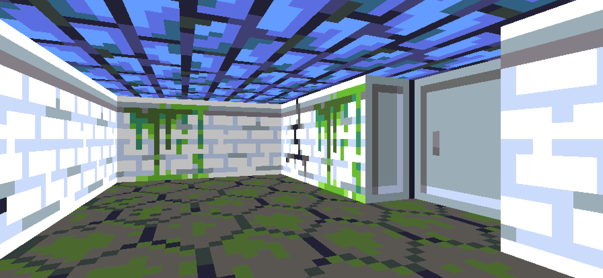
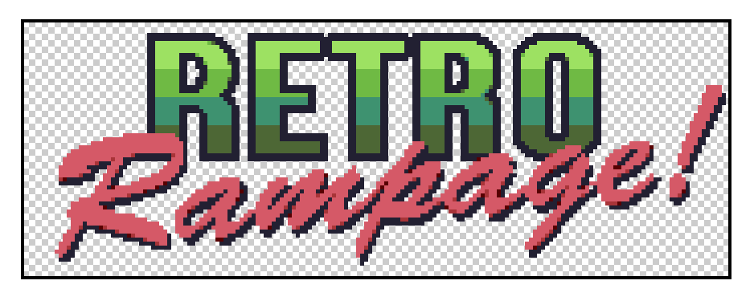
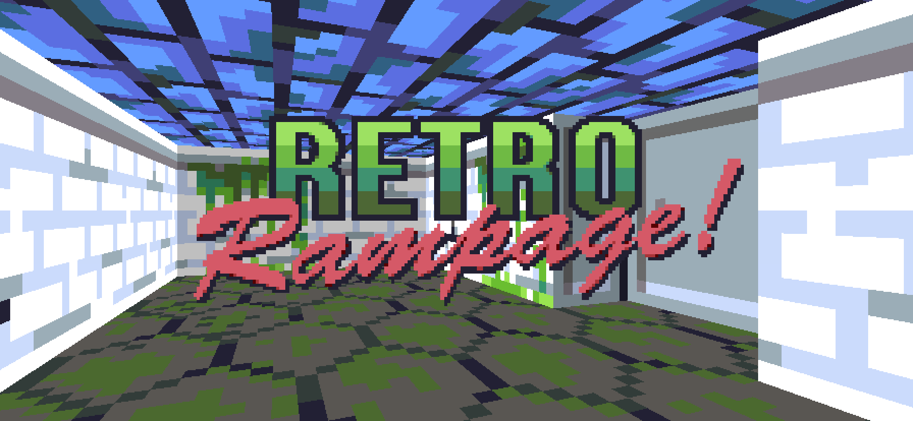
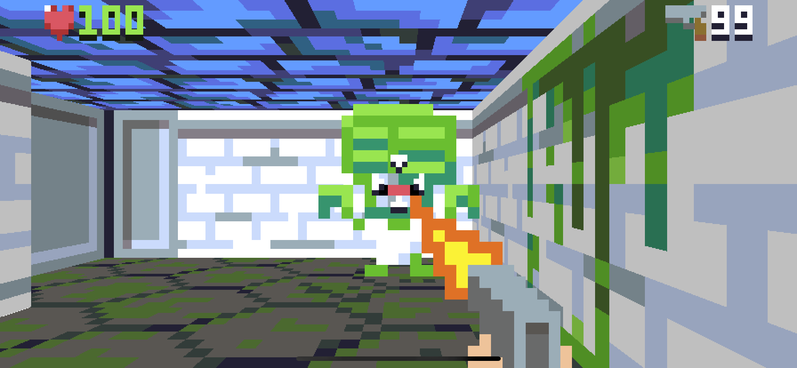
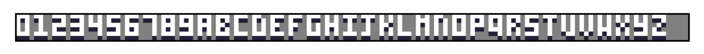
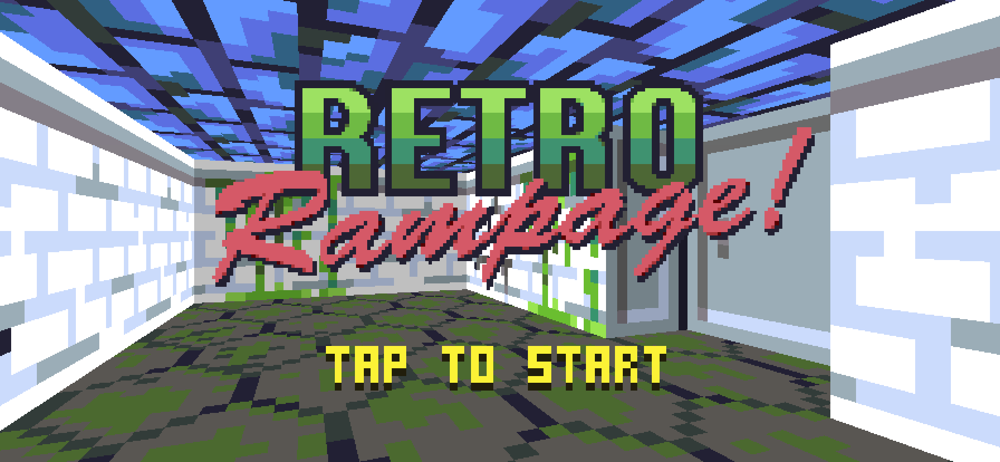

## Part 17: Title Screen

In [Part 16](Part16.md) we added a heads-up display showing the user health and ammo. You can find the complete source code for Part 16 [here](https://github.com/nicklockwood/RetroRampage/archive/Part16.zip).

Now that we have some in-game UI, what about *pre*-game UI? It's time for us to turn our attention to the title screen.

### Working Title

So far, all of the logic in the game has been managed by the game's `World` object. The world is a model of everything that happens inside the environment of a level. We've even extended the world with some objects that arguably fall slightly outside of that scope - such as the `effects` array that models transitions between levels. But incorporating the title screen into the `World` object seems like a step too far.

Let's introduce a new object called `Game`. The `Game` object will manage the higher-level interactions with the game that exist outside of the game world, such as the title screen and menus, leaving `World` to focus on managing what happens in the virtual universe of the game itself.

Add a new file to the Engine module called `Game.swift`, with the following contents:

```swift
public struct Game {
    public let levels: [Tilemap]
    public private(set) var world: World

    public init(levels: [Tilemap]) {
        self.levels = levels
        self.world = World(map: levels[0])
    }
}
```

We've made a lot of use of state machines in the game so far, for managing things like monster AI or animations. But we can think of the *entire* game as a sort of state machine, which is either playing (when the game is running, and the player is interacting with the world) or not (such as when we are looking at the title screen, and the world doesn't really exist yet).

Add the following enum to the top of the `Game.swift` file:

```swift
public enum GameState {
    case title
    case playing
}
```

Then add a `state` property to the game object itself:

```swift
public struct Game {
    public let levels: [Tilemap]
    public private(set) var world: World
    public private(set) var state: GameState = .title
}
```

Since `World` is now wrapped inside `Game`, we will need to proxy the communications between `ViewController` and `World`. This is an opportunity to bring some of the increasingly complex logic inside `ViewController.update()` out of the platform layer and into the game engine itself.

In [Part 12](Part12.md#at-your-command), we added the `WorldAction` enum as a way to pass messages back from `World` to the platform layer. If you recall, we couldn't use the traditional delegation pattern because of the *overlapping access* problem, but that issue doesn't apply to communications between `ViewController` and `Game`, as it doesn't have the same mutation constraints.

Add the following protocol declaration to the top of the `Game.swift` file:

```swift
public protocol GameDelegate: AnyObject {
    func playSound(_ sound: Sound)
    func clearSounds()
}
```

Next, add a new property to the top of the `Game` struct:

```swift
public weak var delegate: GameDelegate?
```

Then add the following code at the bottom of the `Game.swift` file:

```swift
public extension Game {
    mutating func update(timeStep: Double, input: Input) {
        guard let delegate = delegate else {
            return
        }

        // Update state
        switch state {
        case .title:

        case .playing:
        
        }
    }
}
```

To keep things simple, when `Game` is in the `title` state we'll just wait until the player presses fire to begin. Add the following code inside `case .title:`:

```swift
if input.isFiring {
    state = .playing
}
```

Once the game enters the `playing` state, the `World` object will take over. But since `World` is now wrapped inside `Game`, we will need to proxy its communications with `ViewController`. This is an opportunity to bring some of the increasingly complex logic inside `ViewController.update()` out of the platform layer and into the game engine itself.

Add the following lines inside `case .playing:`:

```swift
if let action = world.update(timeStep: timeStep, input: input) {
    switch action {
    case .loadLevel(let index):
        let index = index % levels.count
        world.setLevel(levels[index])
        delegate.clearSounds()
    case .playSounds(let sounds):
        sounds.forEach(delegate.playSound)
    }
}
```

Now we'll need to make some changes in `ViewController.swift` to actually make use of the `Game` object. Start by adding the following code to the bottom of the file:

```swift
extension ViewController: GameDelegate {
    func playSound(_ sound: Sound) {
        DispatchQueue.main.asyncAfter(deadline: .now() + sound.delay) {
            guard let url = sound.name?.url else {
                if let channel = sound.channel {
                    SoundManager.shared.clearChannel(channel)
                }
                return
            }
            try? SoundManager.shared.play(
                url,
                channel: sound.channel,
                volume: sound.volume,
                pan: sound.pan
            )
        }
    }

    func clearSounds() {
        SoundManager.shared.clearAll()
    }
}
```

This conforms `ViewController` to the `GameDelegate` protocol. Next, replace the following line in `ViewController`:

```swift
private let levels = loadLevels()
private lazy var world = World(map: levels[0])
```

with:

```swift
private var game = Game(levels: loadLevels())
```

We'll need to set `self` as the game delegate, but we can't do it here because `self` isn't available yet. Instead, add the following line to the end of the `viewDidLoad()` method:

```swift
game.delegate = self
```

We've moved the sound playback logic into the delegate methods, and the level management into `Game.update()`, so now we can replace the following, complicated block of code in `ViewController.update()`:

```swift
if let action = world.update(timeStep: timeStep / worldSteps, input: input) {
    switch action {
    case .loadLevel(let index):
        SoundManager.shared.clearAll()
        let index = index % levels.count
        world.setLevel(levels[index])
    case .playSounds(let sounds):
        for sound in sounds {
            DispatchQueue.main.asyncAfter(deadline: .now() + sound.delay) {
                guard let url = sound.name?.url else {
                    if let channel = sound.channel {
                        SoundManager.shared.clearChannel(channel)
                    }
                    return
                }
                try? SoundManager.shared.play(
                    url,
                    channel: sound.channel,
                    volume: sound.volume,
                    pan: sound.pan
                )
            }
        }
    }
}
```

with just:

```swift
game.update(timeStep: timeStep / worldSteps, input: input)
```

You'll also need to replace any remaining references to `world` with `game.world`.

Now try running the game. You should see the same starting room as always, but with one small difference: The monster doesn't attack - and won't - until you tap the screen<sup><a id="reference1"></a>[[1]](#footnote1)</sup>.

The title state logic *is* working, it's just behaving more like a pause function than a title screen right now. To actually implement a separate screen, we'll need to update `Renderer`. But first, we'll need to add some new image assets.

### Screen Painting

In the DOS era, when the relatime graphical capabilities of the hardware could not yet match up to the aspirations of game artists, it was common to use a lavish, hand-painted backdrop for the title screen to establish atmosphere and fire the imagination of the player. For the background of the Retro Rampage title screen, I decided to use a screenshot of the game instead<sup><a id="reference2"></a>[[2]](#footnote2)</sup>.

You can draw your own background image, or just use the one from the tutorial project [here](https://github.com/nicklockwood/RetroRampage/tree/Part17/Source/Rampage/Assets.xcassets/titleBackground.imageset), but the way I created it was as follows:

First, comment out the `// Player weapon` section in `Renderer.draw()` and then wander around the level to find a suitable angle to capture<sup><a id="reference3"></a>[[3]](#footnote3)</sup>. I used the iPhone 11 Pro Max simulator to generate the widest, highest-resolution image possible<sup><a id="reference4"></a>[[4]](#footnote4)</sup>, and also increased the bitmap resolution by 3x to match the native device resolution by replacing this line in `ViewController.swift`:

```swift
let width = Int(imageView.bounds.width), height = Int(imageView.bounds.height)
```

with:

```swift
let width = Int(imageView.bounds.width) * 3, height = Int(imageView.bounds.height) * 3
```

To avoid a pill-shaped overlay on the screenshot from the home bar, add the following to `ViewController`:

```swift
override var prefersHomeIndicatorAutoHidden: Bool {
    return true
}
```

Once you have a suitable image for the background, add it to XCAssets (remember to revert any code changes made for screen capture purposes) then add a new case for it to the `Texture` enum in `Texture.swift`:

```swift
public enum Texture: String, CaseIterable {
    ...
    case titleBackground
}
```

We currently have a `draw()` method that accepts an instance of `World`, but since the title screen is not part of the world, we'll need a new method that accepts a `Game` object instead. In `ViewController.swift` replace the following line:

```swift
renderer.draw(game.world)
```

with:

```swift
renderer.draw(game)
```

Then in `Renderer.swift` add this new method right before the current `draw(_ world:)` method:

```swift
mutating func draw(_ game: Game) {
    switch game.state {
    case .title:

    case .playing:
        draw(game.world)
    }
}
```

We only have one title background image to use for all devices, which is why we've used the highest resolution image we can, so that it can be cropped or scaled down as needed.

To draw the title screen, we'll need to draw the background image centered in the display, and scaled to match the height of the output bitmap. We actually already have code to do this - the player weapon is drawn using the same logic - so we'll reuse that.

Add the following code to `case .title:` block in `Renderer.draw(_ game:)`:

```swift
// Background
let background = textures[.titleBackground]
let backgroundScale = bitmap.size.y / background.size.y
let backgroundSize = background.size * backgroundScale
let backgroundPosition = (bitmap.size - backgroundSize) / 2
bitmap.drawImage(background, at: backgroundPosition, size: backgroundSize)
```

Run the game again and you should now see the title screen instead of the game world.



### Brand Recognition

The title screen is a bit boring without some sort of text or logo. We could paste the logo directly into the title background image itself, but that would limit our ability to scale it independently of the background for different devices, or to move it around to make way for other content. Instead, we'll draw the logo at runtime in a separate layer.

Add a suitable logo image to XCAssets and replace the following line in `Texture.swift`:

```swift
case titleBackground
```

with:

```swift
case titleBackground, titleLogo
```

The logo image used in the tutorial can be found [here](https://github.com/nicklockwood/RetroRampage/tree/Part17/Source/Rampage/Assets.xcassets/titleLogo.imageset), but as always you are free to create your own.



The logo we've used in the tutorial has dimensions of 176x64. Unlike the weapon or title background images, the logo is not intended to fit either the height or width of the screen, but it also doesn't match the HUD scale. Instead, we will scale the logo to fill approximately half the screen height (if you have used a different size or aspect ratio for your own logo image, you may need to tweak this scale factor).

Add the following code to the `Renderer.draw(_ game:)` method, just below the `// Background` block:

```swift
// Logo
let logo = textures[.titleLogo]
let logoScale = bitmap.size.y / logo.size.y / 2
let logoSize = logo.size * logoScale
let logoPosition = (bitmap.size - logoSize) / 2
bitmap.drawImage(logo, at: logoPosition, size: logoSize)
```

Run the game again to see the title screen in all its glory!



### Hair Trigger

There's a small bug in the title state logic. When we tap fire to start the game, we also immediately fire *in* the game.



This problem with the player's gun firing prematurely is caused by a combination of factors. As you may recall, in [Part 2](Part2#baby-steps) we added code to decouple the simulation time step from the rendering frame rate, with the result that the engine actually performs multiple updates for each frame displayed.

Take at the look at the latest iteration of this logic inside `ViewController.update()`:

```swift
let input = Input(
    speed: -inputVector.y,
    rotation: Rotation(sine: sin(rotation), cosine: cos(rotation)),
    isFiring: lastFiredTime > lastFrameTime
)
let worldSteps = (timeStep / worldTimeStep).rounded(.up)
for _ in 0 ..< Int(worldSteps) {
    game.update(timeStep: timeStep / worldSteps, input: input)
}
lastFrameTime = displayLink.timestamp
```

Note that although `game.update()` is being called multiple times, the `input` is only sampled once per frame. That makes sense, since touch input on iOS is processed synchronously on the main thread, so it isn't going to change between loop iterations. But it does mean that `isFiring` will remain true for a minimum of four game updates after the user taps.

That explains why the player's weapon fires as soon as the game begins. When the user taps, the input is initially routed to the `title` case, which interprets the tap as a request to start the game. But once the state shifts to `playing`, the same input is then routed to the game world on the next update, which interprets it as a request to fire.

Since that shift can happen mid-frame, there's no opportunity for the `isFiring` flag to be reset. We can fix that by resetting it manually after the first update. In `ViewController.update()`, change the line:

```swift
let input = Input(
```

to:

```swift
var input = Input(
```

Then at the end of the for loop, before the closing brace, insert the following line:

```swift
input.isFiring = false
```

This will reset the `isFiring` state after the first iteration, so that it doesn't continue to be set for every subsequent update within the frame.

This *should* solve the problem, but when I tried it on the simulator I found that the weapon still fired sometimes when the game starts, and this turned out to be due to a mismatch between `displayLink.timestamp` and `CACurrentMediaTime()`. It seems that these are not always in sync, and so the `lastFiredTime` is sometimes ahead of the timestamp by more than the frame duration, causing a single tap to register on two successive frames.

To mitigate this, move the line:

```swift
lastFrameTime = displayLink.timestamp
```

from below the for loop to just before the line `let worldSteps = (timeStep / worldTimeStep).rounded(.up)`. Then add the following line just beneath it:

```swift
lastFiredTime = min(lastFiredTime, displayLink.timestamp)
```

The result should look like this:

```swift
var input = Input(
    speed: -inputVector.y,
    rotation: Rotation(sine: sin(rotation), cosine: cos(rotation)),
    isFiring: lastFiredTime > lastFrameTime
)
lastFrameTime = displayLink.timestamp
lastFiredTime = min(lastFiredTime, lastFrameTime)

let worldSteps = (timeStep / worldTimeStep).rounded(.up)
for _ in 0 ..< Int(worldSteps) {
    game.update(timeStep: timeStep / worldSteps, input: input)
    input.isFiring = false
}
```

### Fade to Black

The transition from title screen to game is rather sudden. It would be nice if we could cover this with a gentle crossfade, as we do with level transitions.

The logic for crossfading is managed using the `effects` array inside `World`, but this isn't accessible externally. In any case, it doesn't really make sense for `World` to manage a transition that starts before the game even begins.

Instead we'll put the code for managing crossfades in the `Game` object. In `Game.swift`, add a new case called `starting` to `GameState`:

```swift
public enum GameState {
    case title
    case starting
    case playing
}
```

Then add the following property to the `Game` struct:

```swift
public private(set) var transition: Effect?
```

Next, in the `update()` method, replace the lines:

```swift
case .title:
    if input.isFiring {
        state = .playing
    }
```

with:

```swift
case .title:
    if input.isFiring {
        transition = Effect(type: .fadeOut, color: .black, duration: 0.5)
        state = .starting
    }
case .starting:
    if transition?.isCompleted == true {
        transition = Effect(type: .fadeIn, color: .black, duration: 0.5)
        state = .playing
    }
```

In the same method, insert the following code between the `guard self = self ...` statement and the `// Update state` block:
 
```swift
// Update transition
if var effect = transition {
    effect.time += timeStep
    transition = effect
}
```

Now we need to actually draw the transition effect. We have the logic to do that already, but it's currently inlined inside the `draw(_ world:)` method, and we now need to use it in `draw(_ game:)` instead, so let's extract it.

In `Renderer.swift`, add the following new method below `draw(_ world:)`:

```swift
mutating func draw(_ effect: Effect) {

}
```

Cut (copy and delete) the following block of code from inside the for loop in the `// Effects` block at the bottom of the `draw(_ world:)` method, and paste it into the `draw(_ effect:)` method you just added:

```swift
switch effect.type {
case .fadeIn:
    bitmap.tint(with: effect.color, opacity: 1 - effect.progress)
case .fadeOut:
    bitmap.tint(with: effect.color, opacity: effect.progress)
case .fizzleOut:
    let threshold = Int(effect.progress * Double(fizzle.count))
    for x in 0 ..< bitmap.width {
        for y in 0 ..< bitmap.height {
            let granularity = 4
            let index = y / granularity * bitmap.width + x / granularity
            let fizzledIndex = fizzle[index % fizzle.count]
            if fizzledIndex <= threshold {
                bitmap[x, y] = effect.color
            }
        }
    }
}
```

Put the following inside the now-empty for loop:

```swift
draw(effect)
```

Still in `Renderer.swift`, at the top of the extension block, replace the following line inside the `draw(_ game:)` method:

```swift
case .title:
```

with:

```swift
case .title, .starting:
```

Then, after the switch statement, add the following:

```swift
// Transition
if let effect = game.transition {
    draw(effect)
}
```

Try running the game again. You should see a smooth fade to black and back again after tapping to start, before the game begins.

### Model Citizen

It's not very satisfactory that so much of the HUD logic resides in the Renderer module. The Renderer should only be concerned with *view* logic (i.e. drawing), and things like switching the indicator color based on a damage threshold should really be done in the *model*.

Let's move that code into the Engine module instead by introducing a new type. Add a new file to the Engine module called `HUD.swift` with the following contents:

```swift
public struct HUD {
    public let healthString: String
    public let healthTint: Color
    public let ammoString: String
    public let playerWeapon: Texture
    public let weaponIcon: Texture

    public init(player: Player) {
        let health = Int(max(0, player.health))
        switch health {
        case ...10:
            self.healthTint = .red
        case 10 ... 30:
            self.healthTint = .yellow
        default:
            self.healthTint = .green
        }
        self.healthString = String(health)
        self.ammoString = String(Int(max(0, min(99, player.ammo))))
        self.playerWeapon = player.animation.texture
        self.weaponIcon = player.weapon.attributes.hudIcon
    }
}
```

The `HUD` type is a simple struct that encapsulates all of the information that the Renderer needs in order to draw the HUD. You can think of it as a [view model](https://en.wikipedia.org/wiki/Model–view–viewmodel). In `Game.swift`, add the following computed property to the top of the extension block, just before the `update()` method:

```swift
var hud: HUD {
    return HUD(player: world.player)
}
```

In `Renderer.swift` add the following empty method just before the `draw(_ effect:)` definition:

```swift
mutating func draw(_ hud: HUD) {
    
}
```

Now cut (copy and delete) everything in the `draw(_ world:)` method from the start of the `// Player weapon` block up until `// Effects`, and paste it inside the `draw(_ hud:)` method you just added.

And what of the `// Effects` block? We can't move it to `draw(_ hud:)` because it's not part of the HUD, but we also can't leave it inside `draw(_ world:)` since the effects need to be drawn *in front* of the HUD. So just delete the entire `// Effects` block for now.

Inside `draw(_ hud:)` we now have several broken references to `world`. We'll fix those as follows:

In the `// Player weapon` block, replace the line:

```swift
let weaponTexture = textures[world.player.animation.texture]
```

with:

```swift
let weaponTexture = textures[hud.playerWeapon]
```

Then in the `// Health` block, replace the following lines:

```swift
let health = Int(max(0, world.player.health))
let healthTint: Color
switch health {
case ...10:
    healthTint = .red
case 10 ... 30:
    healthTint = .yellow
default:
    healthTint = .green
}
for char in String(health) {
```

with:

```swift
let healthTint = hud.healthTint
for char in hud.healthString {
```

Next, in the `// Ammunition` block, replace:

```swift
let ammo = Int(max(0, min(99, world.player.ammo)))
for char in String(ammo).reversed() {
```

with:

```swift
for char in hud.ammoString.reversed() {
```

Then in the `// Weapon icon` block, replace:

```swift
let weaponIcon = textures[world.player.weapon.attributes.hudIcon]
```

with:

```swift
let weaponIcon = textures[hud.weaponIcon]
```

Finally, at the top of the file, in the `draw(_ game:)` method, add the following lines just after `draw(game.world)`:

```swift
draw(game.hud)

// Effects
for effect in game.world.effects {
    draw(effect)
}
```

That's a bit neater, but what does this have to do with the title screen? Well, it puts us in a better position to implement the next step:

### Text Adventure

We've set up the title screen so that pressing fire starts the game. Players will probably figure this out, since it's natural to tap when you aren't sure what else to do, but it would be even better if we actually told them.

Let's add the text "Tap to start" to the title screen. We could cheat and just do this by creating a new image containing the entire phrase, but since we already added a rudimentary text engine in [Part 16](Part16.md), let's extend that to handle letters as well as numbers.

First, we'll need a more complete character set. Replace the existing font asset in XCAssets with [this new one](https://github.com/nicklockwood/RetroRampage/tree/Part17/Source/Rampage/Assets.xcassets/font.imageset).



You can create your own font image instead if you prefer, but if so ensure that it has at least the full uppercase alphabet and a space character in addition to the digits 0 - 9.

Because the characters in the bitmap font no longer represent a contiguous range of ASCII code points, the trick we used in [Part 16](Part16.md#font-of-life) for mapping characters to sprite sheet ranges will no longer work. Instead, let's add a more explicit mapping in the form of a JSON file that defines the characters in the font.

Add a new file to the main app called `Font.json` with the following contents:

```swift
{
    "texture": "font",
    "characters": [
        "0", "1", "2", "3", "4", "5", "6", "7", "8", "9",
        "A", "B", "C", "D", "E", "F", "G", "H", "I", "J",
        "K", "L", "M", "N", "O", "P", "Q", "R", "S", "T",
        "U", "V", "W", "X", "Y", "Z", " "
    ]
}
```

We'll need an object to represent this data in the game, so add a new file to the Engine module called `Font.swift` with the following contents:

```swift
public struct Font: Decodable {
    public let texture: Texture
    public let characters: [String]
}
```

The `Font` struct contains the name of the font texture, along with an ordered list of characters<sup><a id="reference5"></a>[[5]](#footnote5)</sup> that appear in the font.

We've included the font `Texture` name in the same file because it makes sense to keep the image and character list together, but that means we'll need to make `Texture` decodable, so in `Texture.swift` replace the following line:

```swift
public enum Texture: String, CaseIterable {
```

with:

```swift
public enum Texture: String, CaseIterable, Decodable {
```

In `HUD.swift`, add a `font` property to the `HUD` struct and its initializer:

```swift
public struct HUD {
    ...
    public let font: Font
    
    public init(player: Player, font: Font) {
        ...
        self.font = font
    }
}

```

Then do the same in `Game.swift`:

```swift
public struct Game {
    ...
    public let font: Font

    public init(levels: [Tilemap], font: Font) {
        ...
        self.font = font
    }
}
```

And while we're here, add the following additional property just below `public let font: Font`:

```swift
public var titleText = "TAP TO START"
```

Still in `Games.swift`, in the computed `hud` property, replace the line:

```swift
return HUD(player: world.player)
```

with:

```swift
return HUD(player: world.player, font: font)
```

Then, in `ViewController.swift`, add the following just below the `loadLevels()` function declaration:

```swift
public func loadFont() -> Font {
    let jsonURL = Bundle.main.url(forResource: "Font", withExtension: "json")!
    let jsonData = try! Data(contentsOf: jsonURL)
    return try! JSONDecoder().decode(Font.self, from: jsonData)
}
```

And replace the line:

```swift
private var game = Game(levels: loadLevels())
```

with:

```swift
private var game = Game(levels: loadLevels(), font: loadFont())
```

In `Renderer.swift`, in the `draw(_ hud:)` method, we now have access to the font, and so we can replace the hard-coded (and now-broken) character bitmap range calculations. In the `// Health` block, replace the lines:

```swift
let font = textures[.font]
let charSize = Vector(x: font.size.x / 10, y: font.size.y)
```

with:

```swift
let font = textures[hud.font.texture]
let charSize = Vector(x: Double(font.width / hud.font.characters.count), y: font.size.y)
```

Then, inside the for loop, replace the line:

```swift
let index = Int(char.asciiValue!) - 48
```

with:

```swift
let index = hud.font.characters.firstIndex(of: String(char)) ?? 0
```

Do the same for the equivalent line in the `// Ammunition` block, and if you run the game (and you've done everything right), the HUD text should look exactly the same as before.

So now we just need to actually draw the text on the title screen, and here we run into a slight problem. We avoided pre-calculating the text width in the HUD by just drawing from the left or right edges respectively. But for the title screen we want the text to be centered, so we'll need to know its width.

Since we're using a [monospaced](https://en.wikipedia.org/wiki/Monospaced_font) font, the width of the text is equal to the size of any character multiplied by the number of characters in the string. In `draw(_ game:)`, add the following code just below the `// Logo` block:

```swift
// Text
let textScale = bitmap.size.y / 64
let font = textures[game.font.texture]
let charSize = Vector(x: Double(font.width / game.font.characters.count), y: font.size.y)
let textWidth = charSize.x * Double(game.titleText.count) * textScale
```

This calculates the total width of the title screen text, based on the character size and count.

From that we can derive the starting horizontal offset as the width of the screen minus the textWidth, divided by two. For the vertical offset, we'll use three quarters of the screen height. Add the following line:

```swift
var offset = Vector(x: (bitmap.size.x - textWidth) / 2, y: bitmap.size.y * 0.75)
```

Next we need to actually draw the text. The logic for this is the same as the code we already used to draw the player health indicator in the HUD. Add the following lines:

```swift
for char in game.titleText {
    let index = game.font.characters.firstIndex(of: String(char)) ?? 0
    let step = Int(charSize.x)
    let xRange = index * step ..< (index + 1) * step
    bitmap.drawImage(
        font,
        xRange: xRange,
        at: offset,
        size: charSize * textScale,
        tint: .yellow
    )
    offset.x += charSize.x * textScale
}
```

We'll also need to move the logo up a bit to allow room. Currently the logo is centered in the screen by this line in the `// Logo` block:

```swift
let logoPosition = (bitmap.size - logoSize) / 2
```

Replace this with:

```swift
let logoPosition = Vector(x: (bitmap.size.x - logoSize.x) / 2, y: bitmap.size.y * 0.15)
```

Run the game again and you can see the title screen text in all its glory.



And that brings us to the end of Part 17. It's amazing how much more finished a game feels with the addition of even the most basic title screen. To recap, in this this part we:

* Added a new `Game` object to manage higher-level interaction
* Added a title screen with a background and logo
* Moved logic out of Renderer and ViewController into Engine
* Upgraded the font system to support text as well as numbers

Stay tuned for more retro mayhem in Part 18 (TBD).

### Reader Exercises

Finished the tutorial and hungry for more? Here are some ideas you can try out for yourself:

1. How would you go about localizing the "TAP TO START" text on the title screen? You should be able to use the standard Apple mechanism for localized strings, but not from inside the Engine module - you'll need to find a way to inject the text from the platform layer.

2. Building on the solution for the first exercise, how would you go about supporting languages that don't use the Roman alphabet? Hint: Apple's localized resources system works for images and JSON files, not just strings.

3. We've used a monospaced font for the title screen text, but could you make it work with a proportional (aka *variable-width*) font as well? Besides the changes to the font image, you'll need some extra metadata in the `Font` object, and some changes to the `Renderer` itself.

<hr>

<a id="footnote1"></a>[[1]](#reference1) If nothing happens when you tap, you probably forgot to set `game.delegate = self`.

<a id="footnote2"></a>[[2]](#reference2) Mostly because I'm a terrible artist, and this was an easy option.

<a id="footnote3"></a>[[3]](#reference3) You might also want to disable the monsters if they interfere with your sightseeing tour. A simple way to do this is to edit the `Levels.json` and remove all the monsters. Alternatively, you can lure them into the first room and kill them (which is what I did).

<a id="footnote4"></a>[[4]](#reference4) If you're reading this in the future on your iPhone Ultra Max Pro Extreme with 360 wraparound 16K VR display, just take my word for it that in 2020 the Pro Max screen seemed like a lot of pixels. 

<a id="footnote5"></a>[[5]](#reference5) If you're wondering why the characters are stored as an array of `String`, instead of the more-obvious `Character` type, it's because `Character` does not conform to the `Decodable` protocol. We could write a custom decoding implementation that mapped from strings to characters, but defining font characters using strings potentially gives us more flexibility anyway - for example we could potentially implement multi-character [ligatures](https://en.wikipedia.org/wiki/Orthographic_ligature).
