## Part 18: Computer Aided Design

In [Part 17](Part17.md) we added polish to the game in the form of a title screen, as well as extending the text-rending system. You can find the complete source code for Part 17 [here](https://github.com/nicklockwood/RetroRampage/archive/Part17.zip).

Now it's time to address a longstanding weak point in the game... my lack of level-design skills.

### Help Wanted

As a programmer, I find implementing new engine and gameplay features much less intimidating than having to actually create levels that utilize those features<sup><a id="reference1"></a>[[1]](#footnote1)</sup>. Right now Retro Rampage is set up to consume levels in the form of hand-edited JSON files, but what if the game could actually create the levels itself? Or at least take some of the burden away from the level designer?

Although the levels in Wolfenstein 3D were all crafted individually by the Id software team, the simplistic nature of the level structure lends itself very well to [procedural generation](https://en.wikipedia.org/wiki/Procedural_generation).

Generating an entire level from scratch is still a fairly complex business, but it doesn't have to be an all-or-nothing endeavor. We can use the computer to *assist* us in designing a level without necessarily having it generate the entire thing from scratch. Let's break down the steps of creating a level:

1. Create a bunch of rooms
2. Link the rooms with doorways and corridors
3. Add doors, push-walls and switches
4. Select a starting position for the player
5. Add monsters and pickups

These tasks are arranged in roughly descending order of difficulty, so we'll start at the end and work backwards.

### Generation Gap

To manage level generation we're going to introduce a new type called `MapGenerator`. The generator will consume a `MapData` struct and then produce a `Tilemap`. Add a new file called `MapGenerator.swift` to the Engine module, with the following contents:

```swift
public struct MapGenerator {
    public private(set) var map: Tilemap

    public init(mapData: MapData, index: Int) {
        self.map = Tilemap(mapData, index: index)
    }
}
```

Then, in `ViewController.swift`, in the `loadLevels()` method, replace the line:

```swift
return levels.enumerated().map { Tilemap($0.element, index: $0.offset) }
```

with:

```swift
return levels.enumerated().map { index, mapData in
    MapGenerator(mapData: mapData, index: index).map
}
```

For now, all `MapGenerator` does is proxy the existing `Tilemap` initializer, but that's about to change.

### Hellspawn

We said we'd start by adding monsters and pickup items to the map, but we first need to answer two questions: How many should we add, and where should we put them?

We introduced the `MapData` struct in [Part 12](Part12.md#by-the-numbers) in order to decouple the format of a level stored on disk from a level stored in memory. Initially that was just because we didn't want to have to specify the level index in the map data, but this separation also gives us the flexibility to add new fields to `MapData` that can be used to configure the map generator.

Find the `MapData` struct in `Tilemap.swift` add the following additional properties:

```swift
public let monsters: Int?
public let medkits: Int?
public let shotguns: Int?
```

Notice that these properties are all `Optional`s - we want to give the level designer the flexibility of using or not using procedural features, so if these counts are omitted, no procedural elements will be added.

Back in `MapGenerator.swift`, add the following to the end of the `init()` method:

```swift
// Add monsters
for _ in 0 ..< (mapData.monsters ?? 0) {
    
}
```

This loop will add the number of monsters specified in the map data (defaulting to zero). That answers the "how many?" question - what about "where to put them"?

A naive way to place the monsters would be to randomly select coordinates inside the maze in a loop - if the selected square is already occupied then try again with a different random coordinate until you succeed.

The problem with this approach is that the number of failed attempts is not predictable, and the chances of finding an empty tile decreases as the level fills up. Even with empty tiles available, it's possible that such an algorithm could take hours or even *days* to actually stumble on them. 

Instead of hunting for tiles at random, we can remove the element of chance by finding the available tiles *systematically*. Add the following code just before the `// Add monsters` block:

```swift
// Find empty tiles
var emptyTiles = Set<Vector>()
for y in 0 ..< map.height {
    for x in 0 ..< map.width {
        if map[x, y].isWall == false, map.things[y * map.width + x] == .nothing {
            emptyTiles.insert(Vector(x: Double(x) + 0.5, y: Double(y) + 0.5))
        }
    }
}
```

So now we have a set of every tile coordinate in the level that *isn't* occupied, we can randomly select one of those tiles in constant time. In the `// Add monsters` block, add the following code inside the for loop:

```swift
if let position = emptyTiles.randomElement() {
    let x = Int(position.x), y = Int(position.y)
    map.things[y * map.width + x] = .monster
    emptyTiles.remove(position)
}
```

Ah. Unfortunately this won't compile because the `things` property of `Tilemap` is read-only. We didn't want to make `things` public because Swift has no concept of fixed-length mutable arrays, so it would be easy to accidentally shorten the array and cause a crash.

We solved this for tile access by adding a `subscript` method, so let's do the same for `things`. In `Tilemap.swift` replace the line:

```swift
public let things: [Thing]
```

with:

```swift
private var things: [Thing]
```

Then just below the existing `subscript` declaration in the extension block, add the following:

```swift
subscript(thing x: Int, y: Int) -> Thing {
    get { return things[y * width + x] }
    set { things[y * width + x] = newValue }
}
```

By making the formerly-public `things` property private, we've introduced a number of compilation errors, so let's fix those now. In `World.swift` replace all instances of:

```swift
map.things[y * map.width + x]
```

with:

```swift
map[thing: x, y]
```

Then do the same in `MapGenerator.swift`. There should be five instances altogether, and once you've replaced them all the game should build successfully.

Run the game and you should see... no difference. To properly observe the effects of procedural monster placement, we need to remove the hand-positioned monsters from the JSON first.

### Clean Slate

Open the `Level.json` file and remove all the predefined monsters and pickup items (values 2, 6 and 7 respectively) from the `things` array, along with the. While we're at it, we'll also set the procedural element counts and (temporarily) remove the second level. The result should look like this:

```swift
[
    {
        "width": 8,
        "monsters": 5,
        "medkits": 2,
        "shotguns": 1,
        "tiles": [
            1, 3, 1, 1, 3, 1, 1, 1,
            1, 0, 0, 2, 0, 0, 0, 1,
            1, 4, 0, 3, 4, 0, 0, 3,
            2, 0, 0, 0, 0, 0, 4, 3,
            1, 4, 0, 1, 3, 1, 0, 1,
            1, 0, 1, 2, 0, 0, 0, 1,
            6, 5, 6, 1, 0, 4, 4, 1,
            1, 7, 3, 1, 1, 3, 1, 1
        ],
        "things": [
            0, 0, 0, 0, 0, 0, 0, 0,
            0, 0, 0, 0, 0, 0, 0, 0,
            0, 0, 0, 0, 0, 0, 0, 0,
            0, 0, 0, 3, 0, 0, 0, 0,
            0, 0, 0, 0, 4, 0, 3, 0,
            0, 3, 0, 0, 0, 0, 0, 0,
            0, 0, 0, 0, 1, 0, 2, 0,
            0, 5, 0, 0, 0, 0, 0, 0
        ]
    }
]
```

Run the game again and you should find the level is now populated with five monsters in random places. A slight problem with this is that sometimes you'll find that the level begins with a monster right up in your face (or worse, right behind you).

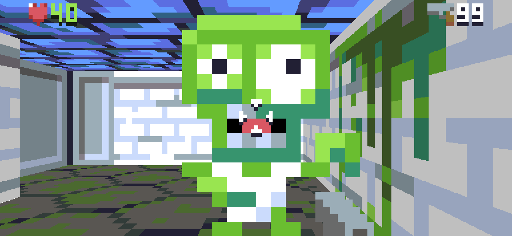

To solve this, we'll restrict the starting position of the monsters to be outside a given radius of the player. Add the following line at the start of the `// Find empty tiles` block:

```swift
var playerPosition: Vector!
```

Then replace the following lines:

```swift
if map[x, y].isWall == false, map[thing: x, y] == .nothing {
    emptyTiles.insert(Vector(x: Double(x) + 0.5, y: Double(y) + 0.5))
}
```

with:

```swift
let position = Vector(x: Double(x) + 0.5, y: Double(y) + 0.5)
if map[x, y].isWall == false {
    switch map[thing: x, y] {
    case .nothing:
        emptyTiles.insert(position)
    case .player:
        playerPosition = position
    default:
        break
    }
}
```

Next, we need to use the player position to filter the potential set of monster locations. In the `// Add monsters` block, replace the line:

```swift
if let index = emptyTiles.indices.randomElement() {
```

with:

```swift
if let position = emptyTiles.filter({
    (playerPosition - $0).length > 2.5
}).randomElement() {
```

Run the game a few times and satisfy yourself that a monster will never be spawned in the starting room with the player (temporarily upping the monster count to 50 in `Levels.json` is a quick way to verify this).

### Lucky Dip

We can use similar logic for placing pickups. We don't necessarily mind if these appear right next to the player at the start, so we can skip the radius check this time around. Add the following code below the `// Add monsters` block:

```swift
// Add medkits
for _ in 0 ..< (mapData.medkits ?? 0) {
    if let position = emptyTiles.filter({
        (playerPosition - $0).length > 2.5
    }).randomElement() {
        let x = Int(position.x), y = Int(position.y)
        map[thing: x, y] = .medkit
        emptyTiles.remove(position)
    }
}
```

There's a lot of duplication between this code and the monsters loop. Duplication isn't *always* bad because it means the code is more flexible, but in this case it's clear that a lot of this logic is pretty generic and can be extracted.

Add the following code to the end of the file:

```swift
private extension MapGenerator {
    mutating func add(_ thing: Thing, at position: Vector?) {
        if let position = position {
            map[thing: Int(position.x), Int(position.y)] = thing
            emptyTiles.remove(position)
        }
    }
}
```

This won't actually compile as-is because `emptyTiles` is a local variable inside the `buildMap()` function. We could pass it as parameter to the function, but that's ugly, so let's make it an instance variable instead. Add the following properties to `MapGenerator`:

```swift
private var playerPosition: Vector!
private var emptyTiles: Set<Vector> = []
```

Then in `init()` remove the following lines:

```swift
var playerPosition: Vector!
var emptyTiles = Set<Vector>()
```

The code should compile now, so we can go ahead and replace the following lines in the `// Add monsters` block:

```swift
if let position = emptyTiles.filter({
    (playerPosition - $0).length > 2.5
}).randomElement() {
    let x = Int(position.x), y = Int(position.y)
    map[thing: x, y] = .monster
    emptyTiles.remove(position)
}
```

with:

```swift
add(.monster, at: emptyTiles.filter {
    (playerPosition - $0).length > 2.5
}.randomElement())
```

Then in the `// Add medkits` block, replace:

```swift
if let position = emptyTiles.randomElement() {
    let x = Int(position.x), y = Int(position.y)
    map[thing: x, y] = .medkit
    emptyTiles.remove(position)
}
```

with:

```swift
add(.medkit, at: emptyTiles.randomElement())
```

Finally, add the following code after the `// Add medkits` block:

```swift
// Add shotguns
for _ in 0 ..< (mapData.shotguns ?? 0) {
    add(.shotgun, at: emptyTiles.randomElement())
}
```

### Door-to-Door

We've eliminated the need to manually place monsters and items, but what about the other `Thing` types, like doors, push-walls and switches? We certainly can't place these completely at random, but it's clear that there are implicit rules for where they should go. If we can make those rules *explicit*, we can automate them.

We'll start with doors. In `Levels.json`, remove all the doors (index 3) from the `things` array:

```swift
"things": [
    0, 0, 0, 0, 0, 0, 0, 0,
    0, 0, 0, 0, 0, 0, 0, 0,
    0, 0, 0, 0, 0, 0, 0, 0,
    0, 0, 0, 0, 0, 0, 0, 0,
    0, 0, 0, 0, 4, 0, 0, 0,
    0, 0, 0, 0, 0, 0, 0, 0,
    0, 0, 0, 0, 1, 0, 0, 0,
    0, 5, 0, 0, 0, 0, 0, 0
]
```

Run the game and verify that the doors have been removed.

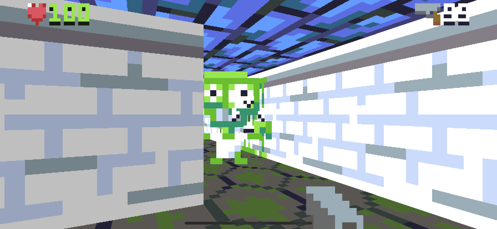

Now we'll put them back again, programmatically. A door is always placed in an empty tile that lies between two tiles and two rooms. If we find all such tiles, we can put doors there.

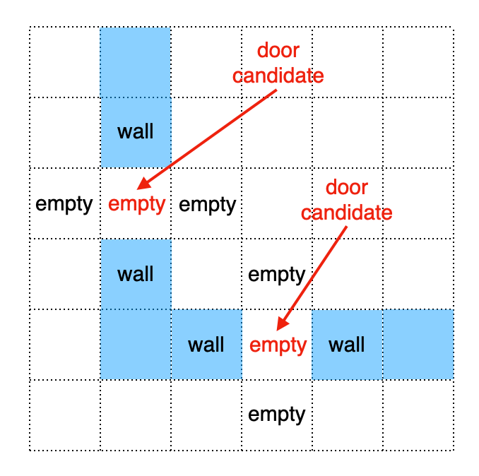

Add the following code just after the `// Find empty tiles` block:

```swift
// Add doors
for position in emptyTiles {
    let x = Int(position.x), y = Int(position.y)
    let left = map[x - 1, y], right = map[x + 1, y],
         up = map[x, y - 1], down = map[x, y + 1]
    if (left.isWall && right.isWall && !up.isWall && !down.isWall)
        || (!left.isWall && !right.isWall && up.isWall && down.isWall) {
        add(.door, at: position)
    }
}
```

Run the game again and you'll find the doors are back in place.

### Pushing the Limit

What about push-walls? Unlike doors these must be placed *on* a wall tile instead of in a gap between walls, but otherwise the placement rules are similar. An extra requirement is that the push-wall needs at least two empty tiles on either side to allow room for it to slide.

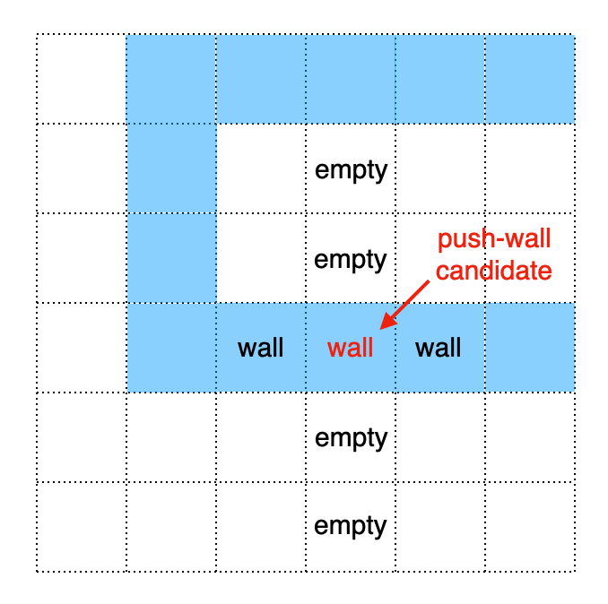

In `Tilemap.swift`, add the following property to the `MapData` struct:

```swift
public let pushwalls: Int?
```

Then in `Levels.json` add the following line:

```swift
"pushwalls": 1,
```

And remove the existing push-wall (index 4) from the `things` array:

```swift
"things": [
    0, 0, 0, 0, 0, 0, 0, 0,
    0, 0, 0, 0, 0, 0, 0, 0,
    0, 0, 0, 0, 0, 0, 0, 0,
    0, 0, 0, 0, 0, 0, 0, 0,
    0, 0, 0, 0, 0, 0, 0, 0,
    0, 0, 0, 0, 0, 0, 0, 0,
    0, 0, 0, 0, 1, 0, 0, 0,
    0, 5, 0, 0, 0, 0, 0, 0
]
```

Back in `MapGenerator.swift`, add the following property to `MapGenerator`:

```swift
private var wallTiles: Set<Vector> = []
```

Then in the `// Find empty tiles` block, replace the line:

```swift
if map[x, y].isWall == false {
```

with:

```swift
if map[x, y].isWall {
    wallTiles.insert(position)
} else {
```

So now we have a handy set of wall tiles that we can scan for suitable push-wall candidates. Add the following code after the `// Add doors` block:

```swift
// Add push-walls
for _ in 0 ..< (mapData.pushwalls ?? 0) {
    add(.pushwall, at: wallTiles.filter { position in
        let x = Int(position.x), y = Int(position.y)
        guard x > 0, x < map.width - 1, y > 0, y < map.height - 1 else {
            return false // Outer wall
        }
        let left = map[x - 1, y], right = map[x + 1, y],
            up = map[x, y - 1], down = map[x, y + 1]
        if left.isWall, right.isWall, !up.isWall, !down.isWall,
            !map[x, y - 2].isWall, !map[x, y + 2].isWall {
            return true
        }
        if !left.isWall, !right.isWall, up.isWall, down.isWall,
            !map[x - 2, y].isWall, !map[x + 2, y].isWall {
            return true
        }
        return false
    }.randomElement())
}
```

Run the game again and try to find the push-wall. Don't be surprised if it's in the same place as before - the current level layout defined in the JSON means there are only two eligible places to put a push-wall, but if you run the game a few times you should see that its position changes.

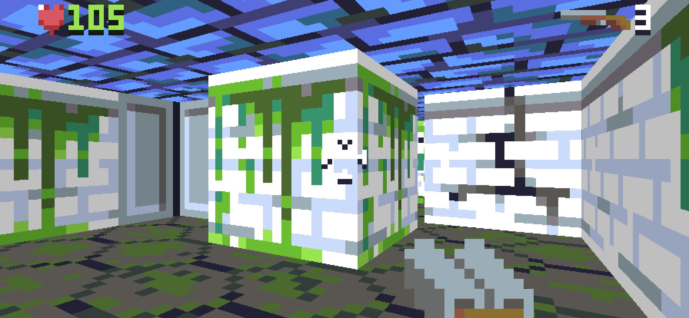

### Want for No Thing

We're tantalizingly close to eliminating the need to manually specify *things* altogether. The only non-zero `things` left in our `Levels.json` are the switch and player.

Eliminating the manually-placed switch is fairly easy - since the elevator switch will always be positioned on an `elevatorBackWall` tile, we can programmatically enforce that relationship. In `MapGenerator.swift`, in the `// Find empty tiles` block, add the following code just before the line `wallTiles.insert(position)`:

```swift
if map[x, y] == .elevatorBackWall {
    map[thing: x, y] = .switch
}
```

That just leaves the player. Here's where things start to get a little more complicated.

### The Hero's Journey

We could just drop the player down into any empty tile in the level, but we don't want to accidentally place them in a sealed alcove, or in a spot with no route to the exit elevator. So how do we ensure that a potential player position is able to reach the exit? Sounds like a job for *path-finding*.

Fortunately, we added path-finding logic in [Part 15](Part15.md) (and we even had the foresight to make it re-usable). Pathfinding is implemented on top of the `Graph` protocol, so let's go ahead and add `Graph` conformance to `MapGenerator`. Add the following code at the bottom of `MapGenerator.swift`:

```swift
extension MapGenerator: Graph {
    public typealias Node = Vector

    public func nodesConnectedTo(_ node: Node) -> [Node] {
        return [
            Node(x: node.x - 1, y: node.y),
            Node(x: node.x + 1, y: node.y),
            Node(x: node.x, y: node.y - 1),
            Node(x: node.x, y: node.y + 1),
        ].filter { node in
            let x = Int(node.x), y = Int(node.y)
            return map[x, y].isWall == false
        }
    }

    public func estimatedDistance(from a: Node, to b: Node) -> Double {
        return abs(b.x - a.x) + abs(b.y - a.y)
    }

    public func stepDistance(from a: Node, to b: Node) -> Double {
        return 1
    }
}
```

The implementation here is mostly copied from the one we added to `World.swift` in [Part 15](Part15.md), so I won't explain it again here. We've made a couple of simplifications though - there's no check for push-walls in the `nodesConnectedTo()` method, and we haven't bothered with increasing the `stepDistance()` calculation for tiles containing doors. 

To calculate a route to the elevator, we'll first need to know where the elevator is. Add the following property to `MapGenerator`:

```swift
private var elevatorPosition: Vector!
```

Then, in the `// Find empty tiles` block, add the following code just inside the `else` clause, before the line `switch map[thing: x, y] {`:

```swift
if map[x, y] == .elevatorFloor {
    elevatorPosition = position
}
```

We now have all the information we need to position the player. We'll use the `findPath()` method provided by the `Graph` protocol to filter out potential locations that don't have a route to the elevator. Add the following code just before the `// Add monsters` block:

```swift
// Add player
if playerPosition == nil {
    playerPosition = emptyTiles.filter {
        findPath(from: $0, to: elevatorPosition, maxDistance: 1000).isEmpty == false
    }.randomElement()
    add(.player, at: playerPosition)
}
```

Now we just need to remove the switch and player positions from `Levels.json`. Since these are the last manually-specified things in the file, we may as well remove the entire `things` array while we're at it.

In `TileMap.swift`, make the `things` property of `MapData` optional, as follows:

```swift
fileprivate let things: [Thing]?
```

Then in `Tilemap.init()`, replace the line:

```swift
self.things = map.things
```

with:

```swift
self.things = map.things ?? Array(repeating: .nothing, count: map.tiles.count)
```

We can now safely remove the `things` array from the JSON file. In `Levels.json` remove the following lines:

```swift
"things": [
    0, 0, 0, 0, 0, 0, 0, 0,
    0, 0, 0, 0, 0, 0, 0, 0,
    0, 0, 0, 0, 0, 0, 0, 0,
    0, 0, 0, 0, 0, 0, 0, 0,
    0, 0, 0, 0, 0, 0, 0, 0,
    0, 0, 0, 0, 0, 0, 0, 0,
    0, 0, 0, 0, 1, 0, 0, 0,
    0, 5, 0, 0, 0, 0, 0, 0
]
```

Run the game again and you should find that your start position is randomized.

### Game of Chance

Some games use procedural generation to produce a new, unique set of levels each time they are played, but that's not always what you want. Procedurally generated levels are often colloquially referred to as *randomly* generated, but this is a misleading term because - while randomness certainly plays a role in procedural generation - the goal is often to ensure a *predictable* outcome.

We've implemented a hybrid system, where levels are created using a mixture of hand-crafted and procedural features. This will make it easier to crank out a large number of levels, but we can't guarantee that every possible variation will be fun to play. If the algorithm places the player right next to the exit, or puts the shotgun in the starting room, the level might be too easy. If it places too many monsters between the player and the first medkit, it might be too hard.

We can add more rules to try to handle these cases, but ideally we'd still want to manually *curate* the final levels, and we can't do that if they are different every time we play. So what we want is *deterministic* randomness - the computer will decide the level layouts, but it will make the *same* decisions every time it runs.

### Seedy Business

The randomness in our level generator is supplied by the `randomElement()` method, but what is this actually doing under the hood? Internally, `randomElement()` makes use of the `SystemRandomNumberGenerator`, a global [Random Number Generator](https://en.wikipedia.org/wiki/Random_number_generation) (RNG) provided by Swift.

Software random number generators are typically *pseudo*-random, meaning that the sequence they produce is not *truly* random, but is generated algorithmically by applying a function to the current state to produce a new state. For a given algorithm and starting state (the [*seed*](https://en.wikipedia.org/wiki/Random_seed)), an RNG will always produce the same sequence.

Swift's `SystemRandomNumberGenerator` is pre-seeded with an indeterminate value that we cannot control, and is guaranteed to be [cryptographically secure](https://en.wikipedia.org/wiki/Cryptographically_secure_pseudorandom_number_generator), meaning it's effectively impossible to guess what the next value will be simply by observing the previous output. On top of that, the exact behavior of the system RNG is not defined, and may vary between platforms and Swift releases.

This is exactly the opposite of what we want. We don't care if the RNG used in our map generator is cryptographically secure, but if we intend to generate reproducible results we need every aspect of both the algorithm and the seed to be well-defined. There's only one option - we're going to have write our own RNG.

### Rolling Our Own

There are many algorithms for pseudo-random number generators, most of which make use of the properties of [prime numbers](https://en.wikipedia.org/wiki/Prime_number). The RNG we are going to use is called a [Linear Congruential Generator](https://en.wikipedia.org/wiki/Linear_congruential_generator) (LCG), which is implemented as follows:

```swift
newValue = (oldValue * multiplier + increment) % modulus
```

This produces a sequence of integer values in the range `0` to `modulus - 1`. With appropriately chosen `multiplier` and `increment` constants<sup><a id="reference2"></a>[[2]](#footnote2)</sup>, all values in that range will be produced (though not in order), so the *period* (the number of values produced before the sequence repeats) is equal to the modulus.

Now that we've decided on a formula to generate random numbers, how do we actually make use of it? `SystemRandomNumberGenerator` conforms to the `RandomNumberGenerator` protocol, and methods like `randomElement()` allow us to replace the system RNG with our own `RandomNumberGenerator` implementation.

The protocol defines a single method that we need to implement:

```swift
mutating func next() -> UInt64
```

Note that the return type of this function is `UInt64`. A compliant implementation must provide an *even distribution*, meaning that this method should have an equal probability of returning any value in the entire 64-bit range. That tells us that the `modulus` value for our LCG function must be 2<sup>64</sup>, because a smaller value wouldn't populate the higher bits of the output.

The other constants must be carefully chosen to produce an even distribution. Tables of suitable values can be found online (including on the aforementioned [Wikipedia page](https://en.wikipedia.org/wiki/Linear_congruential_generator). Based on the 2<sup>64</sup> modulus and even distribution requirements, there's only really one set of values from this table that we can use, which are the ones from Donald Knuth's [MMIX](https://en.wikipedia.org/wiki/MMIX) specification:

* multiplier - `6364136223846793005`
* increment - `1442695040888963407`

Add a new file the Engine module called `RNG.swift`, with the following contents:

```swift
private let multiplier: UInt64 = 6364136223846793005
private let increment: UInt64 = 1442695040888963407

public struct RNG: RandomNumberGenerator {
    private var seed: UInt64 = 0

    public init(seed: UInt64) {
        self.seed = seed
    }

    public mutating func next() -> UInt64 {
        seed = seed &* multiplier &+ increment
        return seed
    }
}
```

This line requires a bit of explanation:

```swift
seed = seed &* multiplier &+ increment
```

If you squint you can see this looks a bit like the LCG algorithm we described earlier, but what are `&*` and `&+`, and what happened to the `modulus` constant?

Unlike some other C-like languages, in Swift when a math operation overflows it causes a runtime error and crashes the app<sup><a id="reference3"></a>[[3]](#footnote3)</sup>. `&*` and `&+` work like `*` and `+`, but will wrap if the value overflows instead of crashing. That's important in this case because the constants we are using are close to the maximum capacity of `UInt64`.

That also answers the question of what happened to the `modulus`. We can't actually represent a modulus of `UInt64.max + 1` because it won't fit into a `UInt64` variable. But that's fine, because if we overflow the 64-bit limit, the value wraps back to zero, so we get the modulo operation for free.

### Code Injection

Now that we have the `RandomNumberGenerator` implementation, we need to actually use it. In `MapGenerator.swift`, add the following property to the `MapGenerator` struct:

```swift
private var rng: RNG
```

And in `MapGenerator.init()`, add the following line just below `self.map = Tilemap(mapData, index: index)`:

```swift
self.rng = RNG(seed: 0)
```

Finally, to actually make use of our custom RNG instead of the system default, replace all calls to:

```swift
randomElement()
```

with:

```swift
randomElement(using: &rng)
```

(There should be five in total). Try running the game again a few more times.

Hmm, that's weird. We'd expect to see exactly the same level layout each time, but we don't - it's still random.

### Set Theory

It turns out that theres a second, sneaky source of randomness hiding in the map generator implementation. We used a `Set` for the `emptyTiles` and `wallTiles` variables, but `Set` is an unordered collection, and the value returned by `randomElement()` is non-deterministic, even if the RNG itself has well-defined behavior.

To solve this, we'll need to use an *ordered* collection type instead (an `Array`). In `MapGenerator`, replace the properties:

```swift
private var emptyTiles: Set<Vector> = []
private var wallTiles: Set<Vector> = []
```

with:

```swift
private var emptyTiles: [Vector] = []
private var wallTiles: [Vector] = []
```

Then in `init()`, in the `// Find empty tiles` block, replace:

```swift
wallTiles.insert(position)
```

with

```swift
wallTiles.append(position)
```

and:

```swift
emptyTiles.insert(position)
```

with

```swift
emptyTiles.append(position)
```

Finally, in `MapGenerator.add()`, replace:

```swift
emptyTiles.remove(position)
```

with:

```swift
if let index = emptyTiles.lastIndex(of: position) {
    emptyTiles.remove(at: index)
}
```

Run the game a few more times and you should see that the level now always looks the same. In fact, since we've now defined every aspect of the generation, you will *probably*<sup><a id="reference4"></a>[[4]](#footnote4)</sup> find that it looks like this:

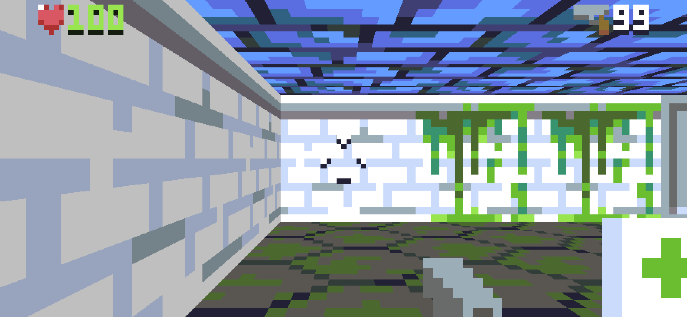

### Stable Genius

Except that unfortunately, it isn't *guaranteed* to look like this. If we build the game using Xcode 11.4 you should see the previous screenshot, but with 11.3 we get the following:

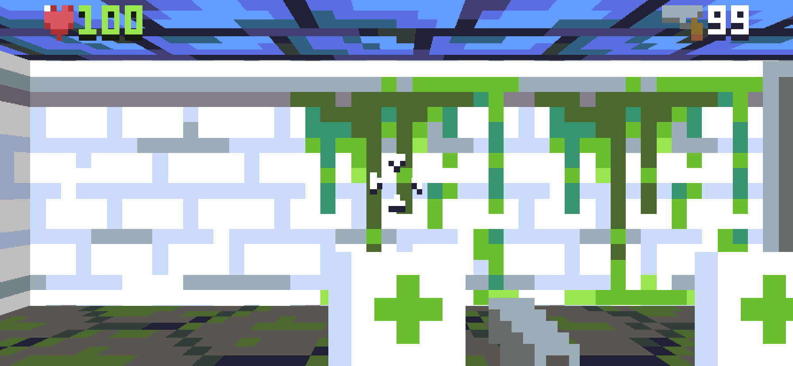

As elegant as Swift's `RandomNumberGenerator` protocol is, it sadly doesn't offer the kind of stability guarantees that we need for procedural content generation. Even though we've provided both the RNG algorithm and the seed, the way that `randomElement()` works internally is still a black box, and we should have heeded this warning, included in the header docs for the `Collection.randomElement()` method:

```swift
/// - Note: The algorithm used to select a random element may change in a
///   future version of Swift. If you're passing a generator that results in
///   the same sequence of elements each time you run your program, that
///   sequence may change when your program is compiled using a different
///   version of Swift.
```

Fortunately, since the API surface we are using is fairly narrow, we can simply recreate it ourselves. In `RNG.swift`, remove the `RandomNumberGenerator` conformance from the `RNG` struct as follows:

```swift
public struct RNG {
```

That introduces a bunch of compilation errors in `MapGenerator.swift`, but don't worry about those for now. Still in `RNG.swift`, add the following code to the bottom of the file:

```swift
public extension Collection where Index == Int {
    func randomElement(using generator: inout RNG) -> Element? {
        if isEmpty {
            return nil
        }
        return self[startIndex + Index(generator.next() % UInt64(count))]
    }
}
```

What this does is takes the raw output of our `next()` function (a 64-bit integer) and applies the modulus of the array count in order to produce a random index in the collection. This is not the way that Swift does it (at least, not since version 5.2), but it works well enough for our purposes, and we can be confident that it will continue to work the same way in perpetuity.

With that in place, you should now see the same level generated, regardless of the Swift version or platform.

### Seed Round

This actually isn't a great level layout, so let's try changing the seed and see if we can get the system to produce a better one. In `TileMap.swift`, add the following new property to the `MapData` struct:

```swift
public let seed: UInt64?
```

Then in `MapGenerator.swift`, replace the line:

```swift
self.rng = RNG(seed: 0)
```

with:

```swift
self.rng = RNG(seed: mapData.seed ?? .random(in: 0 ... .max))
```

This means we can now specify a separate seed for each level (or omit it, if we want a different level each time). Add the following line to the first map in `Levels.json`:

```swift
"seed": 1,
```

Trying values of `1`, `2`, `3` and `4`, we see the following level layouts:

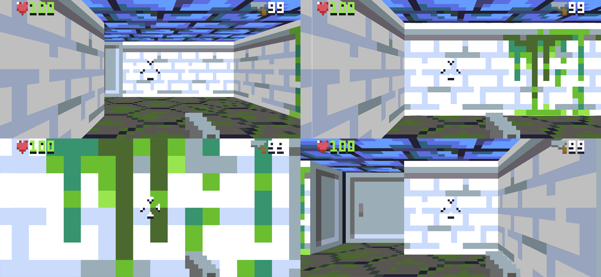

Of these, `1` seems the best, so we'll stick with that for now. Feel free to experiment though - there are 2<sup>64</sup> possibilities to choose from!

### Fault Line

If you look closely at the second of the four example levels (seed value `2`) you might notice a slight rendering glitch along the edge of a wall tile on the left of the screen. Here it is again, closer up:

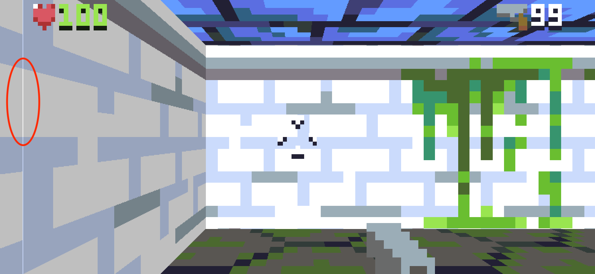

So what's going on here? The glitch is actually a fault in the lighting. A one pixel column of the wall is being rendered with the wrong texture - it should be using the darker variant of the wall texture, but it's using the lighter one instead.

This bug isn't caused by the level generation logic, it just happened to be revealed by moving the player to a new starting position. The bug is due to a *literal* corner case - when the ray hits the corner of a tile, the logic for determining which side of the wall to render doesn't work. The logic in question is here, in the `// Draw wall` section in `Renderer.swift`:

```swift
if end.x.rounded(.down) == end.x {
    let neighborX = tileX + (ray.direction.x > 0 ? -1 : 1)
    let isDoor = world.isDoor(at: neighborX, tileY)
    wallTexture = textures[isDoor ? .doorjamb : tile.textures[0]]
    wallX = end.y - end.y.rounded(.down)
} else {
    ...
}
```

The code here assumes that if the X coordinate of the ray/wall intersection point lies at the division between two tiles, we must be seeing the vertical edge of the wall. But if the intersection point is exactly on the corner of a wall tile, then that assumption doesn't necessarily hold. Which edge a particualr pixel falls on wouldn't normally matter, except that in this case, because the tile is up against another wall, the wrong choice causes a visible discontinuity in the lighting.

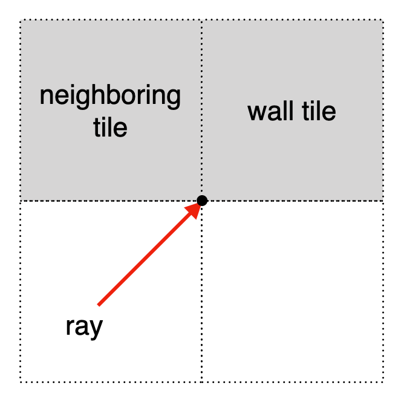

To solve this, we can check if the neighboring wall tile is occupied, and if so select the other texture instead. Replace the lines:

```swift
let isDoor = world.isDoor(at: neighborX, tileY)
wallTexture = textures[isDoor ? .doorjamb : tile.textures[0]]
wallX = end.y - end.y.rounded(.down)
```

with:

```swift
if world.map[neighborX, tileY].isWall {
    wallTexture = textures[tile.textures[1]]
    wallX = end.x - end.x.rounded(.down)
} else {
    let isDoor = world.isDoor(at: neighborX, tileY)
    wallTexture = textures[isDoor ? .doorjamb : tile.textures[0]]
    wallX = end.y - end.y.rounded(.down)
}
```

With this change in place, the glitch disappears.

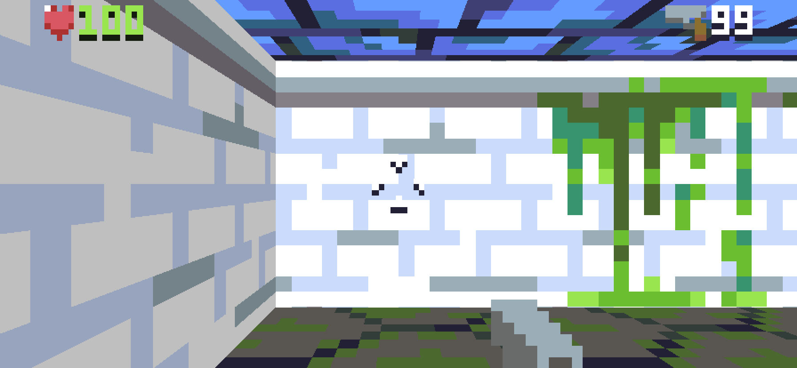

That's it for Part 18. In this this part we:

* Added logic to generate all of the `things` in the level algorithmically, so we don't have to place them by hand
* Created our own pseudorandom number generator for producing deterministic randomness
* Added a seed value and tweaked the generator code to ensure consistent behavior across platforms
* Solved a lighting glitch that was revealed by moving the player starting position

In Part 19 we'll expand on the principles we've explored so far to create *fully*-procedural levels.

### Reader Exercises

Finished the tutorial and hungry for more? Here are some ideas you can try out for yourself:

1. Can you add a check to ensure that the player doesn't end up too close to the exit elevator? A good approach would be to apply a minimum threshold to the length of the path from the player to the elevator.

2. The `// Add monsters` loop does a radius check to ensure no monsters are placed in the starting room with the player, but this logic is flawed. If the player's starting room is large enough, monsters may still be placed inside, and if the player is right next to a wall this will prevent monsters being placed on the other side of the wall too. Can you replace the radius check with a test to determine if the monster can see the player?

3. The code for placing push-walls checks that there is room for the wall to move, but not much else. Can you add some code to ensure that push-walls are placed in *interesting* locations? (Hint: an "interesting" location might be defined as one where the player can't already walk from one side of the push-wall to the other without needing to push it). 

<hr>

<a id="footnote1"></a>[[1]](#reference1) As evidenced by the tiny, pointless second level in `Levels.json`.

<a id="footnote2"></a>[[2]](#reference2) Besides these constants, the only other input to the function is the previous value. This makes the LCG sequence extremely easy to work with, because the last value produced is the seed for the next one, so you can easily replay the sequence from any point.

<a id="footnote3"></a>[[3]](#reference3) This might seem like a rather dangerous default, but it's actually a *safety* feature designed to prevent subtle bugs in security-critical code. Unhandled integer overflows are a common source of software exploits.

<a id="footnote4"></a>[[4]](#reference4) Why only *probably*? Read on and find out!
