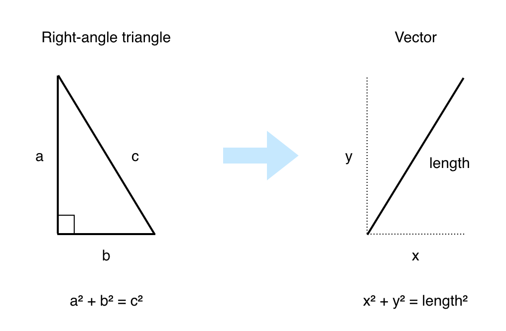

## Part 2: Mazes and Motion

In [Part 1](Part1.md) we laid the groundwork for our game, creating a cross-platform graphics engine, a rectangular world with a moving player avatar, and a platform layer for iOS.

We will now build upon the code we created in Part 1, adding a 2D maze, user input and collision handling. If you haven't already done so, I strongly suggest you work through Part 1 and write the code yourself, but if you prefer you can just download the project from [here](https://github.com/nicklockwood/RetroRampage/archive/Part1.zip).

### Amaze Me

Wolfenstein, at its heart, is a 2D maze game built on a 64x64 tile grid. A grid of fixed-size tiles is a little too crude to create realistic architecture, but it's great for making twisting corridors, hidden alcoves and secret chambers. It's also really easy to define in code.

Create a new file in the Engine module called `Tile.swift` with the following contents:

```swift
public enum Tile: Int, Decodable {
    case floor
    case wall
}
```

Then, create another file called `Tilemap.swift`:

```swift
public struct Tilemap: Decodable {
    private let tiles: [Tile]
    public let width: Int
}

public extension Tilemap {
    var height: Int {
        return tiles.count / width
    }
    
    var size: Vector {
        return Vector(x: Double(width), y: Double(height))
    }

    subscript(x: Int, y: Int) -> Tile {
        return tiles[y * width + x]
    }
}
```

If you were thinking this looks familiar, you'd be right. `Tilemap` is pretty similar to the `Bitmap` struct we defined in the first part (they even both have "map" in the name). The only difference is that instead of colors, `Tilemap` contains tiles<sup><a id="reference1"></a>[[1]](#footnote1)</sup>.

In the `World` struct, replace the stored `size` property with:

```swift
public let map: Tilemap
```

Then modify the `World.init()` method to look like this:

```swift
public init(map: Tilemap) {
    self.map = map
    self.player = Player(position: map.size / 2)
}
```

Since `size` is now a sub-property of `map`, rather than being of a property of the world itself, let's add a computed property for the size so we don't break all the existing references:

```swift
public extension World {
    var size: Vector {
        return map.size
    }
    
    ...
}
```

To draw the map we will need to know if each tile is a wall or not. We could just check if the tile type is equal to `.wall`, but later if we add other kinds of wall tile, such code would break silently.

Instead, add the following code to `Tile.swift`:

```
public extension Tile {
    var isWall: Bool {
        switch self {
        case .wall:
            return true
        case .floor:
            return false
        }
    }
}
```

The `switch` statement in the `isWall` property is *exhaustive*, meaning it doesn't include a `default:` clause, so it will fail to compile if we add another case without handling it. That means we can't accidentally introduce a bug by forgetting to update it when we add new wall types.

Repeating that `switch` everywhere we access the tiles would be a nuisance, but by using the `isWall` property instead, we can ensure the code is robust without being verbose.

In `Renderer.draw()` add the following block of code before `// Draw player`:

```swift
// Draw map
for y in 0 ..< world.map.height {
    for x in 0 ..< world.map.width where world.map[x, y].isWall {
        let rect = Rect(
            min: Vector(x: Double(x), y: Double(y)) * scale,
            max: Vector(x: Double(x + 1), y: Double(y + 1)) * scale
        )
        bitmap.fill(rect: rect, color: .white)
    }
}
```

That takes care of drawing the wall tiles. But so that we can actually see the white walls against the background, in `Renderer.init()` change the line:

```swift
self.bitmap = Bitmap(width: width, height: height, color: .white)
```

to:

```swift
self.bitmap = Bitmap(width: width, height: height, color: .black)
```

Now that we have code to draw the map, *we need a map to draw*.

Here we hit upon another natural division between architectural layers. So far we have only really dealt with two layers: the game engine and the platform layer. Gameplay specifics such as particular map layouts do not really belong in the engine, but they are also not tied to a particular platform. So where do we put them?

### The Best Code is No Code

We could create a whole new module for game-specific code, but even better would be if we could treat our game as *data* to be consumed by the engine, rather than code at all.

You may have noticed that the `Tile` enum has an `Int` type, and conforms to `Decodable` (as does `Tilemap` itself). The reason for this is to facilitate defining maps in JSON rather than having to hard-code them.

Create a new empty file in the main project called `Map.json` and add the following contents:

```swift
{
    "width": 8,
    "tiles": [
        1, 1, 1, 1, 1, 1, 1, 1,
        1, 0, 0, 1, 0, 0, 0, 1,
        1, 0, 0, 1, 0, 0, 0, 1,
        1, 0, 0, 0, 0, 0, 0, 1,
        1, 0, 0, 1, 1, 1, 0, 1,
        1, 0, 0, 1, 0, 0, 0, 1,
        1, 0, 0, 1, 0, 0, 0, 1,
        1, 1, 1, 1, 1, 1, 1, 1
    ]
}
```

The numbers match the case values in the `Tile` enum, so `0` is a floor tile and `1` is a wall. This is a tiny and trivial map, but it will serve to test the engine. You can replace it with a different map size or layout if you prefer - it won't affect the rest of the tutorial.

In `ViewController.swift`, add the following free function outside the `ViewController` class<sup><a id="reference2"></a>[[2]](#footnote2)</sup>:

```swift
private func loadMap() -> Tilemap {
    let jsonURL = Bundle.main.url(forResource: "Map", withExtension: "json")!
    let jsonData = try! Data(contentsOf: jsonURL)
    return try! JSONDecoder().decode(Tilemap.self, from: jsonData)
}
```

Then replace the line:

```swift
private var world = World()
```

with:

```swift
private var world = World(map: loadMap())
```

Run the app again and you should see the map rendered in all its glory:


The player looks a bit silly now though, drifting diagonally across the map without regard for the placement of walls. Let's fix that.

### Position is Everything

For maximum flexibility in the map design, the player's starting position should be defined in the JSON file rather than hard-coded.

We could add a new case called `player` to the `Tile` enum, and then place the player in the map array the same way we place walls, but if we later add different types of floor tile we'd have no way to specify the type of floor underneath the player if they both occupied the same element in the `tiles` array.

Instead, let's add a new type to represent non-static objects in the map. Create a new file called `Thing.swift` in the Engine module, with the following contents:

```swift
public enum Thing: Int, Decodable {
    case nothing
    case player
}
```

Then add a `things` property to `Tilemap`:

```swift
public struct Tilemap: Decodable {
    private let tiles: [Tile]
    public let things: [Thing]
    public let width: Int
}
```

Finally, add an array of `things` to the `Map.json` file:

```
{
    "width": 8,
    "tiles": [
        1, 1, 1, 1, 1, 1, 1, 1,
        1, 0, 0, 1, 0, 0, 0, 1,
        1, 0, 0, 1, 0, 0, 0, 1,
        1, 0, 0, 0, 0, 0, 0, 1,
        1, 0, 0, 1, 1, 1, 0, 1,
        1, 0, 0, 1, 0, 0, 0, 1,
        1, 0, 0, 1, 0, 0, 0, 1,
        1, 1, 1, 1, 1, 1, 1, 1
    ],
    "things": [
        0, 0, 0, 0, 0, 0, 0, 0,
        0, 0, 0, 0, 0, 0, 0, 0,
        0, 0, 0, 0, 0, 0, 0, 0,
        0, 0, 0, 0, 0, 0, 0, 0,
        0, 0, 0, 0, 0, 0, 0, 0,
        0, 0, 0, 0, 0, 0, 0, 0,
        0, 0, 0, 0, 1, 0, 0, 0,
        0, 0, 0, 0, 0, 0, 0, 0
    ]
}
```

Unlike the map tiles, we can't just look up the player position from the `things` array each time we need it, because once the player starts moving their position will no longer align to the tile grid. 

Instead we'll use `things` to get the *initial* player position, after which the `Player` object will keep track of its own position. In `World.init()`, replace the line:

```swift
self.player = Player(position: map.size / 2)
```

with:

```swift
for y in 0 ..< map.height {
    for x in 0 ..< map.width {
        let position = Vector(x: Double(x) + 0.5, y: Double(y) + 0.5)
        let thing = map.things[y * map.width + x]
        switch thing {
        case .nothing:
            break
        case .player:
            self.player = Player(position: position)
        }
    }
}
```

This code scans through the things array and adds any non-zero things (currently just the player) to the world. Note that we add `0.5` to the map X and Y coordinate when we set the player's starting position so that the player will be placed in the center of the tile instead of at the top-left corner.

If we try to run the app now the compiler will complain that we are trying to return from the initializer without initializing all properties. Although we can see that there is a `1` in the `things` array, the Swift compiler isn't able to detect that statically.

To fix that, add a `!` to the `player` property (that means the app will crash if we forget to include the player in `things`, but the game can't work without a player anyway):

```swift
public var player: Player!
```

With the player avatar in the correct starting position, we now need to fix the player's movement. First, let's stop the hard-coded diagonal motion. In `Player.swift`, change the line:

```swift
self.velocity = Vector(x: 1, y: 1)
```

To:

```swift
self.velocity = Vector(x: 0, y: 0)
```

Now, to make the player move properly we need to implement *user input*. User input is handled by the platform layer, as it will vary significantly between different target devices. On a Mac you'd probably use arrow keys for movement. On tvOS you'd use a joypad. For iOS, we'll need to implement touch-based movement.

### Pan Handling

The most effective form of touch-based interface is direct manipulation, but that doesn't translate well to games where player movement often extends beyond a single screen. Traditional game control schemes also don't work well on a touch screen - some early ports of classic games to iOS had *truly horrible* controls because they tried to replicate physical buttons and joysticks with on-screen icons<sup><a id="reference3"></a>[[3]](#footnote3)</sup>.

The best general-purpose movement control I've found for action games is a *floating joystick*, where the stick position is measured relative to where the finger first touched down instead of a fixed point. The benefit of this approach is that it's much less susceptible to finger-drift than a fixed joystick, meaning that the player can keep their eyes on the action without worrying about their finger slipping off the controls.

There are a couple of different ways to implement a joystick on iOS, but the most straightforward is to use a `UIPanGestureRecognizer`. Go ahead and add a `panGesture` property to the `ViewController` class:

```swift
class ViewController: UIViewController {
    private let imageView = UIImageView()
    private let panGesture = UIPanGestureRecognizer()
    
    ...
}
```

Then add the following line to `viewDidLoad()`:

```swift
view.addGestureRecognizer(panGesture)
```

Conveniently, `UIPanGestureRecognizer` already computes the relative finger position from the point at which the gesture started, so we don't need to store any state information beyond what the gesture recognizer already tracks for us.

In a normal app we'd use the target/action pattern to bind a method that would be called whenever the gesture was recognized, but that's not really helpful in this case because we don't want to be informed about pan gestures *as they happen*, we want to sample them once per frame. Instead of an action method, we'll use a computed property for the input vector.

Add the following code to `ViewController`:

```swift
private var inputVector: Vector {
    switch panGesture.state {
    case .began, .changed:
        let translation = panGesture.translation(in: view)
        return Vector(x: Double(translation.x), y: Double(translation.y))
    default:
        return Vector(x: 0, y: 0)
    }
}
```

This input needs to be passed to the engine. We could directly pass the vector, but we'll be adding other inputs in future (e.g. a fire button), so let's package the input up inside a new type. Create a new file in the Engine module called `Input.swift` with the following contents:

```swift
public struct Input {
    public var velocity: Vector

    public init(velocity: Vector) {
        self.velocity = velocity
    }
}
```

Then replace the following line in `ViewController.update()`:

```swift
world.update(timeStep: timeStep)
```

with:

```swift
let input = Input(velocity: inputVector)
world.update(timeStep: timeStep, input: input)
```

And in the `World.swift` file, change the `update()` method to:

```swift
mutating func update(timeStep: Double, input: Input) {
    player.velocity = input.velocity
    player.position += player.velocity * timeStep
    player.position.x.formTruncatingRemainder(dividingBy: size.x)
    player.position.y.formTruncatingRemainder(dividingBy: size.y)
}
```

If you try running the app now, and drag your finger around the screen, you'll see that the player moves way too fast. The problem here is that we are measuring the input vector in screen points, but player movement in the game is supposed to be specified in world units - a finger swipe across the screen covers far more points than tiles.

The solution is to divide the input vector by some value - but what value? We could use the relative scale factor of the screen to the world, but we don't really want the player speed to depend on the size of the world and/or screen.

What we need to do is [normalize](https://en.wikipedia.org/wiki/Normalization_(statistics)) the input velocity, so that its value is independent of the input method. Regardless of the raw input values produced by the platform layer the game should always receive a value in the range 0 to 1.


In order to normalize the input, we first need to pick a maximum value. If you think about a real joystick on a gamepad, they typically have a travel distance of about half an inch. On an iPhone that's roughly 80 screen points, so a sensible joystick radius would be around 40 points (equivalent to 80 points diameter).

Add a new constant to the top of the `ViewController.swift` file (not inside the `ViewController` class itself):

```
private let joystickRadius: Double = 40
```

Now we have defined the maximum, we can divide the input by that value to get the normalized result. In the `inputVector` getter, replace the line:

```swift
return Vector(x: Double(translation.x), y: Double(translation.y))
```

with:

```swift
var vector = Vector(x: Double(translation.x), y: Double(translation.y))
vector /= joystickRadius
return vector
```

That's *almost* the solution, but there's still a problem. If the user drags their finger further than 40 points, the resultant vector magnitude will be > 1, so we need to clamp it. In order to do that, we need to calculate the actual length of the vector.

[Pythagoras's theorem](https://en.wikipedia.org/wiki/Pythagorean_theorem#Other_forms_of_the_theorem) states that the length of the hypotenuse of a right-angle triangle is equal to the square root of the sum of the squares of the other two sides. This relationship allows us to derive the length of a vector from its X and Y components. 



In `Vector.swift`, add a computed property for `length`:

```swift
public extension Vector {
    var length: Double {
        return (x * x + y * y).squareRoot()
    }
    
    ...
}
```

Then in `ViewController.inputVector`, replace the line:

```swift
vector /= joystickRadius
```

with:

```swift
vector /= max(joystickRadius, vector.length)
```

With that extra check, we can be confident that the resultant magnitude will never be greater than one. Run the app again and you should find that the player now moves at reasonable speed. If anything, one world unit per second is a bit *slow* for the maximum speed. Add a `speed` constant to `Player` so we can configure the maximum rate of movement:

```swift
public struct Player {
    public let speed: Double = 2
    ...
}
```

Then, in `World.update()`, multiply the input velocity by the player's speed to get the final velocity:

```swift
func update(timeStep: Double, input: Vector) {
    player.velocity = input.velocity * player.speed   
    ...
}
```

The speed is reasonable now, but movement feels a bit *laggy*. The problem is, if you drag more than 40 points and then try to change direction, you have to move your finger back inside the joystick radius before it will register movement again. This was exactly the problem we wanted to mitigate by having a floating joystick, but although the joystick re-centers itself whenever you touch down, its position still remains fixed until you raise your finger.

Ideally, it should never be possible to move your finger off the joystick. Attempting to move your finger outside the joystick radius should just drag the joystick to a new location.


In the same way that we clamped the vector to prevent input values > 1, we can also clamp the cumulative translation value of the gesture itself. `UIPanGestureRecognizer` has a `setTranslation()` method that lets you update the distance travelled, so in the `inputVector` computed property, just before the `return vector` line, add the following:

```swift
panGesture.setTranslation(CGPoint(
    x: vector.x * joystickRadius,
    y: vector.y * joystickRadius
), in: view)
```

This uses the clamped `vector` value multiplied by the `joystickRadius` to get the clamped translation distance in screen points, then reassigns that to the gesture recognizer, effectively changing its record of where the gesture started.

### Barrier to Entry

Next, we need to solve the problem of the player moving through walls. To prevent this, we first need a way to detect if the player is intersecting a wall.

Because the map is a grid, we can identify the tiles that overlap the player rectangle by taking the integer parts of the `min` and `max` coordinates of the rectangle to get the equivalent tile coordinates, then looping through the tiles in that range to see if any of them is a wall.


We'll implement that as an `isIntersecting()` method on `Player`:

```swift
public extension Player {
    ...
    
    func isIntersecting(map: Tilemap) -> Bool {
        let playerRect = self.rect
        let minX = Int(playerRect.min.x), maxX = Int(playerRect.max.x)
        let minY = Int(playerRect.min.y), maxY = Int(playerRect.max.y)
        for y in minY ... maxY {
            for x in minX ... maxX {
                if map[x, y].isWall {
                    return true
                }
            }
        }
        return false
    }
}
```

That gives us a way to detect if the player is colliding with a wall. Now we need a way to *stop* them from doing that. A simple approach is to wait for the collision to happen, then *undo* it. Replace the code in `World.update()` with the following:

```swift
mutating func update(timeStep: Double, input: Input) {
    let oldPosition = player.position
    player.velocity = input.velocity * player.speed
    player.position += player.velocity * timeStep
    if player.isIntersecting(map: map) {
        player.position = oldPosition
    }
}
```

If you run the game again, you'll see that it's now not possible to walk through walls anymore. The only problem is that now if you walk into a wall, you get *stuck*, unless you walk directly away from the wall again.

Once you touch the wall, any attempt at lateral movement is likely to lead to interpenetration and be rejected by the update handler. In fact, it's not really possible to move down the one-unit-wide corridor because of this.

We can mitigate the problem a bit by reducing the player's `radius`. The current value of `0.5`, means the player's diameter is one whole world unit - the same width as the corridor. Reducing it to `0.25` will give us a bit more freedom to move around. In `Player.swift` replace the line:

```swift
public let radius: Double = 0.5
```

with:

```swift
public let radius: Double = 0.25
```

That helps with the narrow corridors, but we still stick to the walls when we hit them. It would be much nicer if you could slide along the wall when you walk into it, instead of stopping dead like you'd walked into flypaper.

To fix this, we need to go beyond collision *detection*, and implement collision *response*. Instead of just working out if the player is intersecting a wall, we'll calculate *how far* into the wall they have moved, and then push them out by exactly that amount.

To simplify the problem, we'll start by computing the intersection vector between two rectangles, then we can extend it to work with player/map collisions.

To get the intersection, we measure the overlaps between all four edges of the two rectangles and create an intersection vector for each. If any of these overlaps is zero or negative, it means the rectangles are not intersecting, so we return `nil`. Then we sort the vectors to find the shortest.


Add the following code in `Rect.swift`:

```swift
public extension Rect {
    func intersection(with rect: Rect) -> Vector? {
        let left = Vector(x: max.x - rect.min.x, y: 0)
        if left.x <= 0 {
            return nil
        }
        let right = Vector(x: min.x - rect.max.x, y: 0)
        if right.x >= 0 {
            return nil
        }
        let up = Vector(x: 0, y: max.y - rect.min.y)
        if up.y <= 0 {
            return nil
        }
        let down = Vector(x: 0, y: min.y - rect.max.y)
        if down.y >= 0 {
            return nil
        }
        return [left, right, up, down]
            .sorted(by: { $0.length < $1.length }).first
    }
}
```

In `Player.swift`, replace the `isIntersecting(map:)` method with the following:

```
func intersection(with map: Tilemap) -> Vector? {
    let playerRect = self.rect
    let minX = Int(playerRect.min.x), maxX = Int(playerRect.max.x)
    let minY = Int(playerRect.min.y), maxY = Int(playerRect.max.y)
    for y in minY ... maxY {
        for x in minX ... maxX where map[x, y].isWall {
            let wallRect = Rect(
                min: Vector(x: Double(x), y: Double(y)),
                max: Vector(x: Double(x + 1), y: Double(y + 1))
            )
            if let intersection = rect.intersection(with: wallRect) {
                return intersection
            }
        }
    }
    return nil
}
```

The basic structure of the new method is the same as before: identifying the potentially overlapping tiles and looping through them. But now we actually compute and return the intersection vector, rather than just a boolean to indicate that an intersection has occurred.

In `World.swift`, change the `update()` method to use the new intersection method:

```swift
mutating func update(timeStep: Double, input: Input) {
    player.velocity = input.velocity * player.speed
    player.position += player.velocity * timeStep
    if let intersection = player.intersection(with: map) {
        player.position -= intersection
    }
}
```

If an intersection was detected, we subtract the vector from the player's current position. Unlike the previous solution, this won't move the player back to where they were before, but instead it will move them the shortest distance necessary to push them out of the wall. If they approach the wall at an angle, their lateral movement will be preserved and they will appear to slide along the wall instead of stopping dead.

If you run the game now and try sliding against a wall you may find that the player occasionally sinks into it, or even passes right through it to the other side.

The problem is that if the player is at an intersection between two walls, pushing them out of one wall tile can potentially push them right into another one, since we only handle the first intersection we detect.

That would probably be corrected by a subsequent collision response, but that wouldn't happen until one or more frames later, and in the meantime the player may have moved further into the wall.


Instead of waiting until the next frame to apply further collision response steps, we can replace the `if` statement in the update logic with a `while` loop. 

In `World.update()` replace the following line:

```swift
if let intersection = player.intersection(with: map) {
```

with:

```swift
while let intersection = player.intersection(with: map) {
```

With that change in place, the collision logic will keep nudging the player until there are no further intersections detected.

This collision response mechanism is still a bit fragile however, because it assumes that a player can never walk more than their own diameter's depth through a wall in a single frame. If they did somehow manage to do that, they could get trapped - stuck in an infinite loop of being nudged out of one wall into another and then back again. If they managed to go even faster they might pass the center point of the wall and end up getting pushed out the other side.


So what would it take for that to happen? At the current player movement speed of 2 units-per-second, and a player diameter of 0.5 units, they will travel their own diameter's distance in 0.25 seconds (one quarter of a second). In order to prevent the player potentially getting stuck, we need to *guarantee* that the size of each time step remains well below that limit.

### Baby Steps

Of course, the game would be completely unplayable at 4 frames per second, and we would never ship it in that state, but there are plenty of scenarios where a game might suffer a single-frame stutter. For example, if the player answers a phone call in the middle of a game, the game will move into the background and the frame timer will be paused. When the player resumes 10 minutes later, we don't want their avatar to suddenly jump forward several thousand pixels as if they had been moving that whole time.

A brute-force solution is to cap the update `timeStep` at some sensible maximum like 1/20 (i.e. a minimum of 20 FPS). If the frame period ever goes over that, we'll just pass 1/20 as the `timeStep` anyway.

Add a new constant to the top of the `ViewController.swift` file:

```swift
private let maximumTimeStep: Double = 1 / 20
```

Then in `update()`, replace the line:

```swift
let timeStep = displayLink.timestamp - lastFrameTime
```

with:

```swift
let timeStep = min(maximumTimeStep, displayLink.timestamp - lastFrameTime)
```

That gives us a little bit of breathing room, but what happens later if we want to add projectiles with a radius of 0.1 units that travel 100 units per second? Well, we can't very well set a minimum frame rate of 1000 FPS, so we need a way to make the time steps as small as possible without increasing the frame rate.

The solution is to perform multiple world updates per frame. There is no rule that says world updates have to happen in lock-step with drawing<sup><a id="reference4"></a>[[4]](#footnote4)</sup>. For a game like this, where the frame rate will likely be limited by rendering rather than physics or AI, it makes sense to perform multiple world updates for every frame drawn.

If the actual frame time is 1/20th of a second, we could update the world twice, passing a `timeStep` of 1/40th each time. The player won't see the effect of those intermediate steps on screen, so we won't bother drawing them, but by reducing the time between updates we can improve the accuracy of collisions and avoid any weirdness due to lag.

Since the frame rate will be 60 FPS on most systems, a time step of 1/120 (120 FPS) seems reasonable for now (we can always increase it later if we need to handle tiny and/or fast-moving objects). Add the following constant to the top of `ViewController.swift`:

```swift
private let worldTimeStep: Double = 1 / 120
```

Then, in the `update()` method, replace the line:

```swift
world.update(timeStep: timeStep, input: input)
```

with:

```swift
let worldSteps = (timeStep / worldTimeStep).rounded(.up)
for _ in 0 ..< Int(worldSteps) {
    world.update(timeStep: timeStep / worldSteps, input: input)
}
```

Regardless of the frame rate, the world will now always be updated at a minimum of 120 FPS, ensuring consistent and reliable collision handling.

You might be thinking that with the `worldTimeStep` logic, we no longer need the `maximumTimeStep` check, but actually this saves us from another problem - the so-called *spiral of death* that can occur when your world updates take longer to execute than your frame step.

By limiting the maximum frame time, we also limit the number of iterations of the world update. 1/20 divided by 1/120 is 6, so there will never be more than six world updates performed for a single frame drawn. That means that if a frame happens to take a long time (e.g. because the game was backgrounded or paused), then when the game wakes up it won't try to execute hundreds of world updates in order to catch up with the frame time, blocking the main thread and delaying the next frame - and so on - leading to the death spiral.

That's it for Part 2. In this part we...

* Loaded and displayed a simple maze
* Added touch input for moving the player
* Added collision detection and response so the player doesn't pass through walls
* Refined the game loop and decoupled world updates from the frame rate

In Part 3 (TBD) we'll take the jump into 3D and learn how to view a 2D maze from a first person perspective.

<hr>

<a id="footnote1"></a>[[1]](#reference1) We could replace both of these with a single `Map` type, perhaps using generics or a protocol in place of `Color`/`Tile`, but despite the superficial similarity, these two structs serve significantly different roles, and are likely to diverge as we add more code, rather than benefitting from a shared implementation.

<a id="footnote2"></a>[[2]](#reference2) You may wonder why we haven't bothered with any error handling in the `loadMap()` function? Since the `Map.json` file is bundled with the app at build time, any runtime errors when loading it would really be symptomatic of a programmer error, so there is no point in trying to recover gracefully.

<a id="footnote3"></a>[[3]](#reference3) I'd name and shame some examples, but due to the 32-bit *Appocalypse* of iOS 11, most of them don't exist anymore.

<a id="footnote4"></a>[[4]](#reference4) Modern games often run their game logic on a different thread from graphics rendering. This has some nice advantages - such as improved input responsiveness - but it adds a lot of complexity because you need to ensure that all the data structures shared by the game logic and the renderer are thread-safe.