## Part 3: Ray Casting

In [Part 2](Part2.md) we created a 2D tile-based maze, implemented a player avatar with simple physics and collision handling, and  added a touch-based joystick for movement.

Starting with [that code](https://github.com/nicklockwood/RetroRampage/archive/Part2.zip) we will now make the jump into 3D using a technique called ray casting. But first, we need to lay some groundwork.

### Sense of Direction

The player avatar currently has an implicit direction of movement, but in a first person game we will need to have an *explicit* direction that the player is facing, even when stationary. Go ahead and add a `direction` property to the player:

```swift
public struct Player {
    public let speed: Double = 2
    public let radius: Double = 0.25
    public var position: Vector
    public var velocity: Vector
    public var direction: Vector
    
    public init(position: Vector) {
        self.position = position
        self.velocity = Vector(x: 0, y: 0)
        self.direction = Vector(x: 1, y: 0)
    }
}
```

Note that we've used a vector for the direction, rather than an angle. Vectors are a better representation for directions as they avoid ambiguities such as where the angle is measured from, and whether it's measured clockwise or counter-clockwise. They're also easier to work with mathematically.

A direction vector should ideally always be *normalized* (have a length of 1), which is why we've initialized the direction with 1,0 instead of 0,0.

For now, we'll derive the direction from the input velocity vector. The input vector may have a length less than 1, so we can't use it directly, but we can get the normalized direction by dividing the vector by its own length.

Insert the following code at the beginning of the `World.update()` method to set the player's direction:

```swift
let length = input.velocity.length
if length > 0 {
    player.direction = input.velocity / length
}
```

### Plotting a Course

The player's direction should now always face whichever way they last moved. But the player's avatar is just a square - how can we see which way it's facing? We need a way to visualize the player's line of sight.

Let's draw a line to illustrate the direction vector. Add a new method to `Bitmap`:

```swift
public extension Bitmap {
    ...
    
    mutating func drawLine(from: Vector, to: Vector, color: Color) {
            
    }
}
```

To draw the line, we will need to fill each pixel in the bitmap that it touches. We'll start by working out the vector between the start and end of the line, which we'll call `difference`:

```swift
mutating func drawLine(from: Vector, to: Vector, color: Color) {
    let difference = to - from
    
}
```

To fill every pixel along the line, without leaving gaps or filling the same pixel twice, we need to step along its length exactly one pixel at a time. Each step should be a vector that, when added to the current position, moves to the next pixel along the line.

To ensure the correct step length, the number of steps should be equal to the larger of the X or Y components of the total length. That way the step vector will be exactly one pixel in the longer axis and <= to one pixel in the other axis, so there will be no gaps when we drawn the line.

Add the following code to `drawLine()` to compute the step count:

```swift
let stepCount: Int
if abs(difference.x) > abs(difference.y) {
    stepCount = Int(abs(difference.x).rounded(.up))
    
} else {
    stepCount = Int(abs(difference.y).rounded(.up))
    
}
```

The longer component of that step vector will have a value of one (because we're moving one pixel at a time). If the longer component is the X component, the Y component will have a length of `difference.y / difference.x`.

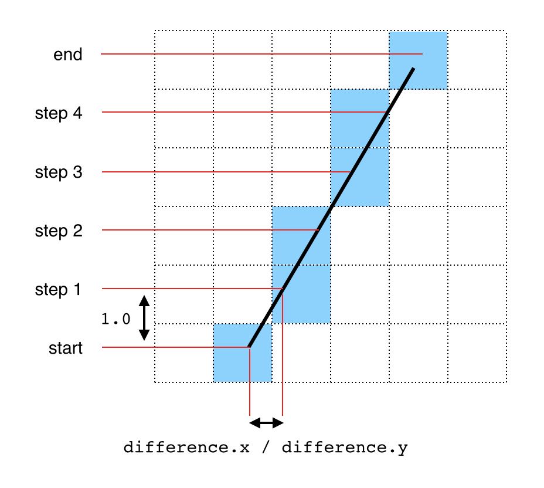

In other words it will be equal to the height of the line divided by the width, so that the slope of the step vector is the same as the slope of the line itself. If the longer component is Y, the X component will have a length of `difference.x / difference.y`, for the same reason. 

Update the `drawLine()` code to compute the step vector as follows:

```swift
mutating func drawLine(from: Vector, to: Vector, color: Color) {
    let difference = to - from
    let stepCount: Int
    let step: Vector
    if abs(difference.x) > abs(difference.y) {
        stepCount = Int(abs(difference.x).rounded(.up))
        let sign = difference.x > 0 ? 1.0 : -1.0
        step = Vector(x: 1, y: difference.y / difference.x) * sign
    } else {
        stepCount = Int(abs(difference.y).rounded(.up))
        let sign = difference.y > 0 ? 1.0 : -1.0
        step = Vector(x: difference.x / difference.y, y: 1) * sign
    }
    
}
```

Complete the `drawLine()` method by adding a loop from 0 to `stepCount`, advancing the step each time and filling the specified pixel:

```swift
var point = from
for _ in 0 ..< stepCount {
    self[Int(point.x), Int(point.y)] = color
    point += step
}
```

This is a very basic line-drawing routine - it makes no attempt at [antialiasing](https://en.wikipedia.org/wiki/Spatial_anti-aliasing), or even to correct for the floating point offset of the start and end points within each pixel. It will suffice for visualization purposes, however.

Add the following code to the end of the `Renderer.draw()` method:

```swift
// Draw line of sight
let end = world.player.position + world.player.direction * 100
bitmap.drawLine(from: world.player.position * scale, to: end * scale, color: .green)
```

This draws a green line extending out from the center of the player avatar, along their line of sight. The line of sight is technically infinite, but since we can't draw an infinitely long line, we've simply used an arbitrary large number for the length (100 world units).

Run the app and move around a bit. You should see something like this:

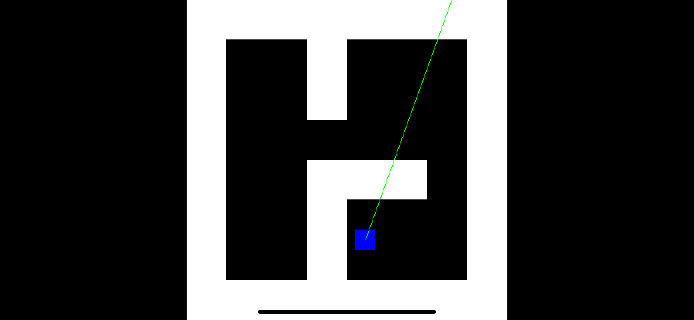

### Ray, Interrupted

The line we have drawn is known as a *ray* - a line that extends out indefinitely from a fixed point until it hits something. Right now, we don't actually detect if it hits anything though, so let's fix that.

First, let's create a data structure to represent the ray. A ray has an *origin* (the starting point) and a direction (a normalized vector). It *doesn't* have an end-point because it continues indefinitely. Create a new file called `Ray.swift` in the Engine module with the following contents:

```swift
public struct Ray {
    public var origin, direction: Vector
    
    public init(origin: Vector, direction: Vector) {
        self.origin = origin
        self.direction = direction
    }
}
```

To detect where the ray is interrupted by a wall, we need to perform a *hit test*. The hit test method will take a ray as an argument and return a vector indicating the point at which the ray should terminate.

The problem of detecting the hit point inside the map is in some ways quite similar to the `drawLine()` function we wrote earlier. In both cases we need to step along a line inside a grid (in this case a grid of tiles rather than pixels) and find the intersection points.

For the map hit test though, we'll need to be much more precise. It is not enough to know which tile we hit - we also need to know exactly *where* on the tile the collision occurred.

We'll start by simplifying the problem to a single tile. Given that we are standing inside a map tile, where is the point on the tile's boundary where our line of sight exits the tile?

Although the ray origin and direction are vectors, it's actually simpler in this case if we take the X and Y components and handle them individually.

Since the tiles lie on a 1x1 grid, we can get the horizontal and vertical positions of the current tile's edges by rounding the X and Y components of ray's origin up or down, depending on the direction of the ray. From those we can subtract the un-rounded X and Y values to get the distance of the origin from those edges.

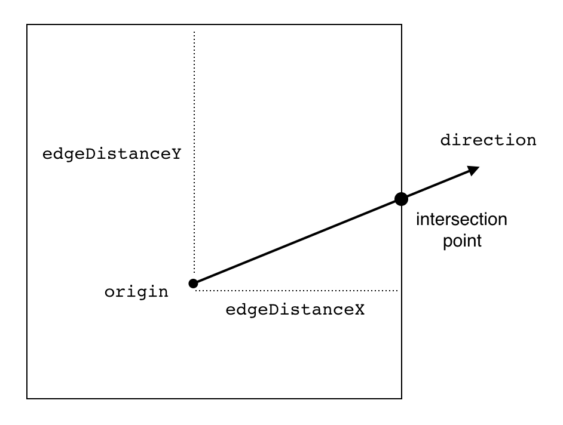

Add the following method to `TileMap`:

```swift
public extension Tilemap {
    ...
    
    func hitTest(_ ray: Ray) -> Vector {
        var position = ray.origin
        let edgeDistanceX, edgeDistanceY: Double
        if ray.direction.x > 0 {
            edgeDistanceX = position.x.rounded(.down) + 1 - position.x
        } else {
            edgeDistanceX = position.x.rounded(.up) - 1 - position.x
        }
        if ray.direction.y > 0 {
            edgeDistanceY = position.y.rounded(.down) + 1 - position.y
        } else {
            edgeDistanceY = position.y.rounded(.up) - 1 - position.y
        }
        
    }
}
```

You might wonder why the code to compute `edgeDistanceX` and `edgeDistanceY` is using `rounded(.down) + 1` instead of `rounded(.up)` and `rounded(.up) - 1` instead of `rounded(.down)` to get the tile boundaries? This is to handle the edge case (*literally*) where the player is already standing at the edge of the tile.

For example, if the player is standing at the exact leftmost edge of a tile looking right, `rounded(.up)` will give the coordinate of the leftmost edge (not what we want), whereas `rounded(.down) + 1` will give the position of the rightmost edge. The same applies if they are standing at the rightmost edge looking left (and so on for up and down).

Now that we know the X and Y distances from the edges of our current tile, we can compute the step vectors we would need to take along the ray to reach either of those edges. We can use the slope of the ray (the X component of the direction divided by the Y component) to derive the missing components of the step vectors, which we'll call `step1` and `step2`.

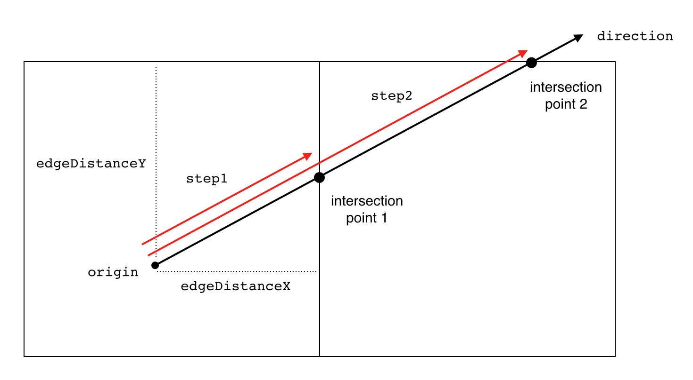

Append the following code to `hitTest()` to compute `step1` and `step2`:

```swift
let slope = ray.direction.x / ray.direction.y
let step1 = Vector(x: edgeDistanceX, y: edgeDistanceX / slope)
let step2 = Vector(x: edgeDistanceY * slope, y: edgeDistanceY) 
```

Adding the shortest of these two steps to our current position gives us the position at which the ray would exit the tile we are current standing in. Complete the `hitTest()` method by adding this last block of code:

```swift
if step1.length < step2.length {
    position += step1
} else {
    position += step2
}
return position
```

This is only the first piece of the puzzle, but it's a good point at which to check our work. In `Renderer.draw()`, replace the line:

```swift
let end = world.player.position + world.player.direction * 100
```

With:

```swift
let ray = Ray(origin: world.player.position, direction: world.player.direction)
let end = world.map.hitTest(ray)
```

Now run the app and you should see something like this:

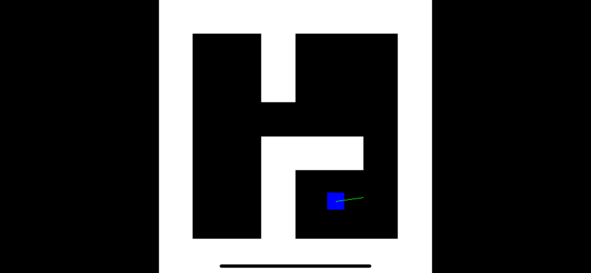

The line length may at first seem arbitrary, but if you move around it should become clear that the line always stops at the nearest edge of whatever tile we are currently standing in (which isn't necessarily a wall).

Now that we have the code to calculate where the ray hits the next tile, we can put that code inside a loop to extend the ray until the edge we have hit is a wall. Update `TileMap.hitTest()` as follows:

```swift
func hitTest(_ ray: Ray) -> Vector {
    var position = ray.origin
    let slope = ray.direction.x / ray.direction.y
    repeat {
        let edgeDistanceX, edgeDistanceY: Double
        if ray.direction.x > 0 {
            edgeDistanceX = position.x.rounded(.down) + 1 - position.x
        } else {
            edgeDistanceX = position.x.rounded(.up) - 1 - position.x
        }
        if ray.direction.y > 0 {
            edgeDistanceY = position.y.rounded(.down) + 1 - position.y
        } else {
            edgeDistanceY = position.y.rounded(.up) - 1 - position.y
        }
        let step1 = Vector(x: edgeDistanceX, y: edgeDistanceX / slope)
        let step2 = Vector(x: edgeDistanceY * slope, y: edgeDistanceY)
        if step1.length < step2.length {
            position += step1
        } else {
            position += step2
        }
    } while // TODO: Check if we hit a wall
    return position
}
```

Checking the type of tile we have just hit is not quite as simple as rounding the coordinates of `position` down to the nearest whole tile. All the collision points will be on the boundary between two (or even four) tiles, and which of those tiles we need to check depends on the direction the ray is pointing.

Since this is a nontrivial piece of logic (and it may be useful later), let's extract it into its own method. Add a the following method to `TileMap`, just before the `hitTest()` method:

```swift
func tile(at position: Vector, from direction: Vector) -> Tile {
    var offsetX = 0, offsetY = 0
    if position.x.rounded(.down) == position.x {
        offsetX = direction.x > 0 ? 0 : -1
    }
    if position.y.rounded(.down) == position.y {
        offsetY = direction.y > 0 ? 0 : -1
    }
    return self[Int(position.x) + offsetX, Int(position.y) + offsetY]
}
```

As before, we've simplified the problem by handling the X and Y components separately. If either component is a whole number (i.e. it lies on a tile boundary), we use the ray direction to determine which side should be checked.

We can now use `tile(at:from:)` to complete the `hitTest()` method. Replace the line:

```swift
} while // TODO: Check if we hit a wall
```

with:

```swift
} while tile(at: position, from: ray.direction).isWall == false
```

Run the app again and you'll see that the ray now terminates at the first wall it hits, instead of the first tile boundary:

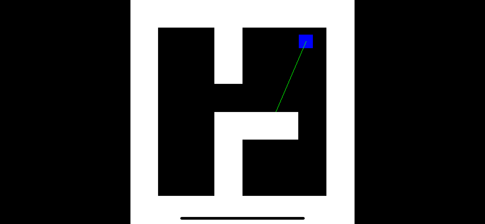

This may not look like much (it certainly doesn't look much like Wolfenstein!) but the ray intersection logic we just wrote is the key to the ray casting engine.

### Custom Frustum

To render the whole scene using ray casting (instead of casting just a single ray in the direction the player is facing) we need to cast a *fan* of rays - one for each column of pixels on the screen. In a true 3D engine we would need to cast a ray for *every pixel* on the screen, but because our map is 2D we don't need to worry about the vertical axis.

The area described by the fan represents a horizontal cross-section of the [view frustum](https://en.wikipedia.org/wiki/Viewing_frustum). In most 3D projections, the frustum has so-called *near* and *far* clipping planes that define the nearest and farthest things that can be seen. The 3D scene is projected onto the near plane to form the image that appears on the screen.

We don't have a far plane, as the rays we are projecting go on indefinitely until they hit something. For this reason we'll refer to the near plane as the *view plane* instead.

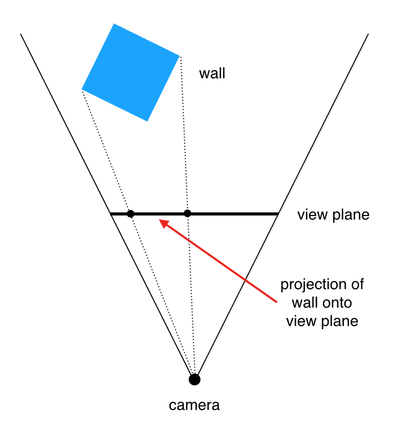

Since our world is two-dimensional, we can think of the view plane as a line rather than a rectangle. The direction of this line is always orthogonal to the direction that the camera is facing. The orthogonal vector can be computed as (-Y, X). This will be useful, so let's add another computed property to `Vector`:

```swift
public extension Vector {
    var orthogonal: Vector {
        return Vector(x: -y, y: x)
    }
    
    ...
}
```

The length of the line represents the *view width* in world units. This has no direct relationship to how many pixels wide the view is on-screen, it's more about how big we want the world to appear from the player's viewpoint. 

Since the player's `direction` vector is normalized (has a length of 1) the orthogonal vector will be as well. That means we can just multiply the orthogonal vector by the view width to get a line of the correct length to represent the view plane. 

```swift
let viewPlane = world.player.direction.orthogonal * viewWidth
```

The distance of the view plane from the player is the *focal length*. This affects how near things appear to be. Together, the view width and focal length define the *Field of View* (FoV), which determines how much of the world the player can see at once.

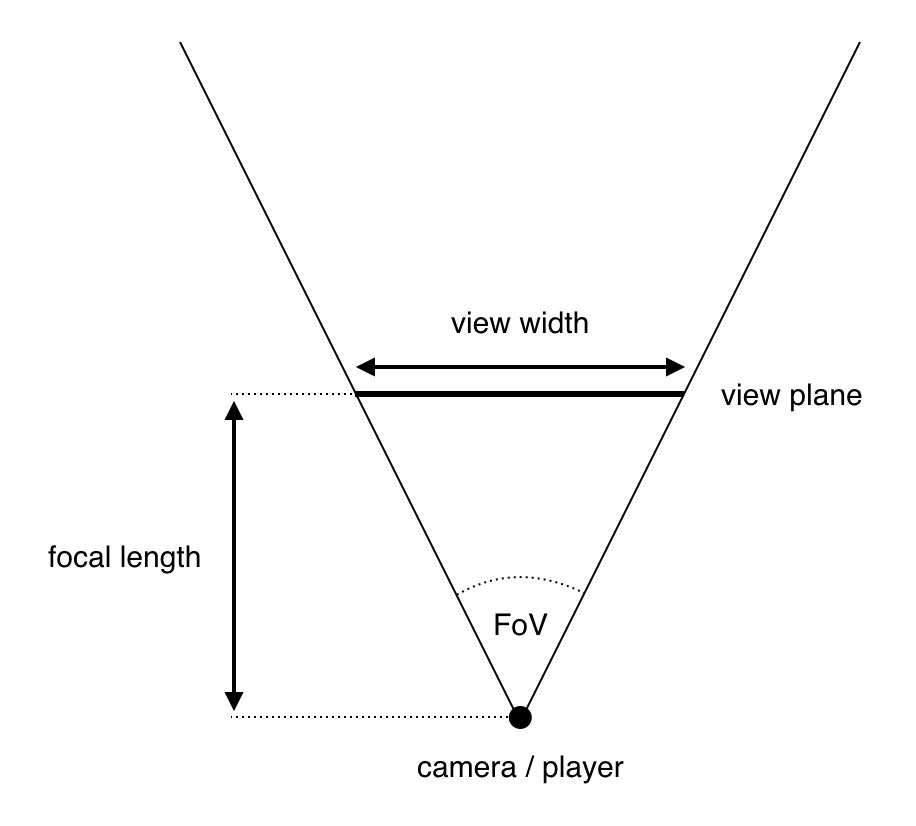

We'll set both the view width and the focal length to `1.0` for now. This gives a FoV angle of ~53 degrees<sup><a id="reference1"></a>[[1]](#footnote1)</sup>, which is a little narrow, but we'll fix that later. Add the following code to the end of the `Renderer.draw()` method:

```swift
// Draw view plane
let focalLength = 1.0
let viewWidth = 1.0
let viewPlane = world.player.direction.orthogonal * viewWidth
let viewCenter = world.player.position + world.player.direction * focalLength
let viewStart = viewCenter - viewPlane / 2
let viewEnd = viewStart + viewPlane
bitmap.drawLine(from: viewStart * scale, to: viewEnd * scale, color: .red)
```

Run the app and you will the view plane drawn as a red line in front of the player.

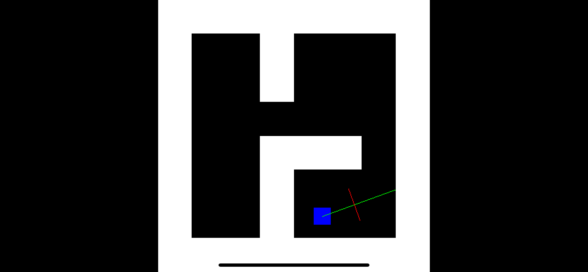

### Fan Service

Now we have defined the view plane, we can replace the single line-of-sight ray with a fan of rays spanning the player's view. Delete the following lines from `Renderer.draw()`, as we won't need them anymore:

```swift
// Draw line of sight
let ray = Ray(origin: world.player.position, direction: world.player.direction)
let end = world.map.hitTest(ray)
bitmap.drawLine(from: ray.origin * scale, to: end * scale, color: .green)
```

To get the direction of the first ray in the fan, we subtract the player position from the starting point of the view plane:

```swift
let rayDirection = columnPosition - world.player.position
```

The length of `rayDirection` is the diagonal distance from the player to the view plane. We mentioned earlier that direction vectors should always be normalized, and while it doesn't matter right now, it will avoid some weird bugs later. To normalize the ray direction, we divide it by its length:

```swift
let viewPlaneDistance = rayDirection.length
let ray = Ray(
    origin: world.player.position,
    direction: rayDirection / viewPlaneDistance
)
```

Eventually we'll need one ray for every horizontal pixel in the bitmap, but for now lets just draw 10 rays to test the principle. Add the following code to end of the `Renderer.draw()` method:

```swift
// Cast rays
let columns = 10
let step = viewPlane / Double(columns)
var columnPosition = viewStart
for _ in 0 ..< columns {
    let rayDirection = columnPosition - world.player.position
    let viewPlaneDistance = rayDirection.length
    let ray = Ray(
        origin: world.player.position,
        direction: rayDirection / viewPlaneDistance
    )
    let end = world.map.hitTest(ray)
    bitmap.drawLine(from: ray.origin * scale, to: end * scale, color: .green)
    columnPosition += step
}
```

Run the app again and you should see a fan of ten green rays spanning the red view plane line we drew earlier.

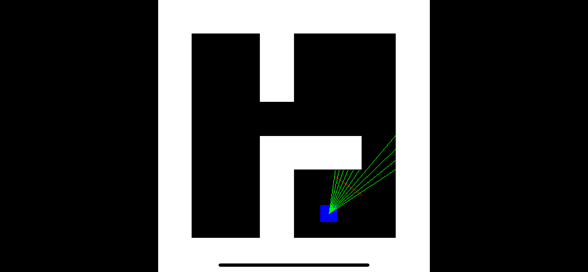

From the length of those rays, we can determine the distance of the walls of the maze at every pixel along the screen. Just one last thing to do before we enter the third dimension...

### A Quick Turnaround

The touch-based joystick we created in Part 2 works well for navigating a maze from a top-down perspective, but it's not set up quite right for a first-person game. Currently, pushing the joystick up always moves the player avatar towards the top of the screen, but in 3D we'll want it to move us *forward* relative to whatever direction the avatar is facing.

The joystick code itself is fine, but we need to change the input model to something more appropriate. Remove the `velocity` property of the `Input` struct and replace it with the following:

```swift
public struct Input {
    public var speed: Double
    public var rotation: Rotation

    public init(speed: Double, rotation: Rotation) {
        self.speed = speed
        self.rotation = rotation
    }
}
```

Instead of a velocity vector, our input will now be a scalar speed (positive for forwards and negative for backwards) and a left/right rotation. But what is that `Rotation` type?

We used a vector previously to represent the player's direction, but that won't work for rotation. The obvious way to represent rotation is with an angle, but that introduces a slight problem. We committed to building the engine of the game without any external dependencies - even Foundation - but the Swift standard library (as of version 5.0) does not contain any trigonometric functions, which means working with angles is going to be a bit awkward.

### Enter The Matrix

Fortunately there is another, *even better* way to represent a rotation - a 2x2 [rotation matrix](https://en.wikipedia.org/wiki/Rotation_matrix). This matrix encapsulates a rotation in a form that can be efficiently applied to a vector using only ordinary multiplication and addition.

Create a new file in the Engine module called `Rotation.swift` with the following contents:

```swift
public struct Rotation {
    var m1, m2, m3, m4: Double
}
```

A 2x2 matrix contains 4 numbers, hence the four parameters. The `m[x]` naming is conventional, but unless you are well-versed with linear algebra those parameters won't mean a whole lot. Let's add an initializer with slightly more ergonomic parameters:

```swift
public extension Rotation {
    init(sine: Double, cosine: Double) {
        self.init(m1: cosine, m2: -sine, m3: sine, m4: cosine)
    }
}
```

This initializer takes the sine and cosine of a given angle and produces a matrix representing a rotation by that angle. We already said that we can't (easily) use the `sin` and `cos` functions inside the engine itself, but that's OK because we'll we be doing that part in the platform layer.

Finally, we'll add a function to apply the rotation to a vector. This feels most natural to write as an extension method on `Vector` itself, but we'll put that extension in the `Rotation.swift` file because it makes more sense from a grouping perspective. Add the following code in `Rotation.swift`:

```swift
public extension Vector {
    func rotated(by rotation: Rotation) -> Vector {
        return Vector(
            x: x * rotation.m1 + y * rotation.m2,
            y: x * rotation.m3 + y * rotation.m4
        )
    }
}
```

Next, we need to update the code in `ViewController.swift` to send the new input model. We'll pass the Y component of the joystick `inputVector` as the speed, and use the X component to calculate the rotation.

As you may recall from Part 2, the input velocity's magnitude ranges from 0 to 1, measured in world-units per second. On the engine side we multiply this by the player's maximum speed and the `timeStep` value before adding it to the position each frame.

If we treat the X component as a rotational velocity value, it becomes *radians* per second rather than world units. This will also need to be multiplied by the time-step and a maximum turning speed, so let's add a `turningSpeed` property to `Player`:

```swift
public struct Player {
    public let speed: Double = 3
    public let turningSpeed: Double = .pi
    ...
}
```

We've chosen a value of `pi` radians (180 degrees) for the turning speed, which means the player will be able to turn a full revolution in two seconds.

Because we are fudging things a little by doing the trigonometry in the platform layer, we'll need to multiply the rotation by the `timeStep` and `turningSpeed` on the platform layer side instead of in `World.update()` as we did for the velocity. This is a bit inelegant, but still preferable to writing our own `sin` and `cos` functions.

In `ViewController.update()`, replace the line:

```swift
let input = Input(velocity: inputVector)
```

with:

```swift
let inputVector = self.inputVector
let rotation = inputVector.x * world.player.turningSpeed * worldTimeStep
let input = Input(
    speed: -inputVector.y,
    rotation: Rotation(sine: sin(rotation), cosine: cos(rotation))
)
```

Finally, in `World.update()`, replace the lines:

```swift
let length = input.velocity.length
if length > 0 {
    player.direction = input.velocity / length
}
player.velocity = input.velocity * player.speed
```

with:

```swift
player.direction = player.direction.rotated(by: input.rotation)
player.velocity = player.direction * input.speed * player.speed
```

If you run the app again now, it should *look* exactly the same, but movement works differently. Swiping the joystick right or left will rotate the player clockwise/counter-clockwise respectively, and swiping up/down will move the player forwards or backwards relative to the direction they are currently facing.

This is a considerably more awkward way to move the player when viewing from a fixed, top-down perspective. But that's OK, because *we won't be using that perspective from now on*.

### A New Dimension

The top-down 2D drawing code we've written so far won't be needed for the first person view, so you can go ahead and delete most of the code in the `Renderer.draw()` function, leaving only the following:

```swift
mutating func draw(_ world: World) {
    let focalLength = 1.0
    let viewWidth = 1.0
    let viewPlane = world.player.direction.orthogonal * viewWidth
    let viewCenter = world.player.position + world.player.direction * focalLength
    let viewStart = viewCenter - viewPlane / 2
    
    // Cast rays
    let columns = 10
    let step = viewPlane / Double(columns)
    var columnPosition = viewStart
    for _ in 0 ..< columns {
        let rayDirection = columnPosition - world.player.position
        let viewPlaneDistance = rayDirection.length
        let ray = Ray(
            origin: world.player.position,
            direction: rayDirection / viewPlaneDistance
        )
        let end = world.map.hitTest(ray)
        
        columnPosition += step
    }
}
```

Ten rays won't be enough to render a complete first-person view - we'll need one ray for every horizontal pixel of the bitmap, so replace the line:

```swift
let columns = 10
```

with:

```swift
let columns = bitmap.width
```

Inside the loop we need to compute the distance from the start of the ray to where it hits the wall:

```swift
let wallDistance = (end - ray.origin).length
```

From this we can use the [perspective projection equation](https://en.wikipedia.org/wiki/3D_projection#Weak_perspective_projection) to compute the height at which to draw the walls. The walls have a height of one world unit, so the code to compute the final wall height in pixels is:

```swift
let wallHeight = 1.0
let height = wallHeight * focalLength / wallDistance * Double(bitmap.height)
```

Then it's just a matter of drawing that line in the bitmap, for which we can use the `drawLine()` method we wrote earlier. But instead of drawing *along* the ray, this time we'll draw a vertical line from the top to the bottom of the wall. The complete code for the draw function is below, replace Renderer.draw() with the following:

```swift
mutating func draw(_ world: World) {
    let focalLength = 1.0
    let viewWidth = 1.0
    let viewPlane = world.player.direction.orthogonal * viewWidth
    let viewCenter = world.player.position + world.player.direction * focalLength
    let viewStart = viewCenter - viewPlane / 2

    // Cast rays
    let columns = bitmap.width
    let step = viewPlane / Double(columns)
    var columnPosition = viewStart
    for x in 0 ..< columns {
        let rayDirection = columnPosition - world.player.position
        let viewPlaneDistance = rayDirection.length
        let ray = Ray(
            origin: world.player.position,
            direction: rayDirection / viewPlaneDistance
        )
        let end = world.map.hitTest(ray)
        let wallDistance = (end - ray.origin).length
        
        // Draw wall
        let wallHeight = 1.0
        let height = wallHeight * focalLength / wallDistance * Double(bitmap.height)
        let wallColor = Color.white
        bitmap.drawLine(
            from: Vector(x: Double(x), y: (Double(bitmap.height) - height) / 2),
            to: Vector(x: Double(x), y: (Double(bitmap.height) + height) / 2),
            color: wallColor
        )
        
        columnPosition += step
    }
}
```

If you run the app now you'll see that we are standing in a 3D world.

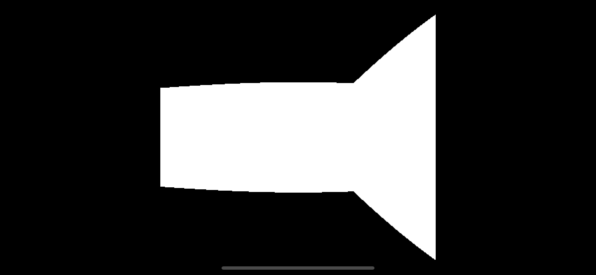

Try moving around - you should be able to walk around naturally by dragging the joystick up/down to move forwards/backwards, and left/right to turn. You'll notice that there's something a bit odd going on with the walls, but it's hard to tell exactly what it is when the view is so small and every surface is pure white.

### Let There Be Light(ing)

Eventually we'll be adding wall textures which will help with the contrast, but in the meantime, maybe we could do something to add some contrast?

Early 3D games tended to use very simple lighting systems, as true, dynamic lights were too expensive. Wolfenstein actually had no lighting *at all*, it just used darker wall textures for North/South facing walls to add contrast.

We don't have textures yet, but we can replicate Wolfenstein's approach by simply using two color tones. We know that walls are aligned on a 1x1 grid, so a wall coordinate with an exact integer Y value must be a North/South facing. In `Renderer.draw()`, replace the line

```swift
let wallColor = Color.white
```

with:

```swift
let wallColor: Color
if end.x.rounded(.down) == end.x {
    wallColor = .white
} else {
    wallColor = .gray
}
```

Run the app again and you'll be able to see more clearly now where one wall ends and the next begins.

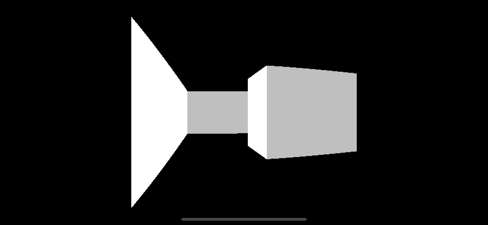

### A Wider Perspective

It would also help if we could see a bit more of the scene at once. We originally used a square aspect ratio for the bitmap because that matched up with the dimensions of the world, but now we've switched to a first-person perspective it seems a shame not to take advantage of the iPhone's glorious widescreen.

Let's extend the bitmap to fill the full screen width. In `ViewController.update()` replace the lines:

```swift
let size = Int(min(imageView.bounds.width, imageView.bounds.height))
var renderer = Renderer(width: size, height: size)
```

with:

```swift
let width = Int(imageView.bounds.width), height = Int(imageView.bounds.height)
var renderer = Renderer(width: width, height: height)
```

Now run the app again. The view now fills the screen, but it looks stretched. Each wall tile ought to be square, but if you look at that doorway in front of us, it's clearly wider than it is tall.

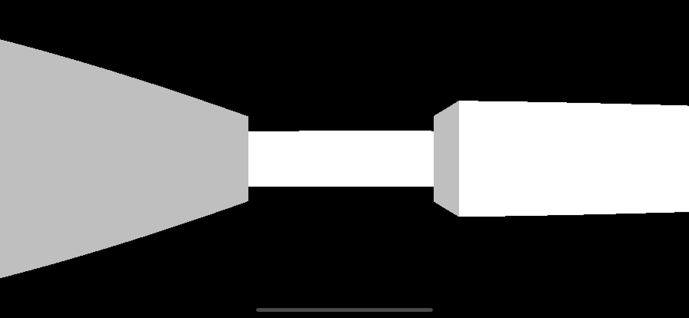

The stretching effect is because we changed the aspect ratio of the bitmap without updating the width of the view plane accordingly. As far as the code is concerned, the view plane is still square, but we're now stretching it to fill a rectangular bitmap. To fix that, in `Renderer.draw()`, replace the line:

```swift
let viewWidth = 1.0
```

with:

```swift
let viewWidth = Double(bitmap.width) / Double(bitmap.height)
```

Running the app again, you can see that we've fixed the stretching effect. Since the focal length is the same but the view width is wider, we've also increased the *field of view*<sup><a id="reference2"></a>[[2]](#footnote2)</sup>.

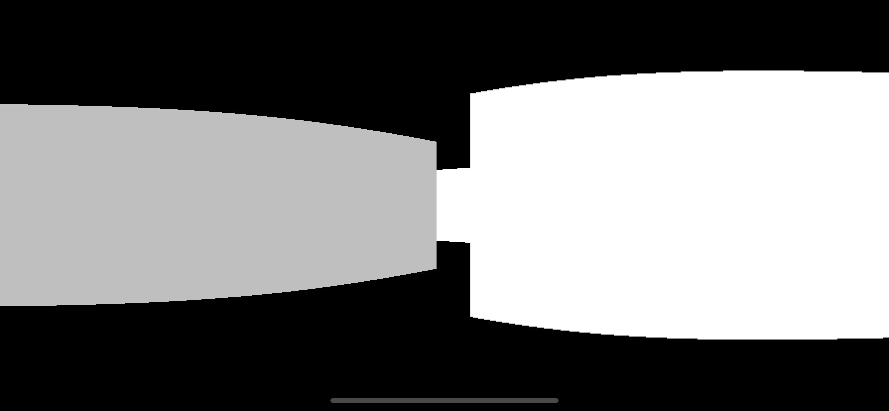

It's now also a bit easier now to see what's going on with the walls. They're... curved? *How are the walls curved?! Literally every line we've drawn is straight!*

### Fishy Business

When the fan of rays hits a wall perpendicular to the player, the further the ray is from the center of the view, the longer it is. Since we are using the length of the ray to compute the distance from the wall, that means that parts of the wall further from the center appear further away, causing a *fisheye* effect as the wall bends away from the camera.

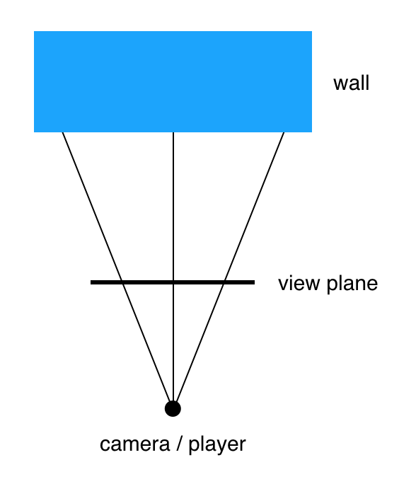

What we really need to use is not the *length* of the ray but the perpendicular distance from the end of the ray to the view plane. We could use Pythagoras's Theorem<sup><a id="reference3"></a>[[3]](#footnote3)</sup> to derive the perpendicular length from the ray length, but we would need to know the length of the opposite side of the triangle, which we currently don't.

Fortunately, we can make use of the handy fact that the ratio between the lengths of the sides doesn't change when you scale a triangle up or down<sup><a id="reference4"></a>[[4]](#footnote4)</sup>. 

Wherever the ray hits a wall, the triangle it forms perpendicular to the view plane will have the same proportions as the triangle that the ray forms with the view plane itself, which we already know all the sides of. So we can calculate the perpendicular length as follows:

1. Compute the vector from the player to the view plane along the ray (which happens to be the vector we already used for the ray direction).
2. Divide the length of that vector by the focal length to get the ratio between distance and perpendicular distance.
3. Divide the distance from the wall by the ratio to get the perpendicular distance to the wall.

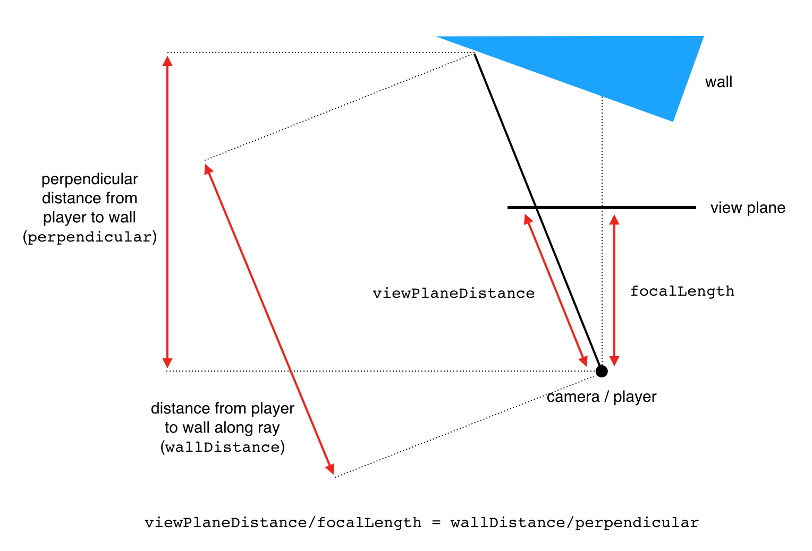

To implement that in code, in `Renderer.draw()` replace the line:

```swift
let height = wallHeight * focalLength / wallDistance * Double(bitmap.height)
```

with:

```swift
let distanceRatio = viewPlaneDistance / focalLength
let perpendicular = wallDistance / distanceRatio
let height = wallHeight * focalLength / perpendicular * Double(bitmap.height)
```

Run the app again and you should see that all trace of curvature has disappeared.

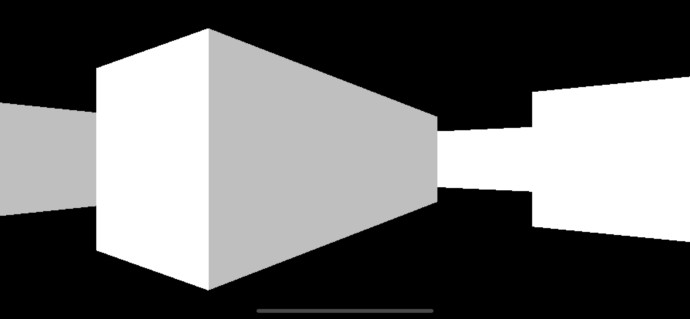

And that will do for now. To recap, in this part we...

* Implemented ray casting to detect walls in the player's field of view
* Changed from a directional to a rotational control scheme
* Switched to a first-person perspective
* Added simple lighting

In [Part 4](Part4.md) we'll redecorate a bit and add some *texture* to our world.

<hr>

<a id="footnote1"></a>[[1]](#reference1) If you're curious how the field of view angle was derived, the point where the line of sight meets the view plane forms a right-angled triangle. Using [SOHCAHTOA](http://mathworld.wolfram.com/SOHCAHTOA.html), with the `focalLength` as the *adjacent* side and half the `viewWidth` as the *opposite* side, the FoV (in radians) can be computed using the formula `fieldOfView = 2 * atan(viewWidth / 2 / focalLength)`. Multiply the result by `180 / .pi` to get the angle in degrees. 

<a id="footnote2"></a>[[2]](#reference2) If you recall, I mentioned before that the earlier value of 53 degrees for the field of view was a bit narrow? Well now it's ~90 degrees (assuming a screen aspect ratio of ~2:1 as found on X-series iPhones).

<a id="footnote3"></a>[[3]](#reference3) The squared length of the diagonal of a right-angle triangle is equal to the sum of the squares of the other two sides. We used this before in [Part 2](Part2.md) to calculate the length of a vector length from its X and Y components.

<a id="footnote4"></a>[[4]](#reference4) You can [thank Pythagoras](https://en.wikipedia.org/wiki/Pythagorean_theorem#Proof_using_similar_triangles) for that little factoid as well.
