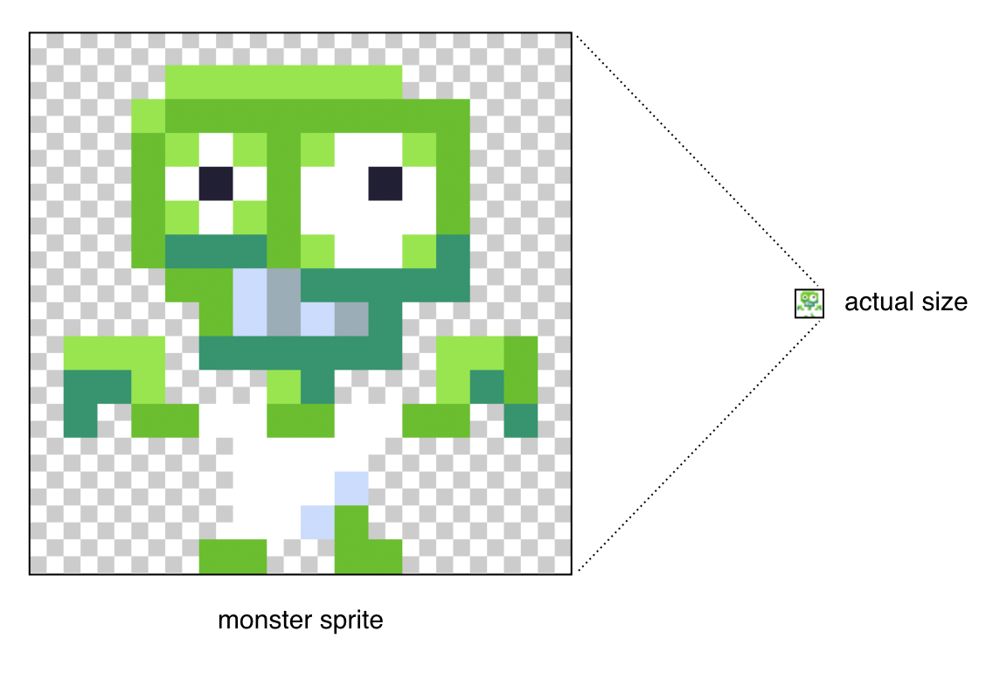
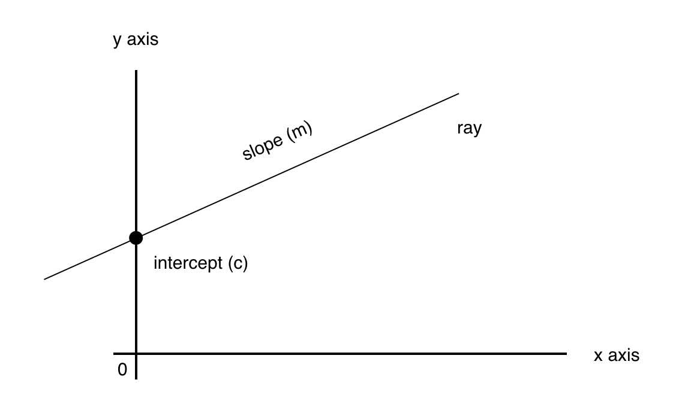
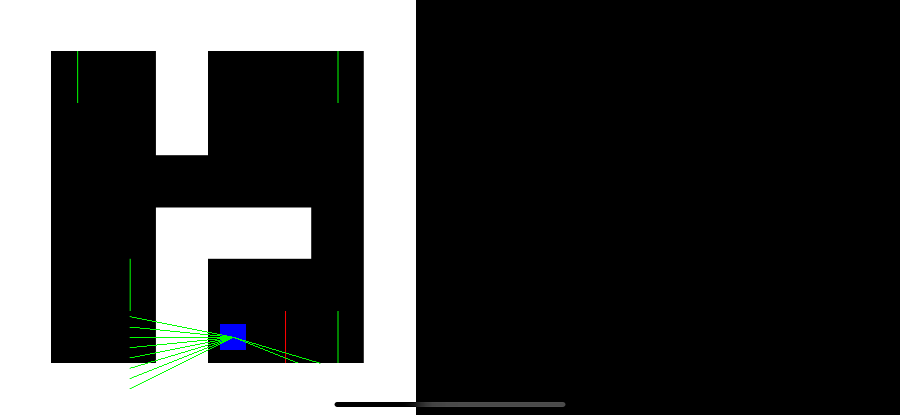
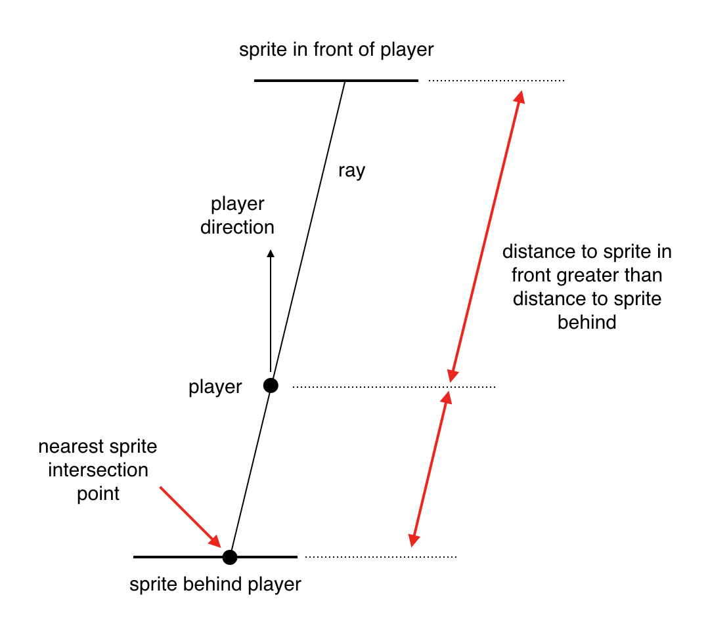
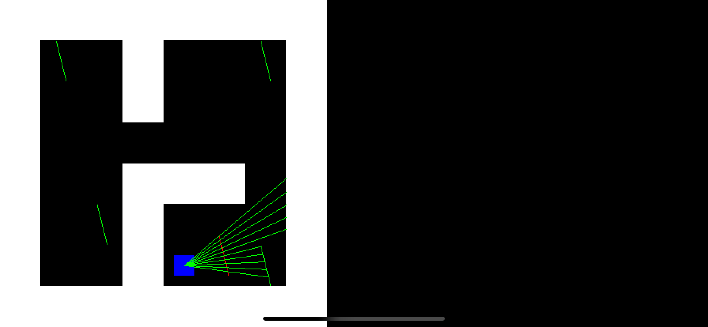
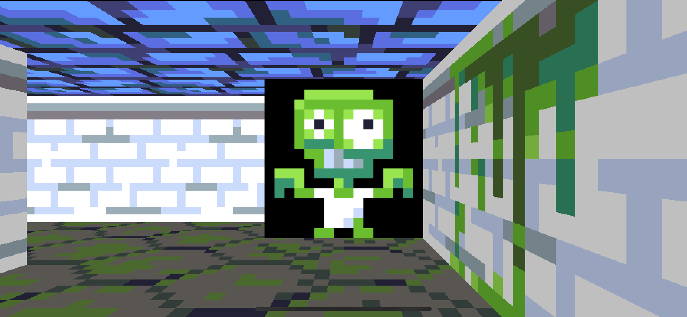
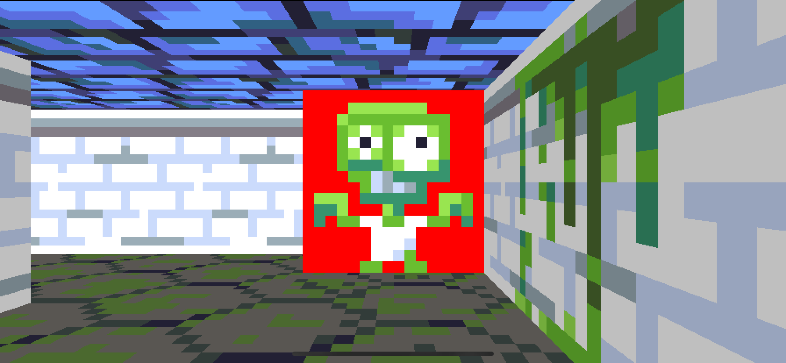
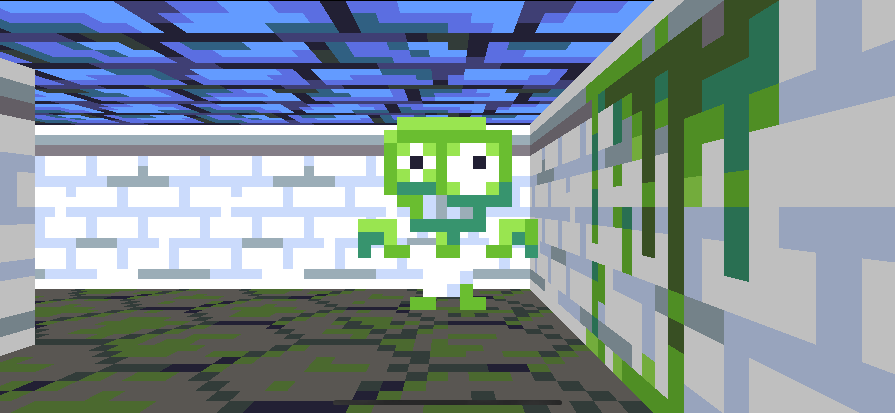
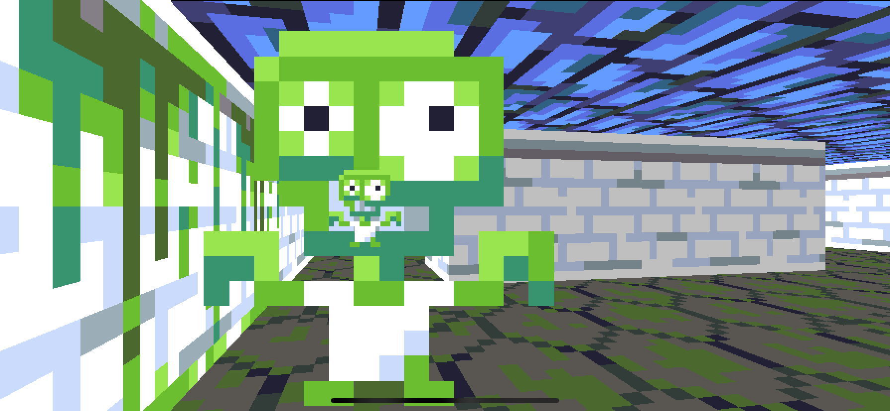
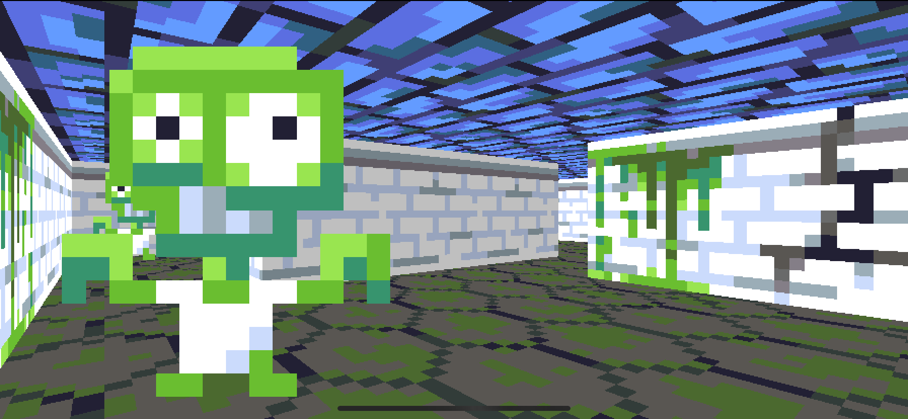

## Part 5: Sprites

In [Part 4](Part4.md) we added wall and floor textures to make our 3D environment more interesting. If you're just jumping in at this point, the code for Part 4 can be found [here](https://github.com/nicklockwood/RetroRampage/archive/Part4.zip).

So far we have succeeded in building a fairly compelling *wallpaper simulator*, however to make this into a game we'll need more than textured walls. It's time to add some other inhabitants to our world.

### Monsters, Inc.

Add a new file called `Monster.swift` to the Engine module with the following contents:

```swift
public struct Monster {
    public var position: Vector

    public init(position: Vector) {
        self.position = position
    }
}
```

In `Thing.swift`, add a `monster` case to the `Thing` enum:

```swift
public enum Thing: Int, Decodable {
    case nothing
    case player
    case monster
}
```

This new monster has an index of 2, so go ahead and add a bunch of `2`s to the `things` array in `Map.json`:

```swift
"things": [
    0, 0, 0, 0, 0, 0, 0, 0,
    0, 0, 2, 0, 0, 0, 2, 0,
    0, 0, 0, 0, 0, 0, 0, 0,
    0, 0, 0, 0, 0, 0, 0, 0,
    0, 0, 0, 0, 0, 0, 0, 0,
    0, 0, 2, 0, 0, 0, 0, 0,
    0, 0, 0, 0, 1, 0, 2, 0,
    0, 0, 0, 0, 0, 0, 0, 0
]
```

Finally, in `World.swift` add a `monsters` property to the `World` struct, and update the `switch` inside `init()` to handle the `monster` case:

```swift
public struct World {
    ...
    public var monsters: [Monster]

    public init(map: Tilemap) {
        self.map = map
        self.monsters = []
        for y in 0 ..< map.height {
            for x in 0 ..< map.width {
                let position = Vector(x: Double(x) + 0.5, y: Double(y) + 0.5)
                let thing = map.things[y * map.width + x]
                switch thing {
                case .nothing:
                    break
                case .player:
                    self.player = Player(position: position)
                case .monster:
                    self.monsters.append(Monster(position: position))
                }
            }
        }
    }
}
```

That takes care of placing the monsters in the world, but how do we *draw* them?

### Spritely Creatures

Modern games use 3D models made from textured polygons. While this approach produces incomparable visual and animation detail, it requires a complex toolchain and engine to work with 3D assets. Back in the early '90s, the technology to render detailed 3D models in real time simply didn't exist, so a different solution had to be found. That solution was [sprites](https://en.wikipedia.org/wiki/Sprite_%28computer_graphics%29).

A *sprite* is just a fancy term for an image that moves around on the screen independently of the background. Sprites were employed in 2D games from the very earliest days of computing, and many arcade machines and consoles had dedicated hardware for handling sprites.

By scaling a sprite in proportion to its distance from the viewer, it can be used to simulate a 3D object<sup><a id="reference1"></a>[[1]](#footnote1)</sup>. Flat, 2D images might seem like a poor way to represent something solid, but from a first-person perspective, a flat image that always rotates to face the viewer can be pretty convincing.

Because sprites must always face the player, they can't rotate freely. Rotating the plane on which the sprite is drawn would just reveal its lack of depth and break the illusion. In order for a sprite-based character to appear to face away from the player, the sprite has to be swapped out for another image drawn from a different angle.


The original DOS version of Wolfenstein used characters drawn from eight different orientations to simulate rotation, but this meant eight copies of every animation frame and pose - a huge amount of work for the artists, as each frame had to be drawn by hand. Later ports of the game such as the [SNES and Mac versions](https://wolfenstein.fandom.com/wiki/Mac_Family) saved memory by doing away with the multiple orientations and simply drawing every enemy facing the player at all times<sup><a id="reference2"></a>[[2]](#footnote2)</sup>.

We'll keep things simple and just use a single image for the monster for now. The monster sprite will be one world unit in size - the same width and height as a wall tile. As with the walls, I've used a 16x16 image for the sprite image, but feel free to use whatever resolution you like as long as it's square.



The monster sprite does not need to completely fill the bounds of the image, but its feet should touch the bottom edge (unless you want it to hover). The background behind the monster should be transparent (i.e. the pixels should have an alpha component of zero). If you would like to use my terrible artwork, you can download it [here](https://github.com/nicklockwood/RetroRampage/tree/Part5/Source/Rampage/Assets.xcassets/monster.imageset).


Add an XCAsset image called `monster`, then add a `monster` case to the `Texture` enum in `Textures.swift`:

```swift
public enum Texture: String, CaseIterable {
    case wall, wall2
    case crackWall, crackWall2
    ...
    case monster
}
```

To draw each monster we need to create a [billboard](https://en.wikipedia.org/wiki/2.5D#Billboarding) - a textured rectangle that always faces the player. As with the view plane, we can model this rectangle as a line because only its X and Y coordinates ever change.

This next part will be much easier to visualize in 2D. In `Renderer.swift`, add a new method called `draw2D` containing the top-down drawing code we we used back in [Part 3](Part3.md):

```swift
mutating func draw2D(_ world: World) {
    let scale = Double(bitmap.height) / world.size.y

    // Draw map
    for y in 0 ..< world.map.height {
        for x in 0 ..< world.map.width where world.map[x, y].isWall {
            let rect = Rect(
                min: Vector(x: Double(x), y: Double(y)) * scale,
                max: Vector(x: Double(x + 1), y: Double(y + 1)) * scale
            )
            bitmap.fill(rect: rect, color: .white)
        }
    }

    // Draw player
    var rect = world.player.rect
    rect.min *= scale
    rect.max *= scale
    bitmap.fill(rect: rect, color: .blue)

    // Draw view plane
    let focalLength = 1.0
    let viewWidth = 1.0
    let viewPlane = world.player.direction.orthogonal * viewWidth
    let viewCenter = world.player.position + world.player.direction * focalLength
    let viewStart = viewCenter - viewPlane / 2
    let viewEnd = viewStart + viewPlane
    bitmap.drawLine(from: viewStart * scale, to: viewEnd * scale, color: .red)

    // Cast rays
    let columns = 10
    let step = viewPlane / Double(columns)
    var columnPosition = viewStart
    for _ in 0 ..< columns {
        let rayDirection = columnPosition - world.player.position
        let viewPlaneDistance = rayDirection.length
        let ray = Ray(
            origin: world.player.position,
            direction: rayDirection / viewPlaneDistance
        )
        let end = world.map.hitTest(ray)
        bitmap.drawLine(from: ray.origin * scale, to: end * scale, color: .green)
        columnPosition += step
    }
}
```

Then in `ViewController.update()`, replace the line:

```swift
renderer.draw(world)
```

with:

```swift
renderer.draw2D(world)
```

Although we have a method for drawing a line, we don't currently have a way to *model* one as a self-contained value. You might be thinking that `Ray` does this job, but `Ray` only has a start point and direction so its length is infinite/unspecified, whereas a line has a start *and* end point, so its length is part of the definition.

Create a new file in the Engine module called `Billboard.swift` with the following contents:

```swift
public struct Billboard {
    var start: Vector
    var direction: Vector
    var length: Double

    public init(start: Vector, direction: Vector, length: Double) {
        self.start = start
        self.direction = direction
        self.length = length
    }
}

public extension Billboard {
    var end: Vector {
        return start + direction * length
    }
}
```

Now, for every monster in the level, we need to create a `Billboard` that represents its sprite. Since the sprites all face the player, the plane of every sprite will be parallel to the view plane, which is itself orthogonal to the player's direction:

```swift
let spritePlane = player.direction.orthogonal
```

The width of the sprites will always be one world unit, so the length of the plane is already correct. We just need to subtract half of that length from each monster's position to get the starting points of their respective sprite billboards. Let's add a computed property to `World` that returns the billboards for each monster sprite. Add the following code in `World.swift`:

```swift
public extension World {
    ...
 
    var sprites: [Billboard] {
        let spritePlane = player.direction.orthogonal
        return monsters.map { monster in
            Billboard(
                start: monster.position - spritePlane / 2,
                direction: spritePlane,
                length: 1
            )
        }
    }
}
```

Now to draw those lines. Append the following code to the end of the `draw2D()` method in `Renderer.swift`:

```swift
// Draw sprites
for line in world.sprites {
    bitmap.drawLine(from: line.start * scale, to: line.end * scale, color: .green)
}
```

Now run the game again. If you move around you'll see that the green lines representing the monster sprites always rotate to face the direction of the player<sup><a id="reference3"></a>[[3]](#footnote3)</sup>.


The view rays currently pass right through the sprites to the wall behind. In order to draw the sprites in 3D we will need to find where the rays intersect them. In `Billboard.swift` add the following placeholder method:

```swift
public extension Billboard {
    ...
    
    func hitTest(_ ray: Ray) -> Vector? {
    
    }
}
```

This should look familiar - we wrote a similar method on `Tilemap` previously. In that case we were looking for the intersection point between a `Ray` and a grid of map tiles. So how do we find the intersection point between a `Ray` and a `Billboard`?

The first step is to convert the lines of the `Ray` and `Billboard` to [slope-intercept form](https://en.wikipedia.org/wiki/Linear_equation#Slope–intercept_form). The slope intercept equation defines the relationship between the X and Y coordinates along a line as:

```swift
y = m * x + c
```

In this equation, `m` is the slope of the line and `c` is the Y value at the point where the line crosses the Y axis (i.e. where X is zero).



Mathematicians love to use single-letter variable names for some reason, but in the programming world that's generally considered an anti-pattern, so let's rewrite that more explicitly:

```swift
y = slope * x + intercept
```

Slope-intercept form discards the length information, so there is no difference between the slope for a line segment or a ray. For that reason, we might as well convert the `Billboard` to a `Ray`, then we can avoid having to duplicate the logic for multiple types. Add the following line to `Billboard.hitTest()`:

```swift
let lhs = ray, rhs = Ray(origin: start, direction: direction)
```

This code assigns the incoming ray to a local variable (`lhs` - short for *left-hand side*) and creates a `Ray` instance from the billboard itself, which we assign to the `rhs` variable.

Now that we have two rays, we need to compute their slope intercept parameters. To get the slope of a ray, we need to take the `direction` vector and divide it's height by its width:

```
let slope = direction.y / direction.x
```

If we rearrange the slope intercept equation by subtracting `slope * x` from both sides, we get `y - slope * x = intercept`. We already have a known position on the ray - its `origin` - so if we plug in the `origin` values for `x` and `y` that will give us the intercept value:

```
let intercept = origin.y - slope * origin.x
```

Because the intercept depends on the slope, instead of having two separate properties, we'll combine slope and intercept into a single *tuple*. Add the following computed property to `Ray.swift`:

```swift
public extension Ray {
    ...
    
    var slopeIntercept: (slope: Double, intercept: Double) {
        let slope = direction.y / direction.x
        let intercept = origin.y - slope * origin.x
        return (slope, intercept)
    }
}
```

Back in the `Billboard.swift` file, add the following code to `hitTest()`:

```swift
// Calculate slopes and intercepts
let (slope1, intercept1) = lhs.slopeIntercept
let (slope2, intercept2) = rhs.slopeIntercept
```

You may have noticed that unlike the `Tilemap.hitTest()` method, `Billboard.hitTest()` returns an *optional* `Vector`. That's because its possible that the ray doesn't intersect the billboard at all. One case where this could happen is if the ray and billboard are parallel, which would mean their slope values would be equal. Let's add a check for that:

```swift
// Check if slopes are parallel
if slope1 == slope2 {
    return nil
}
```

What's next? Well, we have our slope intercept equations for the two lines:

```swift
y = slope1 * x + intercept1
y = slope2 * x + intercept2
```

These are [simultaneous equations](https://en.wikipedia.org/wiki/System_of_linear_equations) - two separate equations that have two variables in common. In this case the variables are the X and Y coordinates of the point where the two lines cross.

You solve a pair of simultaneous equations by defining one in terms of the other. We can replace `y` in the second equation with the body of the first equation, eliminating the `y` variable so we only need to find `x`:

```swift
slope1 * x + intercept1 = slope2 * x + intercept2
```

Rearranging this equation then gives us the formula for `x` in terms of values we already know:

```swift
let x = (intercept1 - intercept2) / (slope2 - slope1)
```

We now have the X coordinate of the intersection point between the ray and billboard. Given X, we can use the `y = m * x + c` equation that we started with to find Y:

```swift
let y = slope1 * x + intercept1
```

Putting it all together, the code for the `Billboard.hitTest()` function is:

```swift
func hitTest(_ ray: Ray) -> Vector? {
    let lhs = ray, rhs = Ray(origin: start, direction: direction)

    // Calculate slopes and intercepts
    let (slope1, intercept1) = lhs.slopeIntercept
    let (slope2, intercept2) = rhs.slopeIntercept

    // Check if slopes are parallel
    if slope1 == slope2 {
        return nil
    }

    // Find intersection point
    let x = (intercept1 - intercept2) / (slope2 - slope1)
    let y = slope1 * x + intercept1

    return Vector(x: x, y: y)
}
```

Unfortunately there's an edge case (isn't there always?). For a perfectly vertical ray, the value of `direction.x` will be zero, which means that `direction.y / direction.x` will be infinite, and pretty soon we're going to end up with [NaNs](https://en.wikipedia.org/wiki/NaN) everywhere.

We could add a bunch of logic to handle vertical rays as a special case, but instead we're going to use a time-honored tradition when working with floating point numbers - we're going to *fudge* it. When `direction.x` is zero (or very close to zero), we'll just add a small offset to the value (you may recall that we already used this trick once before when we added `0.001` to the texture coordinate in Part 4 to fix a rounding error). 

In `Billboard.hitTest()`, replace the following:

```swift
let lhs = ray, rhs = Ray(origin: start, direction: direction)
```

with:

```swift
var lhs = ray, rhs = Ray(origin: start, direction: direction)

// Ensure rays are never exactly vertical
let epsilon = 0.00001
if abs(lhs.direction.x) < epsilon {
    lhs.direction.x = epsilon
}
if abs(rhs.direction.x) < epsilon {
    rhs.direction.x = epsilon
}
```

The `epsilon` constant is the offset in world units. There's no great science to choosing this value - it just needs to be small enough that it won't be noticeable if an object is misplaced by this amount in the world, but large enough not to cause precision issues in the subsequent calculations<sup><a id="reference4"></a>[[4]](#footnote4)</sup>.

Now we have calculated the intersection point between the lines, let's update the drawing code so that the rays stop when they hit a sprite. In `Renderer.draw2D()`, in the `// Cast rays` section, replace the line:

```swift
let end = world.map.hitTest(ray)
```

with:

```swift
var end = world.map.hitTest(ray)
for sprite in world.sprites {
    guard let hit = sprite.hitTest(ray) else {
        continue
    }
    let spriteDistance = (hit - ray.origin).length
    if spriteDistance > (end - ray.origin).length {
        continue
    }
    end = hit
}
```

This logic loops through each sprite and checks if the ray hits it. If it does, it compares the distance from the player to the hit position with the distance to the current `end`, and updates `end` if the new position is closer. Run the game again and see how it looks.



Hmm... not quite the effect we were hoping for. Several of the rays seem to be going the wrong way and/or stopping in mid-air.

The problem is, our ray-to-billboard intersection code doesn't currently take the `origin` point of the ray into account. We are treating the ray as if it extends indefinitely in *both* directions. The rays in the top-down view are going the wrong way because the sprite behind us is closer than the one in front, and the slopes formed by the ray and that sprite *do* in fact intersect, even though they do so behind the player.



We need to update the `hitTest()` method to return `nil` if the intersection point between the lines is outside the range we want to test. We can do that by checking if the vector between the ray origin and the intersection point lies in the same direction as the ray itself.

Subtracting the ray origin from the intersection point gives us the direction vector. We can check if that direction matches the ray direction by comparing the signs of the X and Y components.

```swift
guard (x - lhs.origin.x).sign == lhs.direction.x.sign &&
    (y - lhs.origin.y).sign == lhs.direction.y.sign else {
    return nil
}
```

But actually, since the X and Y components of a vector are both proportional to its length, and because of our hack that guarantees that `direction.x` will never be zero, we can figure this out using just the X components instead of the whole vector.

If we take the X component of the vector from the ray origin to the intersection point, and divide it by the X component of the direction, the result will be proportional to the distance of the intersection point along the ray. If that result is less than zero it means that the intersection happens before the origin point of the ray (i.e. that the sprite is behind the player), so we can ignore it.

In `Billboard.hitTest()` add the following code just before the line `return Vector(x: x, y: y)`:

```swift
// Check intersection point is in range
let distanceAlongRay = (x - lhs.origin.x) / lhs.direction.x
if distanceAlongRay < 0 {
    return nil
}
```

We also need to check that the intersection point lies between the start and end points of the sprite's billboard, otherwise the rays will stop in mid-air every time they cross any sprite plane. Add the following lines below the code we just wrote:

```swift
let distanceAlongBillboard = (x - rhs.origin.x) / rhs.direction.x
if distanceAlongBillboard < 0 || distanceAlongBillboard > length {
    return nil
}
```

Run the game again and you should see that the rays all travel in the right direction, and no longer stop in mid-air.



Now that we've got the intersection logic figured out, we can switch back to first-person perspective and draw the sprites in 3D.

### Erase and Rewind

In `ViewController.update` restore the line:

```swift
renderer.draw2D(world)
```

back to:

```swift
renderer.draw(world)
```

Then, back in `Renderer.swift`, delete the `draw2D()` method, as we won't be needing it anymore.

Next, add the following code to the `Renderer.draw()` method, just before the line `columnPosition += step`:

```swift
// Draw sprites
for sprite in world.sprites {
    guard let hit = sprite.hitTest(ray) else {
        continue
    }
    let spriteDistance = (hit - ray.origin).length
    
}
```

As in the `draw2D` method, we need to compare the distance from the sprite to the player with the distance from the wall to the player. But in this case, we already have the distance from the player to the wall stored in the `wallDistance` variable so we don't need to calculate it. Add the following code to the loop:

```swift
if spriteDistance > wallDistance {
    continue
}
```

From the `spriteDistance` we can derive the height at which to draw the sprite - it's the same exact logic we used to draw the wall previously:

```swift
let perpendicular = spriteDistance / distanceRatio
let height = wallHeight / perpendicular * Double(bitmap.height)
```

Now we need to derive the X coordinate to use for the sprite texture. This is proportional to the distance from the start of the sprite billboard to the hit position, divided by the billboard's length:

```swift
let spriteX = (hit - sprite.start).length / sprite.length
let textureX = Int(spriteX * Double(wallTexture.width))
```

The rest of the code is the same as for drawing the walls. Putting it all together we have:

```swift
// Draw sprites
for sprite in world.sprites {
    guard let hit = sprite.hitTest(ray) else {
        continue
    }
    let spriteDistance = (hit - ray.origin).length
    if spriteDistance > wallDistance {
        continue
    }
    let perpendicular = spriteDistance / distanceRatio
    let height = wallHeight / perpendicular * Double(bitmap.height)
    let spriteX = (hit - sprite.start).length / sprite.length
    let textureX = Int(spriteX * Double(wallTexture.width))
    let spriteTexture = textures[.monster]
    let start = Vector(x: Double(x), y: (Double(bitmap.height) - height) / 2 + 0.001)
    bitmap.drawColumn(textureX, of: spriteTexture, at: start, height: height)
}
```

Run the app again and we should see... *Why, hello friend!*



Why is the wall behind the monster black? You might be thinking it's because we aren't drawing the wall if the ray hits the sprite first, but that isn't it - we draw the wall first and then draw the sprite on top. The problem is actually to do with *blending*.

### Will it Blend?

As you may recall, every pixel in the bitmap is represented by a `Color` struct with four components. The `r`, `g` and `b` properties determine the color, and the `a` (*alpha*) component controls the transparency.

Pixels with zero alpha should not be drawn to the screen. Ones with partial alpha values should be *blended* into the existing background color. At least, that's how it works normally on iOS. But we aren't using iOS to draw our pixels - we wrote our own drawing code.

Our sprite has a transparent background, but at the moment, when the sprite is drawn into the bitmap, its pixels just replace the ones that are already there. The transparent pixels in the sprite aren't blended with the background, *they make the background transparent*. So why does it appear black? Because the `UIImageView` has a black background, and we're seeing right through to that.

If we change the `UIImageView` background color to red, the background of the sprite will be red instead.



To fix this, we'll need to implement alpha blending in `Bitmap.drawColumn()`. So how do we do that?

In the era of indexed color, it wasn't practical to implement variable transparency (at least not without extremely clever palette management). Instead, games like Wolfenstein chose a single color in the palette to represent the transparency, and pixels that used that color were simply not drawn.

The sprite we are using at the moment only has either fully transparent or opaque pixels, but since we are using full 32-bit color for our sprites, we may as well add proper support for alpha blending. In pseudo-code, the equation for alpha blending is:

```swift
result = backgroundColor * (1 - alpha) + foregroundColor * alpha
```

In this equation `alpha` is a value in the range 0 to 1, with 0 being fully transparent and 1 being fully opaque. This operation is actually quite expensive, requiring two multiplications for every component (a total of six for the red, green and blue components) per pixel.

For this reason it is common practice to use an optimization called *premultiplied alpha* to eliminate half of those multiplications. With premultiplied alpha, the red, green and blue components in the image are premultiplied by the alpha component - i.e. every pixel in the image has already been multiplied by its alpha value. With premultiplied alpha, the blending equation is simplified to:

```swift
result = backgroundColor * (1 - alpha) + foregroundColor
```

So how do we know if our images are using premultiplied alpha or not? When we wrote the code to initialize a `Bitmap` from a `UIImage` we had to specify a `CGImageAlphaInfo` value, and the value we used was `premultipliedLast` which means that the color values in the bitmap *are* already premultiplied, so we can use the more efficient form of the blending equation.

In `Bitmap.swift`, add the following new method:

```swift
public extension Bitmap {
    ...

    mutating func blendPixel(at x: Int, _ y: Int, with newColor: Color) {
        let oldColor = self[x, y]
        let inverseAlpha = 1 - Double(newColor.a) / 255
        self[x, y] = Color(
            r: UInt8(Double(oldColor.r) * inverseAlpha) + newColor.r,
            g: UInt8(Double(oldColor.g) * inverseAlpha) + newColor.g,
            b: UInt8(Double(oldColor.b) * inverseAlpha) + newColor.b
        )
    }
}
```

Then in the `drawColumn()` method, replace the line:

```swift
self[Int(point.x), y] = sourceColor
```

with:

```swift
blendPixel(at: Int(point.x), y, with: sourceColor)
```

Run the app again and you'll see that the wall now shows through the background of the sprite.



### We Don't Like Your Sort

If you walk to the top-right corner of the map and stand behind the monster in that corner, looking down towards the monster in the bottom-right corner, you'll see something like this (that's assuming you're using the same map layout as we have in the tutorial - if not, you can just take my word for it).



What's going on there? Well, basically we're seeing the far-away monster *through* the nearer one. This doesn't happen with the walls because the ray casting algorithm always stops at the wall nearest the camera, but because sprites have transparent areas we can't just draw the nearest sprite or we wouldn't be able to see other sprites showing through the gaps.

The order in which we draw the sprites is determined by the order in which they are defined in the `things` array, so sprites that are further toward the bottom/right of the map will be drawn after (and therefore *on top of*) ones that are in the top/left, even if they are further away from the player.

This problem still plagues modern graphics engines, and a common solution is to use the [Painter's algorithm](https://en.wikipedia.org/wiki/Painter's_algorithm) - a fancy name for a simple idea: When a painter wants to draw a person in front of a mountain, they draw the mountain first, and then the person. So likewise, when we want to draw one sprite in front of another, we need to make sure we draw the more distant sprite first.

In other words, we need to sort the sprites according to their distance from the player before we draw them. In `Renderer.draw()`, add the following code just above the `// Draw sprites` comment:

```swift
// Sort sprites by distance
var spritesByDistance: [(distance: Double, sprite: Billboard)] = []
for sprite in world.sprites {
    guard let hit = sprite.hitTest(ray) else {
        continue
    }
    let spriteDistance = (hit - ray.origin).length
    spritesByDistance.append(
        (distance: spriteDistance, sprite: sprite)
    )
}
```

The first part of this loop looks a lot like the sprite drawing loop we already wrote. It iterates over the sprites, performs a hit test, then computes the distance. But instead of drawing anything, it appends a tuple of the distance and sprite itself to an array.

Just below the for loop, add the following line:

```swift
spritesByDistance.sort(by: { $0.distance > $1.distance })
```

This sorts the tuples in the array in reverse order of the `distance`, so the sprite with the greatest distance appears first in the array. Finally, in the `// Draw sprites` section below, replace the line:

```swift
for sprite in world.sprites {
```

with:

```swift
for (_, sprite) in spritesByDistance {
```

This means we are now looping through the pre-sorted tuples instead of the unsorted sprites. We aren't using the distance value from the tuple, so we discard it using the `_` syntax and just keep the sprite. Try running the game again and you should find that the problem with sprite order has been resolved.



### Measure Twice, Cut Once

It seems inefficient that we are performing the hit test twice for each sprite, discarding the result in between. It's tempting to either include the hit position in the sorted tuples so we can reuse it in the drawing loop, or compute extra values like `textureX` in the first loop and store the results so they need not be recalculated in the second.

This is the dangerous allure of *premature optimization*. It is easy to be distracted by small optimization opportunities, but applying a small optimization can often make it harder to recognize a larger one.

The hit test is certainly an expensive calculation to be doing twice, but we are actually doing something *far more* wasteful. The sorting loop creates an array of billboards for every sprite in the level, then copies them into another array, then sorts them by distance from the player, and it does this every frame, for every ray. There is one ray cast for every horizontal pixel on the screen, so that's ~1000 times per frame.

But because the sprites all face the player, their order doesn't change depending on their horizontal position on the screen. The (non-perpendicular) distance of each sprite varies depending on the angle of the ray, but the relative *order* of the sprites does not. That means we can hoist the sorting loop outside of the ray casting loop, and only do it once per frame instead of 1000 times.

In `Renderer.draw()`, move the following block of code from its current position to just above the `//Cast rays` comment:

```swift
// Sort sprites by distance
var spritesByDistance: [(distance: Double, sprite: Billboard)] = []
for sprite in world.sprites {
    guard let hit = sprite.hitTest(ray) else {
        continue
    }
    let spriteDistance = (hit - ray.origin).length
    spritesByDistance.append(
        (distance: spriteDistance, sprite: sprite)
    )
}
spritesByDistance.sort(by: { $0.distance > $1.distance })
```

At this point in the code we don't have a `ray` to use for the intersection test anymore, but we can use the distance from the player position to the starting point of the sprite billboard as an approximation. This won't always work correctly if two sprites are very close together, but the collision detection we'll add later should prevent that from happening anyway.

In the `// Sort sprites by distance` block, replace the lines:

```swift
guard let hit = sprite.hitTest(ray) else {
    continue
}
let spriteDistance = (hit - ray.origin).length
```

with:

```swift
let spriteDistance = (sprite.start - world.player.position).length
```

The `spriteDistance` value we are now using to sort the sprites is completely different from the one used inside the `//Draw sprites` loop. If we had "optimized" the rendering by combining those values, this (much more significant) optimization would not have been possible.

In fact, the optimization we have done here is *also* a bit premature, and we may have cause to regret it later, but it's a good illustration of the principle that small optimizations can impede larger ones.

That's it for Part 5. In this part we:

* Added monsters to the map
* Displayed the monsters in 3D using sprites
* Implemented alpha blending
* Learned a valuable lesson about premature optimization

In Part 6 (TBD) we will bring the monsters to life with collision detection and some rudimentary AI.

<hr>

<a id="footnote1"></a>[[1]](#reference1) Long before modern GPU technology, consoles such as the [SNES](https://en.wikipedia.org/wiki/Super_Nintendo_Entertainment_System) included [built-in support](https://en.wikipedia.org/wiki/Mode_7) for scaling and rotating sprites instead of just moving them around. 

<a id="footnote2"></a>[[2]](#reference2) It's a testament to the immersiveness of Wolfenstein that I never noticed this fact when playing the Mac version as a teenager (although I did notice that the Mac graphics, despite being twice the resolution of the PC version, were significantly inferior artistically).

<a id="footnote3"></a>[[3]](#reference3) If you're wondering why the map is left-aligned rather than centered as it was before, it's because we changed the aspect ratio of the output bitmap after we switched to a first-person view. The bitmap is now wider than it is tall, but the map is still square, so it only occupies the left-hand side.

<a id="footnote4"></a>[[4]](#reference4) You might be tempted to use some *official* value for `epsilon` like `.ulpOfOne`, but don't do that. Dividing by `.ulpOfOne` will produce a gigantic number right at the limit of `Double` precision, and will certainly cause errors in the subsequent calculations. 

