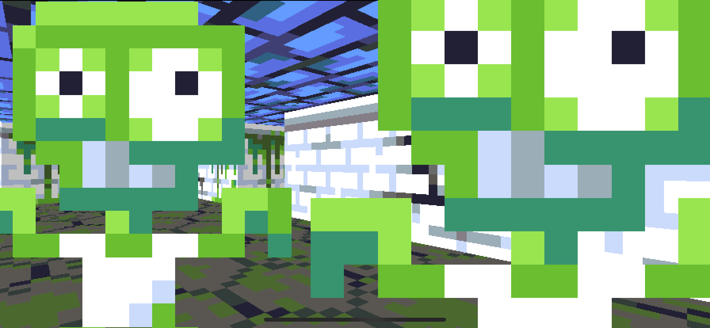

## Part 6: Enemy Action

In [Part 5](Part5.md) we added some monsters to the level, and displayed them using *sprites* - textured rectangles that scale with distance but always face the camera. The complete code for Part 5 can be found [here](https://github.com/nicklockwood/RetroRampage/archive/Part5.zip).

The monster sprites *look* good<sup><a id="reference1"></a>[[1]](#footnote1)</sup>, but they don't *do* very much. In fact we can walk right through them as if they weren't even there.

### Don't Ghost Me

The reason you can walk through the sprites is that they are ghosts. I know they look more like zombies, but they're actually ghosts. It's a feature, not a bug.

OK, *fine* - I suppose we can make them solid if you insist. To make the zombies less ghostly and more zombie-ie, we'll need to implement collision handling. Fortunately we already did almost all the work for this when we implemented player-wall collisions back in [Part 2](Part2.md).

To detect if the player was colliding with a wall, we modeled the player as a `Rect` and then did a `Rect`/`Rect` intersection test with the walls. We can use the same approach for `Player`/`Monster` collisions.

Start by copying the computed `rect` property from `Player.swift` and adding it to `Monster.swift` as follows:

```swift
public extension Monster {
    var rect: Rect {
        let halfSize = Vector(x: radius, y: radius)
        return Rect(min: position - halfSize, max: position + halfSize)
    }
}
```

That code depends on a `radius` property, so add a `radius` to the `Monster` as well:

```swift
public struct Monster {
    public let radius: Double = 0.25
    
    ...
}
```

Now, in`Player.swift`, add the following method to the end of the `Player` extension:

```swift
func intersection(with monster: Monster) -> Vector? {
    return rect.intersection(with: monster.rect)
}
```

This code is just a proxy to the `Rect.insersection()` method, which returns a vector representing the overlap between the rectangles (or `nil` if they don't intersect).

This gives us everything we need to determine if the player is colliding with a monster, and if so by how much we need to move them so that they won't be anymore. In `World.update()`, add the following block of code just above the `while` loop:

```swift
// Handle collisions
for monster in monsters {
    if let intersection = player.intersection(with: monster) {
        player.position -= intersection
    }
}
```

This code loops through every monster in the map, checks if the player is intersecting them, and if so moves the player away so that they aren't. This solution isn't necessarily perfect - it's possible that if you bumped into a group of monsters, you'd end up being buffeted from one into another, but it should be good enough since you expect a certain amount of squishiness if you walk into a monster, so it's not a big problem if the collision response has some looseness to it.

It's because of this looseness that we perform the monster collision loop *before* the wall collision loop - we don't mind if the player gets bounced from one monster into another, but we *definitely* don't want them to end up embedded in a wall, so we make sure that wall collisions are processed last.

Run the game now and you should find that you are no longer able to walk through the monsters

### You've Got to Give a Little

Something feels a bit... *off* about the collision handling right now. Walking into those monsters is like walking into a brick wall because they don't have any *give*. Since they are roughly the same size as the player, and assuming they aren't glued to the floor, you'd expect to be able to push them around.

Instead of applying the collision response solely to the player, what if we split it evenly between the player and monster, so that a collision pushes both player and monster in opposite directions?

In order to move the monsters, we'll need to change the loop a bit. Because the monsters are structs (value types) we can't modify the monster variable in the loop - we'll need to make a copy of the monster, modify that, and then assign it back to the correct position in the `monsters` array. Replace the `// Handle collisions` block we just wrote with the following:

```swift
// Handle collisions
for i in monsters.indices {
    var monster = monsters[i]
    if let intersection = player.intersection(with: monster) {
        player.position -= intersection
    }
    monsters[i] = monster
}
```

Instead of looping over the monsters directly, we are now looping over the *indices* of the array, which allows us to replace the original monster (that's what the `monsters[i] = monster` line is doing at the end of the loop<sup><a id="reference2"></a>[[2]](#footnote2)</sup>. Still in the same block of code, replace the line:

```swift
player.position -= intersection
```

with:

```swift
player.position -= intersection / 2
monster.position += intersection / 2
```

Now, when we bump into a monster, it will be pushed back. Because we're also being pushed back, we will move more slowly when pushing, making the interaction feel more realistic.

Try running the game now and pushing some monsters around. Pretty soon, you'll notice we've introduced a new problem.


### They're in the Walls!

Now that we can push the monsters, we can push them *through walls*. So far, all our collision handling has been player-centric, but now that monsters can move (even if it's not of their own volition), they need their own collision logic.

We already have a method to detect collisions between the player and the walls, and since the player and monster are both represented by rectangles, we can re-use that collision logic. The problem is that currently the `intersection(with:)` method we need is a member of the `Player` type, and we don't really want to copy and paste it into `Monster`. It's time for a refactor.

The `Monster` and `Player` types have a bunch of properties and behavior in common, so it makes sense to allow them to share these via a common abstraction. In a traditional object-oriented language like Objective-C or Java, we might have done this by making them inherit from a common superclass, but in our game these are structs rather than classes, so they don't support inheritance.

We could make them into classes, but this has all sorts of downsides, such as losing the ability to magically add serializion via the `Codable` protocol, or easily adding multithreading due to the data structures all being immutable, so let's not do that. Fortunately, Swift has a nice mechanism for sharing logic between value types, in the form of *protocol extensions*.

Create a new file in the Engine module called `Actor.swift`, with the following contents:

```swift
public protocol Actor {
    var radius: Double { get }
    var position: Vector { get set }
}
```

"Actor" is a generic term for entities such as the player, non-player-characters, scenery, or anything else that potentially moves or has agency within the game, as per this description from [Game Coding Complete](https://www.amazon.co.uk/gp/product/1133776574/ref=as_li_tl?ie=UTF8&camp=1634&creative=6738&creativeASIN=1133776574&linkCode=as2&tag=charcoaldesig-21&linkId=5b73f74ee5a9de652e35f8c305266802):

> A game actor is an object that represents a single entity in your game world. It could be an ammo pickup, a tank, a couch, an NPC, or anything you can think of. In some cases, the world itself might even be an actor. It’s important to define the parameters of game actors and to ensure that they are as flexible and reusable as possible.

The `Actor` protocol we've defined makes the guarantee that any object conforming to it will have a read-only `radius` property, and a read-write `position`, which is everything we need to implement collision handling.

In `Player.swift`, replace the following line:

```swift
public struct Player {
```

with:

```swift
public struct Player: Actor {
```

That says that `Player` conforms to the `Actor` protocol. We don't have to do anything else to conform to the protocol because `Player` already has a `radius` and `position` property.

Next, cut the entire `public extension Player { ... }` block from `Player.swift`, and paste it into the `Actor.swift` file. Then replace all references to `Player` or `Monster` with `Actor`. The result should look like this:

```swift
public extension Actor {
    var rect: Rect {
        let halfSize = Vector(x: radius, y: radius)
        return Rect(min: position - halfSize, max: position + halfSize)
    }

    func intersection(with map: Tilemap) -> Vector? {
        let minX = Int(rect.min.x), maxX = Int(rect.max.x)
        let minY = Int(rect.min.y), maxY = Int(rect.max.y)
        var largestIntersection: Vector?
        for y in minY ... maxY {
            for x in minX ... maxX where map[x, y].isWall {
                let wallRect = Rect(
                    min: Vector(x: Double(x), y: Double(y)),
                    max: Vector(x: Double(x + 1), y: Double(y + 1))
                )
                if let intersection = rect.intersection(with: wallRect),
                    intersection.length > largestIntersection?.length ?? 0 {
                    largestIntersection = intersection
                }
            }
        }
        return largestIntersection
    }

    func intersection(with actor: Actor) -> Vector? {
        return rect.intersection(with: actor.rect)
    }
}
```

Now we'll do the same for `Monster`. In `Monster.swift` replace:

```swift
public struct Monster {
```

with:

```swift
public struct Monster: Actor {
```

Then you can delete the `public extension Monster { ... }` block completely, since the computed `rect` property is now inherited from the `Actor` protocol.

That's the beauty of Swift's protocol extensions. In Objective-C it was possible for classes to conform to a common protocol, but they couldn't inherit behavior from it. In Swift however, we can extend the protocol with functionality that is then available to all types that conform to it. That even works for value types like struct that aren't polymorphic and don't support traditional inheritance.

Anyway, enough about how awesome Swift is - let's get on with the task at hand. In `World.update()`,  add the following code inside the `for` loop, just before the line `monsters[i] = monster`:

```swift
while let intersection = monster.intersection(with: map) {
    monster.position -= intersection
}
```

This applies the same wall collision logic we used for `Player` to every `Monster` in the map. Collision with walls is handled *after* collisions with the player, so that it overrides previous collision response handling - the monster may end up being pushed back into the player, but they shouldn't get pushed through a wall.

If you run the game again though, you'll see that's not quite the case.


It's no longer possible to push the monster right through the wall as before, but they still seem to be able to get stuck a little way into it - why is that?

In short, it's because we've used the wrong *radius*. We set the monster's radius to 0.25, meaning that it occupies half a tile's width. But the sprite graphic we are using for the monster is 14 pixels wide inside a 16-pixel texture. Since the texture is one tile wide, that means the monster is actually 14/16ths of a tile wide - equivalent to 0.875 tiles.


If the collision rectangle we use for the monsters is smaller than the sprite, the sprite will clip into the walls when the monster bumps up agains them. If we don't want that to happen, the correct radius to use for the monsters is 0.4375 (half of 0.875). In `Monster.swift`, change the line:

```swift
public let radius: Double = 0.25
```

to:

```swift
public let radius: Double = 0.4375
```

The monsters should no longer intersect the walls, however much you push them. But what about *other monsters*? It shouldn't be possible to push one monster right through another one, but right now there's nothing to prevent that. The collision handling should be able to prevent any monster from intersecting another.

In order to implement monster-monster collisions we'll need to do a pairwise collision test between each monster and every other monster. For that we'll need to add a second loop through all of the monsters, *inside* the first loop.

Back inside the `World.update()` method, find the line:

```swift
while let intersection = monster.intersection(with: map) {
```

Just above that line, add the following:

```swift
for j in monsters.indices where i != j {
    if let intersection = monster.intersection(with: monsters[j]) {
        monster.position -= intersection / 2
        monsters[j].position += intersection / 2
    }
}
```

This inner loop<sup><a id="reference3"></a>[[3]](#footnote3)</sup> runs through the monsters again, checking for an intersection between the current monster from the outer loop (`monsters[i]`) and the current monster in the inner loop (`monsters[j]`). The `where i != j` ensures we don't check if a monster is colliding with itself (which would always be true, leading to some interesting bugs).

If you're familiar with [Big O notation](https://en.wikipedia.org/wiki/Big_O_notation) for describing algorithmic complexity, this algorithm has a a *Big O* of O(n<sup>2</sup>), where *n* is the total number of monsters.

An algorithm with O(n<sup>2</sup>) complexity slows down rapidly with the number of elements, and is generally considered a *bad thing*. Modern physics engines use a variety of tricks to cut down the number of collision tests they need to perform, such as subdividing objects into buckets and only checking for collisions between objects in the same or neighboring buckets.

With such a small map and so few monsters, n<sup>2</sup> will never get large enough to be a problem, so we won't worry about it for now. There is, however, a trivial optimization we can make which will halve the work we are doing.

We're currently comparing every pair of monsters twice because we always compare `monsters[i]` with `monsters[j]` for every value of `i` and `j`. But if we've already compared `monsters[1]` with `monsters[2]` we don't *also* need to compare `monsters[2]` with `monsters[1]` because they're equivalent.

So it follows that for the inner `for` loop, we only need to loop over monsters that we have not *already* covered in the outer loop, so instead of looping through every index apart from `i`, we can just loop through every index *after* `i`. In `World.update()` replace the line:

```swift
for j in monsters.indices where i != j {
```

with:

```swift
for j in i + 1 ..< monsters.count {
```

That should take care of monster-monster collisions. Run the app again and you should find that you now can't push monsters through walls *or* each other.

The `// Handle collisions` code is maybe not the most beautiful we've written, but I'll leave refactoring it as an exercise for the reader because we have more interesting fish to fry. 

### Enemy State

The monsters have had enough of being pushed around - it's time they got their revenge. The only problem is, they don't actually have the power of independent thought. We need to give them some *artificial intelligence*.

There's an old joke in tech circles that when companies talk about their new software using "advanced AI", they probably mean it has a giant bunch of `if`/`else` statements. And it's funny because it's true - if you are trying to build a program that can "reason" about a situation and decide on a course of action, the simplest approach in most cases is to figure out all of the possible scenarios and then build a big `if` or `switch` statement with the appropriate responses to each of them.

The AI for non-player characters (including enemies) in a game can be built around a [state machine](https://en.wikipedia.org/wiki/Finite-state_machine). At any given point in time, the character is in a particular state. While in that state they have a certain behavior. Certain events or *triggers* will cause them to transition to a different state, with different behavior.

In Swift, the state machine can be implemented as a `switch` over an enum, with a bunch of `if`/`else` cases for handling state transitions. For now, we'll just define two states for the monsters - *idle* and *chasing*.

Each monster will start out in the *idle* state. When they see the player they will switch to the *chasing* state. In the chasing state, the monster will pursue the player until it can't see them anymore, at which point it will revert back to idle.


In `Monster.swift`, add the following code to the top of the file:

```swift
public enum MonsterState {
    case idle
    case chasing
}
```

Then add a `state` property to the `Monster` itself:

```swift
public struct Monster: Actor {
    ...
    public var state: MonsterState = .idle
    
    ...
}
```

In `World.update()`, insert the following block of code above the `// Handle collisions` section:

```swift
// Update monsters
for i in 0 ..< monsters.count {
    var monster = monsters[i]
    monster.update(in: self)
    monsters[i] = monster
}
```

Then, back in `Monster.swift` add the following block of code to the bottom of the file:

```swift
public extension Monster {
    mutating func update(in world: World) {
        switch state {
        case .idle:

        case .chasing:
        
        }
    }
}
```

Here we have the outline for the AI routine - now we need to write the implementations for the two states. In `idle` mode, all the monster needs to do is wait until it sees the player. That means we need a method to detect if the monster can see the player.

Since the monsters don't currently have a direction (they always face the player), we don't need to worry about their field of view. The only reason a monster *wouldn't* be able to see the player is if there was a wall between them. 

Still in `Monster.swift` add a `canSeePlayer()` method:

```swift
public extension Monster {
    ...
    
    func canSeePlayer(in world: World) -> Bool {
        
    }
}
```

The first thing we'll need to do is create a `Ray` from the monster to the `Player`. We've done this a few times now, so the code should require no explanation. Add the following lines to the start of the `canSeePlayer()` method:

```swift
let direction = world.player.position - position
let playerDistance = direction.length
let ray = Ray(origin: position, direction: direction / playerDistance)
```

We need to check if the view of the player is obstructed by a wall. We already have a way to check if a ray hits a wall, using the `Tilemap.hitTest()` method we wrote in [Part 3](Part3.md). Add the following line to the `canSeePlayer()` method:

```swift
let wallHit = world.map.hitTest(ray)
```

Now we have the point at which the ray intersects the map, we just need to check if the distance at which that occurs is closer or farther than the player. Add the following lines to complete the `canSeePlayer()` method:

```swift
let wallDistance = (wallHit - position).length
return wallDistance > playerDistance
```

Using that method, we can now implement the monster's AI. Replace the empty switch cases in `Monster.update()` with the following:

```swift
switch state {
case .idle:
    if canSeePlayer(in: world) {
        state = .chasing
    }
case .chasing:
    guard canSeePlayer(in: world) else {
        state = .idle
        break
    }
}
```

So now if the monster sees the player it will enter the `chasing` state, and if it it can't see the player anymore it will return to the `idle` state. Just one last thing to do - we need to make it actually chase the player!

### The Chase is On

The `Player` has a `speed` property to control their maximum speed. Let's add one to `Monster` too:

```swift
public struct Monster: Actor {
    public let speed: Double = 0.5
    ...
}
```

The player has a maximum speed of `2`, but we've set the monster's maximum speed to `0.5`. They're supposed to be zombies, so we don't really want them sprinting around. We may as well add a `velocity` property too while we're here:

```swift
public struct Monster: Actor {
    ...
    public var position: Vector
    public var velocity: Vector = Vector(x: 0, y: 0)
    public var state: MonsterState = .idle
    
    ...
}
```

In the `Monster.update()` method, add the following code inside `case .idle:`, after the `if` statement:

```swift
velocity = Vector(x: 0, y: 0)
```

Then, inside `case .chasing:`, after the `guard` statement, add the following:

```swift
let direction = world.player.position - position
velocity = direction * (speed / direction.length)
```

Finally, back in `World.upate()` in the `// Update monsters` section, just before the line `monsters[i] = monster`, add the following:

```swift
monster.position += monster.velocity * timeStep
```

With these additions, each monster will move towards the player whenever it can see them. Run the game again to check everything is working as expected (prepare to be mobbed!)



### An Animated Performance

It's pretty eery seeing the monsters float towards you like ghosts, but they are supposed to be zombies and zombies *stagger*, they don't float. It would help to improve the realism if the monsters had some animation.

Start by adding some walking frames for the monster.


The walking animation has four frames, but two of them are the same as the standing image we already have. Feel free to use as many or as few frames as needed for your own animation (you can also just use [these ones](https://github.com/nicklockwood/RetroRampage/tree/Part6/Source/Rampage/Assets.xcassets/) if you want).

Add the images for the walking animation to XCAssets, then in `Textures.swift` extend the `Texture` enum with these two additional cases, matching the names of the image assets:

```swift
public enum Texture: String, CaseIterable {
    ...
    case monster
    case monsterWalk1, monsterWalk2
}
```

We'll need a new type to represent the animation itself. In the Engine module, create a new file called `Animation.swift` with the following contents:

```swift
public struct Animation {
    public let frames: [Texture]
    public let duration: Double

    public init(frames: [Texture], duration: Double) {
        self.frames = frames
        self.duration = duration
    }
}
```

Then in `Monster.swift` add an `animation` property to `Monster`:

```swift
public struct Monster: Actor {
    ...
    public var state: MonsterState = .idle
    public var animation: Animation = .monsterIdle
    
    ...
}
```

It may seem like the monster only has one animation, but it really has two - it's just that the idle/standing animation only has a single frame. Still in `Monster.swift`, add the following code to the bottom of the file:

```swift
public extension Animation {
    static let monsterIdle = Animation(frames: [
        .monster
    ], duration: 0)
    static let monsterWalk = Animation(frames: [
        .monsterWalk1,
        .monster,
        .monsterWalk2,
        .monster
    ], duration: 0.5)
}
```

We've added the animations as static constants on the `Animation` type because it means we can conveniently reference them using dot syntax, thanks to Swift's type inference. But since these animations are specific to the monster sprite, it makes sense to keep them together in with the other `Monster`-specific code rather than in the `Animation.swift` file. 

Now, in the `Monster.update()` method, modify the state machine again to swap the animations:

```swift
switch state {
case .idle:
    if monster.canSeePlayer(in: self) {
        state = .chasing
        animation = .monsterWalk
    }
    velocity = Vector(x: 0, y: 0)
case .chasing:
    guard monster.canSeePlayer(in: self) else {
        state = .idle
        animation = .monsterIdle
        break
    }
    let direction = world.player.position - position
    velocity = direction * (speed / direction.length)
}
```

That's the data model side of animations taken care of, but what about the *rendering* side? Right now the renderer is just hard-coded to show the monster's standing image for each sprite. The renderer is going to need to know which animation frame to draw.

Open `Billboard.swift` and add a `texture` property and initializer argument:

```swift
public struct Billboard {
    public var start: Vector
    public var direction: Vector
    public var length: Double
    public var texture: Texture

    public init(start: Vector, direction: Vector, length: Double, texture: Texture) {
        self.start = start
        self.direction = direction
        self.length = length
        self.texture = texture
    }
}
```

Then, in `Renderer.draw()`, in the `// Draw sprites` section, replace the line:

```swift
let spriteTexture = textures[.monster]
```

with:

```swift
let spriteTexture = textures[sprite.texture]
```

It's now up to the `World` to supply the correct frame texture for each sprite billboard at a given point in time, but which frame should it select? We need to introduce a concept of the *current frame* for an animation.

Back in `Animation.swift`, add a `time` property to the `Animation` struct:

```swift
public struct Animation {
    public let frames: [Texture]
    public let duration: Double
    public var time: Double = 0
    
    ...
}
```

The `time` defaults to zero (the start of the animation), but it's a `var`, so we can advance the time of any given `Animation` instance in order to scrub through the frames. Still in `Animation.swift`, add the following extension method:

```swift
public extension Animation {
    var texture: Texture {
        guard duration > 0 else {
            return frames[0]
        }
        let t = time.truncatingRemainder(dividingBy: duration) / duration
        return frames[Int(Double(frames.count) * t)]
    }
}
```

This fetches the current frame texture for `time`. It calculates this by dividing `time` by the animation's `duration`, and then multiplying by the `frames` count. The `truncatingRemainder(dividingBy: duration)` means that if `time` is greater than `duration`, the animation will loop back around.

In `World.swift`. update the computed `sprites` var, replacing the lines:

```swift
Billboard(
    start: monster.position - spritePlane / 2,
    direction: spritePlane,
    length: 1
)
```

with:

```swift
Billboard(
    start: monster.position - spritePlane / 2,
    direction: spritePlane,
    length: 1,
    texture: monster.animation.texture
)
```

Each sprite billboard will now include the current animation frame for that monster as its texture. All that's left now is to actually advance the animation times as the game is playing. Still in `World.swift`, in the `// Update monsters` block inside the `update()` method, add the following line just before `monsters[i] = monster`:

```swift
monster.animation.time += timeStep
``` 

And that's it! Run the game now and you'll see the monsters striding towards you menacingly (it's actually a pretty creepy).

### Space Invaders

As terrifying as it is to be crowded by a bunch of zombies, it's a bit anticlimactic if all they do is try to stand uncomfortably close to you. Let's add a new state to the monster AI. First, we'll need a new animation:


Add the images to XCAssets, then add the new cases to the `Texture` enum in `Textures.swift`:

```swift
public enum Texture: String, CaseIterable {
    ...
    case monsterScratch1, monsterScratch2, monsterScratch3, monsterScratch4
    case monsterScratch5, monsterScratch6, monsterScratch7, monsterScratch8
}
```

Next, at the bottom of the `Monster.swift` file, add a new static property for the `monsterScratch` animation:

```swift
public extension Animation {
    ...
        
    static let monsterScratch = Animation(frames: [
        .monsterScratch1,
        .monsterScratch2,
        .monsterScratch3,
        .monsterScratch4,
        .monsterScratch5,
        .monsterScratch6,
        .monsterScratch7,
        .monsterScratch8,
    ], duration: 0.8)
}
```

That's the animation taken care of - now we need to upgrade the monster's AI. At the top of `Monster.swift`, add a `scratching` case to the `MonsterState` enum:

```swift
public enum MonsterState {
    case idle
    case chasing
    case scratching
}
```

The monster can only scratch the player if they're in range, so we'll need some logic to determine that. This doesn't need to be anything fancy, we can just check if the distance between the player and monster is below a certain threshold.

Still in `Monster.swift` add the following method just below the `canSeePlayer()` method we added earlier:

```swift
func canReachPlayer(in world: World) -> Bool {
    let reach = 0.25
    let playerDistance = (world.player.position - position).length
    return playerDistance - radius - world.player.radius < reach
}
```

This computes the distance from the monster to the player (we don't care about the direction) and then compares it with a `reach` constant that determines how far the monster can reach out when attacking.

We subtract the player and monster radii from the `playerDistance` before comparing with `reach`. The player and monster cannot actually stand in exactly the same spot because of collision handling, so `reach` is measured relative to their minimum separation distance, which is the sum of their radii.

In `Monster.update()`, inside `case .chasing:`, find the following block of code:

```swift
guard canSeePlayer(in: world) else {
    state = .idle
    animation = .monsterIdle
    break
}
```

Just below it, before the `let direction = ...`, add the following:

```switch
if canReachPlayer(in: world) {
    state = .scratching
    animation = .monsterScratch
}
```

Finally, add this extra case to the end of the `switch` block to complete the monster attack logic:

```swift
case .scratching:
    guard canReachPlayer(in: world) else {
        state = .chasing
        animation = .monsterWalk
        break
    }
```

The monsters can now both chase and attack the player (albeit without actually doing any damage). Run the game again, but prepare for a scare!


That's it for Part 6. In this part we:

* Added collision handling for the monsters
* Extracted common code between the `Player` and `Monster` classes
* Created a state machine to act as the monster's brain
* Gave the monsters the ability to chase and attack the player
* Added walking and attack animations for the monsters

In [Part 7](Part7.md) we'll raise the stakes a bit by giving the monsters the ability to hurt (and eventually kill) the player.

### Reader Exercises

1. Can you add an idle animation for the monsters? Perhaps every few seconds they could blink?

2. As soon as they lose sight of you, the monsters forget you existed. Make them a little bit smarter by having them keep going until they reach the place where they last saw the player.

3. Now that we've added animation to the sprites, could you use the same approach to make an animated wall tile? Maybe a ventilation shaft with a spinning fan? Or a computer terminal with flashing lights?

<hr>

<a id="footnote1"></a>[[1]](#reference1) Beauty is in the eye of the beholder, OK?

<a id="footnote2"></a>[[2]](#reference2) The Swift experts among you will probably be turning up your noses at this unapologetically imperative code and wondering why I don't just use `Array.map()` like a civilized person. This will be explained, so try to contain your disgust for now and read on.

<a id="footnote3"></a>[[3]](#reference3) The inner loop is why I didn't use `map()`. There may still be a way to solve this using functional programming, but I didn't want to write it and I *definitely* didn't want to have to explain it.
