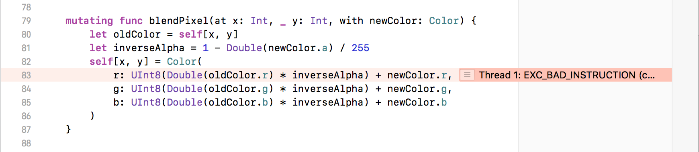
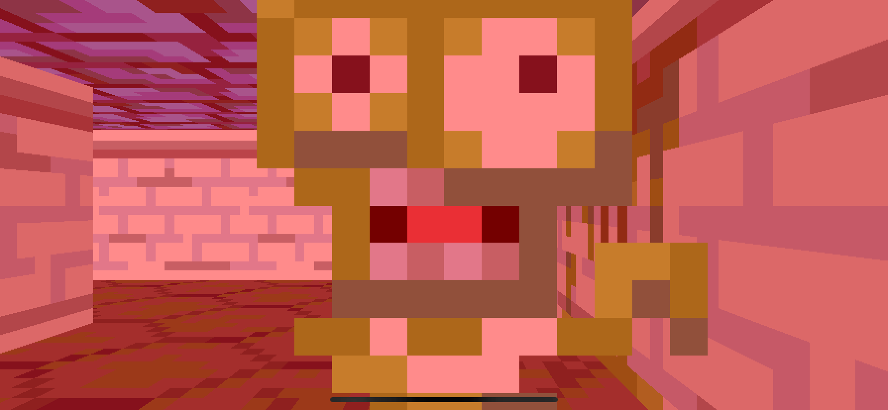
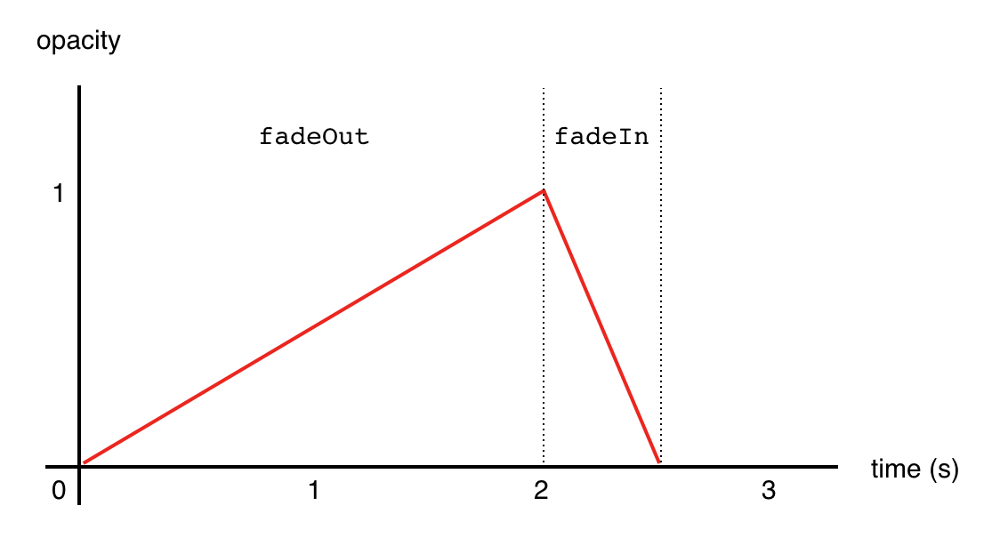
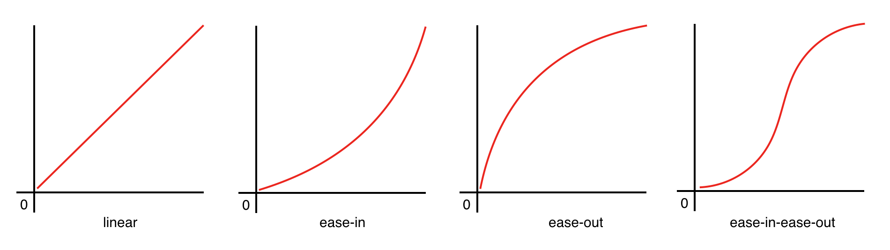
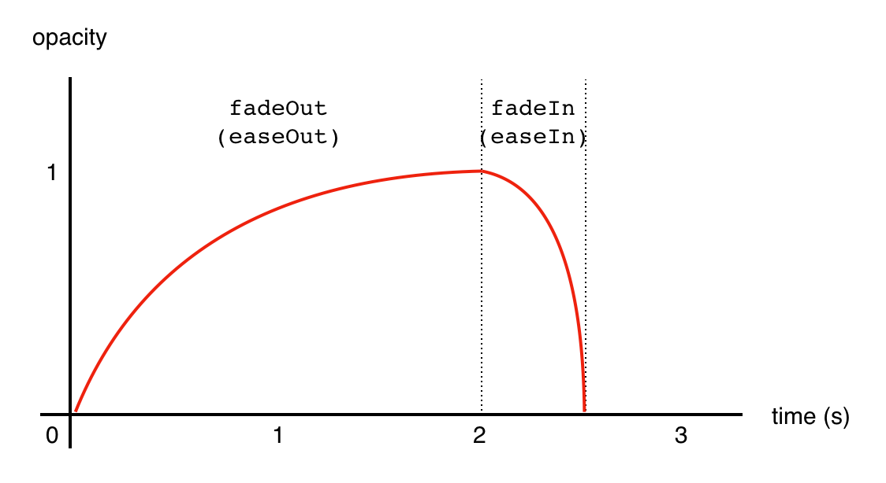
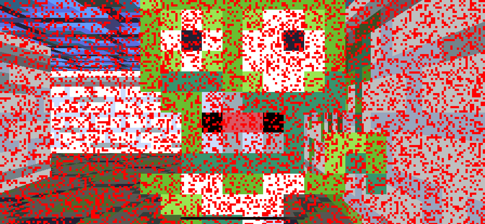

## Part 7: Death and Transition

In [Part 6](Part6.md) we added animations to the monsters inhabiting the maze, and gave them rudimentary intelligence so they could hunt and attack the player. The complete code for Part 6 can be found [here](https://github.com/nicklockwood/RetroRampage/archive/Part6.zip).

Although the monsters appear to attack, their blows don't actually have any effect on the player. Time to fix that.

### Healthy Living

In order for the player to be hurt (and eventually die), they need to have some sort of health meter. In `Player.swift`, add a `health` property to the `Player` and in the initializer set its starting value to `100`:

```swift
public struct Player: Actor {
    public let speed: Double = 2
    public let turningSpeed: Double = .pi
    public let radius: Double = 0.25
    public var position: Vector
    public var velocity: Vector
    public var direction: Vector
    public var health: Double

    public init(position: Vector) {
        self.position = position
        self.velocity = Vector(x: 0, y: 0)
        self.direction = Vector(x: 1, y: 0)
        self.health = 100
    }
}
```

In the same file, add the following convenience extension:

```swift
public extension Player {
    var isDead: Bool {
        return health <= 0
    }
}
```

### Hurt Me Plenty

Now that the player has health, the monster needs a way to deplete it.

Changes to the player are currently handled inline within the `World.update()` method. This is a *mutating* method, so it has the ability to make changes to the world and its contents.

Monster behavior is delegated out to the `Monster.update()` method. This method is also marked as mutating - which means that it can make changes to the monster itself - but the `world` parameter it receives is immutable, which means it cannot make changes to the world.

In order for the monster to be able to hurt the player, we need some way for its behavior to affect objects outside of itself. We could just inline the monster update logic inside `World.update()`, but that method is already doing more than it should so we don't really want to overload it any further.

Instead, we can pass the world to `Monster.update()` as an `inout` parameter, thereby making it mutable. In `Monster.swift`, replace the line:

```swift
mutating func update(in world: World) {
```

with:

```swift
mutating func update(in world: inout World) {
```

Then, in `World.update()`, in the `// Update monsters` section, change the line:

```swift
monster.update(in: self)
```

to:

```swift
monster.update(in: &self)
```

This means that we are passing the world *by reference*, giving `Monster.update()` the ability to make changes to the world, along with anything in it (such as the player).

We don't really want the monster to just manipulate the player's health directly though, because harming the player will potentially have side-effects in the game logic that the monster shouldn't need to know about.

Let's lock the interface down a bit so that we don't accidentally break encapsulation. Find the following property declarations at the top of the `World` struct:

```swift
public var monsters: [Monster]
public var player: Player!
```

And change them to:

```swift
public private(set) var monsters: [Monster]
public private(set) var player: Player!
```

Then, still in `World.swift`, add the following method to the bottom of the extension:

```swift
mutating func hurtPlayer(_ damage: Double) {
    player.health -= damage
}
```

That gives the monster a way to hurt the player in a structured way without directly manipulating properties. Next, in `Monster.update()`, add the following code to the end of the `case .scratching:` block, just after the guard statement:

```swift
world.hurtPlayer(10)
```

### Game Over Man, Game Over!

I mentioned earlier that reducing player health might have side-effects. One such side-effect is that if the player's health drops to zero, the game should end. This is a change that affects the entire world, which is why `hurtPlayer()` is a method of the world itself and not the `Player` type.

Eventually, the player dying will have effects that extend even beyond the game world, such as displaying a "Game Over" screen, and presenting a menu for the player to quit or try again, etc. We haven't built any of the infrastructure for that yet, so for now we'll just reset the world to its initial conditions.

The world is currently created by `ViewController` (in the platform layer) which might seem like it would cause a headache if we need to trigger re-initialization from *inside* the world itself. Fortunately, the initial conditions for the world are all encoded within the `TileMap`, which is never actually modified.

Since the world already contains all the information needed to reset itself, we can go ahead and add a method to do that. Near the top of `World.swift`, find the `init()` method and copy the following lines:

```swift
self.monsters = []
for y in 0 ..< map.height {
    for x in 0 ..< map.width {
        let position = Vector(x: Double(x) + 0.5, y: Double(y) + 0.5)
        let thing = map.things[y * map.width + x]
        switch thing {
        case .nothing:
            break
        case .player:
            self.player = Player(position: position)
        case .monster:
            monsters.append(Monster(position: position))
        }
    }
}
```

Create a new mutating method in the extension block called `reset()` and paste the copied code into it:

```swift
mutating func reset() {
    ...
}
```

Then, still in `World.swift`, replace the `init()` implementation with the following:

```swift
public init(map: Tilemap) {
    self.map = map
    self.monsters = []
    reset()
}
```

That gives us the means to reinitialize the world in its starting state when the player dies. Find the `World.hurtPlayer()` function we created earlier and append the following code inside it:

```swift
if player.isDead {
    reset()
}
```

Now go ahead and run the game.

*Hmm, that's odd...* as soon the the monster touches the player, everything starts flickering and the player can't move. What's going on?

There are actually *two* problems here. The first is that the game is being reset every time the monster touches the player. The second is that the monster itself is unaffected by the reset, and continues to attack the player immediately after player re-spawns.

### One Punch Man

The monster only does 10 damage per swipe, so how come the player dies instantly? Let's look at the monster attack logic again:

```swift
case .scratching:
    guard canReachPlayer(in: world) else {
        state = .chasing
        animation = .monsterWalk
        break
    }
    world.hurtPlayer(10)
}
```

Here is the problem - as long as the monster is in `scratching` mode and in range of the player, `hurtPlayer()` will be called on every update. Since `update()` is called ~120 times per second, it's no wonder that the player drops dead almost instantly.

We will need to keep track of when the monster last struck the player, and only apply damage again if a minimum time has passed - we'll call this the *cooldown* period.

The scratching animation is 0.8 seconds long, and the monster swipes at the player twice during each cycle of the attack animation, so a cooldown period of 0.4 seconds would make sense.

In `Monster.swift`, add the following two properties to the `Monster` struct:

```swift
public let attackCooldown: Double = 0.4
public private(set) var lastAttackTime: Double = 0
```

Then in `Monster.update()`, in the `case .scratching:` block, replace the line:

```swift
world.hurtPlayer(10)
```

with:

```swift
if animation.time - lastAttackTime >= attackCooldown {
    lastAttackTime = animation.time
    world.hurtPlayer(10)
}
```

Then, just above in the `case .chasing:` block, find the code:

```swift
if canReachPlayer(in: world) {
    state = .scratching
    animation = .monsterScratch
}
```

And add the following line inside the `if` block:

```swift
lastAttackTime = -attackCooldown
```

We set the `lastAttackTime` to `-attackCooldown` when the `scratching` state begins to ensure that the `animation.time - lastAttackTime >= attackCooldown` condition is initially true, otherwise the monster's first swipe wouldn't do any damage.

If you run the game again, you should find that the player can take a few punches before the game resets. Now for the second problem - why isn't the monster being reset with the rest of the world?

### Left Behind

Take a look at the `// Update monsters` loop in the `World.update()` method:

```swift
for i in 0 ..< monsters.count {
    var monster = monsters[i]
    monster.update(in: &self)
    monster.position += monster.velocity * timeStep
    monster.animation.time += timeStep
    monsters[i] = monster
}
```

Inside the loop, we copy the monster at the current index into a local variable, then call its `update()` method, then modify its `position` and `animation` before assigning it back to the `monsters` array.

If the player is killed during `Monster.update()` the world will be reset immediately, but the local `monster` var inside the `// Update monsters` loop will be unaffected by the reset, and will then be written back into the `monsters` array. That's why the monster is still in the same position after the reset occurs.

Maybe it's not such a good idea for the `hurtPlayer()` method to reset the world immediately? Remove the following lines from the `World.hurtPlayer()` method:

```swift
if player.isDead {
    reset()
}
```

Then, at the very top of the `World.update()` method, add the following:

```swift
// Update player
if player.isDead {
    reset()
    return
}
```

In this way, the reset is deferred until the next update cycle after the player is killed, and performed before any other updates so it can't introduce inconsistencies in the world model.

Run the game again and you should find that it now resets correctly when the player dies.

### Cause and Effect

The visual impact of being hacked to death by a ravenous zombie is currently rather underwhelming. Eventually we'll add an on-screen health meter, but in the meantime it would be good to at least have *some* visual indication of player damage.

Modern games use a variety of effects to indicate the player being hurt - camera shake, blood spatter on the screen, blurred vision, etc. Wolfenstein 3D used a brief red flash of the screen, and so will we.

Create a new file in the Engine module called `Effect.swift` with the following contents:

```swift
public enum EffectType {
    case fadeIn
}

public struct Effect {
    public let type: EffectType
    public let color: Color
    public let duration: Double
    public var time: Double = 0

    public init(type: EffectType, color: Color, duration: Double) {
        self.type = type
        self.color = color
        self.duration = duration
    }
}
```

The `Effect` type is quite similar to the `Animation` type we added in [Part 6](Part6.md), but instead of an array of image frames it has a `type` and `color`. Just below the `Effect` struct, add the following extension:

```swift
public extension Effect {
    var isCompleted: Bool {
        return time >= duration
    }
    
    var progress: Double {
        return min(1, time / duration)
    }
}
```

These convenience properties allow us to easily get the *progress* of the effect (a normalized representation of how far it is from completion) and whether it has already completed.

Effects will span multiple frames, so we'll need to store them somewhere. It's debatable whether they really *exist* as physical objects within the world, but it seems like the logical place to put them for now. In `World.swift`, add an `effects` property to the `World` struct, and initialize it inside `World.init()`:

```swift
public struct World {
    public let map: Tilemap
    public private(set) var monsters: [Monster]
    public private(set) var player: Player!
    public private(set) var effects: [Effect]

    public init(map: Tilemap) {
        self.map = map
        self.monsters = []
        self.effects = []
        reset()
    }
}
```

Like other objects in the world, effects will need to be updated over time. It seems like a good idea to update effects first, before any other updates because we don't want events like a world reset (which returns from the `update()` method early) to cause any ongoing effects to skip frames.

Insert the following code at the very top of the `World.update()` method, above the `// Update player` section:

```swift
// Update effects
effects = effects.map { effect in
    var effect = effect
    effect.time += timeStep
    return effect
}
```

This code is a little different from the other update loops. As with animations, we're incrementing the elapsed `time` property of each effect, but this time we're using `map()` to replace the original `effects` array, instead of a `for` loop.

Functional programming is cool and all, but *why now*?

Well, there's something else we need to do in this loop in addition to updating the effects - once an effect is complete we want to remove it from the array. That's awkward and error-prone to do with a traditional `for` loop because removing an item messes up the index (unless you resort to tricks like iterating the loop backwards).

But with Swift's functional programming extensions, we can do this very cleanly using `compactMap()`. The `compactMap()` function works like a combination of `map()` (to replace the values in a collection) and `filter()` (to conditionally remove them). In the `// Update effects` block we just added, replace the line:

```swift
effects = effects.map { effect in
```

with:

```swift
effects = effects.compactMap { effect in
    if effect.isCompleted {
        return nil
    }
```

So now we return `nil` for any effect that has completed, thereby removing it from the `effects` array. This check is performed *before* incrementing the time, so that the final state of the effect is displayed at least once before it is removed<sup><a id="reference1"></a>[[1]](#footnote1)</sup>.

The red flash effect should be triggered whenever the player is hurt. Still in `World.swift`, add the following line to the `hurtPlayer()` method:

```swift
effects.append(Effect(type: .fadeIn, color: .red, duration: 0.2))
```

Finally, we need to actually draw the effect.

Wolfenstein implemented the red screen flash using a trick called [color cycling](https://en.wikipedia.org/wiki/Color_cycling) (also known as *palette animation*), made possible by the game's use of an indexed color palette. It would have been expensive to tint every pixel on-screen, and also impractical to craft a palette that had multiple red-shifted shades of each color, but color cycling neatly solves both of these problems.

The palette introduces a layer of indirection between the 8-bit color indexes drawn into the output buffer and the colors that actually appeared on screen. By gradually red-shifting all the colors in the palette over time, the image drawn on the screen automatically tinted to red without the game needing to actually needing to redraw anything. And shifting the palette only required changing the 256 values in the palette itself, not the 64,000 pixels on screen<sup><a id="reference2"></a>[[2]](#footnote2)</sup>.

Pretty clever, right? Unfortunately, since we're using 32-bit "true" color instead of an indexed palette, we can't use the same trick<sup><a id="reference3"></a>[[3]](#footnote3)</sup>. *Fortunately*, computers are immensely fast now so we can just use a brute-force approach and blend every pixel of the output bitmap.

In `Renderer.swift` add the following code to the bottom of the `draw()` function (be careful to put it *outside* the `for` loop, as the nested closing braces can be confusing):

```swift
// Effects
for effect in world.effects {
    let color = effect.color
    for y in 0 ..< bitmap.height {
        for x in 0 ..< bitmap.width {
            bitmap.blendPixel(at: x, y, with: color)
        }
    }
}
```

Run the game and you should see the screen blink red every time the monster swipes at the player. The effect isn't very pretty yet though - we need to add the fading effect. In the `// Effects` code we just added, replace the line:

```swift
let color = effect.color
```

with:

```swift
var color = effect.color
color.a = UInt8((1 - effect.progress) * 255)
```

If you recall from earlier, the `progress` property is the normalized effect time (in the range 0 - 1). We can use that to calculate the `a` (alpha) value for the color by subtracting it from 1 and multiplying by 255, so that the value falls from 255 to 0 over the duration of the effect.

Run the game and... *crash*. Oh.



The game crashed inside the `blendPixel()` function. A bit of investigation reveals that the cause of the crash is that we overflowed the range of `UInt8` - we tried to put a number bigger than 255 into it. How did that happen?

If you recall, in [Part 5](Part5.md), when we originally added the `blendPixel()` method, we designed it to work with *premultiplied alpha* values, because it's better for performance. Premultiplied alpha is common when dealing with images, but it's a bit of a weird requirement for a public API.

We can fix the crash by manually premultiplying the color components by the alpha value. In `Renderer.draw()`, inside the `// Effects` update loop, replace the lines:

```swift
var color = effect.color
color.a = UInt8((1 - effect.progress) * 255)
```

with:

```swift
let opacity = 1 - effect.progress
let color = Color(
    r: UInt8(opacity * Double(effect.color.r)),
    g: UInt8(opacity * Double(effect.color.g)),
    b: UInt8(opacity * Double(effect.color.b)),
    a: UInt8(opacity * 255)
)
```

Now run the game again, and you should see the fading effect working correctly.



### It's a Trap

We've fixed the bug, but it seems a bit dangerous to have such a sharp edge exposed in the `Bitmap` API. The behavior of `blendPixel()` is pretty unintuitive. There are three possible ways I can think of to improve it:

* Change the name to more accurately reflect its purpose
* Add bounds checking so it won't crash for out-of-range values
* Make it private

This is a performance-critical method (it's called at least once for every pixel on screen), so adding bounds checking is probably not desirable. It's also not clear that would be the right solution anyway since a bounds error here is indicative of a programming mistake - it should't happen with valid input.

For now, we'll just make the `blendPixel()` method private. In `Bitmap.swift`, replace the line:

```swift
mutating func blendPixel(at x: Int, _ y: Int, with newColor: Color) {
```

with:

```swift
private mutating func blendPixel(at x: Int, _ y: Int, with newColor: Color) {
```

If the method is private, we can't call it from outside of `Bitmap`, but applying a translucent tint seems like a general enough operation that we can just make a method for it on `Bitmap` itself.

Still in `Bitmap.swift`, add the following method to the bottom of the extension:

```swift
mutating func tint(with color: Color, opacity: Double) {
    let color = Color(
        r: UInt8(opacity * Double(color.r)),
        g: UInt8(opacity * Double(color.g)),
        b: UInt8(opacity * Double(color.b)),
        a: UInt8(opacity * 255)
    )
    for y in 0 ..< height {
        for x in 0 ..< width {
            blendPixel(at: x, y, with: color)
        }
    }
}
```

This is pretty much the same logic we used in the effects loop. One extra enhancement we can make while we're here though is to take the original alpha value from the `color` into account, so that the maximum opacity of the overlay can be adjusted by changing the alpha of the effect color.

Insert the following line at the beginning of the `Bitmap.tint()` function we just added:

```swift
let opacity = min(1, max(0, Double(color.a) / 255 * opacity))
```

Now, back in `Renderer.swift`, replace the whole `// Effects` block at the end of the `draw()` function with the following code:

```swift
// Effects
for effect in world.effects {
    bitmap.tint(with: effect.color, opacity: 1 - effect.progress)
}
```

As you can see, this is a much nicer (and safer) API to work with.

We mentioned above that the new `tint()` method supports using a partially transparent base color. In `World.hurtPlayer()`, replace the line:

```swift
effects.append(Effect(type: .fadeIn, color: .red, duration: 0.2))
```

with:

```swift
let color = Color(r: 255, g: 0, b: 0, a: 191)
effects.append(Effect(type: .fadeIn, color: color, duration: 0.2))
```

An alpha value of `191` is equivalent to 75% opacity (255 * 0.75), so now the flash of red when the monster strikes will start at 75% opacity instead of 100%. This isn't just a cosmetic improvement - it also means the red flash won't completely obscure your vision if you are attacked repeatedly.

### Fade to <strike>Black</strike> Red

The red flash effect works well for player damage, but the re-spawn when the player eventually dies is much too sudden. We need a longer, more pronounced effect for the player's death to give the them time to react to what has happened, and prepare for the next attempt.

Instead of a short fade *from* red, when the player dies let's show a longer fade *to* red. Since this is basically just the same effect in reverse, we can re-use a lot of the logic we've already written.

In `Effect.swift`, add a `fadeOut` case to the `EffectType` enum:

```swift
public enum EffectType {
    case fadeIn
    case fadeOut
}
```

Then in `Renderer.draw()`, modify the `// Effects` block again as follows:

```swift
// Effects
for effect in world.effects {
    switch effect.type {
    case .fadeIn:
        bitmap.tint(with: effect.color, opacity: 1 - effect.progress)
    case .fadeOut:
        bitmap.tint(with: effect.color, opacity: effect.progress)
    }
}
```

As you can see, the code for `fadeOut` is nearly identical to the original `fadeIn` effect, except that we are no longer subtracting the `progress` value from 1, so the opacity goes up from 0 to 1 instead of down from 1 to 0.

In `World.swift`, append the following code to the `hurtPlayer()` method:

```swift
if player.isDead {
    effects.append(Effect(type: .fadeOut, color: .red, duration: 2))
}
```

This triggers a two-second fade to red. If you run the game again, you'll find this doesn't quite do what we wanted however. The fade works, but the game still resets instantly when the player dies, so the fade begins much too late.

We need to defer the game reset until after the effect has completed. Let's take a look at the code responsible for resetting the game, which is located near the top of the `World.update()` method:

```swift
// Update player
if player.isDead {
    reset()
    return
}
```

In this block, replace the line:

```swift
if player.isDead {
```

with:

```swift
if player.isDead, effects.isEmpty {
```

Then try running the game again. When the player dies, the game now keeps running until the fade is complete. But now the fade never goes away - what's going on?

### Rest in Peace

Because the game now keeps running after the player is dead, the monster is going to keep hitting the player, causing more and more fade effects to trigger. Because of this, the `effects` array is never empty, so the game never actually resets.

We could modify the monster AI so that it stops attacking the player once they're dead, but seeing the zombies continue to hack away at your corpse as you pass away is kind of cool<sup><a id="reference4"></a>[[4]](#footnote4)</sup>, so let's solve it a different way. Add the following code to the top of the `World.hurtPlayer()` method:

```swift
if player.isDead {
    return
}
```

Now, once the player is dead, the monsters can't hurt them anymore (even though they'll keep trying). That means no further effects will be spawned, and the reset should happen on schedule.

The last slightly weird thing about the way the death sequence works currently is that the player can keep moving after death. We need to keep the update loop running if we want the effects to keep animating and the monsters to keep attacking, but we don't necessarily need to keep accepting player input.

To prevent the player wandering around after death (there are enough zombies in this game already), in `World.update()`, rearrange the `// Update player` code section as follows:

```swift
// Update player
if player.isDead == false {
    player.direction = player.direction.rotated(by: input.rotation)
    player.velocity = player.direction * input.speed * player.speed
    player.position += player.velocity * timeStep
} else if effects.isEmpty {
    reset()
    return
}
```

Now the player can finally die with bit of dignity. With, um, zombies hacking at their lifeless corpse.

### Easy Does It

The game-over fade looks pretty good, but it ends rather abruptly.

We can mitigate this by adding a short fade-in after the reset. Still in `World.update()`, in the `// Update player` section, add the following just after the `reset()` line (or immediately before it - it doesn't really matter since effects aren't cleared by the reset):

```swift
effects.append(Effect(type: .fadeIn, color: .red, duration: 0.5))
```

You can play with the duration value a bit <sup><a id="reference5"></a>[[5]](#footnote5)</sup>, but it still doesn't completely fix the problem. The issue is that the human eye is quite sensitive to discontinuities in animation timing. This is much more apparent with moving objects, but it also applies to fading effects.

If we plot a graph of the change in opacity of the fade effect over time, we get the following:



There is a sharp discontinuity in the middle where we transition from the `fadeOut` to `fadeIn` effects, which is why it doesn't quite feel right. We can smooth it out a bit by using a technique called *easing*.

Easing (also known as *tweening*) is a (typically non-linear) mapping of time to an animated property such as position or scale (or in our case, opacity). If you were a Flash programmer in the early 2000s, the term *easing* may be almost synonymous with the name [Robert Penner](http://robertpenner.com/easing/), whose open-source easing functions have been ported to almost every language and platform you can think of.

There are an infinite number of possible easing functions, but the most common variants are: *linear*, *ease-in*, *ease-out* and *ease-in-ease-out*.



Real-life objects do not start and stop moving instantly, they have to accelerate up to speed and then decelerate back to a stop. The purpose of easing is to create realistic motion without all the complexities of a true physics engine, with simulated mass, friction, torque, etc.

The best all-round easing function for general use is *ease-in-ease-out*, because it starts slow, reaches maximum speed at the half-way point, and then slows down again before stopping, just like a real object. That doesn't mean it's necessarily the best choice for every situation though.

For the fade to red as the player dies, we want to start quickly at first and then go slower so that the effect seems more drawn out towards the end. For that, we can use the *ease-out* curve. And for the subsequent fade in we want the reverse effect (*ease-in*) so that the overall curve is smooth.

Easing functions take a normalized input time and produce an output time that has been delayed or sped up according to the type of easing applied. We could implement these as free functions, but grouping them under a common namespace helps with autocompletion and prevents naming collisions.

Create a new file in the Engine module called `Easing.swift` with the following contents:

```swift
public enum Easing {}

public extension Easing {
    static func linear(_ t: Double) -> Double {
        return t
    }

    static func easeIn(_ t: Double) -> Double {
        return t * t
    }
}
```

The first line here may seem a little baffling. An enum with no cases?!

This is actually a neat little pattern in Swift for when you want to create a namespace. There is no `namespace` keyword in Swift, so to group functions together you have to make them members of a type. We could use a class or struct, but an empty enum has the nice property that you can't accidentally create an instance of it. It's what's known as an *uninhabited type* - a type with no possible values.

After the empty enum we have an extension with some static methods. The first is the `linear()` easing function - this just returns the same time you pass in.

Next is the `easeIn()` function. There are actually many ways to implement `easeIn()` - for example, UIKit and Core Animation use Bezier curves to implement easing. But you can also use sine/cosine, or various orders of [polynomial](https://en.wikipedia.org/wiki/Polynomial).

In this case we have used a *quadratic* `easeIn()` implementation, meaning that it's proportional to the input time *squared*. If we had used `t * t * t`, it would have been a *cubic* `easeIn()` instead. There's no right or wrong type to use, so feel free to experiment and see what feels right.

Let's add the equivalent quadratic implementations for ease-out and ease-in-ease-out:

```swift
public extension Easing {
    ...
    
    static func easeOut(_ t: Double) -> Double {
        return 1 - easeIn(1 - t)
    }

    static func easeInEaseOut(_ t: Double) -> Double {
        if t < 0.5 {
            return 2 * easeIn(t)
        } else {
            return 4 * t - 2 * easeIn(t) - 1
        }
    }
}
```

The `easeOut()` function is just the opposite of ease-in, so we can implement it by calling `easeIn()` with inverted input. The `easeInEaseOut()` function is a little more complex but essentially it behaves like ease-in up to the half-way point, then it behaves like ease-out for the rest (shifted, so it aligns seamlessly with the first half).

In `Effect.swift`, find the code for the computed `progress` property and update it as follows:

```swift
var progress: Double {
    let t = min(1, time / duration)
    switch type {
    case .fadeIn:
        return Easing.easeIn(t)
    case .fadeOut:
        return Easing.easeOut(t)
    }
}
```

We're still using `time / duration` to compute the normalized time, but now we pass it through either `easeIn()` or `easeOut()` depending on the effect type. The game-over fade effect timing is now a smooth curve.



Try running the game again and you should notice a subtle improvement.

### Not with a Bang, but with a Fizzle

Wolfenstein 3D didn't actually use a palette fade for the player death. Instead, John Carmack created a rather special custom effect he called *fizzlefade*. Fizzlefade is a sort of stippling transition where the pixels flip to red at random.

The naive way to implement this would be to repeatedly set pixels to red at random until the screen is filled, but this doesn't work well in practice because as the screen fills up, the chances of randomly stumbling on an unfilled pixel tends towards zero. As a result, the effect runs slower and slower over time, and the total duration is non-deterministic.

Wolfenstein used an ingenious solution to this problem which Fabien Sanglard [wrote about here](http://fabiensanglard.net/fizzlefade/). I'm not *sure* I fully understand how it works (let alone to a level where I can explain it), but fortunately we aren't as resource-constrained as Wolfenstein was, and can use a much simpler approach.

To restate the problem: We need to visit every pixel on the screen only once, but in a random order. If we put the indexes of all the pixels into an array and then shuffle it before we begin, we can step through the shuffled array in order to ensure we only touch each pixel once.

In `Effect.swift`, add a new case to the `EffectType` enum called `fizzleOut`:

```swift
public enum EffectType {
    case fadeIn
    case fadeOut
    case fizzleOut
}
```

Then add the following extra case to the switch statement in the computed `progress` property below:

```swift
case .fizzleOut:
    return Easing.easeInEaseOut(t)
```

Although it's similar to fade-out, I found that `easeOut()` didn't work as well for the fizzle effect, so I've used `easeInEaseOut()` instead (it also looks pretty good with just `linear()` easing, which is what Wolfenstein used).

Next, in `World.hurtPlayer()` replace the line:

```swift
effects.append(Effect(type: .fadeOut, color: .red, duration: 2))
```

with:

```swift
effects.append(Effect(type: .fizzleOut, color: .red, duration: 2))
```

To implement the fizzle effect itself, we need to pre-generate a buffer of pixel indexes. It's not immediately obvious where we should store that. We could put it in the renderer itself if it was persistent, but we are currently creating a new `Renderer` instance each frame so we can't store anything in it long-term. Another reasonable option would be to store it in the `Effect` itself, but since it's only needed for fizzle-type effects that's not ideal either. 

For now we'll store the fizzle buffer in a global constant. It's not a very elegant solution because it introduces potential issues with thread safety, but since the renderer is currently single-threaded anyway it will do as a stop-gap measure.

At the top of the `Renderer.swift` file, add the following line:

```swift
private let fizzle = (0 ..< 10000).shuffled()
```

This populates the fizzle buffer with the values 0 to 9999, shuffled in a random order. A typical iPhone screen has a lot more than 10,000 pixels but we don't need a buffer entry for every single pixel, just enough so that any repetition isn't obvious.

At the bottom of the `Renderer.draw()` method, add the missing `.fizzleOut` case to the `// Effects` block:

```swift
case .fizzleOut:
    let threshold = Int(effect.progress * Double(fizzle.count))
    
}
```

The threshold value is the number of pixels in the `fizzle` buffer that should be filled in a given frame. For example, if `effect.progress` is 0.5, we want to fill 50% of the pixels on screen, so any pixel that maps to the lower half of the buffer should be filled, and any in the upper half won't be.

Next, we need to loop through every pixel in the image and determine if we should fill the pixel or not. Add the following code just after the `let threshold` line:

```swift
for y in 0 ..< bitmap.height {
    for x in 0 ..< bitmap.width {
        let index = y * bitmap.width + x

    }
}
```

The `let index...` line converts the X and Y pixel coordinates into a linear buffer index. Just below that line, add the following:

```swift
let fizzledIndex = fizzle[index % fizzle.count]
```

This looks up the fizzled index from the buffer. Since there are more pixels in the bitmap than entries in the `fizzle` buffer, we use `%` (the modulo operator) to wrap the index value within the buffer's range.

Finally, we need to compare the fizzled index value to the threshold. If it's below the threshold we'll fill the pixel, otherwise we do nothing. Add the following code below the line we just added:

```swift
if fizzledIndex <= threshold {
    bitmap[x, y] = effect.color
}
```

Run the game and get yourself killed. You should see the original fade to red has now been replaced by the fizzle effect.


This effect is pretty faithful to the original Wolfenstein 3D death sequence, but it doesn't really suit the lo-fi look of Retro Rampage because the resolution of a modern iPhone (even the virtual 1x resolution that we are using) is a bit too dense.

We can improve the effect by artificially lowering the resolution for a more pixelated fizzle. In the code we just wrote, replace the line:

```swift
let index = y * bitmap.width + x
```

with:

```swift
let granularity = 4
let index = y / granularity * bitmap.width + x / granularity
``` 

The `granularity` constant controls the sampling size. By dividing the real X and Y coordinates by the desired granularity, we increase the apparent size of each sampled pixel on screen.



And with that, we'll bring this (rather morbid) chapter to a close. In this part we:

* Added player health and damage
* Handled player death and re-spawn
* Added fullscreen fade effects for when the player is hurt or killed
* Implemented animation easing for smoother fades
* Recreated the old-school fizzlefade effect from Wolfenstein

In [Part 8](Part8.md) we'll give the player the means to fight back!

### Reader Exercises

1. Can you modify the monster's logic so that there is only a 1 in 3 chance of them doing damage to the player on each swipe?

2. Change the fizzle fade to a dripping blood effect, where red lines drop down from the top of the top of the screen at random speeds until it's all filled up.

3. Doom replaced the fizzlefade with a [screen melt](https://doom.fandom.com/wiki/Screen_melt) effect, where the current scene drips down to reveal a new one behind. Can you implement something like that?

<hr>

<a id="footnote1"></a>[[1]](#reference1) This isn't actually guaranteed to work since there are multiple world updates per frame, but it doesn't seem to be a problem in practice.

<a id="footnote2"></a>[[2]](#reference2) The original Wolfenstein 3D screen resolution was 320x200 (320 * 200 = 64000).

<a id="footnote3"></a>[[3]](#reference3) There are actually similar tricks that you can do on modern machines by altering the [display gamma](https://en.wikipedia.org/wiki/Gamma_correction), but that's highly platform-specific and outside the scope of what we're trying to do here.

<a id="footnote4"></a>[[4]](#reference4) It's, uh... completely normal to think like this, right?

<a id="footnote5"></a>[[5]](#reference5) Don't make it too long, or the monster will be on top of you by the time your vision has cleared!
