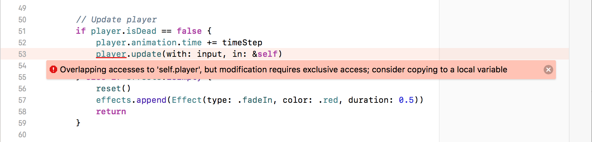

## Part 8: Target Practice

In [Part 7](Part7.md) we added the ability for monsters to hurt and even kill the player, causing the game to reset. The complete code for Part 7 can be found [here](https://github.com/nicklockwood/RetroRampage/archive/Part7.zip).

Now it's time to give the player the means to fight back!

### Pistols at Dawn

I don't know about you, but I've had about enough of being mauled to death by zombies. It's *payback time*.

We're going to need a weapon. In keeping with FPS tradition, we'll start with a humble pistol.


Like the monster sprite, the pistol has a transparent background. Even though the sprite only occupies the bottom-right corner of the screen, to keep the math simple we're going to scale the sprite image to fit the whole screen height.

I've used a 32x32 image for the pistol instead of the 16x16 images used previously, so that the apparent resolution is more similar to the monster sprites and textures, which are normally seen from further away<sup><a id="reference1"></a>[[1]](#footnote1)</sup>.

If you'd like to use the artwork from the tutorial, you can find it [here](https://github.com/nicklockwood/RetroRampage/tree/Part8/Source/Rampage/Assets.xcassets/), but feel free to use any weapon graphics you like for your own project. The logic for handling sprites is resolution-independent, and the image size has no significant impact on performance.

Once you've added the "pistol" image to XCAssets, open `Textures.swift` and extend the `Texture` enum with the new case:

```swift
public enum Texture: String, CaseIterable {
    ...
    case pistol
}
```

### Weapon Drawn

So how do we go about actually drawing the pistol on-screen?

In terms of screen area, the sprite that we want to draw looks like this:


We already have a mechanism for drawing sprites using *billboards* (flat, textured rectangles that always face the player), so it might seem reasonable to implement the pistol as a billboard positioned a constant distance in front of the player.

This wouldn't work well in practice however, because if we try to position the pistol sprite in 3D we'll introduce problems like the sprite being clipped by walls, or nearby monster sprites being drawn in front of it.

We always want to draw the pistol in front of everything else. The height needs to match the screen height, but there is no perspective distortion, nor do we want any part of the image to be clipped or occluded by other objects in the scene. This doesn't really seem like a 3D problem at all - we just want to draw a scaled 2D image.

We already have logic to draw a vertical slice of an image at any scale, so let's extend that to draw an entire image. In `Bitmap.swift` find the `drawColumn()` method. Add a new method underneath it called `drawImage()`, as follows:

```swift
mutating func drawImage(_ source: Bitmap, at point: Vector, size: Vector) {

}
```

The method signature is quite similar to `drawColumn()`, but we don't need the `x` parameter, and instead of a scalar output `height`, we have a vector `size`. The bodies of the methods will also be similar, but instead of stepping vertically through the pixels of a single column, we're going to step horizontally through the columns of the whole image.

Add this code inside `drawImage()`:

```swift
let start = Int(point.x), end = Int(point.x + size.x)
let stepX = Double(source.width) / size.x
for x in max(0, start) ..< min(width, end) {
    let sourceX = (Double(x) - point.x) * stepX

}
```

Inside the loop, `x` is the position at which the column will be displayed on-screen, and `sourceX` is the position in the source image from which the column will be sampled. We can now use the `drawColumn()` function to actually draw each column of pixels. Add the following two lines inside the loop to complete the `drawImage()` method:

```swift
let outputPosition = Vector(x: Double(x), y: point.y)
drawColumn(Int(sourceX), of: source, at: outputPosition, height: size.y)
```

In `Renderer.draw()`, add this block of code just before the `// Effects` section:

```swift
// Player weapon
let screenHeight = Double(bitmap.height)
bitmap.drawImage(
    textures[.pistol],
    at: Vector(x: Double(bitmap.width) / 2 - screenHeight / 2, y: 0),
    size: Vector(x: screenHeight, y: screenHeight)
)
```

This ensures the pistol will be drawn in front of all 3D objects in the scene, but underneath the effects overlays. Run the game again and you should see the pistol displayed over the background.


### Fired Up

We've *drawn* a pistol, but currently there's no way to actually fire it. To do that, we need to add a new type of input.

Many FPS games on the iPhone use an on-screen button for firing weapons. I find that this suffers from the same problem as fixed-position joysticks - it's too easy for your finger position to slip, and with no tactile feedback it's hard to feel your way back to the button without taking your eyes off the action.

Instead, we're going to turn the *entire screen* into a fire button. In `ViewController.swift`, add the following new property just below `panGesture`:

```swift
private let tapGesture = UITapGestureRecognizer()
```

For `panGesture` we didn't bother adding an action handler, and just sampled the current value each frame. That approach won't work for `tapGesture` though, because we only want to send one fire event to the engine each time the user taps, and there's not any obvious way to do that without storing additional state outside the `UITapGestureRecognizer` itself.

Add the following property to `ViewController`:

```swift
private var lastFiredTime = 0.0
```

Then the following method:

```swift
@objc func fire(_ gestureRecognizer: UITapGestureRecognizer) {
    lastFiredTime = CACurrentMediaTime()
}
```

Finally, in `viewDidLoad()` add the lines:

```swift
view.addGestureRecognizer(tapGesture)
tapGesture.addTarget(self, action: #selector(fire))
```

In `Input.swift`, add a new `isFiring` property and update `init()` to set the new property:

```swift
public struct Input {
    public var speed: Double
    public var rotation: Rotation
    public var isFiring: Bool

    public init(speed: Double, rotation: Rotation, isFiring: Bool) {
        self.speed = speed
        self.rotation = rotation
        self.isFiring = isFiring
    }
}
```

Then, in `ViewController.update()`, replace the lines:

```swift
let input = Input(
    speed: -inputVector.y,
    rotation: Rotation(sine: sin(rotation), cosine: cos(rotation))
)
```

with:

```swift
let input = Input(
    speed: -inputVector.y,
    rotation: Rotation(sine: sin(rotation), cosine: cos(rotation)),
    isFiring: lastFiredTime > lastFrameTime
)
```

That takes care of the platform layer changes - now to implement the firing logic in the engine itself.

### Flash Forward

We'll start by implementing the muzzle flash. This will give us a clear visual indication of whether the tap handling is working as intended. First, we'll need some animation frames:


The pistol firing sequence has five frames, but the last is the same as the idle state, so there's only four new images to add to XCAssets. Do that, then add the new cases to `Textures.swift`:

```swift
public enum Texture: String, CaseIterable {
    ...
    case pistol
    case pistolFire1, pistolFire2, pistolFire3, pistolFire4
}
```

We'll need to create some `Animation` instances for the pistol, but where to put them? The pistol is the closest thing we have to a player avatar, so it seems like it makes sense to put them in `Player.swift`. Add the following code to the bottom of the `Player.swift` file:

```swift
public extension Animation {
    static let pistolIdle = Animation(frames: [
        .pistol
    ], duration: 0)
    static let pistolFire = Animation(frames: [
        .pistolFire1,
        .pistolFire2,
        .pistolFire3,
        .pistolFire4,
        .pistol
    ], duration: 0.5)
}
```

Now we need some code to manage weapon state. Add the following enum to the top of `Player.swift`:

```swift
public enum PlayerState {
    case idle
    case firing
}
```

Then add these properties to the `Player` struct<sup><a id="reference2"></a>[[2]](#footnote2)</sup>:

```swift
public var state: PlayerState = .idle
public var animation: Animation = .pistolIdle
public let attackCooldown: Double = 0.4
```

The `Monster` attack logic is handled inside `Monster.update()`, but the player doesn't currently have their own `update()` method. Let's change that. In `World.update()`, find the following two lines in the `// Update player` section:

```swift
player.direction = player.direction.rotated(by: input.rotation)
player.velocity = player.direction * input.speed * player.speed
```

and replace them with:

```swift
player.animation.time += timeStep
player.update(with: input)
```

Then, back in `Player.swift`, add an `update()` method containing the logic we just removed:

```swift
extension Player {
    ...
    
    mutating func update(with input: Input) {
        direction = direction.rotated(by: input.rotation)
        velocity = direction * input.speed * speed
        
    }
}
```

Now that we've moved the player's update logic into the `Player` type itself, we'll add the new code for managing weapon state. Append the following lines to the `Player.update()` method:

```swift
switch state {
case .idle:
    if input.isFiring {
        state = .firing
        animation = .pistolFire
    }
case .firing:
    if animation.time >= attackCooldown {
        state = .idle
        animation = .pistolIdle
    }
}
```

The state logic here is as follows:

* If we're in the `idle` state, and the fire button was pressed during the frame, switch to the `firing` state and trigger the `pistolFire` animation.
* Once in the `firing` state, wait until the `attackCooldown` period has passed, then return to the `idle` state so the weapon can be fired again.

In `Renderer.draw()`, in the `// Player weapon` section, replace the line:

```swift
textures[.pistol],
```

with:

```swift
textures[world.player.animation.texture],
```

This ensures that we draw the current animation frame of the pistol instead of just its idle state.

Run the game again and try tapping to fire the pistol. You should see a satisfying muzzle flash.


At least, you should see it for about a second, before a zombie starts chomping on your brain!

*It's time we put this guy down.*

### All Flash, No Substance

A weapon isn't much good if it doesn't inflict any damage on your attacker. But before we can hurt the monster, we need to detect which (if any) monster we've hit. 

The monster's own attack is just based on distance from the player - it isn't directional. By contrast, a projectile weapon like a pistol requires a very different implementation.

As we discussed in [Part 2](Part.md), a small and/or fast-moving object (like a pistol bullet) poses a potential problem for our collision handling, since it operates in discrete time steps. A sufficiently fast projectile might appear to teleport through a wall unless we increase the update frequency to compensate.

We currently update the world at ~120 FPS. Is that sufficient to reliably simulate a pistol bullet?

[According to Wikipedia](https://en.wikipedia.org/wiki/Muzzle_velocity), muzzle velocity for a bullet ranges from around 120 m/s (meters-per-second) for an old-fashioned musket, to around 1200 m/s for a modern high-powered rifle. That actually makes the math super-simple, because it means that at 120 FPS, the bullet would travel anywhere between 1 and 10 meters per frame.

One world unit is roughly equivalent to a meter, so we can say that a realistic bullet would travel between one and ten world units per frame. The size of a bullet is pretty close to zero (about 0.02 units) so we can discount that. The implication then is that 120 FPS is just on the borderline if we want to simulate a bullet as a moving projectile.

We are free to increase our world simulation rate since we decoupled it from the frame rate. Pushing it up to 1000 FPS would solve any collision accuracy problems. Alternatively, we could compromise by reducing the bullet speed a bit - after all the player is unlikely to really notice if a bullet travels at 60 m/s instead of 120.

But there is a third option which requires neither a reduction in bullet speed nor an increase in simulation speed - we can model the bullet as a *ray* instead of a projectile.

### Ray Gun

Instead of moving a fixed distance each frame, a ray instantly traverses the entire map like a laser beam, stopping at the first object it intersects (a technique known as [hitscanning](https://en.wikipedia.org/wiki/Hitscan)). This isn't really realistic of course, but the difference between a bullet moving 10 units vs the entire map diameter is not really perceptible<sup><a id="reference3"></a>[[3]](#footnote3)</sup>, and it greatly simplifies the implementation.

We've already written the logic for ray/wall and ray/sprite intersections in the `Renderer`, but the use-cases for drawing and bullet collisions are slightly different, so we don't really want to couple them together. Instead, we'll add a new `hitTest()` method to `Monster`.

To implement that method we'll need the monster's sprite `Billboard`, but that's currently generated directly inside `World.sprites` and isn't available here<sup><a id="reference4"></a>[[4]](#footnote4)</sup>, so we'll need to fix that first.

In `Monster.swift` add the following new method near the bottom of the extension:

```swift
func billboard(for ray: Ray) -> Billboard {
    let plane = ray.direction.orthogonal
    return Billboard(
        start: position - plane / 2,
        direction: plane,
        length: 1,
        texture: animation.texture
    )
}
```

Then, in `World.swift`, find the computed `sprites` var and replace it with this much-simplified version so that we aren't duplicating the billboard-generation logic:

```swift
var sprites: [Billboard] {
    let ray = Ray(origin: player.position, direction: player.direction)
    return monsters.map { $0.billboard(for: ray) }
}
```

With that refactoring out the the way, we can get back to the task at hand. Back in `Monster.swift`, just below the `billboard()` method we just added, insert following:

```swift
func hitTest(_ ray: Ray) -> Vector? {
    guard let hit = billboard(for: ray).hitTest(ray) else {
        return nil
    }
    return hit
}
```

This method checks whether the ray intercepts the monster's billboard, and returns the hit location if so, or `nil` otherwise. We're not quite done with the `hitTest()` implementation yet though.

As you may recall from [Part 6](Part6.md), the monster sprite image doesn't extend right to the edges of the bitmap. We don't want bullets that should pass by the monster to be treated as hits, so we need to do a further check to ensure that the distance of the hit position along the billboard is within the monster's radius.

Add the following code to the `hitTest()` method, just before the `return hit` line:

```swift
guard (hit - position).length < radius else {
    return nil
}
```

Now that we have a way to test a ray against an individual monster, we need to write the logic to test each monster in turn to see a) if they've been hit, and b) which was hit first (a process known as *picking*).

In `World.swift`, add the following placeholder method to the bottom of the extension:

```swift
func hitTest(_ ray: Ray) -> Int? {

}
```

You may have noticed that the signature of this `hitTest()` method is different from all other similarly-named methods in the game. In most cases we are interested in the *location* at which the ray intersects the object, but in this case we just need to know *which* object was hit, so we return an integer index instead of a vector position.

The method will start by performing a hit-test against the map itself, and recording the distance. This is useful because any monster hit that is further away than this can be discarded (the bullet would have stopped at the wall first).

Add these lines inside `hitTest()`:

```swift
let wallHit = map.hitTest(ray)
var distance = (wallHit - ray.origin).length
```

Next, we need to loop through all the monsters and check if the ray hits them. Add the following code to complete the method:

```swift
var result: Int? = nil
for i in monsters.indices {
    guard let hit = monsters[i].hitTest(ray) else {
        continue
    }
    let hitDistance = (hit - ray.origin).length
    guard hitDistance < distance else {
        continue
    }
    result = i
    distance = hitDistance
}
return result
```

For each monster, if a hit is detected we compute the distance and then compare it with the previous nearest hit. At the end, the index of the closest sprite is returned (or `nil`, if no sprites were hit).

### Health Hazard

Once we have isolated the monster that was hit, we'll need a way to inflict damage. In [Part 7](Part7.md) we made the player mortal by giving them a `health` property - we'll now do the same for the monsters. In `Monster.swift` add the following property to `Monster`:

```swift
public var health: Double = 50
```

Then add a computed `isDead` property to the extension:

```swift
public extension Monster {
    var isDead: Bool {
        return health <= 0
    }
    
    ...
}
```

Since we've made the `World.monsters` array setter private, it's not possible for the player to directly manipulate the monster's health. For player damage, we solved this problem by adding a `hurtPlayer()` method to `World`. We'll use the same solution here.

In `World.swift`, add the following method to the extension:

```swift
mutating func hurtMonster(at index: Int, damage: Double) {
    monsters[index].health -= damage
}
```

The `Player.update()` method is going to need some way to call this, which means it needs access to the `World` instance. As with `Monster.update()`, we'll pass the world to `Player.update()` via an `inout` parameter. In `Player.swift`, replace the method signature:

```swift
mutating func update(with input: Input) {
```

with:

```swift
mutating func update(with input: Input, in world: inout World) {
```

Then, in `World.update()`, in the `// Update player` section, replace the line:

```swift
player.update(with: input)
```

with:

```swift
player.update(with: input, in: &self)
```

Uh-oh, what's this?



It seems that we can't pass a mutable reference to `World` to `Player.update()` because this would permit simultaneous modifications to be made to the `player` property via two different references.

This isn't a problem for `Monster.update()` because we copy the monster into a local variable before calling `update()`. We'll use the same solution for the player. Still in `World.update()`, replace the lines:

```swift
player.animation.time += timeStep
player.update(with: input, in: &self)
player.position += player.velocity * timeStep
```

with:

```swift
var player = self.player!
player.animation.time += timeStep
player.update(with: input, in: &self)
player.position += player.velocity * timeStep
self.player = player
```

Back in `Player.update()`, just after the line `animation = .pistolFire`, add the following:

```swift
let ray = Ray(origin: position, direction: direction)
if let index = world.hitTest(ray) {
    world.hurtMonster(at: index, damage: 10)
}
```

OK, it seems like that should be everything we need. If you run the game though, it seems like the monster still won't die, no matter how much you shoot it.

### Life After Death

Although *we* know that you are supposed to die when your health reaches zero, we forgot to tell the monster. Rather ironically for a zombie, the monster is *quite literally* a member of the walking dead.

The monster's behavior is guided by a state machine. We could just bypass that logic when the monster is dead, but it makes more sense to extend the state machine rather than work around it.

In `Monster.swift`, add two new cases to the `MonsterState` enum:

```swift
public enum MonsterState {
    ...
    case hurt
    case dead
}
```

We'll need some new monster animation frames to represent these new states.


Add these images to XCAssets, then add the new cases in `Textures.swift`:

```swift
case monsterHurt, monsterDeath1, monsterDeath2, monsterDead
```

Next, at the bottom of `Monster.swift`, add three new animations to the extension:

```swift
public extension Animation {
    ...
    static let monsterHurt = Animation(frames: [
        .monsterHurt
    ], duration: 0.2)
    static let monsterDeath = Animation(frames: [
        .monsterHurt,
        .monsterDeath1,
        .monsterDeath2
    ], duration: 0.5)
    static let monsterDead = Animation(frames: [
        .monsterDead
    ], duration: 0)
}
```

For the `monsterHurt` animation we've just re-used the first frame of the death animation, but you could do something more interesting in your own project, like having the monster shake its head or clutch its chest. Even though the animation is only one frame, we've made it last for 0.2 seconds because we want the monster to pause for a while each time it is shot.

When hurt, the monster will pause its attack on the player, then resume again after the animation has finished. When dead, it should play the death animation once and then switch to the single-frame `monsterDead` animation so it doesn't appear to keep dying over and over.

In `Animation.swift`, add the following code to the extension:

```swift
public extension Animation {
    var isCompleted: Bool {
        return time >= duration
    }

    ...
}
```

Then back in `Monster.swift`, add the following cases to the `switch` statement inside the `update()` method:

```swift
case .hurt:
    if animation.isCompleted {
        state = .idle
        animation = .monsterIdle
    }
case .dead:
    if animation.isCompleted {
        animation = .monsterDead
    }
```

### Rogue States

That takes care of how the monster should behave in the `hurt` and `dead` states, but how does it actually get into those states in the first place? Unlike the other cases in the `MonsterState` enum, being hurt or killed isn't something that the monster AI *decides* to do, it's something that is *done to* the monster.

Let's look at the `World.hurtPlayer()` method for inspiration. If we ignore anything specific to effects we are left with:

```swift
mutating func hurtPlayer(_ damage: Double) {
    if player.isDead {
        return
    }
    player.health -= damage
    ...
    if player.isDead {
        ...
    }
}
```

We can use more-or-less the same code for the monster. In `World.hurtMonster()`, replace the line:

```swift
monsters[index].health -= damage
```

with:

```swift
var monster = monsters[index]
if monster.isDead {
    return
}
monster.health -= damage
if monster.isDead {
    monster.state = .dead
    monster.animation = .monsterDeath
} else {
    monster.state = .hurt
    monster.animation = .monsterHurt
}
monsters[index] = monster
```

Run the game and you should find that your bullets now hurt and kill the monsters. There are a few weird glitches though:

* The monster's corpse keeps sliding towards the player after it dies.
* We sometimes see a flash of the monster standing up again just at the point of death.

### Death Slide

The posthumous slide is happening because the monster's velocity isn't reset when it dies.

The velocity of the monster is controlled by its state machine. In the `chasing` state it always maneuvers towards the player. The velocity gets reset to zero in the `idle` state, but we never reset it when the monster is hurt or killed, so it just retains whatever value it had previously.

Since it's only the `chasing` state that should be actively changing the velocity, it makes more sense for the velocity to be set at the point of transition to another state, instead of constantly while in that state.

In `Monster.update()` remove the following line from inside `case .idle:`:

```swift
velocity = Vector(x: 0, y: 0)
```

Then update the body of `case .chasing:` to look like this:

```swift
guard canSeePlayer(in: world) else {
    state = .idle
    animation = .monsterIdle
    velocity = Vector(x: 0, y: 0)
    break
}
if canReachPlayer(in: world) {
    state = .scratching
    animation = .monsterScratch
    lastAttackTime = -attackCooldown
    velocity = Vector(x: 0, y: 0)
    break    
}
let direction = world.player.position - position
velocity = direction * (speed / direction.length)
```

So that the velocity is reset to zero each time we switch state.

Finally, in `World.hurtMonster()`, find the line:

```swift
monster.health -= damage
```

and immediately after it, insert:

```swift
monster.velocity = Vector(x: 0, y: 0)
```

That should solve the issue with monsters sliding around after death.

We don't currently experience this bug with the player, but only because we decided to stop updating player position when they are dead. We might change that later and accidentally introduce the same bug, so it's better to code defensively. 

In `World.hurtPlayer()`, find the line:

```swift
player.health -= damage
```

and immediately after it, insert:

```swift
player.velocity = Vector(x: 0, y: 0)
```

With that done, we're ready to move on to the second bug.

### Strange Loop

The death animation glitch is due to a race condition. In `World.update()`, in the `// Update monsters` section, we update each monster *before* we update the playback time for its animation. That means that the monster may be redrawn in between when the animation has ended and when the monster switches to the `dead` state, by which point the animation will have wrapped around to its first frame again.

In `World.update()`, in the `// Update monsters` section, move the line:

```swift
monster.animation.time += timeStep
```

from its current position to just above the line:

```swift
monster.update(in: &self)
```

That will ensure that `animation.isCompleted` gets checked and handled before the animation wraps around.

### Dead Weight

There's just one last issue with post-death monster behavior - dead monsters still behave like solid objects. They can be pushed around the level, and they absorb bullets.

This isn't exactly a bug, but it's not optimal from a gameplay perspective. Let's disable collision detection when the monster is dead.

In `Monster.swift`, in the `hitTest()` method, replace the line:

```swift
guard let hit = billboard(for: ray).hitTest(ray) else {
```

with:

```swift
guard isDead == false, let hit = billboard(for: ray).hitTest(ray) else {
```

That means the monster corpse will no longer absorb bullets, so you can now shoot over the top of one corpse to hit the monster behind.

It's a little more complex to disable collisions between the player and monster, because that logic has been abstracted out into `Actor`. Fortunately, since both `Monster` and `Player` already have an `isDead` property, we can easily abstract that as well. 

In `Actor.swift`, add the following property to the `Actor` protocol:

```swift
var isDead: Bool { get }
```

Then insert the following code at the start of the `intersection(with actor:)` method:

```swift
if isDead || actor.isDead {
    return nil
}
```

If you run the game now, you should see that all the post-death monster glitches are solved. But it's also apparent that the game is actually pretty *hard*.

There are a couple of reasons for this:

* It's not possible to fire and turn at the same time.
* Even when locked on target, it's still difficult to land enough hits to bring down a monster before it attacks.

### Point and Shoot

The first problem is due to the way that `UIGestureRecognizer` works. By default, only one gesture can be recognized at a time, so if iOS thinks you're making a pan gesture, it won't also recognize a tap gesture, and vice-versa.

This is probably a sensible default as it helps to prevent false positives, but in the context of our game it's annoying. We can override this behavior using `UIGestureRecognizerDelegate`. In `ViewController.swift`, add the following code to the bottom of the file:

```swift
extension ViewController: UIGestureRecognizerDelegate {
    func gestureRecognizer(
        _ gestureRecognizer: UIGestureRecognizer,
        shouldRecognizeSimultaneouslyWith otherGestureRecognizer: UIGestureRecognizer
    ) -> Bool {
        return true
    }
}
```

Next, in the `viewDidLoad()` method, just before the line:

```swift
view.addGestureRecognizer(panGesture)
```

add:

```swift
panGesture.delegate = self
```

Finally, in the same method, just after the line:

```swift
tapGesture.addTarget(self, action: #selector(fire))
```

add:

```swift
tapGesture.delegate = self
```

With the delegates hooked up, the gestures can now be recognized concurrently, so we no longer have to choose between aiming and firing. Let's take a look at the second problem.

### Too Cool for Comfort

Although we set the monster health to 50 (half of the player's), they approach fast and we can only fire relatively slowly.

We can tip the odds a bit further in the player's favor by reducing their cooldown period (the minimum time between shots). In `Player.swift`, change the line:

```swift
public let attackCooldown: Double = 0.4
```

to:

```swift
public let attackCooldown: Double = 0.25
```

If you run the game again, you'll see you can now fire much faster, making it easier to take down a monster before they get close enough to start draining your health.

But an unintended side-effect of this is that the pistol firing animation no longer plays to completion. Because the player state resets to `idle` as soon as the cooldown period of 0.25 seconds has elapsed, the pistol animation (which is supposed to last 0.5 seconds) is never able to finish.

We didn't notice this problem earlier because the cooldown period of 0.4, combined with the fact that the `pistolFire` animation's final frame is the same as the `pistolIdle` frame anyway, meant that the animation wasn't clipped.

Interrupting the animation in order to fire more frequently than the full duration makes sense, but when we *don't* interrupt the animation, it should play to completion.

In `Player.swift`, add the following code just below the `var isDead` property:

```swift
var canFire: Bool {
    switch state {
    case .idle:
        return true
    case .firing:
        return animation.time >= attackCooldown
    }
}
```

This computed property allows us to hoist the firing logic outside of the `idle` state handler. Next, in `Player.update()`, insert this code just before the `switch` statement:

```swift
if input.isFiring, canFire {
    state = .firing
    animation = .pistolFire
    let ray = Ray(origin: position, direction: direction)
    if let index = world.hitTest(ray) {
        world.hurtMonster(at: index, damage: 10)
    }
}
```

then replace the body of `case .idle:` with just a `break` statement, since we no longer need to be in the `idle` state to fire.

Finally, in `case .firing:`, replace the line:

```swift
if animation.time >= attackCooldown {
```

with:

```swift
if animation.isCompleted {
```

So now when the `pistolFire` animation is playing, if the player *doesn't* tap to fire, the state will only transition back to `idle` once the animation has actually completed.

That's all for Part 8. In this part we:

* Added a player weapon sprite and figured out how best to draw it
* Implemented tap-to-fire and added a muzzle flash animation
* Used ray casting to simulate bullets hitting enemies
* Added the ability to hurt and kill the monsters in the game
* Discovered and fixed a bunch of bugs

We've added a bunch of new effects over the last few chapters, and the frame rate is starting to suffer, especially on older devices. In [Part 9](Part9.md) we'll take a short break from pixelated mayhem to tune the performance a bit before we pile on any more features.

### Reader Exercises

1. Try adding a small random offset to the angle of the bullet each time so it's more challenging to try to pick off a monster in the distance.

2. Replace the pistol with a shotgun that fires a spread of several bullets at once (If you're wondering how to create a spread of rays without trigonometry functions, remember how the player's vision works).

3. We've added sprites for the pistol and a muzzle flash, but what about the point of impact? Can you figure out how to implement a blood splash when the weapon hits a monster, or a spark when it hits a wall?

<hr>

<a id="footnote1"></a>[[1]](#reference1) It's also pretty difficult to draw a pistol any smaller than this.

<a id="footnote2"></a>[[2]](#reference2) You may have noticed that these properties closely mirror the ones we used for the `Monster` attack sequence. There's probably an opportunity to consolidate some of this shared code, but let's follow the [rule of three](https://en.wikipedia.org/wiki/Rule_of_three_(computer_programming)) and hold off on refactoring until we've completed more of the functionality.

<a id="footnote3"></a>[[3]](#reference3) Especially given that our test map isn't even 10 units wide.

<a id="footnote4"></a>[[4]](#reference4) What idiot made *that* decision?

