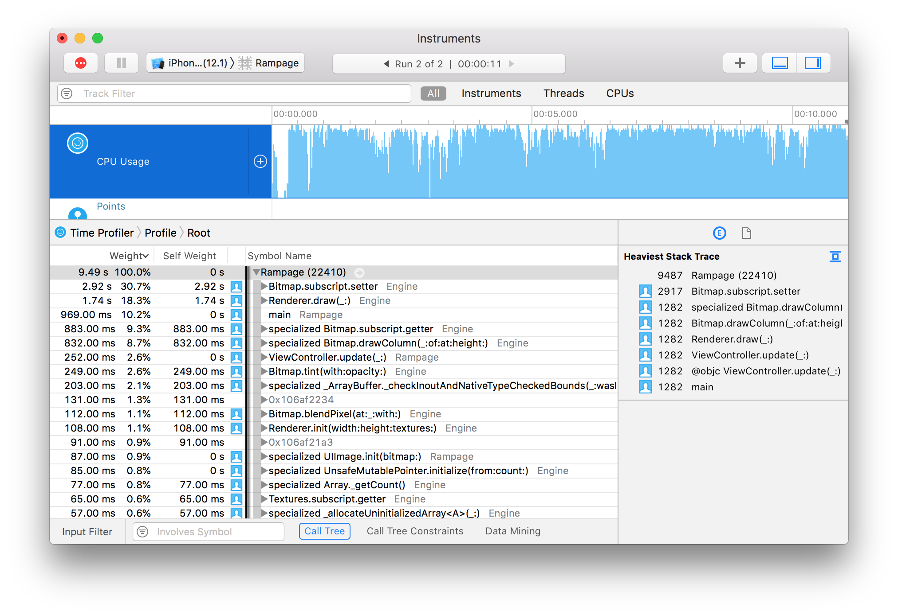

## Part 9: Performance Tuning

In [Part 8](Part8.md) we gave the player a pistol to kill the monsters so the game isn't quite so one-sided. The complete code for Part 8 can be found [here](https://github.com/nicklockwood/RetroRampage/archive/Part8.zip).

We've held off on doing any optimization work so far because optimized code tends to be harder to read and harder to modify. It's also just generally an inefficient use of our time to optimize code that might be changed or even deleted.

But now that we've reached a point of relative stability with the renderer, let's take a break from adding new features to do some much-needed performance tuning.

### Standardized Testing

The cardinal rule of performance tuning is *measure first*. Before we do anything, we need to give ourselves a way to measure the progress we are making. We need a [test harness](https://en.wikipedia.org/wiki/Test_harness).

It's no secret that the games industry hasn't embraced automated testing to quite the same extent as app developers, preferring to rely on teams of manual testers.

Videogames are an inherently visual medium, and while some aspects of our code base could benefit from automated testing, the kind of bugs we've encountered so far - such as fisheye rendering distortion, or monster corpses absorbing bullets - would take hours to write tests for, and can be reproduced in seconds by just *playing the game*.

Performance testing is an altogether different matter. A human can tell if a game seems smooth or choppy, but it's very hard for them to make objective comparisons between the effects of small optimizations. For that we need a more scientific approach, and this is where automated tests really shine.

We're going to start by adding a test target to the project. Xcode usually adds this by default, so you may already have a folder called *RampageTests* in your project, in which case you can skip the next step.

If you *don't* already have a test target, go to `File > New > Target...` and select *iOS Unit Testing Bundle*.


Once you've added the test target, edit the Rampage scheme and change the *Build Configuration* in the *Test* tab to "Release".

We already set the *Run* mode to Release in [Part 4](Part4.md), but we need to do it for the Test target as well otherwise the tests won't be representative of real-world performance conditions.


### Public Service

It's common practice to use the `@testable` attribute when importing modules in a test file. `@testable` makes `internal` (module-scoped) code accessible to the test. Unfortunately `@testable` only works in Debug mode, so we can't use it here. That means we're going to have to make a few things in the Rampage module public.

In `ViewController.swift`, make `loadMap()` public by replacing the line:

```swift
private func loadMap() -> Tilemap {
```

with:

```swift
public func loadMap() -> Tilemap {
```

Then do the same for the `loadTextures()` method.

### Purity Test

In general it's much easier to write tests for *pure* functions than stateful ones. A [pure function](https://en.wikipedia.org/wiki/Pure_function) is one that takes an input argument and returns an output value without accessing any external state.

Modern rendering engines are multi-threaded and highly stateful, as they need to interact with GPU hardware (which is basically a giant state machine). The software renderer that we've written for Retro Rampage however is *completely stateless*, and should be super-simple to test.

In the RampageTests folder in your project, find the file called `RampageTests.swift` and edit the contents to look as follows:

```swift
import XCTest
import Engine
import Rampage

class RampageTests: XCTestCase {
    let world = World(map: loadMap())
    let textures = loadTextures()
    
    func testRenderFrame() {
        self.measure {
            var renderer = Renderer(width: 1000, height: 1000, textures: textures)
            renderer.draw(world)
        }
    }
}
```

That's all the code needed to render a single frame of the game under test conditions. The `measure {}` block wrapped around the drawing code is a built-in method of `XCTestCase` that automatically executes and benchmarks the code inside it.

Normally a test function would include one or more `XCAssert()` statements to test the output of the code under test, but in this case we aren't interested in the *output* of the test, only how long it takes to run. 

Go ahead and run the tests (select the `Product > Test` menu, or press `Cmd-U` on the keyboard). Note that you can (and should) run the tests on an actual iOS device rather than the Simulator.

You might be surprised to see that the game boots up and runs for a few seconds. That's normal, but we don't really want it to happen in this case because we're trying to measure performance in an isolated test, and having the game running at the same time is likely to peg the CPU, impacting the result.

In `ViewController.swift` add the following code at the top of the `viewDidLoad()` method, just below the `super.viewDidLoad()` line:

```swift
guard NSClassFromString("XCTestCase") == nil else {
    return
}
```

This (slightly eccentric) code performs a runtime check for the presence of the `XCTestCase` class. If found, it indicates that the app is running in a test environment, so we bail out early before the game has been initialized.

Run the tests again and you should see something like this:


Each time the tests are run, the code inside `measure {}` is evaluated multiple times and the average time is compared against the previously recorded value. Because this is the first run, we don't have a baseline time for the performance test yet, so we need to set one.

Click the small grey diamond icon on the left-hand side of the `self.measure {` line and you'll see the following popup that will allow you to save the last recorded time as the baseline:


Once set, the baseline value is saved inside the project. Future test runs will be compared against this value, and the test will fail if the new time is significantly worse.

Successive performance test values are only meaningful when the tests are run on the same hardware. Even on the same device, test results can be distorted by background processes or other external factors. For this reason I usually run the tests a few times and then take the best reproducible result.

The baseline time we've recorded is 0.11 seconds, so we're only getting ~9 FPS. That means we've got plenty of room for improvement.

### Low Hanging Fruit

You can spend an almost unlimited amount of time making small improvements to performance, but the return on investment tends to diminish exponentially. So how do we decide where best to focus our efforts?

Instincts about what makes code slow are often wildly misguided, but fortunately Xcode has some great tools that we can use to disabuse us of our misconceptions. In [Part 4](Part4.md) we briefly used the Time Profiler Instrument to diagnose an unexpected performance dip. We'll use it again now (use `Cmd-I` to launch Instruments and select the Time Profiler tool).

Here is the trace for the game as it currently stands.


The Time Profiler is not especially good for measuring absolute performance (for that, we have the performance test we just wrote), but it's great for identifying the bottlenecks in your code.

From the screenshot you can see that the top function in the list is `Bitmap.blendPixel()` with a whole 24% of the total frame time spent in just that single function. It's clearly a prime candidate for optimization.

Let's take a look at `blendPixel()`:

```swift
private mutating func blendPixel(at x: Int, _ y: Int, with newColor: Color) {
    let oldColor = self[x, y]
    let inverseAlpha = 1 - Double(newColor.a) / 255
    self[x, y] = Color(
        r: UInt8(Double(oldColor.r) * inverseAlpha) + newColor.r,
        g: UInt8(Double(oldColor.g) * inverseAlpha) + newColor.g,
        b: UInt8(Double(oldColor.b) * inverseAlpha) + newColor.b
    )
}
```

At first glance there isn't much opportunity for improvement here. We're already using premultiplied alpha, and common code like `inverseAlpha` has already been extracted. But if you can't make code faster, what about *not calling it in the first place*?

The `blendPixel()` method is called from inside both `drawColumn()` and `tint()`. Looking at the Time Profiler trace, `Bitmap.drawColumn()` is higher in the list, which makes sense since we only use `tint()` for `Effect` overlays when the player is hurt, whereas `drawColumn()` is called many times each frame for both walls and sprites.

So let's concentrate on `drawColumn()` for now. The `drawColumn()` method calls `blendPixel()` because it's used for sprites, which have a transparent background. But it's also used for walls, which don't. We pay a significant price for that flexibility.

We could fork the `drawColumn()` method into opaque and non-opaque variants, or add an `isOpaque` parameter to the function, but there's a more elegant solution.

### Clear as Mud

In `Color.swift`, add the following computed property to the extension:

```swift
public extension Color {
    var isOpaque: Bool {
        return a == 255
    }
    
    ...
}
```

Then in `Bitmap.swift`, update the `Bitmap` struct to include an `isOpaque` property, as follows:

```swift
public struct Bitmap {
    public private(set) var pixels: [Color]
    public let width: Int
    public let isOpaque: Bool

    public init(width: Int, pixels: [Color]) {
        self.width = width
        self.pixels = pixels
        self.isOpaque = pixels.allSatisfy { $0.isOpaque }
    }
}
```

The `allSatisfy` method returns true *only* if its closure argument returns true for every element in the array, so this is a handy way for us to determine up-front if every pixel in the bitmap is opaque, and then store that value so we can efficiently query it later.

The `Bitmap` type also has a second convenience initializer which creates an image filled with a solid color. Find the following method in the extension block below:

```swift
init(width: Int, height: Int, color: Color) {
    self.pixels = Array(repeating: color, count: width * height)
    self.width = width
}
```

and add this line to it:

```swift
self.isOpaque = color.isOpaque
```

Now, in `Bitmap.drawColumn()`, replace the loop:

```swift
for y in max(0, start) ..< min(self.height, end) {
    let sourceY = max(0, Double(y) - point.y) * stepY
    let sourceColor = source[sourceX, Int(sourceY)]
    blendPixel(at: Int(point.x), y, with: sourceColor)
}
```

with:

```swift
if source.isOpaque {
    for y in max(0, start) ..< min(self.height, end) {
        let sourceY = max(0, Double(y) - point.y) * stepY
        let sourceColor = source[sourceX, Int(sourceY)]
        self[Int(point.x), y] = sourceColor
    }
} else {
    for y in max(0, start) ..< min(self.height, end) {
        let sourceY = max(0, Double(y) - point.y) * stepY
        let sourceColor = source[sourceX, Int(sourceY)]
        blendPixel(at: Int(point.x), y, with: sourceColor)
    }
}
```

So now we completely avoid the cost of blending for opaque surfaces such as walls. If we run the performance test again we can see a 16% improvement - not bad!

**Disclaimer:** It's unlikely you will see *exactly* the same result in your own tests. You may see a smaller improvement, or the performance may even appear to get *worse*. If so, run the tests a few times to make sure it wasn't a random dip. If the result is consistently worse, try reverting the `isOpaque` optimization and re-recording the baseline before trying again, as your original baseline value may have been a fluke.


There's no point applying the same optimization to `Bitmap.tint()` because the way it's used means that overlays will almost always be translucent. But given that `isOpaque` worked so well, maybe there's a way we can optimize `blendPixel()` after all?

### Clear as Crystal

The `isOpaque` trick works because wall images are completely solid, however it doesn't help with sprites, where some pixels are opaque and others aren't.

But even with sprites, many of the pixels *are* opaque, and others are completely transparent. Transparent pixels can be handled even more efficiently than opaque ones since we can skip them completely. But of course no image is *completely* transparent, so to take advantage of this we'll have to check the alpha for each pixel as we draw it.

In `Bitmap.swift`, update the `blendPixel()` method as follows:

```swift
private mutating func blendPixel(at x: Int, _ y: Int, with newColor: Color) {
    switch newColor.a {
    case 0:
        break
    case 255:
        self[x, y] = newColor
    default:
        let oldColor = self[x, y]
        let inverseAlpha = 1 - Double(newColor.a) / 255
        self[x, y] = Color(
            r: UInt8(Double(oldColor.r) * inverseAlpha) + newColor.r,
            g: UInt8(Double(oldColor.g) * inverseAlpha) + newColor.g,
            b: UInt8(Double(oldColor.b) * inverseAlpha) + newColor.b
        )
    }
}
```

This does add a slight overhead for each pixel, but in return we avoid the cost of blending entirely for fully opaque or fully transparent pixels. Run the tests again and let's see if it helped.


Whoa... A whopping *45% improvement* - we've almost doubled our frame rate!

We didn't update the baseline after the last set of changes, so that 45% includes the 16% we got from `Bitmap.isOpaque`, but even so it's pretty huge.

### Now You See Me...

Now that we've made a significant improvement to performance, let's run the Time Profiler again.


Thanks to our optimizations, `blendPixel()` is now taking up only 6.2% of the frame time (down from 24%) and has been bumped down to number five in the list. The new highest priority is `Bitmap.drawColumn()`.

Wait a moment though - shouldn't the changes we just made have improved `drawColumn()` as well? Why has it gotten *slower*? Have we just shifted the performance overhead from one method to another?

Let's take a look at the `drawColumn()` implementation again.

```swift
mutating func drawColumn(_ sourceX: Int, of source: Bitmap, at point: Vector, height: Double) {
    let start = Int(point.y), end = Int((point.y + height).rounded(.up))
    let stepY = Double(source.height) / height
    if source.isOpaque {
        for y in max(0, start) ..< min(self.height, end) {
            let sourceY = max(0, Double(y) - point.y) * stepY
            let sourceColor = source[sourceX, Int(sourceY)]
            self[Int(point.x), y] = sourceColor
        }
    } else {
        for y in max(0, start) ..< min(self.height, end) {
            let sourceY = max(0, Double(y) - point.y) * stepY
            let sourceColor = source[sourceX, Int(sourceY)]
            blendPixel(at: Int(point.x), y, with: sourceColor)
        }
    }
}
```

Previously this method called `blendPixel()` in a tight loop. Now, the loop *either* calls `blendPixel()` *or* it sets the pixel color directly via `Bitmap.subscript`.

In the first trace we ran, `Bitmap.subscript.setter` was the second highest line item after `Bitmap.blendPixel()`. You would expect that `Bitmap.subscript.setter` would now be the highest item in the list, but it seems to have vanished completely from the trace. What's going on?

When you run your app in the Profiler it uses an *optimized* build (equivalent to Release mode). This makes sense because we are interested in how it will perform in the App Store, not how it performs in Debug mode. But the optimizer has a broad remit to make changes to the code structure, and one of the changes it makes is [method inlining](https://en.wikipedia.org/wiki/Inline_expansion).

Due to inlining, the method you need to optimize *may not appear in traces at all*. The subscripting code is still there, but as far as the profiler is concerned that code is now just part of `drawColumn()`.

Optimization is a bit like detective work. When examining a trace, it's not enough to look at which methods appear - you also need to keep an eye out for methods that are conspicuous by their absence. We have some pretty good circumstantial evidence that `Bitmap.setter()` is our performance bottleneck, but how can we *prove* it?

Swift has an `@inline()` attribute that can be used to override the optimizer. In general, I don't recommend using this unless you are extremely confident that you know better than the compiler, but I see no harm in using it to test our theory.

In `Bitmap.subscript(x:y:)` replace the line:

```swift
set {
```

with:

```swift
@inline(never) set {
```

This tells Swift *never* to inline the subscript setter. Run the time profiler again and you'll see that our suspicions have been confirmed.



### Set Cost

Before we do anything else, remove the `@inline(never)` again so it doesn't negatively affect our performance.

Next, let's take a closer look at the `Bitmap.subscript` setter:

```swift
set {
    guard x >= 0, y >= 0, x < width, y < height else { return }
    pixels[y * width + x] = newValue
}
```

There are 4 range comparisons and some math happening for each pixel we write to the screen. The comparisons are a safety check which we added in [Part 1](Part1.md) to prevent crashes if we try to draw outside the bitmap. We can skip those checks in places like `drawColumn()` where we already constrain the loop bounds to the bitmap height.

In `Bitmap.drawColumn()`, replace the line:

```swift
self[Int(point.x), y] = sourceColor
```

with:

```swift
pixels[y * width + Int(point.x)] = sourceColor
```

Run the tests again (`Cmd-U`) and see if that helps the performance at all.


That's almost another 10% percent faster - not massive, but certainly worth doing.

We've bypassed the range checks by manually inlining the pixel index calculation, but not the multiplication and addition, which are needed to convert between a 2D pixel coordinate and the linear array index. Since we are stepping through a vertical column of pixels, each pixel should be exactly `width` pixels offset from the previous one, so if we keep a running index we can get rid of the multiplication.

Add the following line just before `if source.isOpaque {`:

```swift
var index = max(0, start) * width + Int(point.x)
``` 

Then replace the line:

```swift
pixels[y * width + Int(point.x)] = sourceColor
```

with:

```swift
pixels[index] = sourceColor
index += width
```

And if we run the tests again... oh.


After eliminating the multiplication, the performance is no better - maybe even a little worse. So what happened?

It's important to remember that the compiler is pretty smart. The chances are, if we can spot something simple like a multiplication that can be replaced by addition, the compiler can too. My guess is that it was already performing this optimization for us, so doing it manually ourselves gains us nothing.

Instead of wasting our time on fruitless micro-optimizations, let's see if we can find some bigger wins elsewhere.

### Out of Order

We know that most of the drawing code goes through the `drawColumn()` method. It's pretty fundamental to the design of the ray-casting engine that everything in the world is drawn using vertical strips.

When we created the `Bitmap` type in [Part 1](Part1.md) we decided to lay out the pixels in row order. This made a lot of sense at the time because it's how native iOS image data is arranged, which makes it easy to convert to and from `UIImage` without needing to swizzle the pixels.

But we spend a lot more of our frame time reading and writing pixels from bitmaps inside the Engine module than we do converting to and from `UIImage`, and in most cases we are accessing the pixels column-by-column rather than row-by-row.

Switching `Bitmap.pixels` to column-order would simplify the math for stepping through columns, but based on what we've just seen it's possible that wouldn't improve performance much beyond what the compiler can do for us. There's a much more important reason why it's worth aligning our pixel data with the order we access it though, and that's [cache locality](https://en.wikipedia.org/wiki/Locality_of_reference).

Computer memory is arranged in a [hierarchy](https://en.wikipedia.org/wiki/Memory_hierarchy). At the top of the hierarchy are the CPU registers. There are only a handful of these, but they are super-fast to access. At the bottom of the hierarchy is main memory<sup><a id="reference1"></a>[[1]](#footnote1)</sup>. This is normally numbered in gigabytes, and dwarfs the register capacity, but it is hundreds or even thousands of times slower to access.

In order to make up the performance gap between registers and main memory, modern CPUs include several layers of [cache](https://en.wikipedia.org/wiki/CPU_cache), known as L1 cache, L2 cache, etc. Each level of cache is  progressively larger and slower.


The key to good performance is to try to keep the data you are working on as near to the top of the hierarchy as possible.

The first time you try to access some data in main memory, the processor copies a 64-byte chunk of that data into the cache. That chunk is known as a *cache line*. Subsequent accesses to data inside the same chunk are essentially free, but accessing data outside the cache line will force another line to be fetched from memory, which takes much longer.

The most efficient way to access data is therefore to do it *sequentially*, because this maximizes the chances that subsequent data accesses will land in the same cache line. Predictable data access patterns also allow the CPU to preemptively fetch cache lines before they are needed, reducing the access latency even further.

So how does this relate to `Bitmap`? Well, each pixel in the bitmap is 4 bytes in size, so we can only fit around 16,000 pixels in a single cache line. The screen is about 1000 pixels wide, so that means the CPU can only fetch ~16 rows at a time. If we are looping through a vertical column of pixels, every 16th pixel we access will be in a separate cache line. But if the pixels were stored in column order, the entire column would fit in a single line.

In practice, the processor can fetch and store multiple cache lines from different parts of main memory at once, and given the regularity of the access pattern we are using, it's likely that the processor is already making up most of the cost of our out-of-order accesses. But it's worth at least *trying* to structure our data to match our usage patterns.

To switch the pixel layout, we're going to have to make a few changes in `Bitmap.swift`. First, we'll replace the stored `width` property with `height`, and update `init()`:

```swift
public struct Bitmap {
    public private(set) var pixels: [Color]
    public let height: Int
    public let isOpaque: Bool

    public init(height: Int, pixels: [Color]) {
        self.height = height
        self.pixels = pixels
        self.isOpaque = pixels.allSatisfy { $0.isOpaque }
    }
}
```

Next, in the extension, replace the computed `height` var with:

```swift
var width: Int {
    return pixels.count / height
}
```

The `subscript` will also need to be updated as follows:

```swift
subscript(x: Int, y: Int) -> Color {
    get { return pixels[x * height + y] }
    set {
        guard x >= 0, y >= 0, x < width, y < height else { return }
        pixels[x * height + y] = newValue
    }
}
```

And in `init(width:height:color:)`, replace the line:

```swift
self.width = width
```

with:

```swift
self.height = height
```

The `drawColumn()` function will now be broken because the optimizations we made previously were row-order specific. To fix it, replace:

```swift
var index = max(0, start) * width + Int(point.x)
```

with: 

```swift
let offset = Int(point.x) * self.height
```

Then replace the lines:

```swift
pixels[index] = sourceColor
index += width
```

with:

```swift
pixels[offset + y] = sourceColor
```

Finally, in `UIImage+Bitmap.swift`, in the `Bitmap` extension block, replace:

```swift
self.init(width: cgImage.width, pixels: pixels)
```

with:

```swift
self.init(height: cgImage.height, pixels: pixels)
```

Let's try running the tests again and see what difference we've made.


That's about another 10% improvement. A bit disappointing, but we're not done yet.

Before we make any further changes, let's run the game quickly and check everything still works after the switch to column order.


Ha ha, whoops! It seems like the change we made in `UIImage+Bitmap.swift` wasn't quite sufficient to adapt to the new pixel layout. We'll need to swap over all the references to `width` and `height` in the `UIImage` extension so that it looks like this:

```swift
public extension UIImage {
    convenience init?(bitmap: Bitmap) {
        let alphaInfo = CGImageAlphaInfo.premultipliedLast
        let bytesPerPixel = MemoryLayout<Color>.size
        let bytesPerRow = bitmap.height * bytesPerPixel

        guard let providerRef = CGDataProvider(data: Data(
            bytes: bitmap.pixels, count: bitmap.width * bytesPerRow
        ) as CFData) else {
            return nil
        }

        guard let cgImage = CGImage(
            width: bitmap.height,
            height: bitmap.width,
            bitsPerComponent: 8,
            bitsPerPixel: bytesPerPixel * 8,
            bytesPerRow: bytesPerRow,
            space: CGColorSpaceCreateDeviceRGB(),
            bitmapInfo: CGBitmapInfo(rawValue: alphaInfo.rawValue),
            provider: providerRef,
            decode: nil,
            shouldInterpolate: true,
            intent: .defaultIntent
        ) else {
            return nil
        }

        self.init(cgImage: cgImage)
    }
}
```

Let's try that again...


Nope! I guess we also need to rotate the output image since we flipped the rows and columns? Fortunately iOS makes it quite easy to do this without having to actually swizzle the pixels. In `UIImage.init()` change the line:

```swift
self.init(cgImage: cgImage)
```

to:

```swift
self.init(cgImage: cgImage, scale: 1, orientation: .leftMirrored)
```

That tells iOS that the image data is stored left-side-up, and that it should rotate the image at display time to compensate. Let's see if it helps.


LOL! Well, the world is now the right way up, but the textures are all rotated 90 degrees and flipped, and it looks like the monsters are walking on the walls<sup><a id="reference2"></a>[[2]](#footnote2)</sup>.

This isn't a problem with `UIImage.init()`, it's actually the `Bitmap` initializer that we need to fix this time. We could cheat and just pre-rotate all our texture images before importing them<sup><a id="reference3"></a>[[3]](#footnote3)</sup>, but it would be nicer if we could keep the pixel layout as an internal implementation detail as much as possible.

Still in `UIImage+Bitmap.swift`, go ahead and flip all the `height` and `width` references inside `Bitmap.init()`:

```swift
public extension Bitmap {
    init?(image: UIImage) {
        guard let cgImage = image.cgImage else {
            return nil
        }

        let alphaInfo = CGImageAlphaInfo.premultipliedLast
        let bytesPerPixel = MemoryLayout<Color>.size
        let bytesPerRow = cgImage.height * bytesPerPixel

        var pixels = [Color](repeating: .clear, count: cgImage.width * cgImage.height)
        guard let context = CGContext(
            data: &pixels,
            width: cgImage.height,
            height: cgImage.width,
            bitsPerComponent: 8,
            bytesPerRow: bytesPerRow,
            space: CGColorSpaceCreateDeviceRGB(),
            bitmapInfo: alphaInfo.rawValue
        ) else {
            return nil
        }

        context.draw(cgImage, in: CGRect(origin: .zero, size: image.size))
        self.init(height: cgImage.height, pixels: pixels)
    }
}
```

Finally, to actually rotate the image, we need to do the inverse of the transform we performed in `UIImage.init()`, and replace the line:

```swift
context.draw(cgImage, in: CGRect(origin: .zero, size: image.size))
```

with:

```swift
UIGraphicsPushContext(context)
UIImage(cgImage: cgImage, scale: 1, orientation: .left).draw(at: .zero)
UIGraphicsPopContext()
```

### Loose Ends

There are still a handful of places where we either aren't taking full advantage of the column-order optimization, or where it may actually be making things *slower*, because we are still enumerating pixels in row-first order.

We'll start with the `Bitmap.fill()` function. We aren't using it in the game currently, but we don't want to forget to update it. In `fill()`, swap the lines:

```swift
for y in Int(rect.min.y) ..< Int(rect.max.y) {
    for x in Int(rect.min.x) ..< Int(rect.max.x) 
```

so they read:


```swift
for x in Int(rect.min.x) ..< Int(rect.max.x) {
    for y in Int(rect.min.y) ..< Int(rect.max.y) {
```

That ensures that the pixels are being accessed in column-first order, giving the CPU cache an easier time.

Next, let's take a look at the `tint()` function:

```swift
mutating func tint(with color: Color, opacity: Double) {
    let alpha = min(1, max(0, Double(color.a) / 255 * opacity))
    let color = Color(
        r: UInt8(Double(color.r) * alpha),
        g: UInt8(Double(color.g) * alpha),
        b: UInt8(Double(color.b) * alpha),
        a: UInt8(255 * alpha)
    )
    for y in 0 ..< height {
        for x in 0 ..< width {
            blendPixel(at: x, y, with: color)
        }
    }
}
```

Here we are also processing pixels in row-first order, but there's actually a more significant optimization to be made here than just swapping the loops like we did in `fill()`.

Because `tint()` is always applied to every pixel in the bitmap, we don't need to use X, Y indexing, we can just process the pixels in order. To do that, we'll first need to update `blendPixel()` to use linear indexing, as follows:

```swift
private mutating func blendPixel(at index: Int, with newColor: Color) {
    switch newColor.a {
    case 0:
        break
    case 255:
        pixels[index] = newColor
    default:
        let oldColor = pixels[index]
        let inverseAlpha = 1 - Double(newColor.a) / 255
        pixels[index] = Color(
            r: UInt8(Double(oldColor.r) * inverseAlpha) + newColor.r,
            g: UInt8(Double(oldColor.g) * inverseAlpha) + newColor.g,
            b: UInt8(Double(oldColor.b) * inverseAlpha) + newColor.b
        )
    }
}
```

Then in `tint()` replace the lines:

```swift
for y in 0 ..< height {
    for x in 0 ..< width {
        blendPixel(at: x, y, with: color)
    }
}
```

with:

```swift
for i in pixels.indices {
    blendPixel(at: i, with: color)
}
```

And finally, in `drawColumn()` replace the line:

```swift
blendPixel(at: Int(point.x), y, with: sourceColor)
```

with:

```swift
blendPixel(at: offset + y, with: sourceColor)
```

That's it for the `Bitmap` changes. There's just one other place where our code assumes we're using row-order pixels.

In `Renderer.swift` in the `// Effects` block, swap the lines:

```swift
for y in 0 ..< bitmap.height {
    for x in 0 ..< bitmap.width {
```

to:

```swift
for x in 0 ..< bitmap.width {
    for y in 0 ..< bitmap.height {
```

Now run the tests again and see how we're doing.


We've gained another couple of %, but I think it's time to accept that we may have reached the point of diminishing returns, at least for bitmap-related optimizations.

Before we down tools though, there is one last improvement that we can get, essentially for free.

### Safeties Off

By default, Swift performs safety checks to prevent array bounds violations and integer overflows. These checks aren't designed to prevent crashes - on the contrary, they are designed to *force* a crash, instead of allowing more insidious problems such as silent memory corruption or undefined output. But there is a runtime cost to these checks, and we'd rather not pay it.

We can bypass the numeric overflow checks by replacing integer operators like `+`, `-`, `*` and `/` with their unchecked variants `&+`, `&-`, `&* and `&/`, but that's pretty tedious and it won't help with array bounds checks. Instead, let's just disable safety checks completely for the Engine module.

In the Build Settings for the Engine target, find the *Disable Safety Checks* option, and set it to *Yes* for Release builds.


Let's see how that affects the performance:


Great! That brings our frame time down by another 7%, for a total saving of 73%.

So after all those optimizations, what are now the top functions on the Time Profiler trace?


At the very top is `Renderer.draw()`, which is not surprising since it's the primary call site for all the code we've been working on.

There are undoubtedly many optimization opportunities inside `Renderer.draw()` itself, but we aren't done adding features to the game yet, and making optimizations to the rendering logic at this stage is likely to make that code harder to change, which is why we've mostly restricted our changes to the code inside `Bitmap`<sup><a id="reference4"></a>[[4]](#footnote4)</sup>.

The function that shows up a couple of lines *below* `Renderer.draw()` is a bit more surprising - it seems that almost 11% of our frame time is now being spent in the computed getter for `Bitmap.width`.

### Does Not Compute

It's hard to believe such a trivial function could be a bottleneck, but (as mentioned earlier) performance is often counter-intuitive. In any case, switching `width` to a stored property instead of a computed property should be a trivial fix.

In `Bitmap.swift`, in the `Bitmap` struct itself, replace the line:

```swift
public let height: Int
```

with:

```swift
public let width, height: Int
```

Then in `init(height:pixels:)`, add the line:

```swift
self.width = pixels.count / height
```

A little further down, in the extension block, delete the computed property:

```swift
var width: Int {
    return pixels.count / height
}
```

And finally, in `init(width:height:color:)` add the line:

```swift
self.width = width
```

If we run the tests again, we should expect to see around another 10% performance boost. And we do!


All in all, we've reduced rendering time by 83% - an almost *6X improvement* in frame rate - and we've done it without significantly complicating the code, or hampering our ability to add new features.

Performance testing can be frustrating, counterintuitive and full of dead ends. But hopefully I've convinced you that with the right tools, and a rigorous approach, it can also be quite rewarding.

If you are interested in learning more about optimizing Swift code, [Apple has published some tips](https://github.com/apple/swift/blob/master/docs/OptimizationTips.rst) on the Swift Github page, including several we didn't cover here.

That's all for Part 9. In this part we:

* Created a performance test harness for making accurate frame time measurements
* Used the Time Profiler to identify bottlenecks in the code
* Switched our bitmaps to column-order
* Disabled safety checks
* Made many other minor improvements, adding up to a huge overall performance win

With these optimizations in place, we're in good shape to add more graphics and gameplay features in [Part 10](Part10.md).

### Reader Exercises

1. In the current implementation we recreate the `Renderer` every frame, which means we waste cycles reallocating and clearing pixels that will be overwritten anyway. Can you modify the performance test to measure if it would be worth reusing a single `Renderer` instance between frames?

2. In `UIImage(bitmap:)`, the way we are using `CGDataProvider` currently requires an expensive copy. We aren't currently measuring the cost of the `Bitmap` to `UIImage` conversion in the performance tests either. Modify the tests to measure the current cost of this conversion, then try using `CGDataProvider(dataInfo:data:size:releaseData:)` to convert the bitmap without copying, and see if it helps performance.

3. So far our optimizations have been mostly low-level improvements to the Bitmap drawing logic, but what about higher-level rendering optimizations? After all, the best way to draw something faster is not to draw it all! Currently we are ray-casting every sprite in the level, even if it's behind a wall. Can you think of a way to detect which tiles are visible, and only render the sprites in those tiles?

<hr>

<a id="footnote1"></a>[[1]](#reference1) You can actually extend the hierarchy to include the disk drive, and then network storage, etc. In a sense these are forms of memory, each layer exponentially larger in capacity and proportionally slower to access.

<a id="footnote2"></a>[[2]](#reference2) The game is actually fully playable like this, and I highly recommend you try it because it's hilarious.

<a id="footnote3"></a>[[3]](#reference3) Which is exactly how Wolfenstein 3D handled it - Wolfenstein's sprites were originally pre-rotated by 90 degrees so they could be efficiently rendered column-by-column.

<a id="footnote4"></a>[[4]](#reference4) Although that's also where most of the bottlenecks have been anyway.

